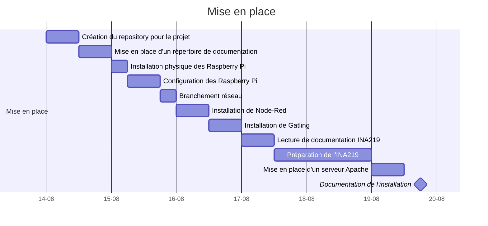
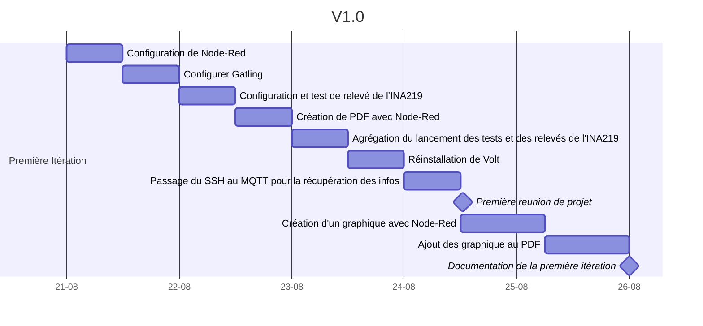
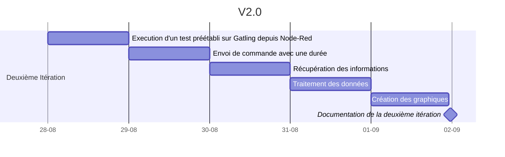
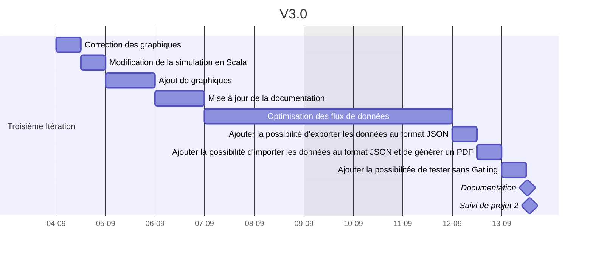
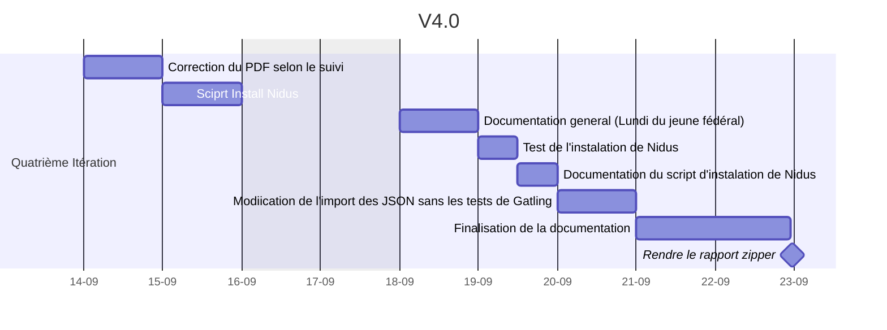

# 1. README : Banc de mesures de la consommation électrique pour application web

     

---

**Candidat:** Cyril Tobler  
**Proposé par:** SINABE Sarl  
**Personne de contact:** Benoit Vianin  
**Enseignant-e:** Fabien Maire  
**Lieu de travail:** Ecole CPNE-TI SIS2  
**Nombre de périodes:** 300  
**Durée du travail :**  *14.08.2023 - 22.09.2023*

---

# 2. Table des matières
- [1. README : Banc de mesures de la consommation électrique pour application web](#1-readme--banc-de-mesures-de-la-consommation-électrique-pour-application-web)
- [2. Table des matières](#2-table-des-matières)
- [3. Introduction](#3-introduction)
- [4. Objectifs](#4-objectifs)
  - [4.1. Objectif principal](#41-objectif-principal)
  - [4.2. Objectifs spécifiques](#42-objectifs-spécifiques)
    - [4.2.1. Génération de trafic web](#421-génération-de-trafic-web)
    - [4.2.2. Mesure de la consommation](#422-mesure-de-la-consommation)
    - [4.2.3. Génération de rapports sur la performance](#423-génération-de-rapports-sur-la-performance)
- [5. Caractéristiques](#5-caractéristiques)
  - [5.1. Génération de trafic web](#51-génération-de-trafic-web)
  - [5.2. Mesure de la consommation électrique (**INA219**)](#52-mesure-de-la-consommation-électrique-ina219)
  - [5.3. Mesure de la consommation](#53-mesure-de-la-consommation)
- [6. Matériel](#6-matériel)
  - [6.1. Nomenclature](#61-nomenclature)
  - [6.2. Volt](#62-volt)
  - [6.3. Nidus](#63-nidus)
- [7. Shéma de principe](#7-shéma-de-principe)
  - [7.1. Shéma de principe visuel](#71-shéma-de-principe-visuel)
  - [7.2. Diagrame de séquence](#72-diagrame-de-séquence)
- [8. Analyse UI](#8-analyse-ui)
- [9. Jalons](#9-jalons)
  - [9.1. Mise en place](#91-mise-en-place)
    - [9.1.1. But](#911-but)
  - [9.2. Première itération](#92-première-itération)
    - [9.2.1. But](#921-but)
  - [9.3. Deuxième itération](#93-deuxième-itération)
    - [9.3.1. But](#931-but)
  - [9.4. Troisième itération](#94-troisième-itération)
    - [9.4.1. But](#941-but)
  - [9.5. Quatrième itération](#95-quatrième-itération)
- [10. Améliorations Futures](#10-améliorations-futures)
  - [10.1. Amélioration du calcul de la bar de chargement](#101-amélioration-du-calcul-de-la-bar-de-chargement)
  - [10.2. Base de Données](#102-base-de-données)
  - [10.3. Utilisation de FlowFuse](#103-utilisation-de-flowfuse)
  - [10.4. Analyse des Données](#104-analyse-des-données)
  - [10.5. Tests de Cluster](#105-tests-de-cluster)
  - [10.6. Intégration de Services Cloud](#106-intégration-de-services-cloud)
  - [10.7. Sécurité Renforcée](#107-sécurité-renforcée)
  - [10.8. Intégration de l'Apprentissage Automatique](#108-intégration-de-lapprentissage-automatique)
  - [10.9. Support Multilingue](#109-support-multilingue)
  - [10.10. Optimisation d'une distribution Ubuntu](#1010-optimisation-dune-distribution-ubuntu)
- [11. Documentation](#11-documentation)
  - [11.1. Licences des Dépendances](#111-licences-des-dépendances)
    - [11.1.1. Brevets et Contributions spécifiques :](#1111-brevets-et-contributions-spécifiques-)
    - [11.1.2. Responsabilité Limitée :](#1112-responsabilité-limitée-)
- [12. Remerciement](#12-remerciement)
- [13. Sources](#13-sources)
  - [13.1. Node-RED et Extensions](#131-node-red-et-extensions)
  - [13.2. Bibliothèques et Outils Externes](#132-bibliothèques-et-outils-externes)
  - [13.3. Tutoriels et Documentation Technique](#133-tutoriels-et-documentation-technique)
  - [13.4. Gatling](#134-gatling)
- [14. Autres Outils et Ressources](#14-autres-outils-et-ressources)
  - [14.1. Articles de Recherche](#141-articles-de-recherche)
  - [14.2. Liens externes](#142-liens-externes)
  - [14.3. OS](#143-os)

# 3. Introduction
Le développement de sites web et d'applications web requiert une attention particulière à la performance et à la consommation des ressources. Afin de réduire l’impact écologique des solutions digitale et d’optimiser la charge des systèmes, il est essentiel de mesurer et d'analyser la consommation de ces systèmes dans des conditions de charge réalistes. Dans ce contexte, il est nécessaire de mettre en place un banc de mesures de la consommation capable de générer du trafic web, de mesurer la consommation électrique et de fournir des rapports sur la performance du code ou de l'architecture testée.
# 4. Objectifs
## 4.1. Objectif principal

L'objectif principal de ce projet est de concevoir et développer un banc de mesures de la consommation électrique pour site web ou application web. Ce banc de mesures devra être capable de générer du trafic web, de mesurer la consommation des ressources et de générer des rapports détaillés sur la performance du code ou de l'architecture testée par rapport à une référence.

## 4.2. Objectifs spécifiques

Les objectifs spécifiques du projet sont les suivants :

### 4.2.1. Génération de trafic web

Le système devra être en mesure de simuler le trafic web en générant des requêtes HTTP réalistes. Il devra pouvoir reproduire des scénarios de charge variable afin d'évaluer les performances du site web ou de l'application web dans des conditions réelles.

### 4.2.2. Mesure de la consommation

Le banc de mesures devra être équipé d'un mécanisme de mesure précis et fiable de la consommation des ressources, telles que la consommation d'énergie, l'utilisation du processeur, la consommation de mémoire et la consommation du réseau.

### 4.2.3. Génération de rapports sur la performance

Le système devra être capable de collecter les données de mesure et de générer des rapports détaillés sur la performance du code ou de l'architecture testée. Les rapports devront inclure des métriques telles que le temps de réponse, la consommation d'énergie par requête, l'utilisation du processeur, etc.

# 5. Caractéristiques 
Le banc de mesures de la consommation pour site web ou application web devra présenter les caractéristiques suivantes :

## 5.1. Génération de trafic web

Utilisation de l'outil Gatling comme générateur de trafic web. Gatling permettra de simuler des requêtes HTTP réalistes, de configurer des scénarios de charge et d'évaluer les performances du système testé.

**Gatling** est un outil de test de charge open source basé sur Scala, conçu pour évaluer les performances des applications et des sites Web. Gatling simule des utilisateurs virtuels qui envoient des requêtes HTTP vers le système cible.

## 5.2. Mesure de la consommation électrique (**INA219**)

Utilisation d'un chip INA219 ou autre connectée via le bus I2C pour mesurer la consommation de manière précise et fiable. La chip INA219 fournira des informations détaillées sur la consommation d'énergie en mesurant la tension et le courant du système testé.

## 5.3. Mesure de la consommation

Utilisation d’un serveur Node-Red pour son environnement low-code pour les applications évènementielles. Il facilitera le relever des mesures de consommation des ressources. du banc de tests (consommation d'énergie, utilisation du processeur, consommation de mémoire, bande passante et temps de réponses, ...).

# 6. Matériel
- **2x** Radiateur pour Raspberry Pi 4
- **2x** Raspberry Pi 4 /4GB RAM / 64GB SD
- **2x** Bloc d'alimentation Raspberry Pi 4
- **2x** Carte Micro SD 64GB
- **2x** cable RJ45 rose
- **1x** cable Micro HDMI - HDMI
- **1x** Plaque d'essai
- **1x** set de câbles de connexion
- **2x** Platine de mesure INA219
- **2x** câble USB-C Femelle 
- **2x** câble USB-C Mâle

## 6.1. Nomenclature

Pour simplifier la lecture du rapport ainsi que le travail, les Raspberry Pi seront nommés comme suit :
- **Volt** : Serveur Web
- **Nidus** : Serveur de monitoring

Au niveau des hostname, les Raspberry Pi seront nommés comme suit :
- **Volt** : volt.s2.rpn.ch
- **Nidus** : nidus.s2.rpn.ch

En plus des raspberry il y a ma machine de développement qui se trouve être mon laptop personnel qui tourne sous un Kubuntu 22.04. Cette machine est nommé comme suit :
- **LPT-UNIX-USB-CT**

## 6.2. Volt

Au niveau de la répartition du materiel, Volt est composé de :
- **1.** Cable HDMI - Micro HDMI
- **2.** Raspberry PI 4
- **3.** Bloc d'alimentation pour Raspberry PI 4
- **4.** Carte Micro SD 64GB
- **5.** Radiateur pour Raspberry Pi 4
- **6.** Set de vis et de gomme pour le radiateur

---

    

## 6.3. Nidus

Le materiel de Nidus est composé de :

- **1.** Set de cable de connexion
- **2.** Plaque d'essai
- **3.** Alimentation pour Raspberry Pi 4
- **4.** Rallonge USB-C coupé en deux
- **5.** INA219
- **6.** Raspberry Pi 4 et sa carte Micro SD 64GB
- **7.** Radiateur pour Raspberry Pi 4
- **8.** Set de vis et de gomme pour le radiateur

---

# 7. Shéma de principe

Le but est que **Nidus** offre tout les outil pour le monittoring incluant le **MQTT**, **Node-Red**, **Gatling** et l'**INA219**. **Volt** lui ne sert que de serveur web pour le site web. Le but est de pouvoir faire des test de charge sur le site web et de pouvoir mesurer la consommation électrique du serveur web.
De fais toute intéraction de l'utilisateur se fait avec **Nidus**.
**Nidus** et **Volt** envoie leurs donnée de monittoring sur le serveur **MQTT** installé sur **Nidus**, et **Node-Red** installé sur **Nidus** récupère les données du serveur **MQTT** et les envoie dans des noeud fais pour le traiter et fournir ensuite les sortie appropié :
- **Dashboard** : Pour l'utilisateur
- **PDF** : Pour l'utilisateur

**Nidus** peut dans un second temps lancer des stresstest via **Node-Red** sur lui même et sur **Volt**. Il peut aussi lancer des stresstest sur **Volt** via **Gatling**.

## 7.1. Shéma de principe visuel

## 7.2. Diagrame de séquence

# 8. Analyse UI
L'interface web sera réalisé avec Node-Red de fais, la navigation se fera via un menu hamburger en haut a gauche, et les pages seront affiché dans la partie centrale de la page.
Dans le cadre de ce projet, j'ai choisi de garder les version du projet comme pages pour la navigation, et de faire une page d'accueil qui permet de choisir la version du projet a utiliser avec un description de la version et un bouton pour lancer la version choisi.

# 9. Jalons
## 9.1. Mise en place
### 9.1.1. But 
Le but de ce jalon est de mettre en place l'environnement de test et de configurer les outils nécessaires pour effectuer les mesures. Tout ce qui est nécessaire pour effectuer les tests de performance doit être installé et configuré,  Node-RED, Gatling et l'INA219. Les Raspberry Pi doivent être installés dans l'environnement prévu et configurés avec les paramètres de base.

## 9.2. Première itération
### 9.2.1. But
Mettre en places un "proof of concept" qui se baseras simplement sur la génération d'un rapport PDF par node-red via les informations de monitoring d'une machine mise sous pression par SSH.

Cette "PoC" ne permettras pas de :
1. L'impossibilité de sélectionner le serveur à tester.
2. L'incapacité à comparer les performances entre différents serveurs.

## 9.3. Deuxième itération
### 9.3.1. But
Ajout de Gatling aux test de charges avec récupérations des informations des logs de Gatling et de l'INA219. 

## 9.4. Troisième itération
### 9.4.1. But
La troisième itération a pour but de rendre le projet utilisable notamment en modifiant les visuels des graphique pour les rendre plus lisible, en modifiant le script Gatlignqui utilise le scala en lieux et place du java en ajoutant de nouveau graphique et enfin en ajoutant la possibilité d'exporter les données au format JSON et d'importer les données au format JSON et de générer un PDF.

## 9.5. Quatrième itération
La quatrième et dernière itération a pour but de peaufiner le projet en ajoutant des fonctionnalitées qui ne sont pas nécessaire mais qui peuvent être utile pour l'utilisateur. Il s'agit de la création d'un script d'instalation de Nidus, de l'ajout de l'import des JSON sans les tests de Gatling, 

# 10. Améliorations Futures

Dès les premiers prémices de ce projet, il a toujours été clair pour toutes les parties prenantes que l'objectif n'était pas de limiter ce produit à notre utilisation personnelle. Au contraire, l'idéal serait de fournir un outil Open-Source que les développeurs pourraient utiliser, contribuer et améliorer. Dans cette section, je vais détailler les améliorations que je souhaite apporter à ce projet après la période de mon travail de diplôme.

Le travail de diplôme est limité à une durée fixe de 6 semaines, mais après cette période, je continuerai à travailler sur le projet et le publierai sur GitHub. Mon engagement est de poursuivre le développement autant que possible.

Personnellement, je crois qu'à notre époque, l'optimisation des ressources pour des raisons de performance est souvent mise en avant, mais l'optimisation de la consommation d'énergie est négligée. C'est pourquoi je pense que ce projet a un grand potentiel pour devenir un outil de référence pour les développeurs, en mettant l'accent sur l'efficacité énergétique.

## 10.1. Amélioration du calcul de la bar de chargement
Actuellement, la barre de chargement est calculé par rapport au temps défini par l'utilisateur lors de la création du test. Cependant, il serait plus intéressant de calculer la barre de chargement par rapport au temps de la simulation Gatling. Cela permettrait d'avoir une barre de chargement plus précise et plus réaliste.

## 10.2. Base de Données
L'ajout d'une base de données permettrait de stocker les données de monitoring et de Gatling. Cela aurait plusieurs avantages, notamment la conservation d'un historique des données pour des analyses futures. De plus, cela réduirait la charge de travail de Node-Red, car les données seraient stockées dans une base de données plutôt que dans des fichiers.

## 10.3. Utilisation de FlowFuse
L'adoption de FlowFuse offrirait une solution pour dépasser les limitations en termes de puissance de calcul et de mémoire du Raspberry Pi. Cela permettrait également de réduire la charge de travail, notamment lors de la création de rapports, en offrant des ressources supplémentaires pour traiter les données.

## 10.4. Analyse des Données
Faire appel à des experts en analyse de données et en création de rapports améliorerait la précision et la qualité des rapports générés. Cela rendrait également les rapports plus professionnels, ce qui serait essentiel pour des utilisations en entreprise.

## 10.5. Tests de Cluster
À terme, il serait extrêmement intéressant de pouvoir tester un cluster de Raspberry Pi. Cela permettrait notamment de répartir la charge des serveurs, par exemple un pour le serveur web, un pour la base de données, un pour le proxy et un pour le load balancer. De telles expériences permettraient de tester la scalabilité de l'application et sa capacité à gérer des charges plus importantes.

De plus, avec la possibilité de tester un cluster de Raspberry Pi, il serait également envisageable de tester des clusters Kubernetes pour évaluer si l'application est capable de gérer un environnement de conteneurs orchestrateurs.

## 10.6. Intégration de Services Cloud
Permettre l'intégration avec des services cloud populaires tels que AWS, Azure ou Google Cloud pour le stockage des données et l'analyse avancée.

## 10.7. Sécurité Renforcée
Renforcer la sécurité de l'ensemble du système, en mettant en place des mécanismes de chiffrement des données, d'authentification forte et de protection contre les vulnérabilités.

## 10.8. Intégration de l'Apprentissage Automatique
Explorer l'intégration de l'apprentissage automatique pour l'analyse prédictive des données, ce qui pourrait permettre de détecter des tendances et des anomalies.

## 10.9. Support Multilingue
Ajouter la prise en charge de plusieurs langues pour rendre l'application accessible à un public international.

## 10.10. Optimisation d'une distribution Ubuntu
Fournir une distribution Ubuntu optimisée au maximum, n'ayant que le strict minimum en termes de service et de logiciel. Cela permettrait de réduire la consommation de ressources et de faciliter le développement. Cette optimisation permettrait notamment de réduire les biais de performance liés à l'OS et de pouvoir comparer les performances plus en détail.

# 11. Documentation
La documentation se trouve dans le dossier `docs` du repository. Il y a deux documents principaux :
- [Rapport de projet](docs/rapport.md) : Rapport de projet qui décrit les différentes étapes du projet pour le reproduire ou le modifier.
- [Manuel d'utilisation](docs/manuel.md) : Manuel d'utilisation qui décrit comment utiliser le projet une fois qu'il est installé.

La documentation est écrite en Markdown et peut être consultée directement sur GitLab ou convertie en PDF à l'aide de Pandoc.
Un [wiki](https://mylos.cifom.ch/gitlab/ToblerC/banc-de-mesures-de-la-consommation-electrique/-/wikis/home) est également disponible sur GitLab pour fournir des informations mieux structurées sur le projet.

## 11.1. Licences des Dépendances
Le projet utilise plusieurs dépendances, chacune étant soumise à une licence spécifique. Voici un aperçu des licences des dépendances, avec des informations sur chacune d'entre elles :

1. [**Licence MIT**](https://opensource.org/license/mit/)
   - **Chart.js, PDFMake2, PDF Make, pi-ina219**
   - La licence MIT autorise une utilisation, une modification et une redistribution libres du logiciel, à condition que les avis de droits d'auteur soient conservés.

2. [**Licence Apache 2.0**](https://opensource.org/license/apache-2-0/)
   - **Node-Red, Dashboard, MQTT+, File System Node-Red, Base64 Node-Red, Gatling, FlowFuse**
   - La licence Apache 2.0 permet une utilisation, une modification et une redistribution libres du logiciel, tout en incluant des dispositions spécifiques concernant les brevets et les contributions.

3. [**Licence ISC (Internet Systems Consortium)**](https://opensource.org/license/isc-license-txt/)
   - **INA219 Node-Red**
   - La licence ISC autorise une utilisation, une modification et une redistribution libres du logiciel, avec une responsabilité limitée.

4. [**Licence BSD-2-Clause**](https://opensource.org/license/bsd-2-clause/)
   - **Chart-Image Node-Red**
   - La licence BSD-2-Clause autorise une utilisation, une modification et une redistribution libres du logiciel, en exigeant que les avis de droits d'auteur soient conservés.

5. [**Licence EPL/EDL (Eclipse Public License / Eclipse Distribution License)**](https://opensource.org/license/epl-2-0/)
   - **Mosquitto**
   - La licence EPL/EDL est spécifique à la fondation Eclipse et permet une utilisation, une modification et une redistribution libres du logiciel, avec des exigences particulières pour les distributions.

6. [**GNU General Public License Version 3.0 (GPL-3.0)**](https://opensource.org/license/gpl-3.0/)
   - **Raspberry Pi OS, Ubuntu**
   - La licence GNU General Public License Version 3.0 garantit les droits de l'utilisateur à exécuter, étudier, modifier et redistribuer le logiciel conformément à ses termes et conditions.

### 11.1.1. Brevets et Contributions spécifiques :

Cela signifie que la licence a des dispositions spécifiques concernant les brevets et les contributions. En général, cela indique que les personnes qui contribuent au projet en ajoutant du code ou d'autres ressources acceptent de céder les droits de leurs brevets associés à ce code au projet. Cela permet au projet d'utiliser ces brevets en toute légalité sans craindre de litiges futurs liés aux brevets. C'est une mesure de protection pour le projet open source et ses contributeurs.

Implication pour les développeurs : Si vous utilisez une bibliothèque ou un logiciel sous une licence avec cette clause, vous devez être conscient que toute contribution que vous apportez au projet peut entraîner la cession de vos droits de brevet associés à cette contribution. Cela signifie que vous ne pourrez pas utiliser ces brevets pour poursuivre le projet ou d'autres contributeurs en justice pour des violations de brevet. Cela encourage la collaboration et la protection du projet.

### 11.1.2. Responsabilité Limitée :

Cette clause signifie généralement que les auteurs du logiciel ne sont pas responsables des dommages ou des problèmes qui pourraient résulter de l'utilisation du logiciel. En d'autres termes, si le logiciel provoque un problème, une perte de données ou tout autre dommage, les auteurs ne sont pas légalement responsables.

Implication pour les développeurs : En utilisant un logiciel sous une licence avec cette clause, vous acceptez que les auteurs ne soient pas responsables des éventuels problèmes ou dommages causés par le logiciel. Vous devez utiliser le logiciel en connaissance de cause et prendre vos propres mesures pour minimiser les risques. Cela protège les auteurs du logiciel contre d'éventuelles poursuites en responsabilité.

| Licence                                                                                                                | Brevets et Contributions spécifiques | Responsabilité Limitée |
| ---------------------------------------------------------------------------------------------------------------------- | ------------------------------------ | ---------------------- |
| [**Licence MIT**](https://opensource.org/license/mit/)                                                                 | Non                                  | Non                    |
| [**Licence Apache 2.0**](https://opensource.org/license/apache-2-0/)                                                   | Oui                                  | Non                    |
| [**Licence ISC (Internet Systems Consortium)**](https://opensource.org/license/isc-license-txt/)                       | Non                                  | Oui                    |
| [**Licence BSD-2-Clause**](https://opensource.org/license/bsd-2-clause/)                                               | Non                                  | Non                    |
| [**Licence EPL/EDL (Eclipse Public License / Eclipse Distribution License)**](https://opensource.org/license/epl-2-0/) | Oui                                  | Non                    |
| [**GNU General Public License Version 3.0 (GPL-3.0)**](https://opensource.org/license/gpl-3-0/)                        | Non                                  | Non                    |

# 12. Remerciement 
Je tiens à exprimer ma profonde gratitude envers les personnes qui ont joué des rôles essentiels dans la réalisation de ce projet. Avant tout, je souhaite exprimer ma sincère reconnaissance à M. Benoit Vianin, dont la proposition du projet, le matériel fourni et les conseils avisés ont été cruciaux pour sa mise en place. Sa précieuse assistance technique a été d'une grande importance.

Je tiens également à adresser mes remerciements à M. Fabien Maire, Directeur du service Informatique du SIS2 (Service Informatique du Secondaire 2), pour son accompagnement et ses conseils tout au long de ce travail. Sa vision éclairée et son expertise ont été des facteurs clés dans la réussite de ce projet.

Un remerciement spécial s'adresse à M. Christophe Singele, enseignant en microtechnique au CPNE-TI, pour son soutien inestimable dans la compréhension des schémas électriques et dans la résolution des problèmes de câblage et de connectique. Sa patience et ses connaissances ont été une source inestimable d'aide.

Je saisis également cette occasion pour exprimer ma gratitude envers l'équipe du SIS2 pour son accueil chaleureux dans leurs locaux et pour le soutien constant qu'ils m'ont apporté tout au long de ce travail. Leur environnement de travail a été propice à la réalisation de ce projet.

Je remercie sincèrement M. Patrice Lüthi, enseignant en informatique au CPNE-TI, pour sa contribution essentielle dans la mise en place de la communication entre l'INA219 et les Raspberry Pi. Son expertise technique a joué un rôle clé dans la résolution des défis techniques.

Je tiens aussi à remercier une personne qui se reconnaîtra, pour le fais que malgré le fait que je ne lui ai pas demandé de l'aide, il m'as donnée ma chance le jour où j'ai eu besoin de lui. Il m'as permis de me réaliser et de prouver que je suis capable de faire ce que je veux. Je lui en serais éternellement reconnaissant.

Enfin, Un remerciement tout particulier à ma mère et à ma copine pour leur soutien infaillible durant ma formation, qui m'a conduit à accomplir ce travail. Leur encouragement constant et leur confiance en moi ont été des sources d'inspiration essentielles.

Ces individus exceptionnels ont joué un rôle capital dans la réalisation de ce projet. Leur soutien, leur expertise et leur encouragement ont été essentiels, et je leur suis profondément reconnaissant.

# 13. Sources

## 13.1. Node-RED et Extensions

1. [**Guide d'Installation Node-Red, Version: 18.17.1, Licence: Apache-2.0**](https://nodered.org/docs/getting-started/raspberrypi)
   > Guide officiel pour installer Node-Red sur Raspberry Pi.

2. [**Guide de Sécurisation de Node-Red**](https://nodered.org/docs/user-guide/runtime/securing-node-red)
   > Guide officiel pour sécuriser votre installation Node-Red.

3. [**Dashboard Node-Red, Version: 3.6.0, Licence: Apache-2.0**](https://flows.nodered.org/node/node-red-dashboard)
   > Extension pour créer des tableaux de bord dans Node-Red.

4. [**MQTT +, Version: 0.0.7, Licence: Apache-2.0** ](https://flows.nodered.org/node/node-red-contrib-mqtt-plus)
   > Extension MQTT pour Node-Red.

5. [**File system Node-Red, Version: 1.4.1, Licence: Apache-2.0**](https://flows.nodered.org/node/node-red-contrib-fs)
   > Extension pour gérer les fichiers du serveur dans Node-Red.

6. [**INA219 Node-Red, Version: 0.7.6, Licence: ISC**](https://flows.nodered.org/node/node-red-contrib-easybotics-ina219-sensor)
   > Extension pour utiliser le capteur de courant INA219 dans Node-Red.

7. [**Base64, Version: 0.3.0, Licence: Apache-2.0**](https://flows.nodered.org/node/node-red-node-base64)
   > Extension pour le codage et le décodage Base64 dans Node-Red.

8. [**Chart Image Node-Red, Version: 1.2.0,Licence: BSD-2-Clause**](https://flows.nodered.org/node/node-red-contrib-chart-image)
   > Extension pour créer des graphiques dans Node-Red.

## 13.2. Bibliothèques et Outils Externes

9. [**Chart.js, Version: 4.4.0, Licence: MIT**](https://www.chartjs.org/)
   > Bibliothèque JavaScript pour créer des graphiques interactifs.

10. [**PDF Make2 Node-Red, Version: 2.0.0, Licence: MIT**](https://flows.nodered.org/node/node-red-contrib-pdfmake2)
    > Extension pour générer des fichiers PDF dans Node-Red.

11. [**PDF Make, Version  0.2.x, Licence: MIT**](https://github.com/bpampuch/pdfmake)
    > Bibliothèque JavaScript pour générer des fichiers PDF.

12. [**Mosquitto, Verion 2.0.17, Licence : EPL/EDL**](https://mosquitto.org/)
    > Serveur MQTT open source.
13. [**R. A. Light, "Mosquitto: server and client implementation of the MQTT protocol," The Journal of Open Source Software, vol. 2, no. 13, May 2017, DOI: 10.21105/joss.00260.**](https://joss.theoj.org/papers/10.21105/joss.00265)
    > Article du journal de l'open sources software sur Mosquitto.

 

## 13.3. Tutoriels et Documentation Technique

14. [**Tutoriel de Base Rototron**](https://www.rototron.info/raspberry-pi-ina219-tutorial/)
    > Tutoriel de base pour utiliser l'INA219 avec Raspberry Pi.

15. [**Documentation Technique de l'INA219**](https://www.ti.com/lit/ds/symlink/ina219.pdf)
    > Documentation technique officielle du capteur INA219 de Texas Instruments.

16. [**Bibliothèque Python pour l'INA219 pi-ina219, Verion 1.4.1, Licence : MIT**](https://pypi.org/project/pi-ina219/)
    > Bibliothèque Python pour utiliser l'INA219 avec Raspberry Pi.

17. [**Forum Problème de Détection I2C**  ](https://forums.raspberrypi.com/viewtopic.php?t=272351#p1652031)
    > Forum de la communauté Raspberry Pi pour résoudre les problèmes de détection I2C.

18. [**Tutoriel Mise en Place INA219** ](https://binaryfury.wann.net/2014/04/solarbatteryload-power-logging-with-raspberry-pi-and-ina219/)
    > Tutoriel sur la mise en place de l'INA219 pour la surveillance de l'énergie solaire.

19. [**Tutoriel Création d'un Enregistreur de Consommation**](https://www.hackster.io/Sparky/diy-power-logger-using-i2c-python-9a39e0)
    > Tutoriel pour créer un enregistreur de consommation d'énergie DIY.

20. [**Tutoriel Complet avec Arduino**](https://electropeak.com/learn/interfacing-ina219-current-sensor-module-with-arduino/)
    > Tutoriel complet sur l'utilisation de l'INA219 avec Arduino.

21. [**Documentation matérielle du Raspberry Pi 4**](https://www.raspberrypi.org/documentation/hardware/raspberrypi/README.md)
    > Documentation matérielle officielle du Raspberry Pi 4.
## 13.4. Gatling

22. [**Téléchargement Gatling, Verion 3.9.5, Licence : Apache-2.0**](https://repo1.maven.org/maven2/io/gatling/highcharts/gatling-charts-highcharts-bundle/3.9.5/gatling-charts-highcharts-bundle-3.9.5-bundle.zip)
    > Lien de téléchargement de l'outil Gatling pour la performance des applications.

23. [**Tutoriel Avancé Gatling**](https://gatling.io/docs/gatling/tutorials/advanced/)
    > Tutoriel avancé pour utiliser Gatling dans des scénarios plus complexes.

24. [**Tutoriel de Démarrage Rapide Gatling**](https://gatling.io/docs/gatling/tutorials/quickstart/)
    > Tutoriel rapide pour commencer à utiliser Gatling.

# 14. Autres Outils et Ressources

25. [**Tutoriel sur l'utilisation de S1seven**](https://www.s1seven.com/blog/use-s1sevens-certificate-tools-to-convert-a-json-certificate-to-a-pdf/)
    > Tutoriel pour utiliser les outils de conversion de certificat JSON en PDF (n'est pas utilisée).

26. [**FlowFuse, Version: 1.11.2, Licence : Apache-2.0**](https://www.flowfuse.io/)
    > Plateforme de DevOps pour le développement et la mise en place d'application avec Node-Red

 

## 14.1. Articles de Recherche

27. [**Yewan Wang, David Nörtershäuser, Stéphane Masson, Jean-Marc Menaud. Etude de l’influence de la température du processeur sur la consommation des serveurs. ComPAS 2018 - Conférence.d’informatique en Parallélisme, Architecture et Système, Jul 2018, Toulouse, France. pp.1-8.**](https://imt-atlantique.hal.science/hal-01807805/)
    > Article de recherche sur l'influence de la température du processeur sur la consommation des serveurs.

28. [**Profil de Consommation d'une carte de développement par M. Lamber**](https://www.researchgate.net/publication/350387196_Power_Consumption_Profiling_of_a_Lightweight_Development_Board_Sensing_with_the_INA219_and_Teensy_40_Microcontroller)
    > Recherche sur le profil de consommation avec INA219 et Teensy 4.0.

29. [**Profil de Consommation par M. Pol J. Planas Pulido**](https://upcommons.upc.edu/bitstream/handle/2117/180533/tfg-report-pol-planas.pdf?sequence=1&isAllowed=y)
    > Recherche sur le profil de consommation avec INA219.

## 14.2. Liens externes

30. [**MicroChip AVR**](https://www.microchip.com/en-us/development-tool/ac164160)
    > Puce de développement Microchip AVR.
31. [**GeeekPi Raspberry Pi Cluster**](https://www.amazon.fr/GeeekPi-Raspberry-Stackable-Ventilateur-4-Couches/dp/B083FP9JRY)
    > Cluster avec Ventilateur 120mm pour RPi 4B/3B+/3B/2B/B+ et Jetson Nano (4-Couches) 
32. [**Cluster "standart" Raspberry Pi**](https://www.elektor.fr/tower-case-for-raspberry-pi-server-cluster)
    > Cluster fais de plaque de pleixglass avec intercalaire
33. [**Index des Licences Utilisées**](https://opensource.org/licenses/alphabetical)
    > Index des licences open source.
## 14.3. OS
34. [**Raspberry Pi OS, Version 2023-05-03, Licence : GNU GPL**](https://www.raspberrypi.org/software/)
    > Système d'exploitation officiel du Raspberry Pi.
35. [**Ubuntu Server, Version 23.04, Licence : GNU GPL**](https://ubuntu.com/download/server)
    > Système d'exploitation Ubuntu Server.