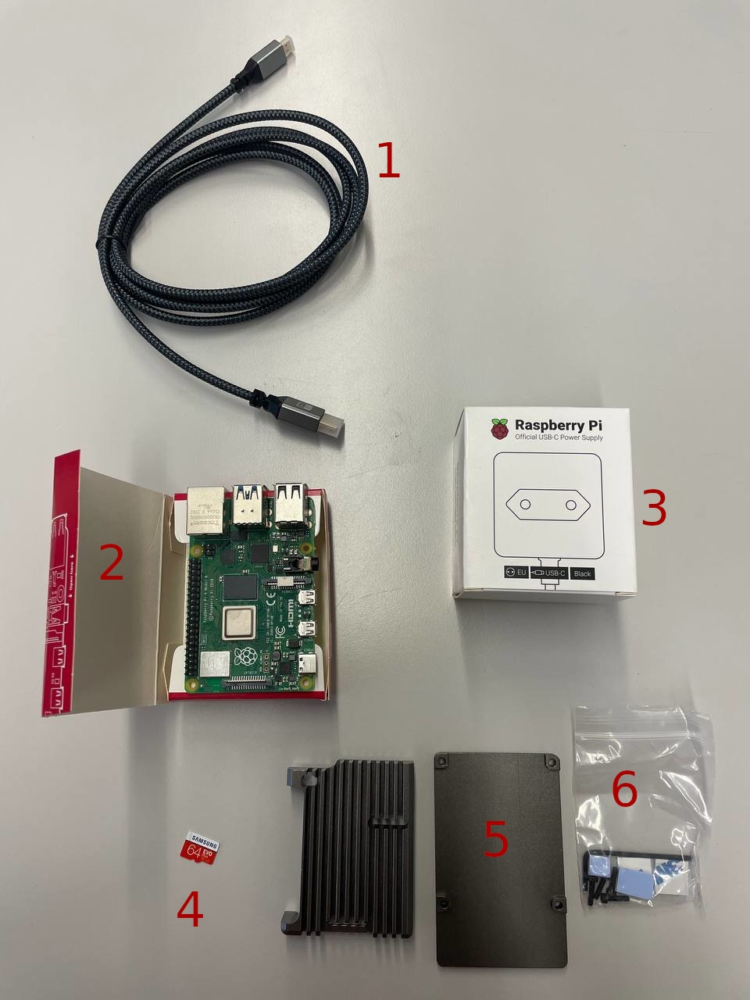
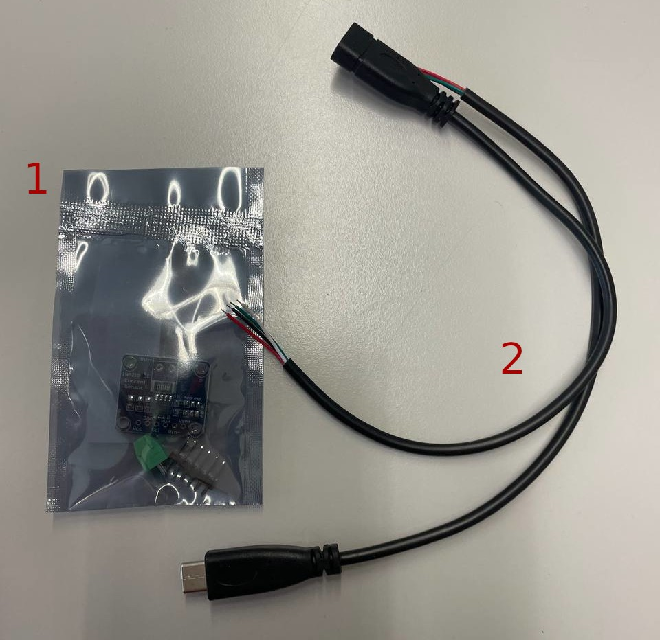

# 1. Projet de Banc de Mesures de Performance

Ce projet consiste à mettre en place un banc de mesures de performance pour évaluer la performance d'un site web ou d'une application web en collectant des données de mesure et en générant des rapports détaillés. Le banc de mesures utilisera des outils tels que Gatling, INA219 et Node-RED pour effectuer les mesures et analyser les résultats.

# 2. Table des matières
- [1. Projet de Banc de Mesures de Performance](#1-projet-de-banc-de-mesures-de-performance)
- [2. Table des matières](#2-table-des-matières)
- [3. Description](#3-description)
- [4. Caractéristiques](#4-caractéristiques)
- [5. Shéma de principe](#5-shéma-de-principe)
- [Analyse UI](#analyse-ui)
  - [Page d'accueil](#page-daccueil)
  - [Données](#données)
  - [Tests](#tests)
- [5. Jalons](#5-jalons)
  - [5.1. Mise en place (14.08.2023 - 21.08.2023)](#51-mise-en-place-14082023---21082023)
    - [5.1.1. But](#511-but)
    - [5.1.2. Etapes](#512-etapes)
    - [5.1.3. Remarque](#513-remarque)
  - [5.2. 1ère itération (21.08.2023 - 04.09.2023)](#52-1ère-itération-21082023---04092023)
    - [5.2.1. But](#521-but)
    - [5.2.2. Étape](#522-étape)
    - [5.2.3. Remarque](#523-remarque)
  - [5.3. 2ème itération (04.09.2023 - 11.09.2023)](#53-2ème-itération-04092023---11092023)
    - [5.3.1. But](#531-but)
    - [5.3.2. Étape](#532-étape)
      - [5.3.2.1. Configuration de l'UI](#5321-configuration-de-lui)
      - [5.3.2.2. Sélection de l'IP et Configuration du Serveur](#5322-sélection-de-lip-et-configuration-du-serveur)
      - [5.3.2.3. Allègement de l'OS de Volt](#5323-allègement-de-los-de-volt)
      - [5.3.2.4. Génération de Comparatifs](#5324-génération-de-comparatifs)
      - [5.3.2.5. Tests et Validation](#5325-tests-et-validation)
    - [5.3.3. Remarque](#533-remarque)
  - [5.4. Bonus (11.09.2023 - 22.09.2023)](#54-bonus-11092023---22092023)
    - [5.4.1. Point important discuté avec le client](#541-point-important-discuté-avec-le-client)
    - [5.4.2. Remarque](#542-remarque)
- [6. Matériel](#6-matériel)
  - [6.1. Volt](#61-volt)
  - [6.2. Nidus](#62-nidus)
  - [6.3. INA219](#63-ina219)
  - [6.4. RJ45](#64-rj45)
- [7. Documentation](#7-documentation)
- [8. Sources](#8-sources)


# 3. Description

Le système sera conçu pour simuler des requêtes HTTP réalistes à l'aide de Gatling, mesurer la consommation électrique en utilisant l'INA219 connecté via le bus I2C, et collecter les mesures de performance à l'aide de Node-RED. Les rapports générés fourniront des informations détaillées sur les performances du système testé, y compris le temps de réponse, la consommation d'énergie par requête, l'utilisation du processeur, etc.

# 4. Caractéristiques

- **Génération de trafic web:** Utilisation de Gatling pour simuler des requêtes HTTP réalistes, configurer des scénarios de charge et évaluer les performances du système testé.

- **Mesure de la consommation électrique (INA219):** Utilisation d'un chip INA219 pour mesurer la consommation d'énergie avec précision en mesurant la tension et le courant du système testé.

- **Mesure de la consommation:** Utilisation de Node-RED pour relever les mesures de consommation des ressources du banc de tests, y compris la consommation d'énergie, l'utilisation du processeur, la consommation de mémoire, la bande passante et les temps de réponse.

- **Génération de rapports:** Utilisation de Node-RED pour générer des rapports détaillés sur les performances du système testé, y compris les mesures de performance et les données de consommation.

- **Interface utilisateur:** Utilisation d'une interface utilisateur conviviale pour configurer les tests, sélectionner les serveurs à tester et comparer les résultats des tests.
# 5. Shéma de principe
```ascii
           +---------+      +-------------+
           |   Volt  |      |   Nidus     |
           |_________|      |_____________|
           |  RPI 4  |      |  RPI 4      |
           |_________|      |_____________|
           | Apache  |      | Node-RED    |
           | No-Proc |      | Gatling     |
           |         |      | INA219      |
           +---------+      +-------------+
              ^   |             ^   |
              |   |             |   |
              |   |             |   |
              |   |             |   |
              |   v             |   v
         +-----------------------------+
         |       Réseau local          |
         +---+-------------------+-----+
             | Dashboard Node-Red|
             +-------------------+
                        ^
                        |
                        |
                  +------------+
                  |Utilisateur |
                  +------------+

```
# Analyse UI
L'interface web sera réalisé avec Node-Red de fais, la navigation se fera via un menu hamburger en haut a gauche, et les pages seront affiché dans la partie centrale de la page.
Il y auras 3 pages principales :
- Page d'accueil : Présente le système et explique comment l'utiliser.
- Données : Permet de voir les données collectée en temps réel.
- Tests : Permet de lancer des tests et de voir les résultats.

Il y possiblité d'ajouter des pages supplémentaire si besoin, par exemple dans le cas de l'ajout d'une base de donnée pour stocker les résultats, il y aurais une page pour consulter les résultats stocké dans la base de donnée.

## Page d'accueil
 
## Données 

## Tests


# 5. Jalons
## 5.1. Mise en place (14.08.2023 - 21.08.2023)
### 5.1.1. But 
Le but de ce jalon est de mettre en place l'environnement de test et de configurer les outils nécessaires pour effectuer les mesures. Tout ce qui est nécessaire pour effectuer les tests de performance doit être installé et configuré,  Node-RED, Gatling et l'INA219. Les Raspberry Pi doivent être installés dans l'environnement prévu et configurés avec les paramètres de base.
### 5.1.2. Etapes
- [ ] Création du repository du projet
- [ ] Mise en place de la structure de documentation
- [ ] Installation des Raspberry Pi dans l'environnement prévu
- [ ] Configuration des paramètres de base des Raspberry Pi
- [ ] Installation de Node-RED et Gatling sur les Raspberry Pi
- [ ] Configuration de l'INA219 pour la mesure de la consommation
### 5.1.3. Remarque
Ce jalon est une étape importante pour le projet, car il permettra de mettre en place l'environnement de test et de configurer les outils nécessaires pour effectuer les mesures. En atteignant ces objectifs, le projet sera prêt à passer à la prochaine étape et à commencer à effectuer des tests de performance.
## 5.2. 1ère itération (21.08.2023 - 04.09.2023)
### 5.2.1. But
Mettre en places un "proof of concept" qui se baseras simplement sur la génération d'un rapport PDF par node-red via les informations de monitoring d'une machine LXC mise sous pression par gattling.

Cette "PoC" ne permettras pas de :
1. L'impossibilité de sélectionner le serveur à tester.
1. L'absence d'interface utilisateur conviviale (UI/UX).
1. L'incapacité à comparer les performances entre différents serveurs.

### 5.2.2. Étape
Pour atteindre ces objectifs, les étapes suivantes seront entreprises :
- [ ] Configuration de Node-red pour la gestion des flux de données.
- [ ] Instalation d'un serveur apache simple sur Volt.
- [ ] Configurer l'outil Gatling pour générer des charges de test sur Volt et collecter les données de performance.
- [ ] Configuration et test de relevé de l'INA219
- [ ] Test de création de PDF avec Node-Red
- [ ] Lancement des test de charge de Gatling depuis Node-Red
- [ ] Agrégation du lancement des test et des relevé de l'INA219
- [ ] Création du PDF contenant les résultat de Gatling et de l'INA219

### 5.2.3. Remarque

En atteignant ces étapes de validation, le PoC démontrera la capacité à générer un rapport PDF en utilisant Node-RED, en se basant sur les informations de surveillance d'une machine LXC soumise à des tests de charge avec Gatling. Cela jettera les bases d'une solution plus complète pour l'interface utilisateur, la comparaison de serveurs et d'autres fonctionnalités futures.

## 5.3. 2ème itération (04.09.2023 - 11.09.2023)
### 5.3.1. But 
Création d'une UI pour gérer les tests et permettre au projet de passer une étape pour devenir "utilisable" en production de fais, l'utilisateur dois pouvoir via l'UI choisir l'adresse IP, définir le serveur WEB, ajouter des paramètre (Avec/sans BD, SSL, Apache/Nginx, etc), choisir le nombre de temps que chaque passe de Gatling prend et utiliser plusieurs tests pour créer un comparatif.
En parallèle, il faudra aussi gèrer l'allègement de l'OS de Volt pour ne pas fausser les résultats de Gatling, celà passera notament par l'utilisation d'un Ubuntu Server, et la désactivation de tous les services inutiles.
### 5.3.2. Étape
#### 5.3.2.1. Configuration de l'UI
- Développer une interface utilisateur conviviale et intuitive.
- Intégrer les champs de sélection de l'IP et de configuration du serveur WEB.
- Permettre l'ajout et la gestion des différentes configurations de test.

#### 5.3.2.2. Sélection de l'IP et Configuration du Serveur
- Mettre en place la fonctionnalité de sélection de l'IP.
- Implémenter la configuration du serveur WEB (Apache/Nginx).
- Intégrer les paramètres tels que la présence de base de données, SSL, etc.
#### 5.3.2.3. Allègement de l'OS de Volt
- Utiliser un Ubuntu Server pour éviter les services inutiles.
- Désactiver tous les services inutiles.
#### 5.3.2.4. Génération de Comparatifs
- Implémenter la fonctionnalité pour exécuter plusieurs tests.
- Collecter et enregistrer les résultats de chaque test sous la forme de JSON.
- Établir un mécanisme pour comparer les performances des différents tests.
- Permettre l'importation de JSON pour comparer directement le performance sans refaire de tests

#### 5.3.2.5. Tests et Validation
- Effectuer des tests approfondis pour s'assurer du bon fonctionnement de l'UI.
- Vérifier la cohérence et l'exactitude des données collectées.
- Assurer que l'UI est réactive et adaptée à différentes configurations.

### 5.3.3. Remarque

Ce jalon représente une avancée significative par rapport au précédent "proof of concept" (PoC), car il inclut la mise en place d'une interface utilisateur, la sélection de l'IP, la configuration des serveurs, et la possibilité de comparer les résultats de différents tests. En atteignant ces objectifs, le projet se rapprochera davantage d'une utilisation en production et offrira une expérience plus complète aux utilisateurs.

## 5.4. Bonus (11.09.2023 - 22.09.2023)
Selon suivi voir si il est possible de faire une troisième itération pour ajouter des fonctionnalités supplémentaires, telles que :
- [ ] Ajouter la possibilité de tester plusieurs serveurs en même temps.
- [ ] Ajouter la possibilitée de stocker les résultats dans une base de données.
- [ ] Ajouter la possibilité de générer des graphiques pour les résultats.
- [ ] Ajouter la possibilitée d'utiliser un capteur type prise connectée pour mesurer la consommation électrique d'un rack de serveur complet.
- [ ] Consultation d'un expert pour voir si il est possible de faire une version "boitier" du projet pour le rendre plus portable.
- [ ] Consultation d'un expert pour donner des résultats plus précis notament grâce a des statistique sur de multiple test.

### 5.4.1. Point important discuté avec le client
- Stockage des résultats dans une base de données : Le client souhaite que les résultats soit stocké dans une base de données pour pouvoir les consulter plus tard, et les comparer avec d'autres tests.
- Génération de graphiques : Le client souhaite pouvoir générer des graphiques pour les résultats, pour pouvoir les comparer plus facilement.
- Mise en place d'un boitier : Le client souhaite pouvoir mettre en place un boitier pour le projet, afin de pouvoir le déplacer plus facilement.
### 5.4.2. Remarque
Ce jalon est facultatif et dépendra de la disponibilité des ressources et du temps restant. Il s'agit d'une opportunité pour le projet d'aller au-delà des objectifs initiaux et d'ajouter des fonctionnalités supplémentaires pour améliorer l'expérience utilisateur et les performances du système.

# 6. Matériel
- 2x Radiateur pour Raspberry Pi 4
- 2x Raspberry Pi 4 /4GB RAM / 64GB SD
- 2x Bloc d'alimentation Raspberry Pi 4
- 2x Carte Micro SD 64GB
- 2x cable RJ45 violet
- 1x cable Micro HDMI - HDMI
- 1x Plaque d'essai
- 1x set de câbles de connexion
- 2x Platine de mesure INA219
- 2x câble USB-C Femelle 
- 2x câble USB-C Mâle

## 6.1. Volt

## 6.2. Nidus

## 6.3. INA219
Il s'agit d'une seconde puce INA219 qui a été commandé pour le projet, pour pouvoir changer la puce INA219 en cas de problème.

## 6.4. RJ45


# 7. Documentation
La documentation se trouve dans le dossier `docs` du repository. Il y a deux documents principaux :
- [Rapport de projet](docs/rapport.md) : Rapport de projet qui décrit les différentes étapes du projet pour le reproduire ou le modifier.
- [Manuel d'utilisation](docs/manuel.md) : Manuel d'utilisation qui décrit comment utiliser le projet une fois qu'il est installé.

La documentation est écrite en Markdown et peut être consultée directement sur GitLab ou convertie en PDF à l'aide de Pandoc.
Un [wiki](https://mylos.cifom.ch/gitlab/ToblerC/banc-de-mesures-de-la-consommation-electrique/-/wikis/home) est également disponible sur GitLab pour fournir des informations mieux structurées sur le projet.


# 8. Sources