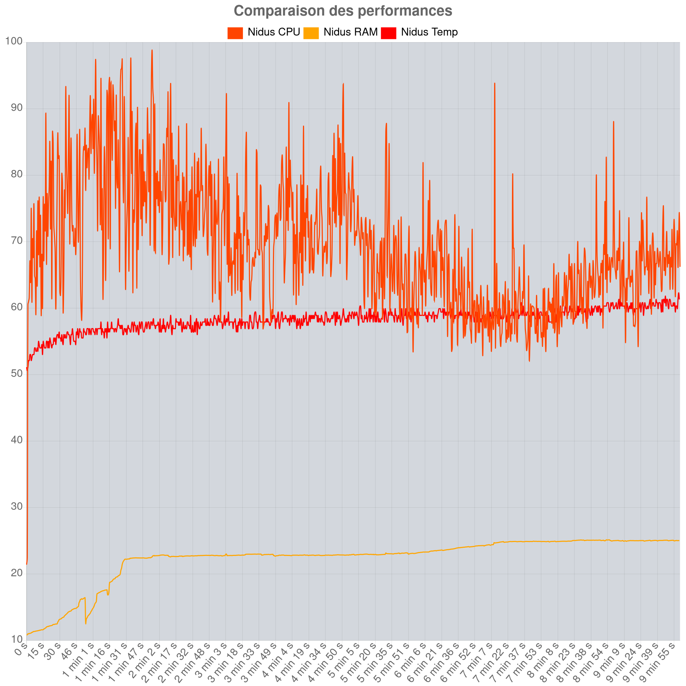
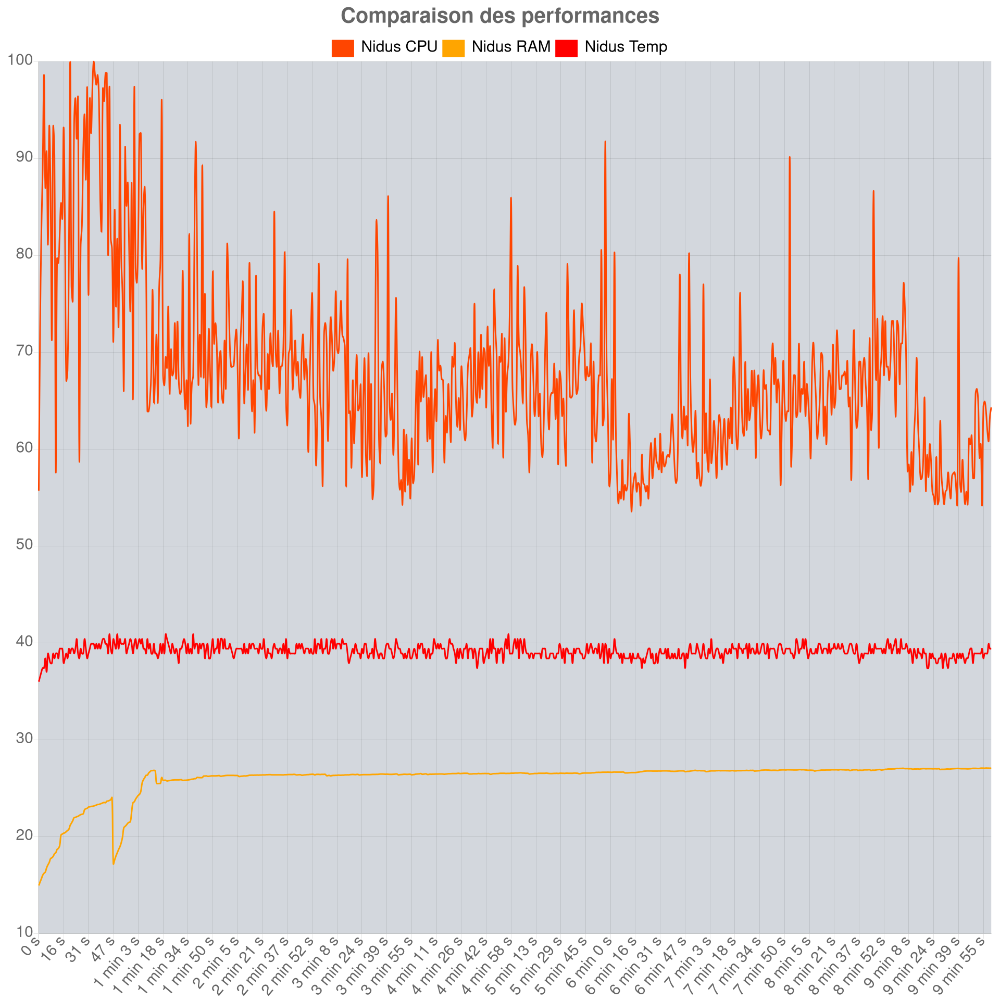

# 1. Suivi de projet : Banc de mesures de la consommation électrique pour application web

     

---

**Candidat:** Cyril Tobler  
**Proposé par:** SINABE Sarl  
**Personne de contact:** Benoit Vianin  
**Enseignant-e:** Fabien Maire  
**Lieu de travail:** Ecole CPNE-TI SIS2  
**Nombre de périodes:** 300  
**Durée du travail :**  *14.08.2023 - 22.09.2023*

---

# 2. Sommaire
- [1. Suivi de projet : Banc de mesures de la consommation électrique pour application web](#1-suivi-de-projet--banc-de-mesures-de-la-consommation-électrique-pour-application-web)
- [2. Sommaire](#2-sommaire)
- [3. Avancées et Suivi](#3-avancées-et-suivi)
- [4. A faire](#4-a-faire)
  - [4.1. Modifier le Json](#41-modifier-le-json)
  - [4.2. Amélioration du calcul de la bar de chargement](#42-amélioration-du-calcul-de-la-bar-de-chargement)
  - [4.3. Reinstaller Nidus](#43-reinstaller-nidus)
  - [4.4. Refactorer Node-Red en séparant mieux les différents flux](#44-refactorer-node-red-en-séparant-mieux-les-différents-flux)
  - [4.5. Execution d'un CSV pour Gatling](#45-execution-dun-csv-pour-gatling)
  - [4.6. Téléchargement d'un script Gatling](#46-téléchargement-dun-script-gatling)
  - [4.7. Choix parmi les script Gatling](#47-choix-parmi-les-script-gatling)
- [5. Améliorations Futures](#5-améliorations-futures)
  - [5.1. Base de Données](#51-base-de-données)
  - [5.2. Utilisation de FlowFuse](#52-utilisation-de-flowfuse)
  - [5.3. Analyse des Données](#53-analyse-des-données)
  - [5.4. Tests de Cluster](#54-tests-de-cluster)
  - [5.5. Sécurité Renforcée](#55-sécurité-renforcée)
  - [5.6. Intégration de l'Apprentissage Automatique](#56-intégration-de-lapprentissage-automatique)
  - [5.7. Support Multilingue](#57-support-multilingue)
  - [5.8. Optimisation d'une distribution Ubuntu](#58-optimisation-dune-distribution-ubuntu)
- [6. Problèmes](#6-problèmes)
  - [6.1. Problème de Détection I2C](#61-problème-de-détection-i2c)
  - [6.2. Problème de Performance](#62-problème-de-performance)
    - [6.2.1. Solution choisie :](#621-solution-choisie-)
  - [6.3. Température](#63-température)
    - [6.3.1. Sans ventilateur](#631-sans-ventilateur)
    - [6.3.2. Avec Ventilateur](#632-avec-ventilateur)

 

# 3. Avancées et Suivi
Depuis le premier suivie il y a eu :
- Création de PDF pour les rapports
- Création des Graphiques pour les rapports
- Ajout des graphiques dans les rapports
- Ajout de la barre de chargement
- Lancement de test depuis Gatling
- Ajout de la possibilité de choisir les tests
- Mise au points du rapport le plus lisible possible
- Optimisation
- Récupération des données de Gatling
- Utilisation des données de Gatling pour les graphiques
- Amélioration de l'UI

 

# 4. A faire 
## 4.1. Modifier le Json
Modification du JSON pour que les test sans gatling puissent etre regenerer.
## 4.2. Amélioration du calcul de la bar de chargement
Actuellement, la barre de chargement est calculé par rapport au temps défini par l'utilisateur lors de la création du test. Cependant, il serait plus intéressant de calculer la barre de chargement par rapport au temps de la simulation Gatling. Cela permettrait d'avoir une barre de chargement plus précise et plus réaliste.
## 4.3. Reinstaller Nidus
Reinstaller Nidus sans interface graphique pour avoir plus de puissance dédié a Node-Red et fournir une documentation plus fine de l'instalation de Nidus.
## 4.4. Refactorer Node-Red en séparant mieux les différents flux
Refactorer Node-Red en séparant mieux les différents flux pour avoir un code plus lisible et plus facile a maintenir.
## 4.5. Execution d'un CSV pour Gatling
Execution d'un CSV pour Gatling pour pouvoir tester des scénarios plus complexe.
## 4.6. Téléchargement d'un script Gatling
Téléchargement d'un script Gatling pour que l'iutilisateur puisse donner le script qu'il veut utiliser.
## 4.7. Choix parmi les script Gatling
Choix parmi les script Gatling pour que l'utilisateur puisse choisir le script qu'il veut utiliser.

 

# 5. Améliorations Futures
## 5.1. Base de Données
L'ajout d'une base de données permettrait de stocker les données de monitoring et de Gatling.

## 5.2. Utilisation de FlowFuse
L'adoption de FlowFuse offrirait une solution pour dépasser les limitations en termes de puissance de calcul et de mémoire du Raspberry Pi. 

## 5.3. Analyse des Données
Faire appel à des experts en analyse de données et en création de rapports améliorerait la précision et la qualité des rapports générés.

## 5.4. Tests de Cluster
À terme, il serait extrêmement intéressant de pouvoir tester un cluster de Raspberry Pi. 

## 5.5. Sécurité Renforcée
Renforcer la sécurité de l'ensemble du système, en mettant en place des mécanismes de chiffrement des données, d'authentification forte et de protection contre les vulnérabilités.

## 5.6. Intégration de l'Apprentissage Automatique
Explorer l'intégration de l'apprentissage automatique pour l'analyse prédictive des données, ce qui pourrait permettre de détecter des tendances et des anomalies.

## 5.7. Support Multilingue
Ajouter la prise en charge de plusieurs langues pour rendre l'application accessible à un public international.

## 5.8. Optimisation d'une distribution Ubuntu
Fournir une distribution Ubuntu optimisée au maximum, n'ayant que le strict minimum en termes de service et de logiciel. 

 

# 6. Problèmes
Comme dans tout projet, j'ai rencontré des problèmes lors de la réalisation de ce projet. Certains ont été résolus, d'autres non. Dans cette section, je vais décrire les problèmes rencontrés et les solutions que j'ai trouvées.

## 6.1. Problème de Détection I2C

Lors de l'installation de l'INA219, l'une des premières étapes consiste à vérifier si le Raspberry Pi détecte correctement le module. Pour ce faire, il faut utiliser la commande `sudo i2cdetect -y 1`, qui permet de répertorier les modules I2C connectés au Raspberry Pi. Cependant, lors de mes tests, j'ai rencontré des difficultés pour détecter l'INA219. J'ai donc entrepris une série de tests avec l'aide précieuse de M. Singelé afin de déterminer la cause du problème.
J'ai donc pris la décision de repartir de zéro en effectuant une installation propre, sans Node-Red ni Gatling. À ce moment-là, j'ai enfin pu détecter mes puces avec succès.

Une fois que la puce a été détectée, j'ai entrepris une réinstallation minutieuse de Node-Red et Gatling, vérifiant étape par étape si la détection de la puce était toujours fonctionnelle. Finalement, j'en ai conclu que le problème résidait dans le chargement incorrect du module I2C lors de ma première installation.

## 6.2. Problème de Performance

Pour récupérer les informations de Gatling, j'extrayais les données des fichiers journaux. Avec ces paramètres, le fichier journal devenait très rapidement volumineux. De plus, ma méthode de traitement des informations était gourmande en mémoire. J'ai donc dû revoir ma manière de traiter les données et de les stocker pour éviter ce genre de problème.

### 6.2.1. Solution choisie :
En traitant les informations plus tôt dans le flux et en évitant de joindre les flux inutilement, j'ai pu réduire la consommation de mémoire et ainsi éviter les problèmes de performances. Cependant, il est essentiel de noter que, malgré ces améliorations, je ne peux pas réaliser des tests de charge avec de nombreux utilisateurs sur de longues périodes.

J'ai réussi à réaliser des tests avec 10 utilisateurs effectuant 6 requêtes par seconde pendant 5 minutes, ou un test d'une heure avec un seul utilisateur.

Il est important de maintenir des attentes réalistes : le Raspberry Pi 4 n'est pas un serveur et ne peut pas gérer des tests de charge avec des milliers d'utilisateurs pendant des heures et traiter ensuite des millions de lignes de journaux.

## 6.3. Température
Les Raspberry Pi sont connus pour leur tendance à surchauffer. C'est pourquoi il est important de prendre des mesures pour éviter la surchauffe. 

Dans un premier temps la solution abordée dès le départ fut de greffer Nidus et Volt de radiateur afin de dissiper la chaleur. Cependant, cette solution n'était pas suffisante pour éviter la surchauffe. J'ai donc décidé d'ajouter un ventilateur de bureau pour aider à dissiper la chaleur.

Cependant, le ventilateur n'est pas contrôlable depuis Node-Red, ce qui signifie qu'il doit être activé manuellement.

Cela signifie également que le ventilateur doit être activé avant le début du test et désactivé après la fin du test. 

Cela peut être problématique car il dépend forcément d'une intervention humaine. Cependant, il est possible de le contrôler depuis Node-Red, mais cela nécessite l'utilisation d'un ventilateur contrôlable, c'est pour quoi j'ai décidé de rajouter un bouton pour mentionner si le ventilateur est utilisée ou non, afin de pouvoir le notifier dans le rapport et a terme si l'on ajoute un ventilateur contrôlable, de pouvoir l'activer ou le désactiver depuis Node-Red.

Et après plusieurs test j'ai pu comparer les résultats avec et sans ventilateur, pour garantir que les résultats du test ne sont pas faussés par l'environnement, j'ai décidé que avant les test je laisserais le ventilateur tourner pendant 5 minutes pour que la température soit stable pour le test avec ventilateur et pour l'autre je laisserais le ventilateur éteint pendant 5 minutes pour que la température soit stable pour le test sans ventilateur.

### 6.3.1. Sans ventilateur

### 6.3.2. Avec Ventilateur

