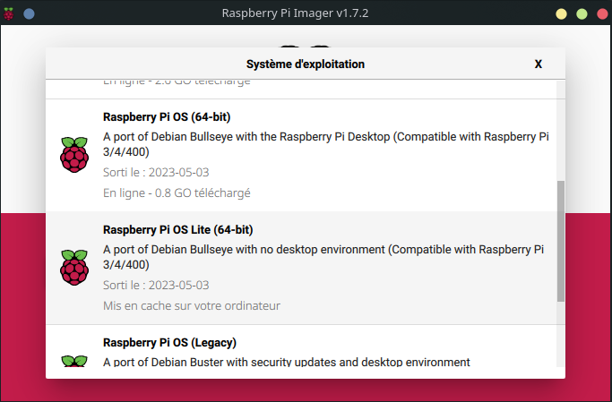
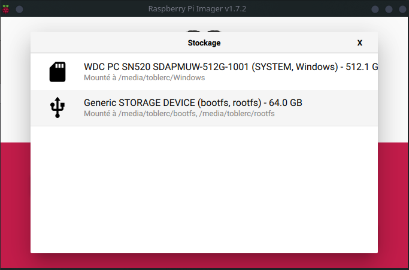
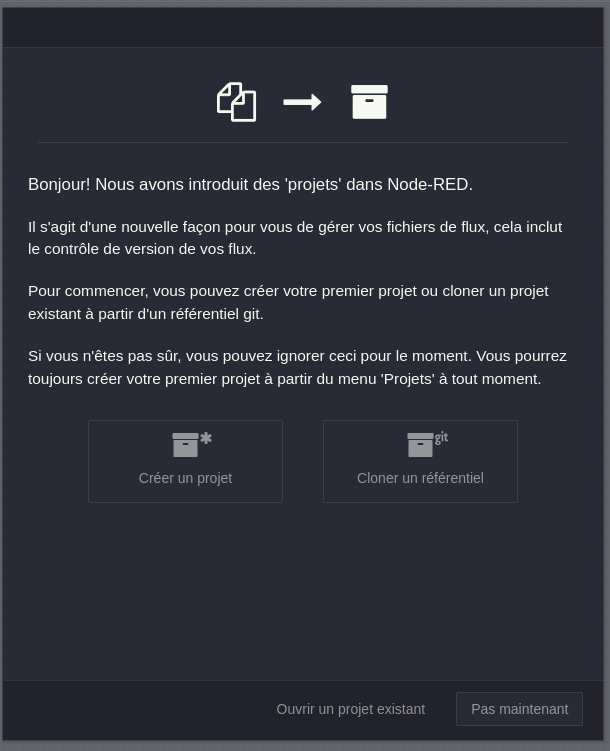
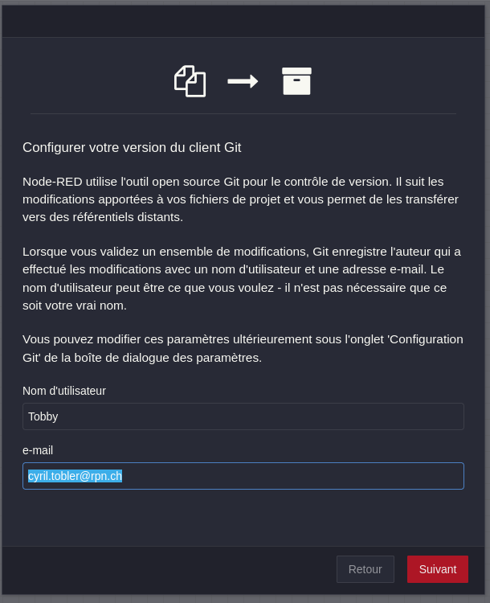
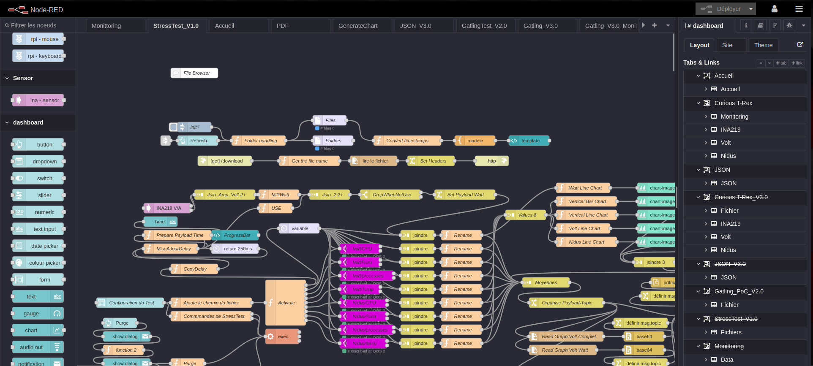
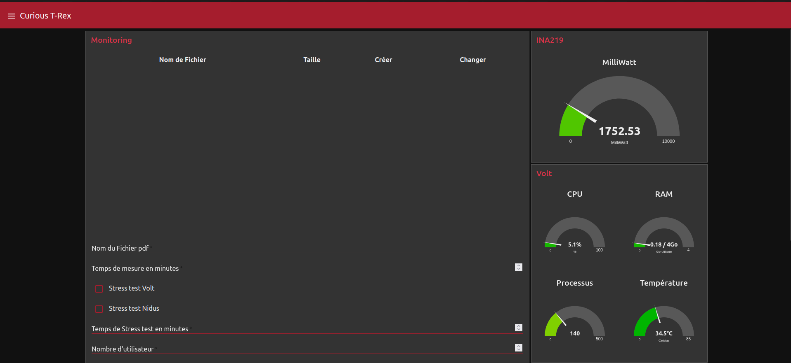
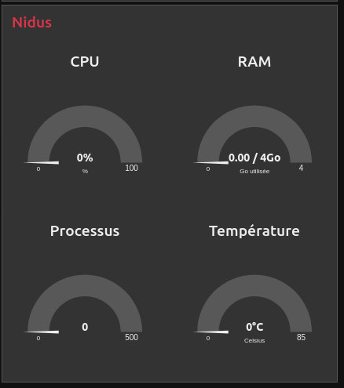
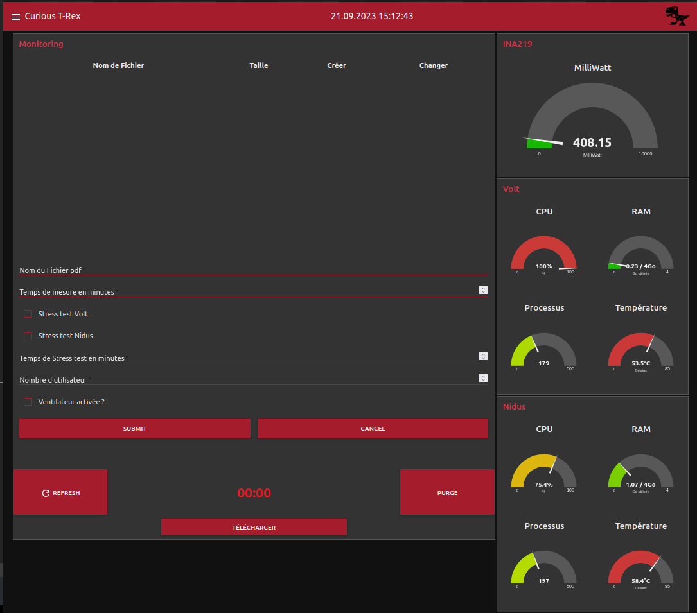
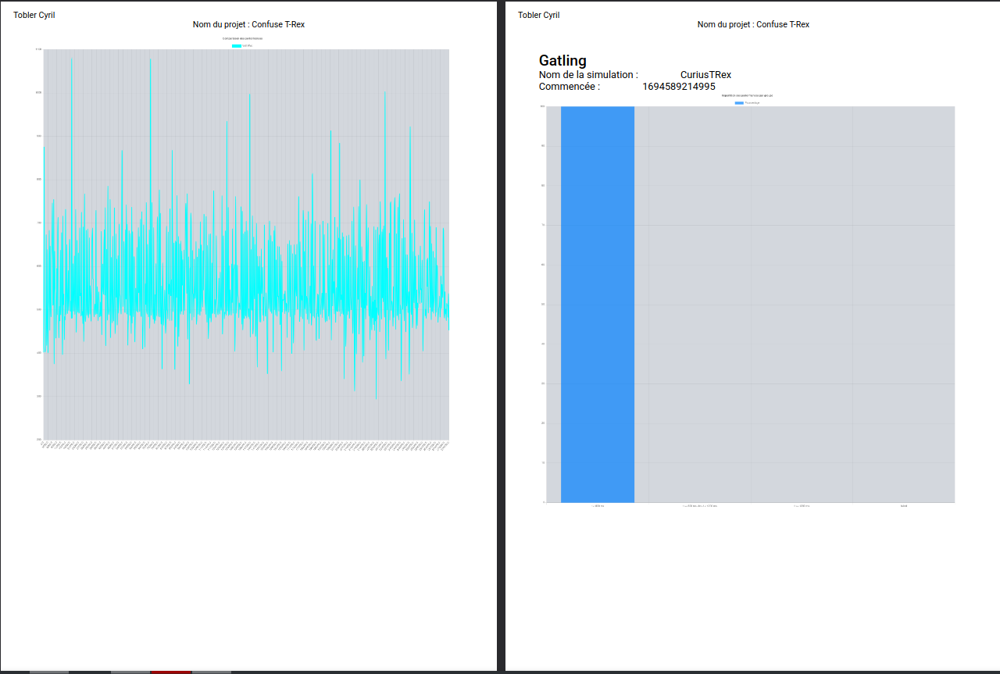
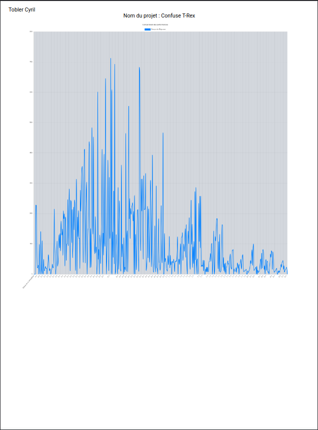

# 1. Manuel Utilisateur - Curious T-Rex- Projet de Surveillance des Raspberry Pi


<br><br><br><br><br>
<div style="page-break-after: always;"></div>

- [1. Manuel Utilisateur - Curious T-Rex- Projet de Surveillance des Raspberry Pi](#1-manuel-utilisateur---curious-t-rex--projet-de-surveillance-des-raspberry-pi)
- [2. Introduction](#2-introduction)
- [3. Matériel](#3-matériel)
  - [3.1. Nomenclature](#31-nomenclature)
- [4. Installation](#4-installation)
  - [4.1. Instalation physique](#41-instalation-physique)
  - [4.2. Instalation logiciel](#42-instalation-logiciel)
    - [4.2.1. Volt](#421-volt)
    - [4.2.2. Nidus](#422-nidus)
    - [4.2.3. Script d'installation](#423-script-dinstallation)
    - [4.2.4. Suite au script d'installation](#424-suite-au-script-dinstallation)
    - [4.2.5. Vérification](#425-vérification)
- [5. Utilisation](#5-utilisation)
  - [5.1. Test de performances](#51-test-de-performances)
  - [5.2. Lecture du rapport](#52-lecture-du-rapport)
- [6. Maintenance](#6-maintenance)
- [7. Licence](#7-licence)
  - [7.1. Licences des Dépendances](#71-licences-des-dépendances)


<div style="page-break-after: always;"></div>

# 2. Introduction

Ce manuel utilisateur vous guidera à travers l'utilisation du système de surveillance des Raspberry Pi. Ce projet vise à surveiller la consommation d'énergie et la température des Raspberry Pi pour évaluer leurs performances. Suivez les étapes ci-dessous pour commencer.


# 3. Matériel
- **2x** Radiateur pour Raspberry Pi 4
- **2x** Raspberry Pi 4 /4GB RAM / 64GB SD
- **2x** Bloc d'alimentation Raspberry Pi 4
- **2x** Carte Micro SD 64GB
- **1x** cable Micro HDMI - HDMI (Déboguage)
- **1x** Plaque d'essai
- **1x** set de câbles de connexion
- **2x** Platine de mesure INA219
- **2x** câble USB-C Femelle 
- **2x** câble USB-C Mâle
## 3.1. Nomenclature

Pour simplifier la lecture du rapport ainsi que le travail, les Raspberry Pi seront nommés comme suit :
- **Volt** : Serveur Web
- **Nidus** : Serveur de monitoring

<div style="page-break-after: always;"></div>

# 4. Installation
Pour installer le système de surveillance des Raspberry Pi, suivez les étapes ci-dessous.
Le but du projet est de proposer un système de monittoring complet et facile à installer.
## 4.1. Instalation physique
- Branchez les Raspberry Pi sur le réseau et sur un écran via le cable Micro HDMI - HDMI.
- Les Raspberry PI doivent se trouver sur le même réseau.
- Branchez les platines de mesure INA219 sur les ports GPIO des Raspberry Pi.
## 4.2. Instalation logiciel
### 4.2.1. Volt
Selon le but du projet, l'instalation de Volt est complétement à choix. Volt est est le serveur Web que vous souhaitez tester. En principe il devrait s'agir d'un serveur Web accessible en :80, simplement lié a la configuration de gatling cependant par la suite il faut personaliser le script de test pour qu'il corresponde à votre serveur Web.

Cependant, pour avoir les informations de monittoring il y a quand même une ou deux étapes à suivre.

- Il faut partager les clé SSH entre Nidus et Volt
- Il faut installer le script de monitoring sur Volt (mqtt.sh)


### 4.2.2. Nidus
Je préconnise d'utiliser la version Lite de Raspbian, car l'environnement de bureau pour ce Raspberry Pi n'est pas un besoin. De plus, cela permettra d'avoir un système plus léger et donc plus performant.
### 4.2.3. Script d'installation
Pour utiliser le script, il faut d'abord installer le Raspberry Pi OS sur une carte SD. 
<div align="center">

</div>
<div align="center">

</div>
<div align="center">

</div>

<div style="page-break-after: always;"></div>

Comme on peut le voir précédemment, il faut sélectionner le fichier image du Raspberry Pi OS Lite 64bit, puis la carte SD sur laquelle on veut l'installer.puis dans la configuration, nous allons lui donner tous les paramètres nécessaires pour qu'il puisse se connecter au réseau et que nous puissions nous connecter à lui via SSH :
- Nom d'hôte : Nidus
- Activation du SSH avec la clé SSH publique
- Utilisateur de base
- Les variable locales :
  - Timezone : Europe/Zurich
  - Keyboard : French (Switzerland) => CH

Une fois que le Raspberry Pi OS est installé, il faut le démarrer et se connecter en SSH. Pour cela, il faut utiliser la commande suivante :
```bash
toblerc@LPT-UNIX-USB-CT:~$ ssh tobby@Nidus
```
Pour simplifier le déployement du script, nous alors simplement copier coller le script dans le terminal SSH, puis l'exécuter :
```bash
tobby@Nidus:~ $ sudo vi ./install.sh
tobby@Nidus:~ $ sudo chmod +x ./install.sh 
tobby@Nidus:~ $ bash ./install.sh
```

À terme, il serait intéressant de pouvoir récupérer le script directement depuis GitHub. Cependant, actuellement, le projet est hébergé sur un GitLab privé, ce qui rend cette option impossible. Voici le type de commande que j'aimerais pouvoir utiliser :
```bash
tobby@Nidus:~ $ sudo wget "URL du script"
```
<br><br><br>
<div align="right">

</div>

<div style="page-break-after: always;"></div>

Attention car à la fin du script, il vas être demandé de remplir les paramêtre de Node-Red, et voici donc les paramètres à entrer :
```bash
Node-RED Settings File initialisation
=====================================
This tool will help you create a Node-RED settings file.

✔ Settings file · /home/tobby/.node-red/settings.js

User Security
=============
✔ Do you want to setup user security? · Yes
✔ Username · tobby
✔ Password · ***********
[...]

Projects
========
The Projects feature allows you to version control your flow using a local git repository.

✔ Do you want to enable the Projects feature? · Yes
✔ What project workflow do you want to use? · auto - changes are automatically committed

Editor settings
===============
✔ Select a theme for the editor. To use any theme other than "default", you will need to install @node-red-contrib-themes/theme-collection in your Node-RED user directory. · dracula
✔ Select the text editor component to use in the Node-RED Editor · monaco (default)

Node settings
=============
✔ Allow Function nodes to load external modules? (functionExternalModules) · Yes

```

Une fois que le script est terminé, il est recommandé de redémarrer le Raspberry Pi pour que les modifications prennent effet. Pour cela, il suffit d'utiliser la commande suivante :
```bash
tobby@Nidus:~ $ sudo reboot
```

<div style="page-break-after: always;"></div>

Maintenant, Node-Red est disponible et il faut donc connecter à Git pour pouvoir récupérer le code source du projet. Heureusement comme c'est nôtre premier démarrage, Node-Red nous propose de le faire directement depuis l'interface web. Il suffit donc de cliquer sur le bouton cloner un referentiel Git, puis de remplir les champs comme ci-dessous :
<div align="center">

</div>
<div align="center">

</div>
<div align="center">

</div>

<div style="page-break-after: always;"></div>

Nous voyons maintenant que les flux sont disponibles dans Node-Red, il est maintenant temps de vérifier que tout fonctionne correctement. Pour cela, il faut se rendre sur la page de monitoring et vérifier que les données sont bien collectées.
<div align="center">

</div>
Evidemment ce n'est pas encore le cas car il faudrais encore pour cela que les clé SSH entre les Raspberry Pi soit échangées, et que le script MQTT soit installé sur Nidus mais dés à présent nous pouvons déja voir que les données de Volt sont déja affiché.

<div align="center">

</div>
<div align="center">

</div>


<div style="page-break-after: always;"></div>

### 4.2.4. Suite au script d'installation
-  Copier les clés SSH de Nidus vers Volt
```bash
tobby@Nidus:~ $ ssh-copy-id tobby@Volt
```
- Copier le script MQTT en Local vers Nidus 
```bash
toblerc@LPT-UNIX-USB-CT:~/Documents/ES_2024/banc-de-mesures-de-la-consommation-electrique/scripts$ scp ./mqtt.sh tobby@nidus:/home/tobby/mqtt.sh
mqtt.sh                                                                                                                                                                         100% 2779     1.3MB/s   00:00
```
- Copier le script SSH au bon endroit
```bash
tobby@Nidus:~ $ sudo cp /home/tobby/mqtt.sh /usr/local/bin/mqtt.sh
```
- Activer le script MQTT
```bash
tobby@Nidus:/usr/local/bin $ sudo chmod +x mqtt.sh 
tobby@Nidus:/usr/local/bin $ sudo ./mqtt.sh
```
Une fois que tout est installé, il faut se rendre sur la page de monitoring et vérifier que les données sont bien collectées.

Pour finir il faut simplement ajouter le script Gatling, pour celà il faut se connecter en SSH à Nidus et ajouter dans le dossier `~/.gatling/gatling-charts-highcharts-bundle-3.9.5/user-files/simulations` le dossier volt dans lequel se trouve le script Gatling nommé `CuriousTRex.scala`.

```bash
tobby@Nidus:~ $ cd .gatling/gatling-charts-highcharts-bundle-3.9.5/user-files/simulations/
tobby@Nidus:~/.gatling/gatling-charts-highcharts-bundle-3.9.5/user-files/simulations $ sudo mkdir volt
tobby@Nidus:~/.gatling/gatling-charts-highcharts-bundle-3.9.5/user-files/simulations $ cd volt/
tobby@Nidus:~/.gatling/gatling-charts-highcharts-bundle-3.9.5/user-files/simulations/volt $ sudo vi CuriousTrex.scala
```


### 4.2.5. Vérification 
Pour vérifier que tout le système est à nouveau fonctionnel, il faut se rendre sur la page de monitoring et vérifier que les données sont bien collectées.
Puis executer un test avec puis sans Gatling.

<div style="page-break-after: always;"></div>


# 5. Utilisation
En se connectant à l'interface web de Node-Red qui est disponible à l'adresse suivante : http://Nidus:1880/ui, vous arrivez sur la page d'accueil du projet. Cette page a pour but de présenter le projet et donne aussi accès aux anciennes versions du projet.

Grâce au menu hamburger, vous pouvez accéder aux différentes pages du projet. La page Curious T-Rex est la page principale du projet. Elle permet de visualiser les données de monitoring des Raspberry Pi mais également de lancer des tests de performances.

<div align="center">

</div>

<div style="page-break-after: always;"></div>

## 5.1. Test de performances
Au niveau des champs à remplir, il y a :
- **Nom du fichier PDF :** Il s'agit du nom du fichier PDF qui sera généré à la fin du test. 
- **Temps de mesure en minutes :** Il s'agit du temps de mesure en minutes mais également le temps du test de Gatling. Il est important de noter que le temps de mesure est en minutes et non en secondes.
- **Stress test Volt :** Il s'agit d'une case à cocher pour définir si un stress test doit être effectué sur Volt ou non. Si cette case est cochée, alors un stresstest système sera lancé sur Volt.
- **Stress test Nidus :** Il s'agit d'une case à cocher pour définir si un stress test doit être effectué sur Nidus ou non. Si cette case est cochée, alors un stresstest système sera lancé sur Nidus.
- **Temps de Stress test en minutes :** Il s'agit du temps de stress test en minutes, il commence en même temps que les mesures.
- **Nombre d'utilisateurs :** Il s'agit du nombre d'utilisateurs qui vont se connecter au serveur Web pendant le stress test. Si ce champs est renseigné à 0 alors le test de Gatlign ne sera pas effectué.
- **Ventilateur activée ?** Il s'agit d'une case à cocher pour définir si un ventilateur est activée ou non, actuellement il ne déclenche pas de ventilateur mais renseigne simplement la valeur dans le rapport.

<div style="page-break-after: always;"></div>

## 5.2. Lecture du rapport


<div align="center">

</div>

Un rapport type se compose comme suit :
- **Première page (Nidus) :** La page de garde contient le nom du projet, le nom du rapport, et les donnée en moyenne sur la durée du test, ainsi que un graphique des donnée dans le temps. Il est normal que le graphique ne comporte pas de label sur l'axe vertical car les donnée ont différentes unités.
- **Deuxième page (Volt) :** La deuxième page contient les même informations que la première page mais pour Volt. Avec en plus une moyenne de la consommation electrique par requête, cette valeur est calculé en soustrayant la consommation moyenne relevée lors d'un test de longue durée à vide de Ubuntu à la moyenne relevée lors du test et en divisant le résultat par le nombre de requête.
- **Troisième page (Consommation) :** La troisième page contient les graphiques de consommation des Raspberry Pi. 
- **Quatrième, cinquième et sixième page (Gatling) :** Contient les informations sur le test de Gatling, avec les graphiques de performances, les graphiques de temps de réponse, et les graphiques de temps de réponse par requête. Ces pages ne sont pas générées si le test de Gatling n'a pas été effectué.

<div style="page-break-after: always;"></div>

# 6. Maintenance

1. **Mises à Jour :** Si vous avez installé les noeud de Node-Red à l'aide de Git, alors vous pouvez simplement utiliser la commande `git pull` pour mettre à jour les noeuds. Si vous avez installé les noeuds à l'aide du script d'installation, vous pouvez utiliser le script d'installation pour mettre à jour le système.

2. **Problèmes Courants :** Consultez la section des problèmes courants de la documentation si vous rencontrez des difficultés.

3. **Support :** Si vous avez des questions ou des problèmes, veuillez ouvrir un ticket sur le GitLab/GitHub du projet en suivant le template de ticket :

```markdown
## Description du problème

[Expliquez ici le problème de manière claire et concise.]

## Étapes de reproduction

1. [Indiquez les étapes exactes pour reproduire le problème, si applicable.]
2. [Ajoutez autant d'étapes que nécessaire.]

## Comportement attendu

[Expliquez ce que vous attendiez comme comportement.]

## Comportement actuel

[Expliquez ce qui se passe réellement, en détail.]

## Captures d'écran

[Si applicable, ajoutez des captures d'écran pour illustrer le problème.]

## Informations supplémentaires

- Version de [votre logiciel ou projet]
- Système d'exploitation [ex : Ubuntu, OpenSuse, Raspberry Pi OS, etc.]
- Navigateur (si applicable) [ex : Chrome, Firefox, Safari, Brave, etc.]

## Contexte

[Ajoutez tout contexte ou informations supplémentaires pertinents.]

## Étape suivante

[Indiquez ce que vous pensez être la prochaine étape pour résoudre ce problème.]

## Contributions possibles

[Si vous avez des idées sur la manière de résoudre ce problème ou si vous êtes prêt à contribuer, veuillez en discuter ici.]

## Personnes assignées

- [@NomDeLAssigné]

```

<div style="page-break-after: always;"></div>

# 7. Licence

Le projet principal est sous licence **GNU General Public License Version 3.0 (GPL-3.0)**. Cette licence open source garantit les droits de l'utilisateur à exécuter, étudier, modifier et redistribuer le logiciel.

Pour plus de détails sur la licence **GPL V3.0**, voici [le texte complet de la licence](https://www.gnu.org/licenses/gpl-3.0.html).

## 7.1. Licences des Dépendances
Le projet utilise plusieurs dépendances, chacune étant soumise à une licence spécifique. Voici un aperçu des licences des dépendances, avec des informations sur chacune d'entre elles :

1. [**Licence MIT**](https://opensource.org/license/mit/)
   - **Chart.js, PDFMake2, PDF Make, pi-ina219**
   - La licence MIT autorise une utilisation, une modification et une redistribution libres du logiciel, à condition que les avis de droits d'auteur soient conservés.

2. [**Licence Apache 2.0**](https://opensource.org/license/apache-2-0/)
   - **Node-Red, Dashboard, MQTT+, File System Node-Red, Base64 Node-Red, Gatling, FlowFuse**
   - La licence Apache 2.0 permet une utilisation, une modification et une redistribution libres du logiciel, tout en incluant des dispositions spécifiques concernant les brevets et les contributions.

3. [**Licence ISC (Internet Systems Consortium)**](https://opensource.org/license/isc-license-txt/)
   - **INA219 Node-Red**
   - La licence ISC autorise une utilisation, une modification et une redistribution libres du logiciel, avec une responsabilité limitée.

4. [**Licence BSD-2-Clause**](https://opensource.org/license/bsd-2-clause/)
   - **Chart-Image Node-Red**
   - La licence BSD-2-Clause autorise une utilisation, une modification et une redistribution libres du logiciel, en exigeant que les avis de droits d'auteur soient conservés.

5. [**Licence EPL/EDL (Eclipse Public License / Eclipse Distribution License)**](https://opensource.org/license/epl-2-0/)
   - **Mosquitto**
   - La licence EPL/EDL est spécifique à la fondation Eclipse et permet une utilisation, une modification et une redistribution libres du logiciel, avec des exigences particulières pour les distributions.

6. [**GNU General Public License Version 3.0 (GPL-3.0)**](https://opensource.org/license/gpl-3.0/)
   - **Raspberry Pi OS, Ubuntu**
   - La licence GNU General Public License Version 3.0 garantit les droits de l'utilisateur à exécuter, étudier, modifier et redistribuer le logiciel conformément à ses termes et conditions.
