# 1. Rapport de projet : Banc de mesures de la consommation électrique pour application web


<br><br><br><br><br>


---

**Candidat:** Cyril Tobler  
**Proposé par:** SINABE Sarl  
**Personne de contact:** Benoit Vianin  
**Enseignant-e:** Fabien Maire  
**Lieu de travail:** Ecole CPNE-TI SIS2  
**Nombre de périodes:** 300  
**Durée du travail :**  *14.08.2023 - 22.09.2023*

---

<div style="page-break-after: always;"></div>


# 2. Sommaire
- [1. Rapport de projet : Banc de mesures de la consommation électrique pour application web](#1-rapport-de-projet--banc-de-mesures-de-la-consommation-électrique-pour-application-web)
- [2. Sommaire](#2-sommaire)
- [3. Introduction](#3-introduction)
- [4. Objectifs](#4-objectifs)
  - [4.1. Objectif principal](#41-objectif-principal)
  - [4.2. Objectifs spécifiques](#42-objectifs-spécifiques)
- [5. Caractéristiques](#5-caractéristiques)
  - [5.1. Génération de trafic web](#51-génération-de-trafic-web)
  - [5.2. Mesure de la consommation électrique (INA219)](#52-mesure-de-la-consommation-électrique-ina219)
  - [5.3. Mesure de la consommation](#53-mesure-de-la-consommation)
- [6. Matériel](#6-matériel)
  - [6.1. Nomenclature](#61-nomenclature)
  - [6.2. Volt](#62-volt)
  - [6.3. Nidus](#63-nidus)
  - [6.4. INA219](#64-ina219)
  - [6.5. RJ45](#65-rj45)
- [7. Budget](#7-budget)
- [8. Planification](#8-planification)
  - [8.1. Mise en place](#81-mise-en-place)
  - [8.2. Première itération](#82-première-itération)
  - [8.3. Deuxième itération](#83-deuxième-itération)
  - [8.4. Troisième itération](#84-troisième-itération)
  - [8.5. Quatrième itération](#85-quatrième-itération)
- [9. Instalation physique](#9-instalation-physique)
  - [9.1. Nidus](#91-nidus)
  - [9.2. Volt](#92-volt)
  - [9.3. Situation finale](#93-situation-finale)
  - [9.4. Suite](#94-suite)
- [10. Shéma de principe](#10-shéma-de-principe)
  - [10.1. Shéma de principe visuel](#101-shéma-de-principe-visuel)
  - [10.2. Diagrame de séquence](#102-diagrame-de-séquence)
- [11. Systèmes d'exploitation (OS)](#11-systèmes-dexploitation-os)
  - [11.1. Ubuntu](#111-ubuntu)
  - [11.2. Raspberry Pi OS (Raspbian)](#112-raspberry-pi-os-raspbian)
  - [11.3. Première installation](#113-première-installation)
  - [11.4. Seconde instalation Ubuntu Server](#114-seconde-instalation-ubuntu-server)
  - [11.5. Deuxième installation Raspbian](#115-deuxième-installation-raspbian)
- [12. I²C (Inter-Integrated Circuit)](#12-ic-inter-integrated-circuit)
  - [12.1. Bus Série Synchrone Bidirectionnel Half-Duplex](#121-bus-série-synchrone-bidirectionnel-half-duplex)
  - [12.2. Les Deux Câbles Essentiels : SDA et SCL](#122-les-deux-câbles-essentiels--sda-et-scl)
  - [12.3. TWI ou TWSI](#123-twi-ou-twsi)
- [13. SSH](#13-ssh)
  - [13.1. Utilisation](#131-utilisation)
  - [13.2. Génération de clé SSH](#132-génération-de-clé-ssh)
  - [13.3. Utilisation de la clé SSH](#133-utilisation-de-la-clé-ssh)
  - [13.4. SCP (Secure Copy Protocol)](#134-scp-secure-copy-protocol)
- [14. Node-RED](#14-node-red)
  - [14.1. Introduction](#141-introduction)
  - [14.2. Node.js](#142-nodejs)
  - [14.3. FlowFuse](#143-flowfuse)
  - [14.4. La Programmation par Flux](#144-la-programmation-par-flux)
  - [14.5. Instalation](#145-instalation)
  - [14.6. Configuration](#146-configuration)
- [15. Gatling](#15-gatling)
  - [15.1. Installation](#151-installation)
  - [15.2. Vérification de l'installation](#152-vérification-de-linstallation)
  - [15.3. Scripts](#153-scripts)
  - [15.4. Scala](#154-scala)
  - [15.5. Kotlin](#155-kotlin)

<div style="page-break-after: always;"></div>

- [16. Apache et Site Web](#16-apache-et-site-web)
  - [16.1. Installation](#161-installation)
  - [16.2. Mise en place d'un site Web](#162-mise-en-place-dun-site-web)
- [17. MQTT](#17-mqtt)
  - [17.1. Installation de Mosquitto sur Nidus](#171-installation-de-mosquitto-sur-nidus)
  - [17.2. Ouverture des port sur Nidus](#172-ouverture-des-port-sur-nidus)
  - [17.3. Script MQTT](#173-script-mqtt)
  - [17.4. Installation](#174-installation)
  - [17.5. Utilisation du script](#175-utilisation-du-script)
- [18. INA219](#18-ina219)
  - [18.1. GPIO](#181-gpio)
  - [18.2. Installation physique](#182-installation-physique)
  - [18.3. Obtention des données](#183-obtention-des-données)
- [19. Noeud Node-Red](#19-noeud-node-red)
  - [19.1. Dashboard](#191-dashboard)
  - [19.2. INA219](#192-ina219)
  - [19.3. Monitoring](#193-monitoring)
  - [19.4. PDF](#194-pdf)
  - [19.5. Images de graphiques et de tableaux](#195-images-de-graphiques-et-de-tableaux)
- [20. Stress Test V1.0](#20-stress-test-v10)
  - [20.1. Écran d'Accueil](#201-écran-daccueil)
  - [20.2. En Exécution](#202-en-exécution)
  - [20.3. Résultat](#203-résultat)
  - [20.4. Purge](#204-purge)
- [21. Gatling Test V2.0](#21-gatling-test-v20)
  - [21.1. But](#211-but)
  - [21.2. Étapes à Atteindre](#212-étapes-à-atteindre)
  - [21.3. Exécution d'un Test Préétabli sur Gatling depuis Node-Red](#213-exécution-dun-test-préétabli-sur-gatling-depuis-node-red)
  - [21.4. Envoi de Commande avec une Durée](#214-envoi-de-commande-avec-une-durée)
  - [21.5. Récupération des Informations](#215-récupération-des-informations)
  - [21.6. Traitement des données](#216-traitement-des-données)
  - [21.7. Refactoring](#217-refactoring)
  - [21.8. Résultat](#218-résultat)
- [22. Curious T-Rex V3.0](#22-curious-t-rex-v30)
  - [22.1. UI](#221-ui)
  - [22.2. Paramètres de Test](#222-paramètres-de-test)
  - [22.3. Optimisation](#223-optimisation)
  - [22.4. JSON](#224-json)
  - [22.5. Rapport PDF selon Gatling](#225-rapport-pdf-selon-gatling)
  - [22.6. Résultat](#226-résultat)
- [23. Curious T-Rex](#23-curious-t-rex)
  - [23.1. Installation](#231-installation)
  - [23.2. Mise à jour du JSON](#232-mise-à-jour-du-json)
- [24. Problèmes](#24-problèmes)
  - [24.1. Problème de Détection I2C](#241-problème-de-détection-i2c)
  - [24.2. Problème de Performance](#242-problème-de-performance)
  - [24.3. Température](#243-température)
  - [24.4. Analyse des Résultats des Tests de Performance](#244-analyse-des-résultats-des-tests-de-performance)
- [25. Choix effectués](#25-choix-effectués)
  - [25.1. Node-Red](#251-node-red)
  - [25.2. MQTT pour les Relevés de Monitoring](#252-mqtt-pour-les-relevés-de-monitoring)
  - [25.3. Rapport PDF](#253-rapport-pdf)
  - [25.4. INA219](#254-ina219)
  - [25.5. Gatling](#255-gatling)

<div style="page-break-after: always;"></div>

- [26. Améliorations Futures](#26-améliorations-futures)
  - [26.1. Amélioration du calcul de la bar de chargement](#261-amélioration-du-calcul-de-la-bar-de-chargement)
  - [26.2. Base de Données](#262-base-de-données)
  - [26.3. Utilisation de FlowFuse](#263-utilisation-de-flowfuse)
  - [26.4. Analyse des Données](#264-analyse-des-données)
  - [26.5. Tests de Cluster](#265-tests-de-cluster)
  - [26.6. Intégration de Services Cloud](#266-intégration-de-services-cloud)
  - [26.7. Sécurité Renforcée](#267-sécurité-renforcée)
  - [26.8. Intégration de l'Apprentissage Automatique](#268-intégration-de-lapprentissage-automatique)
  - [26.9. Support Multilingue](#269-support-multilingue)
  - [26.10. Optimisation d'une distribution Ubuntu](#2610-optimisation-dune-distribution-ubuntu)
- [27. Licences](#27-licences)
  - [27.1. Licence Principale du Projet](#271-licence-principale-du-projet)
  - [27.2. Licences des Dépendances](#272-licences-des-dépendances)
- [28. Conclusion](#28-conclusion)
- [29. Remerciement](#29-remerciement)
- [30. Sources](#30-sources)
  - [30.1. Node-RED et Extensions](#301-node-red-et-extensions)
  - [30.2. Bibliothèques et Outils Externes](#302-bibliothèques-et-outils-externes)
  - [30.3. Tutoriels et Documentation Technique](#303-tutoriels-et-documentation-technique)
  - [30.4. Gatling](#304-gatling)
- [31. Autres Outils et Ressources](#31-autres-outils-et-ressources)
  - [31.1. Articles de Recherche](#311-articles-de-recherche)
  - [31.2. Liens externes](#312-liens-externes)
  - [31.3. OS](#313-os)
- [32. Annexes](#32-annexes)

<div style="page-break-after: always;"></div>


# 3. Introduction
Le développement de sites web et d'applications web requiert une attention particulière à la performance et à la consommation des ressources. Afin de réduire l’impact écologique des solutions digitale et d’optimiser la charge des systèmes, il est essentiel de mesurer et d'analyser la consommation de ces systèmes dans des conditions de charge réalistes. Dans ce contexte, il est nécessaire de mettre en place un banc de mesures de la consommation capable de générer du trafic web, de mesurer la consommation électrique et de fournir des rapports sur la performance du code ou de l'architecture testée.
# 4. Objectifs
## 4.1. Objectif principal

L'objectif principal de ce projet est de concevoir et développer un banc de mesures de la consommation électrique pour site web ou application web. Ce banc de mesures devra être capable de générer du trafic web, de mesurer la consommation des ressources et de générer des rapports détaillés sur la performance du code ou de l'architecture testée par rapport à une référence.

## 4.2. Objectifs spécifiques

Les objectifs spécifiques du projet sont les suivants :

### 4.2.1. Génération de trafic web

Le système devra être en mesure de simuler le trafic web en générant des requêtes HTTP réalistes. Il devra pouvoir reproduire des scénarios de charge variable afin d'évaluer les performances du site web ou de l'application web dans des conditions réelles.

### 4.2.2. Mesure de la consommation

Le banc de mesures devra être équipé d'un mécanisme de mesure précis et fiable de la consommation des ressources, telles que la consommation d'énergie, l'utilisation du processeur, la consommation de mémoire et la consommation du réseau.

### 4.2.3. Génération de rapports sur la performance

Le système devra être capable de collecter les données de mesure et de générer des rapports détaillés sur la performance du code ou de l'architecture testée. Les rapports devront inclure des métriques telles que le temps de réponse, la consommation d'énergie par requête, l'utilisation du processeur, etc.

<div style="page-break-after: always;"></div>

# 5. Caractéristiques 
Le banc de mesures de la consommation pour site web ou application web devra présenter les caractéristiques suivantes :

## 5.1. Génération de trafic web

Utilisation de l'outil Gatling comme générateur de trafic web. Gatling permettra de simuler des requêtes HTTP réalistes, de configurer des scénarios de charge et d'évaluer les performances du système testé.

**Gatling** est un outil de test de charge open source basé sur Scala, conçu pour évaluer les performances des applications et des sites Web. Gatling simule des utilisateurs virtuels qui envoient des requêtes HTTP vers le système cible.


## 5.2. Mesure de la consommation électrique (INA219)

Utilisation d'un chip INA219 ou autre connectée via le bus I2C pour mesurer la consommation de manière précise et fiable. La chip INA219 fournira des informations détaillées sur la consommation d'énergie en mesurant la tension et le courant du système testé.

## 5.3. Mesure de la consommation

Utilisation d’un serveur Node-Red pour son environnement low-code pour les applications évènementielles. Il facilitera le relever des mesures de consommation des ressources. du banc de tests (consommation d'énergie, utilisation du processeur, consommation de mémoire, bande passante et temps de réponses, ...).

<div style="page-break-after: always;"></div>

# 6. Matériel
- **2x** Radiateur pour Raspberry Pi 4
- **2x** Raspberry Pi 4 /4GB RAM / 64GB SD
- **2x** Bloc d'alimentation Raspberry Pi 4
- **2x** Carte Micro SD 64GB
- **2x** cable RJ45 rose
- **1x** cable Micro HDMI - HDMI
- **1x** Plaque d'essai
- **1x** set de câbles de connexion
- **2x** Platine de mesure INA219
- **2x** câble USB-C Femelle 
- **2x** câble USB-C Mâle

## 6.1. Nomenclature

Pour simplifier la lecture du rapport ainsi que le travail, les Raspberry Pi seront nommés comme suit :
- **Volt** : Serveur Web
- **Nidus** : Serveur de monitoring

Au niveau des hostname, les Raspberry Pi seront nommés comme suit :
- **Volt** : volt.s2.rpn.ch
- **Nidus** : nidus.s2.rpn.ch

En plus des raspberry il y a ma machine de développement qui se trouve être mon laptop personnel qui tourne sous un Kubuntu 22.04. Cette machine est nommé comme suit :
- **LPT-UNIX-USB-CT**

<br><br><br><br><br>
<div style="text-align:center;">

</div>
<div style="page-break-after: always;"></div>

## 6.2. Volt

Au niveau de la répartition du materiel, Volt est composé de :
- **1.** Cable HDMI - Micro HDMI
- **2.** Raspberry PI 4
- **3.** Bloc d'alimentation pour Raspberry PI 4
- **4.** Carte Micro SD 64GB
- **5.** Radiateur pour Raspberry Pi 4
- **6.** Set de vis et de gomme pour le radiateur

---

<div style="text-align:center;">
    
</div>
<div style="page-break-after: always;"></div>

## 6.3. Nidus

Le materiel de Nidus est composé de :

- **1.** Set de cable de connexion
- **2.** Plaque d'essai
- **3.** Alimentation pour Raspberry Pi 4
- **4.** Rallonge USB-C coupé en deux
- **5.** INA219
- **6.** Raspberry Pi 4 et sa carte Micro SD 64GB
- **7.** Radiateur pour Raspberry Pi 4
- **8.** Set de vis et de gomme pour le radiateur

---


<div style="page-break-after: always;"></div>

## 6.4. INA219
Il s'agit d'une seconde puce **INA219** qui a été commandé pour le projet, pour pouvoir changer la puce **INA219** en cas de problème. Au cas ou le projet prend de l'ampleur, il est aussi possible à terme de mettre plusieurs INA219 sur le même bus **I2C**.


<div style="text-align:center;">

</div>
<br><br><br>

## 6.5. RJ45
En reserve, deux cable **RJ45** rose ont été commandé pour le projet.


<div style="text-align:center;">

</div>

<div style="page-break-after: always;"></div>

# 7. Budget
En ce qui concerne le budget, je vais fournir les prix de **Digitec/Galaxus** pour donner une idée des coûts si l'on souhaite reproduire le projet. Dans mon cas, c'est M. Viannin qui a effectué les achats auprès de ces fournisseurs. Il est possible que les prix ne correspondent pas exactement à ceux que j'ai indiqués.

---

| Matériel                                                                                                                                                                                                                                | Quantité | Prix Par Unité | Prix Total |
| --------------------------------------------------------------------------------------------------------------------------------------------------------------------------------------------------------------------------------------- | -------- | -------------- | ---------- |
| [**Raspberry Pi Câble officiel blanc Micro-HDMI vers HDMI 1M pour Raspberry Pi 4**](https://www.digitec.ch/fr/s1/product/raspberry-pi-cable-officiel-blanc-micro-hdmi-vers-hdmi-1m-pour-raspberry-pi-4-type-a-accessoires-ele-24227466) | 1X       | 12.90          | 12.90      |
| [**RASPBERRY Radiateur**](https://www.digitec.ch/fr/s1/product/intertech-raspberry-boitier-ods-721-pi4-modele-b-divers-accessoires-electroniques-boitier-18233601)                                                                      | 2X       | 25.80          | 51.60      |
| [**Raspberry Pi 4 4G Modèle B ARMv8**](https://www.digitec.ch/fr/s1/product/raspberry-pi-4-2g-modele-b-armv8-carte-de-developpement-kit-11267870)                                                                                       | 2X       | 87.–           | 174.–      |
| [**Official Raspberry Pi 4 Power Adapter**](https://www.digitec.ch/fr/s1/product/raspberry-pi-official-raspberry-pi-4-power-adapter-carte-de-developpement-kit-11268330)                                                                | 2X       | 13.90          | 27.80      |
| [**microSDXC, 64 Go, U3, UHS-I**](https://www.digitec.ch/fr/s1/product/sandisk-microsdxc-high-endurance-monitoring-microsdxc-64-go-u3-uhs-i-carte-memoire-11141387)                                                                     | 2X       | 14.90          | 29.80      |
| [**Carte enfichable à grille de trous Breadboard ZY-60**](https://www.digitec.ch/fr/s1/product/oem-carte-enfichable-a-grille-de-trous-breadboard-zy-60-planche-a-pain-accessoires-electroniques-boi-5999412)                            | 1X       | 18.90          | 18.90      |
| [**INA219**](https://www.digitec.ch/fr/s1/product/adafruit-ina219-detecteur-module-electronique-8027636)                                                                                                                                | 2X       | 17.90          | 35.80      |
| [**MikroElektronika Fils de connexion**](https://www.digitec.ch/fr/s1/product/mikroelektronika-fils-de-connexion-pour-perfboard-cable-prise-electronique-10125053)                                                                      | 1X       | 13.-           | 13.-       |
| [**Cable RJ45 violet court**](https://www.digitec.ch/fr/s1/product/violet-015-metre-lszh-uutp-cat6-datacenter-slimline-patch-cable-snagless-with-rj45-connectors-uutp-u-24167092)                                                       | 2X       | 9.75           | 19.50      |
| [**Cable USB-C Mâle-Femelle**](https://www.digitec.ch/fr/s1/product/renkforce-cable-usb-32-gen2x2-usb-c-male-usb-c-femelle-200-m-noir-gaine-pvc-2-m-cable-usb-24206671)                                                                 | 2X       | 14.95          | 29.90      |
| **Total**                                                                                                                                                                                                                               |          |                | 433.20     |

---

Une fois le matériel pris en compte, je tiens également à calculer le coût horaire de travail. Pour cela, je prends le salaire d'un technicien en informatique, soit 30.- de l'heure. Je prends également en compte le temps de travail, soit 300 périodes de 45 minutes, ce qui équivaut à 225 heures. Cela nous donne un total de 6750.- de salaire. En ajoutant le coût du matériel, nous arrivons à un total de 7183.- .

Bien sûr, dans le cadre de ce projet, le salaire n'est pas pris en compte, mais il est important de le considérer si l'on souhaite reproduire le projet dans un contexte professionnel.

<div style="text-align:right;">

</div>

<div style="page-break-after: always;"></div>

# 8. Planification
## 8.1. Mise en place
### 8.1.1. But 
Le but de ce jalon est de mettre en place l'environnement de test et de configurer les outils nécessaires pour effectuer les mesures. Tout ce qui est nécessaire pour effectuer les tests de performance doit être installé et configuré,  Node-RED, Gatling et l'INA219. Les Raspberry Pi doivent être installés dans l'environnement prévu et configurés avec les paramètres de base.
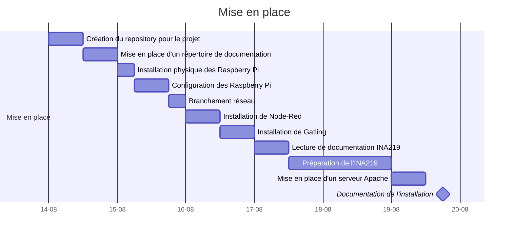
```mermaid
gantt
    dateFormat  YYYY-MM-DD
    title       Mise en place
    excludes    weekends
    axisFormat %d-%m
    tickInterval 1day
    section Mise en place

    Création du repository pour le projet : mise-en-place-a, 2023-08-14, 12h
    Mise en place d'un répertoire de documentation : mise-en-place-b, after mise-en-place-a, 12h
    Installation physique des Raspberry Pi : mise-en-place-c, after mise-en-place-b, 6h
    Configuration des Raspberry Pi : mise-en-place-d, after mise-en-place-c, 12h
    Branchement réseau : mise-en-place-e, after mise-en-place-d, 6h
    Installation de Node-Red : mise-en-place-f, after mise-en-place-e, 12h
    Installation de Gatling : mise-en-place-g, after mise-en-place-f, 12h
    Lecture de documentation INA219 : mise-en-place-h, after mise-en-place-g, 12h
    Préparation de l'INA219 : mise-en-place-i, after mise-en-place-h, 36h
    Mise en place d'un serveur Apache : mise-en-place-j, after mise-en-place-i, 12h
    Documentation de l'installation : milestone, mise-en-place-k, after mise-en-place-j, 12h


```

<div style="page-break-after: always;"></div>

## 8.2. Première itération
### 8.2.1. But
Mettre en places un "proof of concept" qui se baseras simplement sur la génération d'un rapport PDF par node-red via les informations de monitoring d'une machine mise sous pression par SSH.

Cette "PoC" ne permettras pas de :
1. L'impossibilité de sélectionner le serveur à tester.
2. L'incapacité à comparer les performances entre différents serveurs.
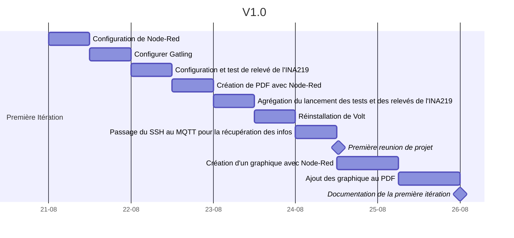
```mermaid
gantt
    dateFormat  YYYY-MM-DD
    title       V1.0
    excludes    weekends
    axisFormat %d-%m
    tickInterval 1day
    section Première Itération

    Configuration de Node-Red  : V1-d1, 2023-08-21, 12h
    Configurer Gatling  : V1-d2, after V1-d1, 12h
    Configuration et test de relevé de l'INA219  : V1-d3, after V1-d2, 12h
    Création de PDF avec Node-Red : V1-d4, after V1-d3, 12h
    Agrégation du lancement des tests et des relevés de l'INA219 : V1-d5, after V1-d4, 12h
    Réinstallation de Volt : V1-d6, after V1-d5, 12h
    Passage du SSH au MQTT pour la récupération des infos : V1-d7, after V1-d6, 12h
    Première reunion de projet : milestone, V1-dR, after V1-d7, 1h
    Création d'un graphique avec Node-Red : V1-d8, after V1-d7, 18h
    Ajout des graphique au PDF : V1-d9, after V1-d8, 18h
    Documentation de la première itération : milestone, V1-d10, after V1-d9, 0h
    

```

<div style="page-break-after: always;"></div>

## 8.3. Deuxième itération
### 8.3.1. But
Ajout de Gatling aux test de charges avec récupérations des informations des logs de Gatling et de l'INA219. 
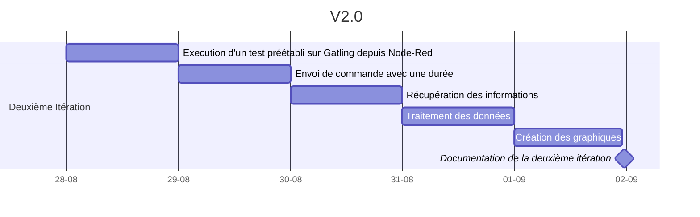
```mermaid
gantt
    dateFormat  YYYY-MM-DD
    title       V2.0
    excludes    weekends
    axisFormat %d-%m
    tickInterval 1day
    section Deuxième Itération

    Execution d'un test préétabli sur Gatling depuis Node-Red : V2-d1, 2023-08-28, 1d
    Envoi de commande avec une durée : V2-d2, after V2-d1, 1d
    Récupération des informations : V2-d3, after V2-d2, 1d
    Traitement des données : V2-d4, after V2-d3, 1d
    Création des graphiques : V2-d5, after V2-d4, 23h
    Documentation de la deuxième itération : milestone, V2-d6, after V2-d5, 1h

```

## 8.4. Troisième itération
### 8.4.1. But
La troisième itération a pour but de rendre le projet utilisable notamment en modifiant les visuels des graphique pour les rendre plus lisible, en modifiant le script Gatlignqui utilise le scala en lieux et place du java en ajoutant de nouveau graphique et enfin en ajoutant la possibilité d'exporter les données au format JSON et d'importer les données au format JSON et de générer un PDF.

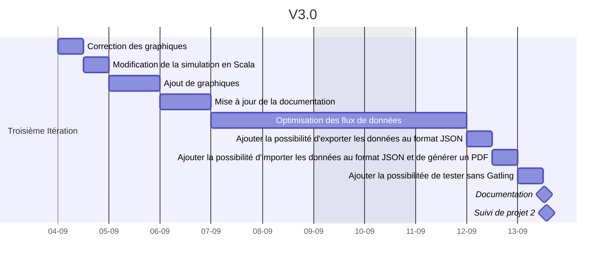
```mermaid
gantt
    dateFormat  YYYY-MM-DD
    title       V3.0
    excludes    weekends
    axisFormat %d-%m
    tickInterval 1day
    section Troisième Itération

    Correction des graphiques : V3-d1, 2023-09-04, 12h
    Modification de la simulation en Scala : V3-d2, after V3-d1, 12h
    Ajout de graphiques : V3-d3, after V3-d2, 1d
    Mise à jour de la documentation : V3-d4, after V3-d3, 1d
    Optimisation des flux de données : V3-d5, after V3-d4, 3d
    Ajouter la possibilité d'exporter les données au format JSON : V3-d6, after V3-d5, 12h
    Ajouter la possibilité d'importer les données au format JSON et de générer un PDF : V3-d7, after V3-d6, 12h
    Ajouter la possibilitée de tester sans Gatling: V3-d8, after V3-d7, 12h
    Documentation : milestone, V3-d9, after V3-d8, 1h  
    Suivi de projet 2 : milestone, V3-d10, after V3-d9, 1h  
```

<div style="page-break-after: always;"></div>

## 8.5. Quatrième itération
La quatrième et dernière itération a pour but de peaufiner le projet en ajoutant des fonctionnalitées qui ne sont pas nécessaire mais qui peuvent être utile pour l'utilisateur. Il s'agit de la création d'un script d'instalation de Nidus, de l'ajout de l'import des JSON sans les tests de Gatling, 


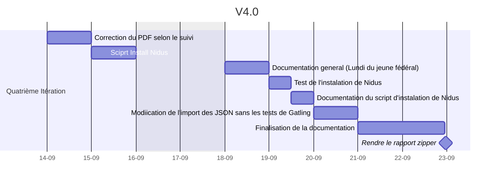
```mermaid
gantt
    dateFormat  YYYY-MM-DD
    title       V4.0
    excludes    weekends
    axisFormat %d-%m
    tickInterval 1day
    section Quatrième Itération

    Correction du PDF selon le suivi : V4-d1, 2023-09-14, 24h
    Sciprt Install Nidus : V4-d2, after V4-d1, 24h
    Documentation general (Lundi du jeune fédéral) : V4-d3, after V4-d2, 24h
    Test de l'instalation de Nidus : V4-d4, after V4-d3, 12h
    Documentation du script d'instalation de Nidus : V4-d5, after V4-d4, 12h
    Modiication de l'import des JSON sans les tests de Gatling : V4-d6, after V4-d5, 24h
    Finalisation de la documentation :  V4-d7, after V4-d6, 47h
    Rendre le rapport zipper : milestone, V4-d8, after V4-d7, 1h

```
<br><br><br><br><br>
<div style="text-align:center;">

</div>


<div style="page-break-after: always;"></div>

# 9. Instalation physique
Pour différencier physiquement les deux Raspberry Pi, j'ai décidé de d'utiliser un stylo effaçable de tableau blanc pour "colorier" la parti du radiateur au dessus de la carte SD `Vert` pour Volt et `Rouge` pour Nidus.
## 9.1. Nidus

<div style="text-align:center;">
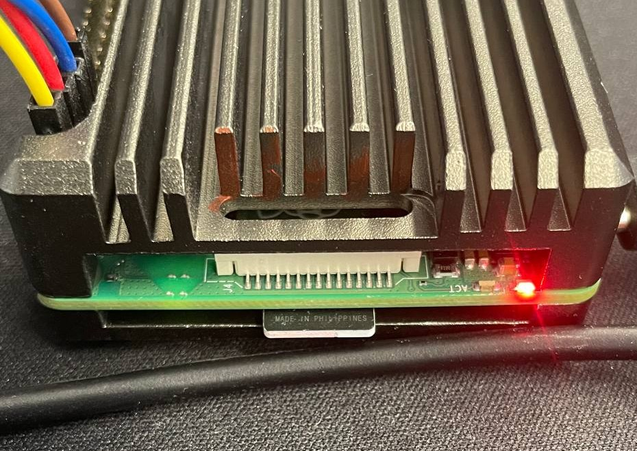
</div>

## 9.2. Volt
<div style="text-align:center;">
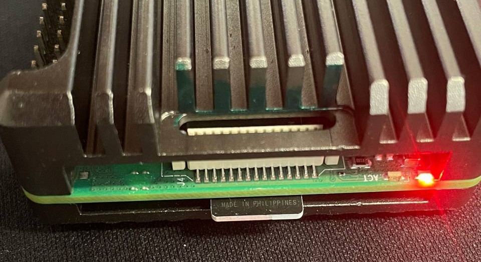
</div>

<div style="page-break-after: always;"></div>

## 9.3. Situation finale
- A l'état final, voici à quoi ressemble la configuration, avec **Nidus** en haut et **Volt** en bas. Actuellement dû au statut de preuve de concept, l'installation est un peu chaotique, mais une fois le projet terminé, il sera possible de faire une installation plus propre.
<div style="text-align:center;">
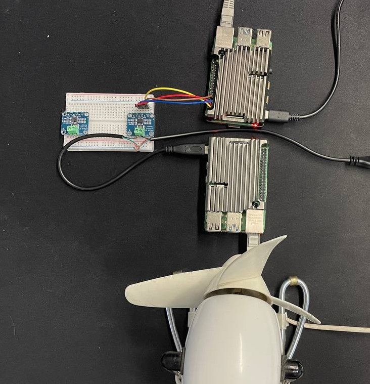
</div>

<div style="page-break-after: always;"></div>

## 9.4. Suite
En début de projet, il à été rapidement pensé de mettre les deux Raspberry Pi dans un boîtier, mais après réflexion et celà reste une reflexion d'actualitée, en y regardant j'ai trouvé deux modèles qui dommine le marché et qui sont les suivant :

### 9.4.1. Plaque de plexiglas avec des vis
<div style="text-align:center;">
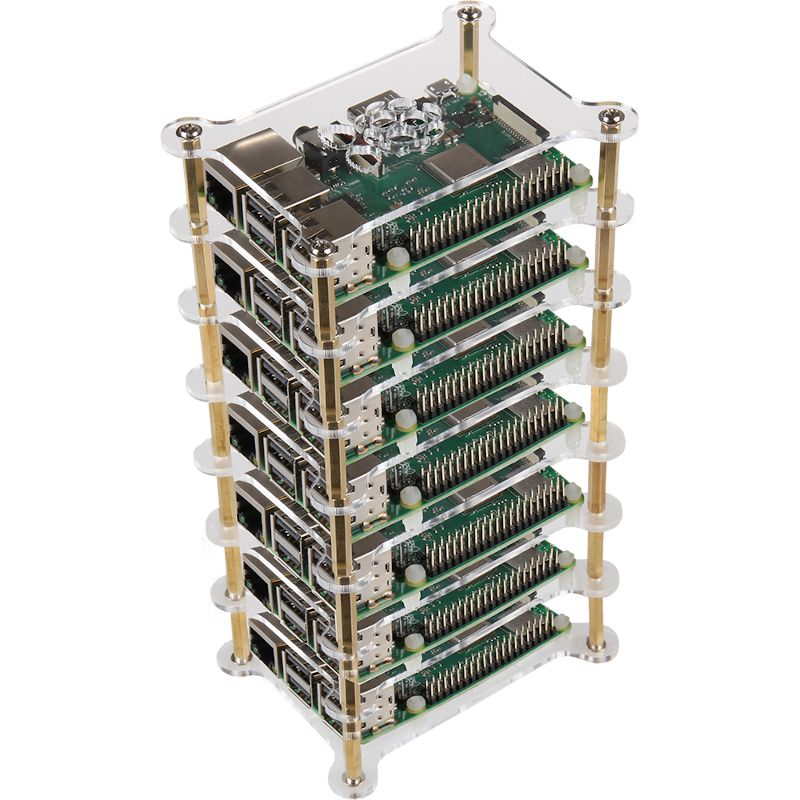
</div>

<div style="page-break-after: always;"></div>

### 9.4.2. Boîtier en plastique
<div style="text-align:center;">
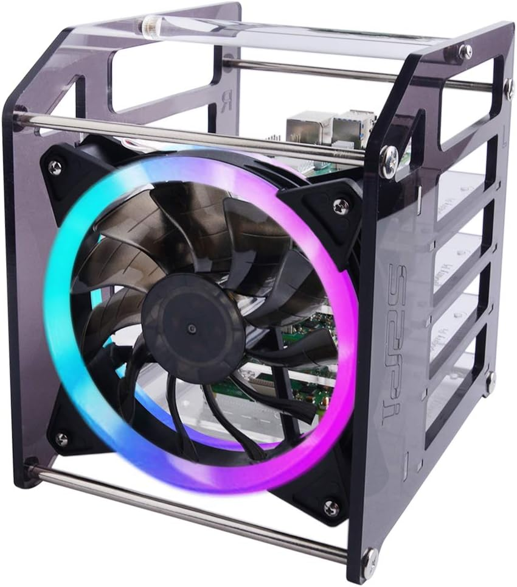
</div>
<div style="text-align:center;">
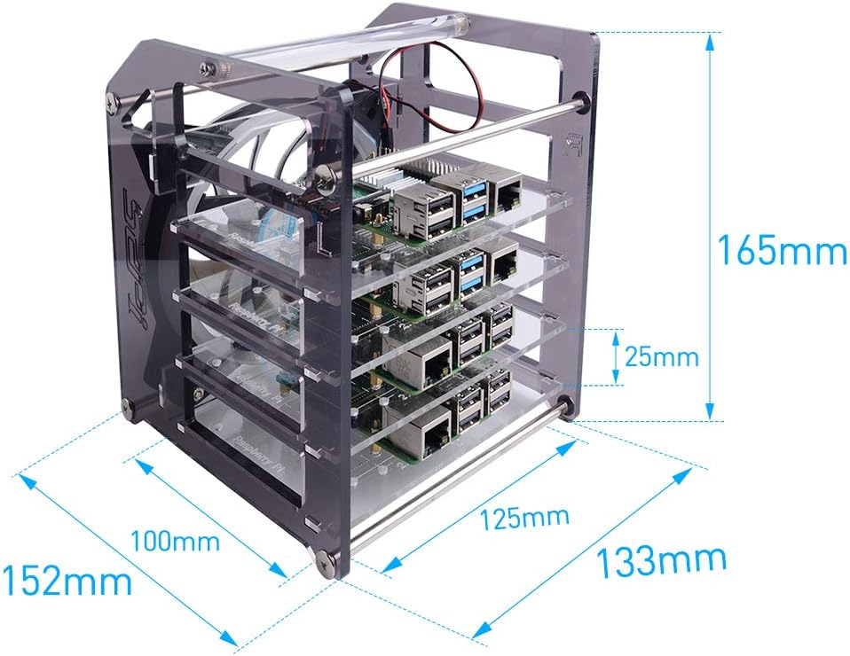
</div>

### 9.4.3. Conclusion
Au niveau du choix du type de boîtier, je pense que le boîtier en plastique est plus adapté pour le projet :
1. Il est possible de mettre tout le matériel dans le boîtier.
2. Il dispose de base d'un ventilateur compatible avec le Raspberry Pi 4.
3. Il dispose d'un emplacement pour un disque dur 2.5" qui permettra de stocker les données de monitoring.
4. Il a des poignées pour le transporter facilement.

<div style="page-break-after: always;"></div>

# 10. Shéma de principe

Le but est que **Nidus** offre tout les outil pour le monittoring incluant le **MQTT**, **Node-Red**, **Gatling** et l'**INA219**. **Volt** lui ne sert que de serveur web pour le site web. Le but est de pouvoir faire des test de charge sur le site web et de pouvoir mesurer la consommation électrique du serveur web.
De fais toute intéraction de l'utilisateur se fait avec **Nidus**.
**Nidus** et **Volt** envoie leurs donnée de monittoring sur le serveur **MQTT** installé sur **Nidus**, et **Node-Red** installé sur **Nidus** récupère les données du serveur **MQTT** et les envoie dans des noeud fais pour le traiter et fournir ensuite les sortie appropié :
- **Dashboard** : Pour l'utilisateur
- **PDF** : Pour l'utilisateur

**Nidus** peut dans un second temps lancer des stresstest via **Node-Red** sur lui même et sur **Volt**. Il peut aussi lancer des stresstest sur **Volt** via **Gatling**.

## 10.1. Shéma de principe visuel

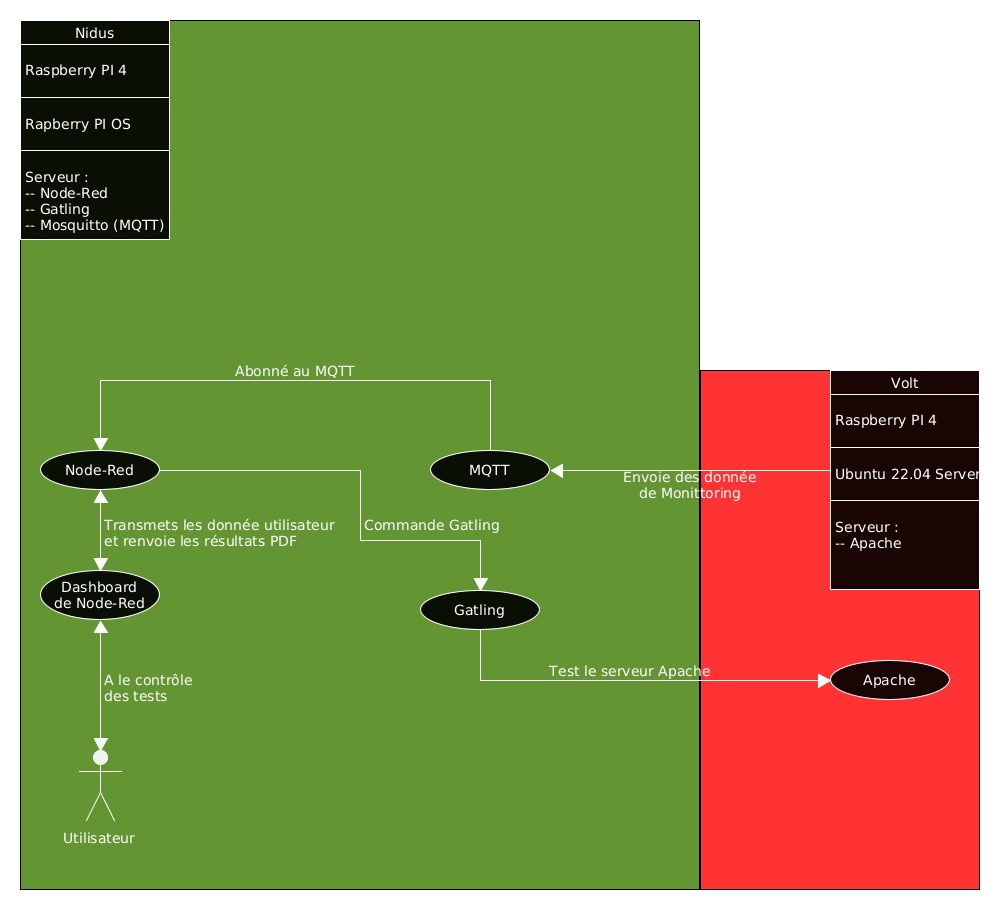

<div style="page-break-after: always;"></div>

## 10.2. Diagrame de séquence


<div style="page-break-after: always;"></div>

# 11. Systèmes d'exploitation (OS)
Dans le cadre de ce projet, plusieurs systèmes d'exploitation seront utilisés. Pour commencer, nous utiliserons Ubuntu.
## 11.1. Ubuntu
*Ubuntu* est un système d'exploitation largement utilisé pour les serveurs et les ordinateurs de bureau. Il est livré avec un ensemble d'outils de développement et de productivité, notamment un navigateur Web, un éditeur de texte, des logiciels de programmation, des outils de calcul, des jeux et des logiciels de productivité. *Ubuntu* propose un environnement de bureau léger et réactif, conçu tant pour les ordinateurs de bureau que pour les serveurs.
## 11.2. Raspberry Pi OS (Raspbian)
Raspbian est un système d'exploitation libre basé sur Debian, spécialement optimisé pour le Raspberry Pi. Depuis 2015, Raspbian est livré avec un ensemble d'outils appelé Pixel. Pixel offre un environnement de bureau comprenant un navigateur Web, un éditeur de texte, des logiciels de programmation, des outils de calcul, des jeux et des logiciels de productivité. Pixel est un environnement de bureau léger et réactif, conçu spécifiquement pour les ordinateurs monocarte Raspberry Pi.

Jusqu'en 2020, **Raspberry Pi OS** était connu sous le nom de **Raspbian**. Le nom a été changé pour plus de clarté et pour éviter toute confusion cependant malgré cela, ayant déja beaucoup travaillé avec Raspbian, et le fais que les blog et rapport continue d'utiliser le nom de Raspbian, je vais me permettre de faire de même et de garder le nom de Raspbian pour le reste du rapport.

## 11.3. Première installation
Dans un premier temps, nous allons installer la version bureau d'Ubuntu sur Volt. Cette décision est motivée par le fait qu'il est plus simple de travailler dans un environnement de bureau pour tester rapidement tous les concepts du projet.

Sur Nidus, Raspbian en version bureau sera installé pour des raisons similaires à celles de Volt.

Un élément crucial à noter est que, étant donné que l'INA219 sera connecté à Nidus, il est plus pratique d'installer Raspbian sur Nidus afin d'avoir accès aux broches GPIO notamment grâce à Node-Red mieux implémenté sur Raspbian.

Dans un second temps, pour obtenir des mesures plus précises, nous installerons les versions « **core** » d'Ubuntu et de Raspbian.

- Adresse IP de **Volt** : 157.26.228.77
- Adresse IP de **Nidus** : 157.26.251.185


<div style="page-break-after: always;"></div>

## 11.4. Seconde instalation Ubuntu Server


<div style="page-break-after: always;"></div>

### 11.4.1. Configuration post instalation
- Première connexion en SSH
```bash
toblerc@LPT-UNIX-USB-CT:~$ ssh tobby@157.26.228.77
The authenticity of host '157.26.228.77 (157.26.228.77)' can't be established.
ED25519 key fingerprint is SHA256:/5raLlKqk0A4AnFWnLP9bagNS3zKE9rFPqn5vA5pc+M.
This key is not known by any other names
Are you sure you want to continue connecting (yes/no/[fingerprint])? yes
Warning: Permanently added '157.26.228.77' (ED25519) to the list of known hosts.
tobby@157.26.228.77's password: 
Welcome to Ubuntu 22.04.3 LTS (GNU/Linux 5.15.0-1034-raspi aarch64)

[...]
```
- Copie des clé SSH pour permettre la connexion sans mot de passe
```bash
tobby@Volt:~$ cd .ssh/
tobby@Volt:~/.ssh$ sudo vi authorized_keys 
[sudo] password for tobby: 
``` 
- Vérification en se déconnectant et en se reconnectant
```bash
tobby@Volt:~/.ssh$ exit
logout
Connection to 157.26.228.77 closed.
toblerc@LPT-UNIX-USB-CT:~$ ssh tobby@157.26.228.77
Welcome to Ubuntu 22.04.3 LTS (GNU/Linux 5.15.0-1034-raspi aarch64)
[...]
Last login: Wed Aug 23 09:30:02 2023 from 157.26.215.31
```
- Mise à jour du système
```bash
tobby@Volt:~$ sudo apt update && sudo apt upgrade -y && sudo apt dist-upgrade -y && sudo apt autzo-remove -y
[sudo] password for tobby: 
[...]
```
- Vérification
```bash
tobby@Volt:~$ sudo apt update && sudo apt upgrade -y && sudo apt dist-upgrade -y && sudo apt auto-remove -y
[...]
0 upgraded, 0 newly installed, 0 to remove and 0 not upgraded.
```

<div style="page-break-after: always;"></div>

### 11.4.2. Instalation Apache
- Instalation de Apache
```bash
tobby@Volt:~$ sudo apt install apache2
[...]
```

Copie du site web entre la machine de développement et Volt
```bash
toblerc@LPT-UNIX-USB-CT:~$ scp -r /home/toblerc/Documents/ES_2024/banc-de-mesures-de-la-consommation-electrique/siteWeb/www/html tobby@157.26.228.77://home/tobby
[...]   
toblerc@LPT-UNIX-USB-CT:~$ 
tobby@Volt:~$ sudo cp -r /home/tobby/html /var/www/
```

<br><br><br>
<br><br><br>
<br><br><br>
<div style="text-align:center;">

</div>


<div style="page-break-after: always;"></div>


### 11.4.3. Script MQTT
- Copie du script MQTT depuis la machine de développement vers Volt
```bash
toblerc@LPT-UNIX-USB-CT:~/Documents/ES_2024/banc-de-mesures-de-la-consommation-electrique$ scp ./mqtt.sh tobby@157.26.228.77:/home/tobby
mqtt.sh                                                                                                                                                                         100% 2522     1.7MB/s   00:00    
```
- Copie du script MQTT dans le dossier /usr/local/bin/
```bash
tobby@Volt:~$ sudo cp ./mqtt.sh /usr/local/bin/
```
- Vérification
```bash
tobby@Volt:~$ ls -la /usr/local/bin/
total 12
drwxr-xr-x  2 root root 4096 Aug 23 10:26 .
drwxr-xr-x 10 root root 4096 Aug  7 17:23 ..
-rw-r--r--  1 root root 2522 Aug 23 10:26 mqtt.sh
```
- Execution du script
```bash
tobby@Volt:/usr/local/bin$ sudo ./mqtt.sh 
Installation de mosquitto-clients...
Hit:1 http://ports.ubuntu.com/ubuntu-ports jammy InRelease
Get:2 http://ports.ubuntu.com/ubuntu-ports jammy-updates InRelease [119 kB]
Hit:3 http://ports.ubuntu.com/ubuntu-ports jammy-backports InRelease
Get:4 http://ports.ubuntu.com/ubuntu-ports jammy-security InRelease [110 kB]
Fetched 229 kB in 2s (133 kB/s)    
Reading package lists... Done
Reading package lists... Done
Building dependency tree... Done
[...]
Activation du service...
Service activé.
```

<div style="page-break-after: always;"></div>

## 11.5. Deuxième installation Raspbian
Pour la deuxième installation, je vais utiliser la version Lite de Raspbian, car je n'ai pas besoin de l'environnement de bureau pour ce Raspberry Pi. De plus, cela permettra d'avoir un système plus léger et donc plus performant.
Qui plus est je vais utiliser le script d'installation pour automatiser l'installation de Node-Red et de ses dépendances.
### 11.5.1. Script d'installation
Pour utiliser le script, il faut d'abord installer le Raspberry Pi OS sur une carte SD. 
<div align="center">
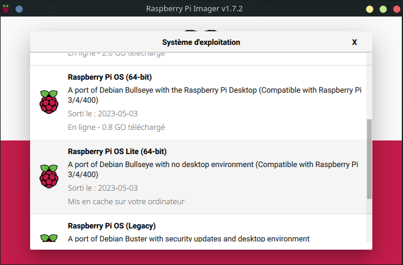
</div>
<div align="center">
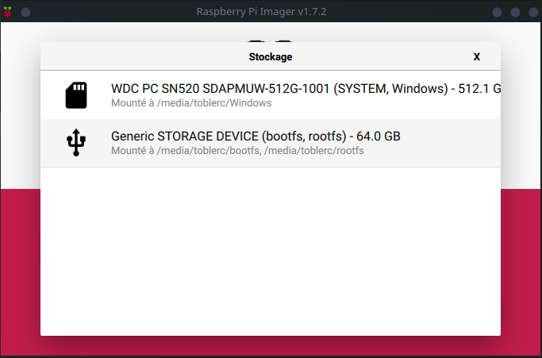
</div>
<div align="center">
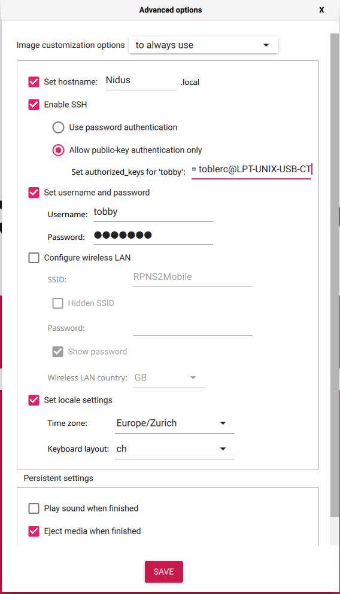
</div>

<div style="page-break-after: always;"></div>

Comme on peut le voir précédemment, il faut sélectionner le fichier image du Raspberry Pi OS Lite 64bit, puis la carte SD sur laquelle on veut l'installer.puis dans la configuration, nous allons lui donner tous les paramètres nécessaires pour qu'il puisse se connecter au réseau et que nous puissions nous connecter à lui via SSH :
- Nom d'hôte : Nidus
- Activation du SSH avec la clé SSH publique
- Utilisateur de base
- Les variable locales :
  - Timezone : Europe/Zurich
  - Keyboard : French (Switzerland) => CH

Une fois que le Raspberry Pi OS est installé, il faut le démarrer et se connecter en SSH. Pour cela, il faut utiliser la commande suivante :
```bash
toblerc@LPT-UNIX-USB-CT:~$ ssh tobby@Nidus
```
Pour simplifier le déployement du script, nous alors simplement copier coller le script dans le terminal SSH, puis l'exécuter :
```bash
tobby@Nidus:~ $ sudo vi ./install.sh
tobby@Nidus:~ $ sudo chmod +x ./install.sh 
tobby@Nidus:~ $ bash ./install.sh
```

À terme, il serait intéressant de pouvoir récupérer le script directement depuis GitHub. Cependant, actuellement, le projet est hébergé sur un GitLab privé, ce qui rend cette option impossible. Voici le type de commande que j'aimerais pouvoir utiliser :
```bash
tobby@Nidus:~ $ sudo wget "URL du script"
```
<br><br><br>
<div align="right">

</div>

<div style="page-break-after: always;"></div>

Attention car à la fin du script, il vas être demandé de remplir les paramêtre de Node-Red, et voici donc les paramètres à entrer :
```bash
Node-RED Settings File initialisation
=====================================
This tool will help you create a Node-RED settings file.

✔ Settings file · /home/tobby/.node-red/settings.js

User Security
=============
✔ Do you want to setup user security? · Yes
✔ Username · tobby
✔ Password · ***********
[...]

Projects
========
The Projects feature allows you to version control your flow using a local git repository.

✔ Do you want to enable the Projects feature? · Yes
✔ What project workflow do you want to use? · auto - changes are automatically committed

Editor settings
===============
✔ Select a theme for the editor. To use any theme other than "default", you will need to install @node-red-contrib-themes/theme-collection in your Node-RED user directory. · dracula
✔ Select the text editor component to use in the Node-RED Editor · monaco (default)

Node settings
=============
✔ Allow Function nodes to load external modules? (functionExternalModules) · Yes

```

Une fois que le script est terminé, il est recommandé de redémarrer le Raspberry Pi pour que les modifications prennent effet. Pour cela, il suffit d'utiliser la commande suivante :
```bash
tobby@Nidus:~ $ sudo reboot
```

<div style="page-break-after: always;"></div>

Maintenant, Node-Red est disponible et il faut donc connecter à Git pour pouvoir récupérer le code source du projet. Heureusement comme c'est nôtre premier démarrage, Node-Red nous propose de le faire directement depuis l'interface web. Il suffit donc de cliquer sur le bouton cloner un referentiel Git, puis de remplir les champs comme ci-dessous :
<div align="center">
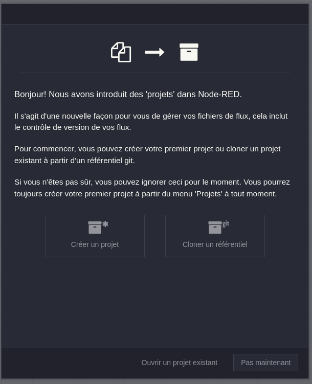
</div>
<div align="center">
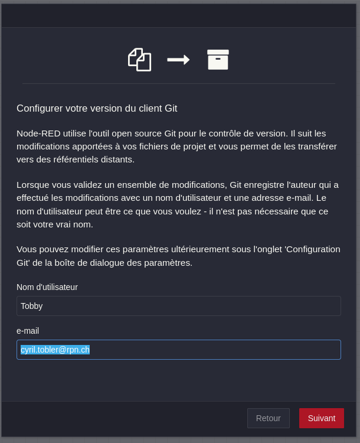
</div>
<div align="center">
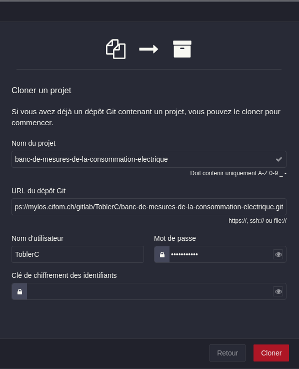
</div>

<div style="page-break-after: always;"></div>

Nous voyons maintenant que les flux sont disponibles dans Node-Red, il est maintenant temps de vérifier que tout fonctionne correctement. Pour cela, il faut se rendre sur la page de monitoring et vérifier que les données sont bien collectées.
<div align="center">
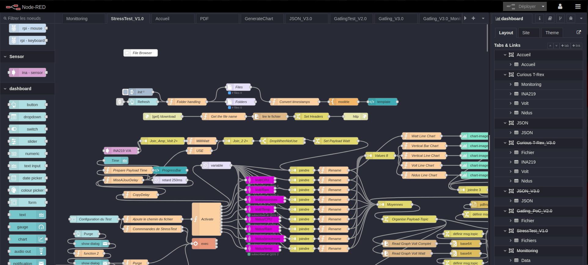
</div>
Evidemment ce n'est pas encore le cas car il faudrais encore pour cela que les clé SSH entre les Raspberry Pi soit échangées, et que le script MQTT soit installé sur Nidus mais dés à présent nous pouvons déja voir que les données de Volt sont déja affiché.

<div align="center">
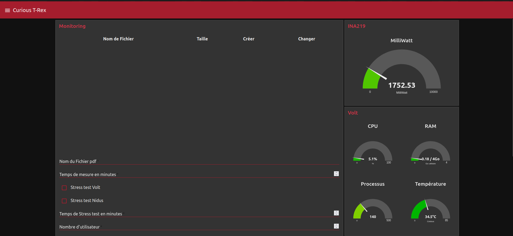
</div>
<div align="center">
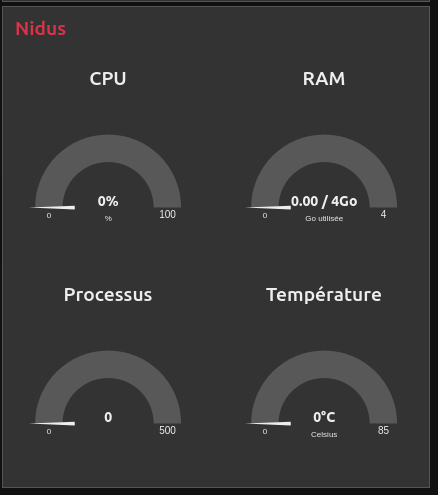
</div>


<div style="page-break-after: always;"></div>

### 11.5.2. Suite au script d'installation
-  Copier les clés SSH de Nidus vers Volt
```bash
tobby@Nidus:~ $ ssh-copy-id tobby@Volt
```
- Copier le script MQTT en Local vers Nidus 
```bash
toblerc@LPT-UNIX-USB-CT:~/Documents/ES_2024/banc-de-mesures-de-la-consommation-electrique/scripts$ scp ./mqtt.sh tobby@nidus:/home/tobby/mqtt.sh
mqtt.sh                                                                                                                                                                         100% 2779     1.3MB/s   00:00
```
- Copier le script SSH au bon endroit
```bash
tobby@Nidus:~ $ sudo cp /home/tobby/mqtt.sh /usr/local/bin/mqtt.sh
```
- Activer le script MQTT
```bash
tobby@Nidus:/usr/local/bin $ sudo chmod +x mqtt.sh 
tobby@Nidus:/usr/local/bin $ sudo ./mqtt.sh
```
Une fois que tout est installé, il faut se rendre sur la page de monitoring et vérifier que les données sont bien collectées.

Pour finir il faut simplement ajouter le script Gatling, pour celà il faut se connecter en SSH à Nidus et ajouter dans le dossier `~/.gatling/gatling-charts-highcharts-bundle-3.9.5/user-files/simulations` le dossier volt dans lequel se trouve le script Gatling nommé `CuriousTRex.scala`.

```bash
tobby@Nidus:~ $ cd .gatling/gatling-charts-highcharts-bundle-3.9.5/user-files/simulations/
tobby@Nidus:~/.gatling/gatling-charts-highcharts-bundle-3.9.5/user-files/simulations $ sudo mkdir volt
tobby@Nidus:~/.gatling/gatling-charts-highcharts-bundle-3.9.5/user-files/simulations $ cd volt/
tobby@Nidus:~/.gatling/gatling-charts-highcharts-bundle-3.9.5/user-files/simulations/volt $ sudo vi CuriousTrex.scala
```


### 11.5.3. Vérification 
Pour vérifier que tout le système est à nouveau fonctionnel, il faut se rendre sur la page de monitoring et vérifier que les données sont bien collectées.
Puis executer un test avec puis sans Gatling.

<div style="page-break-after: always;"></div>

# 12. I²C (Inter-Integrated Circuit)

Dans le cadre de ce projet, la communication avec l'INA219 se fera via le bus I²C. Avant de plonger dans son utilisation, il est essentiel de comprendre le fonctionnement de cette interface de communication particulière.

## 12.1. Bus Série Synchrone Bidirectionnel Half-Duplex

Le bus I²C, ou Inter-Integrated Circuit, est un moyen de communication série synchrone bidirectionnel half-duplex. Cela peut sembler complexe, alors démystifions ces termes :

- **Communication Série :** La communication série signifie que les données sont transmises séquentiellement, bit par bit, sur un seul fil. Imaginez cela comme une conversation téléphonique où une personne parle à la fois, puis l'autre répond.

- **Synchronisé :** La communication sur le bus I²C est synchronisée, ce qui signifie que l'expéditeur (généralement le microcontrôleur) et le récepteur (dans notre cas, l'INA219) sont synchronisés pour transmettre et recevoir des données en utilisant une horloge partagée. Cette horloge garantit que les bits sont envoyés et reçus au bon moment, évitant ainsi toute confusion.

- **Bidirectionnel :** Le bus I²C permet la communication dans les deux sens, ce qui signifie qu'un périphérique peut envoyer et recevoir des données. C'est comme si vous pouviez parler et écouter lors d'une conversation.

- **Half-Duplex :** Le terme "half-duplex" signifie que la communication ne peut se faire que dans un seul sens à la fois. C'est similaire à une radio où vous devez appuyer sur un bouton pour parler, puis relâcher pour écouter. Vous ne pouvez pas parler et écouter en même temps.

## 12.2. Les Deux Câbles Essentiels : SDA et SCL

Le bus I²C se compose de deux câbles principaux :

- **SDA (Serial Data Line) :** La ligne de données série, ou SDA, est utilisée pour transmettre les données binaires entre les périphériques. C'est le fil par lequel les informations sont transmises, qu'il s'agisse de commandes pour lire des capteurs, d'envoyer des données ou de recevoir des réponses.

- **SCL (Serial Clock Line) :** La ligne d'horloge série, ou SCL, est l'horloge qui synchronise le timing des signaux de données sur la ligne SDA. En d'autres termes, le SCL dicte quand chaque bit de données est lu ou écrit.

Ces deux câbles sont les piliers de la communication I²C. Ils permettent une communication robuste et synchrone entre les périphériques connectés au bus I²C.

## 12.3. TWI ou TWSI

Il est important de noter que le bus I²C est également connu sous d'autres noms, selon les fabricants. Par exemple, chez certaines entreprises, il est appelé **TWI (Two Wire Interface)**, tandis que chez d'autres, il est appelé **TWSI (Two Wire Serial Interface)**. Ces noms sont interchangeables et font référence au même concept de base : une interface de communication à deux fils.


<div style="page-break-after: always;"></div>

# 13. SSH
Le SSH, acronyme de Secure Shell, est un protocole de communication sécurisé largement utilisé pour l'accès à distance à des systèmes informatiques. Il est essentiel de comprendre ce protocole pour éviter toute confusion, en particulier lors de l'utilisation de clés SSH, couramment utilisées pour l'authentification sécurisée.

Malgré le fais que le SSH soit un protocole relativement connu, il est important de le définir pour éviter toute confusion.

Dans la plupart des cas, il n'est pas nécessaire de revenir dessus mais il est aussi relativement courrant que des confusion soit faites quand on utilise des clé SSH.

## 13.1. Utilisation
Le SSH permet une connexion sécurisée à un serveur distant, offrant la possibilité d'exécuter des commandes à distance et de transférer des fichiers en toute sécurité. Cette technologie est fondamentale pour l'administration à distance de serveurs et d'appareils.

Lors de l'utilisation du SSH, une commande typique ressemble à ceci :
```bash
ssh <utilisateur>@<adresse IP>
```
Lorsqu'une connexion SSH est établie, il est courant que le serveur distant demande un mot de passe pour vérifier l'identité de l'utilisateur. Cependant, pour des utilisations automatisées, entrer un mot de passe à chaque fois n'est pas pratique. Pour résoudre ce problème, vous pouvez générer une paire de clés SSH, composée d'une clé publique et d'une clé privée.
## 13.2. Génération de clé SSH
La génération de clés SSH se fait généralement avec la commande `ssh-keygen`. Voici un exemple de la façon dont vous pouvez générer une paire de clés :
```bash
ssh-keygen -t rsa -b 2048
```
- `t` spécifie l'algorithme de clé à utiliser, ici RSA.
- `b` définit la longueur de la clé en bits, 2048 étant une valeur couramment utilisée.

La commande vous demandera où stocker la clé, vous pouvez appuyer sur Entrée pour utiliser l'emplacement par défaut (`/home/votre_utilisateur/.ssh/id_rsa`).


Dans le cas de Windows, il est possible de générer une clé SSH avec le logiciel [PuTTY](https://www.putty.org/).

<div style="page-break-after: always;"></div>

## 13.3. Utilisation de la clé SSH
Pour utiliser la clé SSH, il faut d'abord copier la clé publique sur le serveur distant. Pour cela, soit on peut utiliser la commande suivante :
```bash
ssh-copy-id <utilisateur>@<adresse IP>
```
Soit copier directement la clé dans le fichier `~/.ssh/authorized_keys` du serveur distant.

## 13.4. SCP (Secure Copy Protocol)

Le protocole SCP, abréviation de "Secure Copy Protocol", est un outil qui permet de transférer des fichiers de manière sécurisée entre votre système local et un serveur distant via SSH. SCP utilise la même authentification et le même cryptage que SSH, garantissant ainsi un transfert de fichiers sûr.

Il est donc très intéressant d'utiliser les clés SSH pour pouvoir utiliser aussi SCP sans mot de passe.
### 13.4.1. Syntaxe de base

La syntaxe de base de la commande SCP est la suivante :

```bash
scp [options] [source] [destination]
```
<br><br><br>
<br><br><br>
<br><br><br>
<br><br><br>
<div align="right">

</div>

<div style="page-break-after: always;"></div>

# 14. Node-RED
## 14.1. Introduction
**Node-RED** est un outil de programmation visuelle open source conçu pour simplifier la connectivité entre les périphériques, les **API** et les services en ligne. Il offre un éditeur de flux basé sur un navigateur, permettant de connecter des nœuds simplement en les faisant glisser et déposer. Ces nœuds peuvent s'exécuter dans un environnement **Node.js**. Ils peuvent être des fonctions **JavaScript** ou des modules **npm**(gestionaire de paquet JavaScript), tels que node-red-contrib-gpio, node-red-contrib-sqlite, node-red-contrib-modbustcp, etc. En plus des nœuds de base, Node-RED propose une bibliothèque de plus de 2000 nœuds supplémentaires créés par la communauté et prêts à l'emploi.

## 14.2. Node.js

Node.js est une plateforme logicielle libre qui révolutionne le développement web en utilisant JavaScript côté serveur. Elle est conçue pour des applications réseau événementielles hautement concurrentes, tirant parti de la machine virtuelle V8 de Google et de la bibliothèque libuv. Node.js offre un environnement asynchrone idéal pour le développement de serveurs HTTP. Des entreprises de premier plan comme Netflix, Microsoft et PayPal font confiance à Node.js pour leurs projets web à grande échelle.

Node-RED repose sur Node.js en raison des avantages qu'offre cette plateforme. Node.js est connu pour sa performance exceptionnelle et son modèle asynchrone, ce qui en fait un choix idéal pour les applications réseau événementielles à haute concurrence comme Node-RED.

## 14.3. [FlowFuse](https://flowfuse.com/)

FlowFuse est une entreprise spécialisée dans l'hébergement et le DevOps pour Node-RED. Elle permet de professionnaliser l'utilisation de Node-RED, en le sortant des projets de preuve de concept pour le déployer dans des environnements de production. FlowFuse offre des services d'hébergement sécurisé, de surveillance, de sauvegarde et de mise à l'échelle pour Node-RED, ce qui en fait une solution idéale pour les entreprises cherchant à tirer pleinement parti de cet outil puissant de programmation visuelle.

Node-RED est bien plus qu'un simple outil de prototypage. C'est une solution flexible et puissante pour la création d'applications IoT, d'automatisation domestique, de traitement des données et bien plus encore.

À terme, il serait intéressant de pouvoir utiliser FlowFuse pour héberger le projet, notamment pour permettre une meilleure scalabilité, une meilleure sécurité et une meilleure fiabilité.

Cependant, durant ce projet, je n'implémenterai pas cette solution pour plusieurs raisons. La première est de permettre au plus grand nombre de pouvoir reproduire le projet. La deuxième est que FlowFuse est une solution payante, et que je ne peux pas me permettre de payer pour ce projet. La troisième est que FlowFuse est une solution qui nécessite un certain nombre de configurations, et dans l'optique de preuve de concept, je veux privilégier la simplicité et la rapidité de mise en place.


<div style="page-break-after: always;"></div>

## 14.4. La Programmation par Flux
La programmation par flux, également connue sous le nom de programmation réactive, est un paradigme de programmation qui se différencie considérablement de la programmation orientée objet traditionnelle. Cette approche est de plus en plus populaire dans le développement de logiciels, en particulier pour la gestion d'événements asynchrones et la manipulation de flux de données en temps réel.

### 14.4.1. Comprendre les Flux

Dans la programmation par flux, les données sont considérées comme des flux continus plutôt que des objets statiques. Un flux est essentiellement une séquence d'événements ou de données qui peuvent être observés et réagis en temps réel. Voici quelques points importants à retenir :

- **Flux de données**: Les flux représentent des flux de données asynchrones. Les données peuvent être émises en continu ou à intervalles irréguliers.

- **Observateurs**: La programmation par flux repose sur le concept d'observateurs. Un observateur surveille un flux et réagit lorsque de nouvelles données sont disponibles.

- **Opérations sur les Flux**: Vous pouvez effectuer diverses opérations sur les flux, telles que la transformation, le filtrage et la combinaison des données. Ces opérations sont généralement non destructives, ce qui signifie que le flux d'origine reste intact.

### 14.4.2. Différences avec la Programmation Orientée Objet

Dans le cadre de la formation CFC et de la formation ES, nous avons principalement travaillé avec la programmation orientée objet (**POO**). La programmation par flux est un paradigme de programmation différent, qui présente plusieurs différences clés avec la **POO** :

**1. Traitement Asynchrone**: En programmation par flux, les opérations sont généralement asynchrones. Les données sont émises en continu, et les observateurs réagissent dès que de nouvelles données sont disponibles. En revanche, en **POO**, les opérations sont souvent synchrones, ce qui signifie qu'elles s'exécutent séquentiellement.

**2. Gestion des Événements**: La programmation par flux est idéale pour la gestion d'événements, comme la surveillance des capteurs en temps réel ou la gestion des interactions utilisateur. En **POO**, la gestion des événements peut être plus complexe et moins réactive.

**3. Réactivité**: La programmation par flux est intrinsèquement réactive. Elle réagit aux données au fur et à mesure de leur arrivée. En revanche, en **POO**, la réactivité dépend souvent de la mise en œuvre spécifique.

### 14.4.3. Conclusion
La programmation par flux est le cœur de Node-RED. Elle permet de créer des applications en assemblant des nœuds qui représentent des fonctions ou des services. Les flux de données sont gérés visuellement, ce qui rend le développement plus accessible, même pour ceux qui ne sont pas des programmeurs expérimentés. En reliant des nœuds entre eux, il est possible de spécifier comment les données doivent circuler et être transformées tout au long de l'application.

<div style="page-break-after: always;"></div>

## 14.5. Instalation
L'instalation de Node-Red se fait via le script officiel de Node-Red. Ce script permet d'installer Node-Red et Node.js, de configurer Node-Red et de l'activer comme service.
Qui plus est on peut définir des utilisateurs et des mots de passe pour sécuriser Node-Red.
```bash
tobby@Nidus:~ $ bash <(curl -sL https://raw.githubusercontent.com/node-red/linux-installers/master/deb/update-nodejs-and-nodered)
Running Node-RED install for user tobby at /home/tobby on debian


This can take 20-30 minutes on the slower Pi versions - please wait.

  Stop Node-RED                       ✔
  Remove old version of Node-RED      ✔
  Remove old version of Node.js       ✔   
  Install Node.js 18 LTS              ✔   v18.17.1   Npm 9.6.7
  Clean npm cache                     ✔
  Install Node-RED core               ✔   3.0.2
  Move global nodes to local          -
  Npm rebuild existing nodes          ✔
  Install extra Pi nodes              ✔
  Add shortcut commands               ✔
  Update systemd script               ✔
                                      
[...]

  Would you like to customise the settings now (y/N) ? y

Node-RED Settings File initialisation
=====================================
This tool will help you create a Node-RED settings file.

✔ Settings file · /home/tobby/.node-red/settings.js

User Security
=============
✔ Do you want to setup user security? · Yes
✔ Username · Tobby
✔ Password · ***********
✔ User permissions · full access
✔ Add another user? · Yes
✔ Username · FMA
✔ Password · ******** (Pa$$w.rd)
✔ User permissions · read-only access
✔ Add another user? · Yes
✔ Username · BVI
✔ Password · ******** (Pa$$w.rd)
✔ User permissions · read-only access
✔ Add another user? · No
[...]
```
- Activation de Node-Red comme service
```bash
tobby@Nidus:~ $ sudo systemctl enable nodered.service
Created symlink /etc/systemd/system/multi-user.target.wants/nodered.service → /lib/systemd/system/nodered.service.
```

- Vérification
Une fois l'instalation terminé, il est possible de vérifier que Node-Red est bien installé et qu'il fonctionne correctement.
Pour ce faire je vais simplement me connecter à l'interface web de Node-Red.


<br><br><br>
<br><br><br>
<br><br><br>
<br><br><br>
<div align="right">

</div>

<div style="page-break-after: always;"></div>

## 14.6. Configuration
### 14.6.1. Installation des plugins
Les plugins ou palette de Node-Red permettent d'ajouter des fonctionnalité à Node-Red. C'est vraiment un aspect important de Node-Red car il permet d'ajouter des fonctionnalité sans avoir à les programmer soit même. On peut donc gagner un temps énorme en utilisant les palettes.

- Pour commencer, sur la page d'accueil de Node-Red, il faut cliquer sur le menu en haut à droite, puis sur « Manage palette ».
<div style="text-align:center;">

</div>

<div style="page-break-after: always;"></div>

- Une fois sur la page de gestion des palette, il y a deux pages, une pour les palettes installées et une pour les palettes disponibles. Pour installer une palette, il suffit de la chercher dans la page Install en haut a droit puis soit de défiler jusqu'à la palette souhaitée, soit de la chercher dans la barre de recherche. Une fois la palette trouvée, il suffit de cliquer sur le bouton « install ». Dans ce cas, j'installe la palette « node-red-dashboard » qui permet de créer des dashboard pour Node-Red.

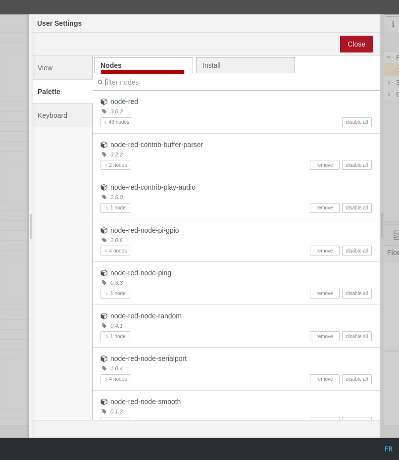
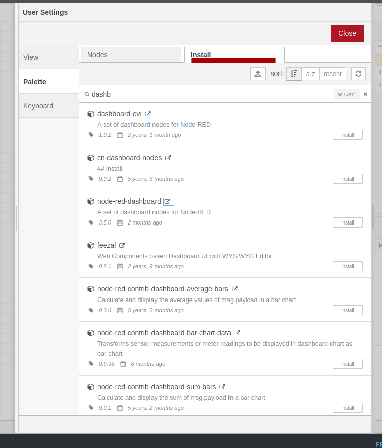

- Une fois la procédure lancé, une popup s'ouvre pour confirmer l'installation de la palette. Il suffit de cliquer sur « install » ou sur "Open node information" pour avoir plus d'information sur la palette.

<div style="text-align:center;">
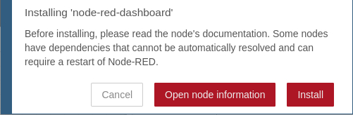
</div>

<div style="page-break-after: always;"></div>

- Pour finir, après l'instalation de la palette, on peut vérifier si l'intallation c'est bien passé en ouvrant dans un nouvel onglet le dashboard de Node-Red. Pour ce faire, il faut aller sur l'adresse de Node-Red le `http://"Hostname":1880` et ajouter `/ui` à la fin de l'adresse. Dans mon cas, l'adresse est `http://nidus.s2.rpn.ch:1880/ui`.

<div style="text-align:center;">

</div>


### 14.6.2. Sécurisation de Node-Red
Pour sécuriser Node-Red, il convient de modifier le fichier `settings.js`. Dans notre cas, nous utilisons la commande `node-red admin init`, ce qui permet, par exemple, de créer des paires utilisateur/mot de passe.

### 14.6.3. Sécurisation du Dashboard
Pour des raisons de sécurité, il est nécessaire de sécuriser le Dashboard. Pour ce faire, il faut modifier le fichier `settings.js` et décommenter les lignes suivantes puis les modifier, de la même manière que les adminAuth :
```json
    /** To password protect the node-defined HTTP endpoints (httpNodeRoot),
     * including node-red-dashboard, or the static content (httpStatic), the
     * following properties can be used.
     * The `pass` field is a bcrypt hash of the password.
     * See http://nodered.org/docs/security.html#generating-the-password-hash
     */
    httpNodeAuth: {user:"user",pass:"$2b$08$.uHgpN7VE5BhIID1ycxRC.5uyM5xwaTw0Q0NFUxzyOG3UMQ.ixPWK"},
```

<div style="page-break-after: always;"></div>

### 14.6.4. Suivi Git
Afin de suivre le projet sur Git, il est nécessaire de configurer un utilisateur, générer des clés SSH, puis effectuer un *clone* du projet.


Comme il s'agit d'un *clone*, il faudra ajouter les fichiers manquants et ajuster les droits d'accès en tout cas pour l'initialisation.

```bash
tobby@Nidus:~/.node-red/projects/banc-de-mesures-de-la-consommation-electrique $ touch ~/.node-red/projects/banc-de-mesures-de-la-consommation-electrique/flows_cred.json
tobby@Nidus:~/.node-red/projects/banc-de-mesures-de-la-consommation-electrique $ chmod 600 ~/.node-red/projects/banc-de-mesures-de-la-consommation-electrique/flows_cred.json
```
<br><br><br>
<br><br><br>
<br><br><br>
<div align="right">

</div>

<div style="page-break-after: always;"></div>

# 15. Gatling
**Gatling** est un outil de test de charge open source basé sur Scala, conçu pour évaluer les performances des applications et des sites Web. Gatling simule des utilisateurs virtuels qui envoient des requêtes HTTP vers le système cible. Il enregistre les temps de réponse des requêtes et les présente sous forme de graphiques. Gatling est doté d'un éditeur de scénarios basé sur navigateur, permettant aux utilisateurs de créer des scénarios de test de charge à l'aide d'un langage de domaine spécifique (DSL) appelé *Gatling DSL*. Ce langage, basé sur Scala, permet de définir des scénarios de test de charge à l'aide de mots-clés tels que `exec`, `pause`, `feed`, etc.

La version la plus récente de Gatling est la 3.9.5, compatible avec Java 8 et Java 11. Dans ce projet, nous opterons pour Java 11 pour exécuter Gatling.

## 15.1. Installation

### 15.1.1. Prerequis
- Instalarion de Java 11
```bash
tobby@Nidus:~ $ sudo apt install default-jdk
```
- Vérification de la version de Java
```bash
tobby@Nidus:~/.node-red $ java -version
openjdk version "11.0.18" 2023-01-17
OpenJDK Runtime Environment (build 11.0.18+10-post-Debian-1deb11u1)
OpenJDK 64-Bit Server VM (build 11.0.18+10-post-Debian-1deb11u1, mixed mode)
```
### 15.1.2. Download
- Création du répertoire d'installation
```bash

tobby@Nidus:~ $ mkdir .gatling
```
- Vérification de la création du répertoire
```bash
tobby@Nidus:~ $ ls -la
total 104
drwxr-xr-x 18 tobby tobby 4096 16 aoû 15:10 .
drwxr-xr-x  3 root  root  4096 16 aoû 13:58 ..
[...]
drwxr-xr-x  2 tobby tobby 4096 16 aoû 15:10 .gatling
[...]
```

<div style="page-break-after: always;"></div>

- Téléchargement de Gatling
```bash
tobby@Nidus:~ $ wget -O ~/.gatling/gatling-charts-highcharts-bundle-3.9.5-bundle.zip https://repo1.maven.org/maven2/io/gatling/highcharts/gatling-charts-highcharts-bundle/3.9.5/gatling-charts-highcharts-bundle-3.9.5-bundle.zip
[...]
2023-08-16 15:12:47 (12.8 MB/s) — « /home/tobby/.gatling/gatling-charts-highcharts-bundle-3.9.5-bundle.zip » sauvegardé [77080673/77080673]
```
- Dezippage de Gatling
```bash
tobby@Nidus:~ $ unzip ~/.gatling/gatling-charts-highcharts-bundle-3.9.5-bundle.zip -d ~/.gatling/
Archive:  /home/tobby/.gatling/gatling-charts-highcharts-bundle-3.9.5-bundle.zip
[...]
```
- Vérification du dézippage
```bash
tobby@Nidus:~ $ cd .gatling/
tobby@Nidus:~/.gatling $ ls -la
total 75288
drwxr-xr-x  3 tobby tobby     4096 16 aoû 15:12 .
drwxr-xr-x 18 tobby tobby     4096 16 aoû 15:10 ..
drwxr-xr-x  7 tobby tobby     4096 10 mai 11:19 gatling-charts-highcharts-bundle-3.9.5
-rw-r--r--  1 tobby tobby 77080673 10 mai 11:19 gatling-charts-highcharts-bundle-3.9.5-bundle.zip
tobby@Nidus:~/.gatling $ cd gatling-charts-highcharts-bundle-3.9.5/
tobby@Nidus:~/.gatling/gatling-charts-highcharts-bundle-3.9.5 $ ls -la
total 48
drwxr-xr-x 7 tobby tobby  4096 10 mai 11:19 .
drwxr-xr-x 3 tobby tobby  4096 16 aoû 15:12 ..
drwxr-xr-x 2 tobby tobby  4096 10 mai 11:19 bin
drwxr-xr-x 2 tobby tobby  4096 10 mai 11:19 conf
drwxr-xr-x 2 tobby tobby 12288 10 mai 11:19 lib
-rw-r--r-- 1 tobby tobby 11367 10 mai 11:19 LICENSE
drwxr-xr-x 2 tobby tobby  4096 10 mai 11:19 results
drwxr-xr-x 5 tobby tobby  4096 10 mai 11:19 user-files
```

<br><br><br>
<div align="right">

</div>


<div style="page-break-after: always;"></div>

## 15.2. Vérification de l'installation
Pour vérifier l'installation de Gatling, j'ai simplement exécuté le script `gatling.sh` situé dans le répertoire `bin` de Gatling. Lorsque j'ai lancé ce script, Gatling a affiché un menu proposant plusieurs options. Dans mon cas, j'ai choisi l'option 1, qui permet de lancer une simulation de test de charge.

Ensuite, j'ai eu la possibilité de choisir la simulation à exécuter, comme il n'y a qu'une seule simulation, je n'ai pas eu besoin de faire de choix supplémentaires. Cette simulation est fournie par Gatling et elle teste un serveur web de test fourni par Gatling.

```bash
tobby@Nidus:~/.gatling/gatling-charts-highcharts-bundle-3.9.5/bin $ ./gatling.sh
GATLING_HOME is set to /home/tobby/.gatling/gatling-charts-highcharts-bundle-3.9.5
Do you want to run the simulation locally, on Gatling Enterprise, or just package it?
Type the number corresponding to your choice and press enter
[0] <Quit>
[1] Run the Simulation locally
[2] Package and upload the Simulation to Gatling Enterprise Cloud, and run it there
[3] Package the Simulation for Gatling Enterprise
[4] Show help and exit
1
août 16, 2023 4:28:28 PM java.util.prefs.FileSystemPreferences$1 run
INFO: Created user preferences directory.
computerdatabase.ComputerDatabaseSimulation is the only simulation, executing it.
Select run description (optional)
InstallVerif
Simulation computerdatabase.ComputerDatabaseSimulation started...
[...]
Simulation computerdatabase.ComputerDatabaseSimulation completed in 17 seconds
Parsing log file(s)...
Parsing log file(s) done
Generating reports...

================================================================================
---- Global Information --------------------------------------------------------
> request count                                        108 (OK=105    KO=3     )
> min response time                                    108 (OK=108    KO=111   )
> max response time                                   1563 (OK=1563   KO=114   )
> mean response time                                   162 (OK=163    KO=112   )
> std deviation                                        168 (OK=170    KO=1     )
> response time 50th percentile                        115 (OK=115    KO=112   )
> response time 75th percentile                        120 (OK=121    KO=113   )
> response time 95th percentile                        351 (OK=352    KO=114   )
> response time 99th percentile                        620 (OK=620    KO=114   )
> mean requests/sec                                  6.353 (OK=6.176  KO=0.176 )
---- Response Time Distribution ------------------------------------------------
> t < 800 ms                                           104 ( 96%)
> 800 ms <= t < 1200 ms                                  0 (  0%)
> t >= 1200 ms                                           1 (  1%)
> failed                                                 3 (  3%)
---- Errors --------------------------------------------------------------------
> status.find.is(201), but actually found 200                         3 (100,0%)
================================================================================

Reports generated in 0s.
Please open the following file: file:///home/tobby/.gatling/gatling-charts-highcharts-bundle-3.9.5/results/computerdatabasesimulation-20230816142907884/index.html
```
## 15.3. Scripts
Pour Gatling, j'ai d'abord choisi le Java comme language de programmation mais je me suis tournée ensuite vers le Scala car il est plus adapté à Gatling. J'ai donc créé un script Scala qui permet de faire un test de charge sur le site web. Ce script est très simple, il se contente de faire une requête GET sur les différentes pages du site. Il est possible de modifier le nombre d'utilisateur et le temps de test dans le script. J'ai aussi créé un script bash qui permet de lancer le script Scala. 

```scala
import io.gatling.core.Predef._
import io.gatling.http.Predef._
import scala.concurrent.duration._

class CuriousTRex_Bash extends Simulation {

  val httpProtocol = http
    .baseUrl("http://volt.s2.rpn.ch")// Il s'agit de l'adresse du site web
    .inferHtmlResources()// Permet de récupérer les ressources HTML
    .acceptHeader("image/avif,image/webp,*/*") // Accepte les images
    .acceptEncodingHeader("gzip, deflate") // Accepte la compression
    .acceptLanguageHeader("fr,fr-FR;q=0.8,en-US;q=0.5,en;q=0.3") // Accepte les langues
    .userAgentHeader("Mozilla/5.0 (X11; Ubuntu; Linux x86_64; rv:109.0) Gecko/20100101 Firefox/114.0") // User Agent

  val headers_0 = Map( 
    "Accept" -> "text/css,*/*;q=0.1",
    "If-Modified-Since" -> "Thu, 17 Aug 2023 08:18:41 GMT",
    "If-None-Match" -> "\"dc3-6031a0f5b4a47-gzip\""
  )

  val headers_1 = Map(
    "Accept" -> "text/html,application/xhtml+xml,application/xml;q=0.9,image/avif,image/webp,*/*;q=0.8",
    "Upgrade-Insecure-Requests" -> "1"
  )

  val headers_4 = Map(
    "If-Modified-Since" -> "Thu, 17 Aug 2023 07:26:33 GMT",
    "If-None-Match" -> "\"164ac-6031954e8df3b\""
  )

  val headers_6 = Map(
    "If-Modified-Since" -> "Thu, 17 Aug 2023 07:26:33 GMT",
    "If-None-Match" -> "\"14c4c-6031954e8cf9b\""
  )

  val headers_7 = Map(
    "Accept" -> "text/html,application/xhtml+xml,application/xml;q=0.9,image/avif,image/webp,*/*;q=0.8",
    "If-Modified-Since" -> "Thu, 17 Aug 2023 08:08:51 GMT",
    "If-None-Match" -> "\"2129-60319ec28bede-gzip\"",
    "Upgrade-Insecure-Requests" -> "1"
  )

  val scn = scenario("CuriousTRex")
    .exec(
      http("request_0")
        .get("/styles.css")
        .headers(headers_0)
    )
    // Start
    .exec(
      http("request_1")
        .get("/contact.html")
        .headers(headers_1)
    )
    .exec(
      http("request_2")
        .get("/about.html")
        .headers(headers_1)
        .resources(
          http("request_3")
            .get("/capture/Home.jpg"),
          http("request_4")
            .get("/capture/Test_Complet.jpg")
            .headers(headers_4),
          http("request_5")
            .get("/capture/Donn%C3%A9es.jpg"),
          http("request_6")
            .get("/capture/Test.jpg")
            .headers(headers_6)
        )
    )
    .exec(
      http("request_7")
        .get("/about.html")
        .headers(headers_7)
    )
   .exec(flushHttpCache)
   .exec(flushSessionCookies)
   .exec(flushCookieJar)

val nbUsers = java.lang.Long.getLong("users", 1).toDouble
val myRamp = java.lang.Long.getLong("ramp", 0)
println(s"Nombre d'utilisateurs : $nbUsers")
println(s"Temps de montée : $myRamp")

  setUp(scn.inject(constantUsersPerSec(nbUsers).during(myRamp seconds))).protocols(httpProtocol)
}
```
<br>
<div align="left">

</div>

<div style="page-break-after: always;"></div>

## 15.4. Scala

Au cœur de Gatling se trouve Scala, un langage de programmation polyvalent qui apporte des avantages significatifs à cet outil de test de charge. Dans ce chapitre, nous explorerons Scala et son rôle essentiel dans l'écosystème de Gatling.

Scala est un langage de programmation multiparadigme qui associe les fonctionnalités de la programmation orientée objet et de la programmation fonctionnelle. Plusieurs raisons justifient le choix de Scala comme langage de développement pour Gatling :
### 15.4.1. Performance

Gatling est conçu pour effectuer des tests de charge sur des applications web, ce qui signifie qu'il doit gérer un grand nombre de requêtes simultanées. Scala est réputé pour sa performance, ce qui en fait un choix naturel pour un outil axé sur la vitesse et l'efficacité.
### 15.4.2. Concision et Expressivité

Scala permet d'écrire un code concis et expressif. Cela signifie que les scripts de test Gatling écrits en Scala sont généralement plus courts et plus faciles à comprendre que leur équivalent dans d'autres langages. Cette clarté est cruciale pour la création et la maintenance de scénarios de test complexes.

### 15.4.3. Interopérabilité Java

Scala est entièrement compatible avec Java, ce qui permet aux utilisateurs de Gatling de tirer parti des bibliothèques Java existantes si nécessaire. Cette interopérabilité simplifie également l'intégration de Gatling dans des projets Java existants.

## 15.5. Kotlin
Scala n'est pas le seul langage qui peut être utilisé pour écrire des tests de performance avec Gatling. Kotlin, un autre langage polyvalent, gagne en popularité dans le domaine des tests de charge.
### 15.5.1. Scala vs. Kotlin
### 15.5.2. Expressivité
Scala est souvent salué pour son expressivité, ce qui en fait un choix privilégié pour la création de scénarios Gatling clairs et concis. Kotlin, bien qu'il offre une certaine concision, peut sembler un peu plus verbeux en comparaison.
### 15.5.3. Performance
Scala est reconnu pour sa performance, ce qui en fait un excellent choix pour les tests de charge où la vitesse est essentielle. Kotlin n'est pas aussi largement reconnu pour ses performances dans ce domaine.

<div style="page-break-after: always;"></div>

# 16. Apache et Site Web
Durant ce projet, il fallais un site web simple pour avoir une cible pour Gatling, de fais j'ai choisi le système le plus utilisée et le plus bas niveau a savoir trois page HTML une page de style CSS soutenue pas un serveur Apache.

## 16.1. Installation
Pour installer et activé Apache, il suffit d'exécuter les commandes suivantes :
```bash
sudo apt install apache2
sudo systemctl enable apache2
```
- Vérication de l'installation
```bash
sudo systemctl status apache2
```

## 16.2. Mise en place d'un site Web
J'ai créee un site web très simple reprenant le readme du projet. Et il comporte trois pages ainsi que du CSS.

E premier lieux je le copie donc sur le serveur web avec la commande suivante :
```bash
scp -r /home/toblerc/Documents/ES_2024/banc-de-mesures-de-la-consommation-electrique/siteWeb/www/html tobby@Volt:/var/www/html/
```
<br><br><br><br><br><br>
<div align="right">

</div>
<div style="page-break-after: always;"></div>

# 17. MQTT

Le MQTT, ou **Message Queuing Telemetry Transport**, est un protocole de messagerie exceptionnellement léger qui repose sur le protocole **TCP/IP**. Sa conception vise à répondre aux besoins des appareils dotés de ressources limitées en termes de calcul et de bande passante, en en faisant un choix privilégié pour l'Internet des objets (**IoT**). L'architecture de ce protocole repose sur le principe fondamental de publication et d'abonnement.

Au cœur du MQTT se trouve un élément essentiel : le **broker MQTT**. Celui-ci joue le rôle de médiateur en recevant les messages émis par les clients puis en les diffusant aux clients abonnés. 

Le protocole MQTT s'appuie sur le protocole TCP/IP et utilise deux ports principaux : le port 1883 pour les communications non sécurisées et le port 8883 pour les communications sécurisées. La sécurité des communications MQTT est assurée par le protocole TLS/SSL.

Il existe deux catégories de clients MQTT : les clients légers et les clients complets. Les clients MQTT légers ne prennent pas en charge le protocole **TLS/SSL**, tandis que les clients MQTT complets le prennent en charge. Les clients MQTT légers sont fréquemment utilisés pour les dispositifs IoT en raison de leur faible empreinte mémoire et de leur simplicité, tandis que les clients MQTT complets sont davantage adaptés aux applications de bureau.

Ma décision d'utiliser MQTT découle de mon expérience antérieure. J'ai eu l'occasion d'employer ce protocole lors de mon travail de diplôme pour mon CFC. À l'époque, j'utilisais MQTT pour l'échange de données entre un Raspberry Pi et les puces de développement de [**Microchip**](https://www.microchip.com/en-us/development-tool/ac164160). Cette expérience m'a permis de développer une solide compréhension de MQTT.

En utilisant le MQTT, nous évitons la complexité liée au transfert de requêtes via SSH ainsi que l'utilisation de clés SSH. Cela se traduit par un gain significatif en termes de performances et de sécurité. Sur le plan des performances, MQTT se distingue par sa légèreté, étant environ dix fois plus léger que SSH. Cette légèreté en fait un choix judicieux pour la transmission de données de consommation.

Au niveau du soft que j'ai choisi de mettre en place, il s'agit de [**Mosquitto**](https://mosquitto.org/), un broker MQTT open source. Il est disponible sur les dépôts officiels de Debian, ce qui facilite son installation. De plus, il est très simple à configurer et j'ai déjà eu l'occasion de l'utiliser dans le cadre de mon travail de diplôme de CFC. 

<br><br><br><br>
<div align="right">

</div>

<div style="page-break-after: always;"></div>

## 17.1. Installation de Mosquitto sur Nidus
- Instalation du paquet Mosquitto
```bash
tobby@Nidus:~/.ssh $ sudo apt install mosquitto
Lecture des listes de paquets... Fait
[...]
```
- Vérification du status de Mosquitto
```bash
tobby@Nidus:~/.ssh $ sudo systemctl status mosquitto
● mosquitto.service - Mosquitto MQTT Broker
     Loaded: loaded (/lib/systemd/system/mosquitto.service; enabled; vendor preset: enabled)
     Active: active (running) since Tue 2023-08-22 16:01:58 CEST; 7s ago
       Docs: man:mosquitto.conf(5)
             man:mosquitto(8)
    Process: 22571 ExecStartPre=/bin/mkdir -m 740 -p /var/log/mosquitto (code=exited, status=0/SUCCESS)
    Process: 22572 ExecStartPre=/bin/chown mosquitto /var/log/mosquitto (code=exited, status=0/SUCCESS)
    Process: 22573 ExecStartPre=/bin/mkdir -m 740 -p /run/mosquitto (code=exited, status=0/SUCCESS)
    Process: 22574 ExecStartPre=/bin/chown mosquitto /run/mosquitto (code=exited, status=0/SUCCESS)
   Main PID: 22575 (mosquitto)
      Tasks: 1 (limit: 3933)
        CPU: 42ms
     CGroup: /system.slice/mosquitto.service
             └─22575 /usr/sbin/mosquitto -c /etc/mosquitto/mosquitto.conf

aoû 22 16:01:58 Nidus systemd[1]: Starting Mosquitto MQTT Broker...
aoû 22 16:01:58 Nidus systemd[1]: Started Mosquitto MQTT Broker.
```
<br><br><br><br>
<div align="center">

</div>

<div style="page-break-after: always;"></div>

## 17.2. Ouverture des port sur Nidus
Pour que le broker MQTT soit accessible depuis l'extérieur, il faut ouvrir les ports **1883** sur Nidus. Dans le fichier de configuration de Mosquitto, il faut aussi autoriser les connexions anonymes.

Il faut donc modifier le fichier de conf comme suit :
```bash
tobby@Nidus:~ $ sudo vim /etc/mosquitto/mosquitto.conf
```
- Vérification du fichier de conf 
```bash
tobby@Nidus:~ $ sudo cat /etc/mosquitto/mosquitto.conf 
# Place your local configuration in /etc/mosquitto/conf.d/
#
# A full description of the configuration file is at
# /usr/share/doc/mosquitto/examples/mosquitto.conf.example

pid_file /run/mosquitto/mosquitto.pid

persistence true
persistence_location /var/lib/mosquitto/

log_dest file /var/log/mosquitto/mosquitto.log

include_dir /etc/mosquitto/conf.d

listener 1883
allow_anonymous true
```

<div style="page-break-after: always;"></div>

## 17.3. Script MQTT
J'ai développé un script MQTT relativement sophistiqué, spécialement conçu pour publier efficacement les données de consommation sur le broker MQTT. Ce script, lors du démarrage de la machine, s'exécute en boucle continue, assurant ainsi une collecte et une publication régulières de ces données. Son objectif principal est d'optimiser les performances tout en garantissant la fiabilité du processus.

Comme nous l'avons évoqué à plusieurs reprises, l'objectif de ce banc de test est de minimiser les exigences envers Volt. Idéalement, il devrait être possible de simplement flasher une image sur une carte SD, de l'insérer dans Volt, et de connecter le banc de test sans contraintes majeures liées à un système d'exploitation spécifique ou à une configuration particulière.

Cependant, il est presque impossible de créer un système entièrement "plug and play". Par conséquent, le script ci-dessous accomplit une tâche cruciale en mettant en place toutes les dépendances et configurations nécessaires pour assurer le bon fonctionnement du script et l'envoi réussi des données vers le broker MQTT.

<br><br><br><br><br><br><br><br><br><br><br><br><br><br><br><br><br><br><br><br>
<div align="right">

</div>

<div style="page-break-after: always;"></div>

### 17.3.1. Script
```sh
#!/bin/bash
### BEGIN INIT INFO
# Provides:          mqtt
# Required-Start:    $remote_fs $syslog
# Required-Stop:     $remote_fs $syslog
# Default-Start:     2 3 4 5
# Default-Stop:      0 1 6
# Short-Description: Script MQTT de collecte de données
# Description:       Ce script collecte la charge CPU, la charge RAM
#                    et le nombre de processus, puis publie ces données
#                    sur un broker MQTT.
### END INIT INFO

INSTALL_DIR="/usr/local/bin" # Nom du script
SCRIPT_NAME="mqtt.sh" # Adresse du broker MQTT
MQTT_BROKER="localhost" # Base du topic
MQTT_TOPIC_BASE="nidus/benchmark" # Sujets MQTT pour les différentes données
MQTT_TOPIC_CPU=$MQTT_TOPIC_BASE"/cpu" # Sujets MQTT pour le CPU
MQTT_TOPIC_RAM=$MQTT_TOPIC_BASE"/ram" # Sujets MQTT pour la RAM
MQTT_TOPIC_PROCESSES=$MQTT_TOPIC_BASE"/processes" # Sujets MQTT pour les processus
MQTT_TOPIC_TEMP=$MQTT_TOPIC_BASE"/temp" # Sujets MQTT pour la température

if [ "$(dirname "$(readlink -f "$0")")" != "$INSTALL_DIR" ]; then
    echo "Erreur : Le script doit être installé dans $INSTALL_DIR"
    exit 1
fi

if ! command -v mosquitto_pub &> /dev/null; then
    echo "Installation de mosquitto-clients..."
    sudo apt-get update
    sudo apt-get install mosquitto-clients
    echo "Installatio$n terminée."
fi

if [ ! -e "/etc/init.d/$SCRIPT_NAME" ]; then
    echo "Création du lien symbolique dans /etc/init.d..."
    sudo ln -s "$INSTALL_DIR/$SCRIPT_NAME" "/etc/init.d/$SCRIPT_NAME"
    echo "Lien symbolique créé."
fi

if ! sudo service "$SCRIPT_NAME" status &> /dev/null; then
    echo "Activation du service..."
    sudo update-rc.d "$SCRIPT_NAME" defaults
    echo "Service activé."
fi

while true; do # Collecte des données
    CPU_LOAD=$(top -bn1 | grep "Cpu(s)" | awk '{print $2 + $4}')
    RAM_LOAD=$(free | awk '/Mem/{printf("%.2f\n", $3/$2*100)}')
    PROCESS_COUNT=$(ps aux | wc -l)
    TEMP=$(vcgencmd measure_temp | egrep -o '[0-9]*\.[0-9]*')
    mosquitto_pub -h $MQTT_BROKER -t $MQTT_TOPIC_CPU -m "$CPU_LOAD"
    mosquitto_pub -h $MQTT_BROKER -t $MQTT_TOPIC_RAM -m "$RAM_LOAD"
    mosquitto_pub -h $MQTT_BROKER -t $MQTT_TOPIC_PROCESSES -m "$PROCESS_COUNT"
    mosquitto_pub -h $MQTT_BROKER -t $MQTT_TOPIC_TEMP -m "$TEMP"
   sleep 0.5  # Attente d'une demi seconde
done
```
<div style="page-break-after: always;"></div>

### 17.3.2. Description détaillée du script
Le script que vous avez sous les yeux est conçu pour fonctionner sur Nidus, la plateforme centrale de notre projet. Il assure la collecte et la publication de données de manière continue. Cependant, pour l'utiliser sur Volt, le dispositif principal que vous souhaitez tester avec un serveur web dédié, quelques ajustements sont nécessaires.

Le script commence par vérifier si son emplacement d'installation est correct, s'assurant qu'il est placé dans le répertoire défini par **INSTALL_DIR**. Ensuite, il vérifie la présence et l'installation des dépendances requises, notamment **mosquitto-clients**, en l'installant si nécessaire.

Une autre vérification importante concerne l'existence d'un lien symbolique vers **/etc/init.d**, qui est nécessaire pour exécuter le script au démarrage de la machine. Si le lien symbolique n'existe pas, le script le crée.

Ensuite, le script s'assure que le service init.d correspondant est activé. Si ce n'est pas le cas, il active le service en utilisant la commande **update-rc.d**.

La section la plus importante du script est la boucle principale, où les données de consommation sont collectées et publiées en continu sur le broker MQTT. Pour chaque itération de la boucle, les taux de charge CPU, de charge RAM et le nombre de processus en cours sont mesurés et enregistrés.

Ces données sont ensuite publiées sur le broker MQTT à l'aide de la commande **mosquitto_pub**. Chaque type de données est publié sur un sujet MQTT spécifique (**$MQTT_TOPIC_CPU**, **$MQTT_TOPIC_RAM**, **$MQTT_TOPIC_PROCESSES**, **$MQTT_TOPIC_TEMP** ), ce qui permet de les organiser de manière claire.

Il est important de noter que pour utiliser ce script sur Volt, vous devrez effectuer deux ajustements cruciaux :
1. **Serveur MQTT :** Modifiez la variable **MQTT_BROKER** pour qu'elle pointe vers l'adresse du serveur MQTT spécifique à Volt.
2. **Base des Topics MQTT :** Adaptez la variable **MQTT_TOPIC_BASE** pour correspondre à la base de topics que vous souhaitez utiliser sur Volt.

Une fois ces ajustements effectués, vous pourrez déployer le script sur Volt, lui permettant de collecter et de publier des données spécifiques à votre dispositif de test. Cette flexibilité vous permettra d'adapter le script en fonction des besoins spécifiques de Volt.

### 17.3.3. Conclusion
Ce script MQTT élaboré et bien structuré offre un moyen efficace de collecter et de publier les données de consommation sur le broker **MQTT**. Son fonctionnement en boucle continue, combiné à des vérifications et des actions préliminaires, garantit une gestion fiable et optimisée des données, contribuant ainsi à la réussite globale du projet.


<div style="page-break-after: always;"></div>

## 17.4. Installation
Pour installer le script, je réalise un `scp` depuis mon poste vers Nidus.
```bash
toblerc@LPT-UNIX-USB-CT:~/Documents/ES_2024/banc-de-mesures-de-la-consommation-electrique$ scp ./mqtt.sh tobby@volt:/usr/local/bin/mqtt.sh
mqtt.sh                                                                                                                                                                         100% 2526     2.1MB/s   00:00 
```
## 17.5. Utilisation du script
```bash
tobby@Volt:/usr/local/bin$ sudo ./mqtt.sh
Installation de mosquitto-clients...
[...]
Il est nécessaire de prendre 136 ko dans les archives.
Après cette opération, 568 ko d'espace disque supplémentaires seront utilisés.
Souhaitez-vous continuer ? [O/n] O
[...]
Installation terminée.
Création du lien symbolique dans /etc/init.d...
Lien symbolique créé.
Activation du service...
Service activé.
```

### 17.5.1. Vérification


<div style="page-break-after: always;"></div>

# 18. INA219

Il est important de noter que deux puces INA219 sont utilisée dans ce projet : l'une pour la mesure proprement dite et l'autre en tant que pièce de rechange en cas de problème. Pour les différencier, nous avons avec M. Singelé effectué des soudures pour attribuer des adresses I2C spécifiques à chaque puce. L'adresse de la puce de mesure est réglée sur *0x40*, tandis que l'adresse de la puce de remplacement est réglée sur *0x41*.

## 18.1. GPIO
Avant toute chose il faut définir quel est la configuration des GPIO du raspberry pi utilisée et autant l'on peu se fier à la documentation de la fondation raspberry pi autant il existe une commande qui nous permet de vérifier celà  et le (1) nous donne le sens de lecture:
```bash
tobby@Nidus:/home/NodeRed/pdf $ pinout
+--------------------------------+
| oooooooooooooooooooo J8   +======
| 1ooooooooooooooooooo  PoE |   Net
|  Wi                    1o +======
|  Fi  Pi Model 4B  V1.2 oo      |
|        +----+ +---+         +====
| |D|    |SoC | |RAM|         |USB3
| |S|    |    | |   |         +====
| |I|    +----+ +---+            |
|                   |C|       +====
|                   |S|       |USB2
| pwr   |hd|   |hd| |I||A|    +====
+-| |---|m0|---|m1|----|V|-------+

Revision           : c03112
SoC                : BCM2711
RAM                : 4GB
Storage            : MicroSD
USB ports          : 4 (of which 2 USB3)
Ethernet ports     : 1 (1000Mbps max. speed)
[...]

J8:
   3V3  (1) (2)  5V    
 GPIO2  (3) (4)  5V    
 GPIO3  (5) (6)  GND   
 GPIO4  (7) (8)  GPIO14
   GND  (9) (10) GPIO15
GPIO17 (11) (12) GPIO18
GPIO27 (13) (14) GND   
GPIO22 (15) (16) GPIO23
   3V3 (17) (18) GPIO24
GPIO10 (19) (20) GND   
 GPIO9 (21) (22) GPIO25
GPIO11 (23) (24) GPIO8 
   GND (25) (26) GPIO7 
 GPIO0 (27) (28) GPIO1 
 GPIO5 (29) (30) GND   
 GPIO6 (31) (32) GPIO12
GPIO13 (33) (34) GND   
GPIO19 (35) (36) GPIO16
GPIO26 (37) (38) GPIO20
   GND (39) (40) GPIO21
```

## 18.2. Installation physique

L'installation physique du **INA219** implique des branchements spécifiques en fonction des scénarios : avec ou sans la dérivation de l'alimentation de Volt. Voici les détails de chaque configuration :

### 18.2.1. Branchement SANS VOLT

Pour le branchement à vide, il suffit de connecter le **INA219** au Raspberry Pi à l'aide d'un câble I2C. Voici un aperçu détaillé de ce branchement :
- Cable Jaune : **3.3V**
- Cable Bleu : **Terre**
- Cable Rouge : **SDA**
- Cable Bleu : **SCL**


<div style="page-break-after: always;"></div>

### 18.2.2. Branchement AVEC VOLT

Le branchement avec le dispositif Volt ajoute une complexité supplémentaire. Voici un aperçu détaillé de ce branchement :


<div style="page-break-after: always;"></div>

### 18.2.3. Vérification de la présence du INA219

Avant de pouvoir commencer à utiliser le **INA219** pour mesurer la consommation, il est crucial de vérifier la présence de la puce et de s'assurer qu'elle est correctement détectée par le système. Cette étape est essentielle pour garantir des mesures précises et fiables tout au long du projet.

```bash
tobby@Nidus:~ $ sudo i2cdetect -y 1
     0  1  2  3  4  5  6  7  8  9  a  b  c  d  e  f
00:                         -- -- -- -- -- -- -- -- 
10: -- -- -- -- -- -- -- -- -- -- -- -- -- -- -- -- 
20: -- -- -- -- -- -- -- -- -- -- -- -- -- -- -- -- 
30: -- -- -- -- -- -- -- -- -- -- -- -- -- -- -- -- 
40: 40 -- -- -- -- -- -- -- -- -- -- -- -- -- -- -- 
50: -- -- -- -- -- -- -- -- -- -- -- -- -- -- -- -- 
60: -- -- -- -- -- -- -- -- -- -- -- -- -- -- -- -- 
70: -- -- -- -- -- -- -- --         

tobby@Nidus:~ $ sudo i2cdetect -y 1
     0  1  2  3  4  5  6  7  8  9  a  b  c  d  e  f
00:                         -- -- -- -- -- -- -- -- 
10: -- -- -- -- -- -- -- -- -- -- -- -- -- -- -- -- 
20: -- -- -- -- -- -- -- -- -- -- -- -- -- -- -- -- 
30: -- -- -- -- -- -- -- -- -- -- -- -- -- -- -- -- 
40: -- 41 -- -- -- -- -- -- -- -- -- -- -- -- -- -- 
50: -- -- -- -- -- -- -- -- -- -- -- -- -- -- -- -- 
60: -- -- -- -- -- -- -- -- -- -- -- -- -- -- -- -- 
70: -- -- -- -- -- -- -- --    
```
<br><br><br><br><br><br><br><br><br><br><br>
<div align="right">

</div>
<div style="page-break-after: always;"></div>

## 18.3. Obtention des données
### 18.3.1. Test avec le un script python
Instalation de la bibliothèque python
```bash
tobby@Nidus:~ $ sudo pip3 install pi-ina219
[...]
```
Vérification de la présence de l'INA219
```
tobby@Nidus:~ $ i2cdetect -y 1
     0  1  2  3  4  5  6  7  8  9  a  b  c  d  e  f
00:                         -- -- -- -- -- -- -- -- 
10: -- -- -- -- -- -- -- -- -- -- -- -- -- -- -- -- 
20: -- -- -- -- -- -- -- -- -- -- -- -- -- -- -- -- 
30: -- -- -- -- -- -- -- -- -- -- -- -- -- -- -- -- 
40: 40 -- -- -- -- -- -- -- -- -- -- -- -- -- -- -- 
50: -- -- -- -- -- -- -- -- -- -- -- -- -- -- -- -- 
60: -- -- -- -- -- -- -- -- -- -- -- -- -- -- -- -- 
70: -- -- -- -- -- -- -- --      
``` 
- Création du dossier py et du script python
```bash
tobby@Nidus:~/Documents $ mkdir py
tobby@Nidus:~/Documents $ cd py
tobby@Nidus:~/Documents/py $ touch my_ina219.py
```
- Vérification de la présence du script
```bash
tobby@Nidus:~/Documents/py $ ls -la
total 8
drwxr-xr-x 2 tobby tobby 4096 22 aoû 10:19 .
drwxr-xr-x 3 tobby tobby 4096 22 aoû 10:18 ..
-rw-r--r-- 1 tobby tobby    0 22 aoû 10:19 my_ina219.py
```
<br>
<div align="left">

</div>
<div style="page-break-after: always;"></div>

- Modification du script
```bash
tobby@Nidus:~/Documents/py $ sudo vi ./my_ina219.py
``` 
```python
#!/usr/bin/env python
# Cette ligne indique au système d'exécuter ce script avec l'interpréteur Python trouvé dans l'environnement.

from ina219 import INA219
from ina219 import DeviceRangeError
# Importe les modules INA219 et DeviceRangeError du package ina219.
SHUNT_OHMS = 0.1
# Définit la valeur de la résistance de shunt en ohms (0.1 ohm dans ce cas).

def read():
    # Définit une fonction nommée "read" pour effectuer la lecture des données.
    ina = INA219(SHUNT_OHMS)
    # Crée une instance de la classe INA219 avec la valeur de résistance.
    ina.configure()
    # Configure l'INA219 avec les paramètres par défaut.

    print("Bus Voltage: %.3f V" % ina.voltage())
    # Affiche la tension du bus mesurée par l'INA219 avec une précision de 3 décimales.
    try:
        print("Bus Current: %.3f mA" % ina.current())
        # Affiche le courant du bus mesuré par l'INA219 avec une précision de 3 décimales.
        print("Power: %.3f mW" % ina.power())
        # Affiche la puissance mesurée par l'INA219 avec une précision de 3 décimales.
        print("Shunt voltage: %.3f mV" % ina.shunt_voltage())
        # Affiche la tension de shunt mesurée par l'INA219 avec une précision de 3 décimales.
    except DeviceRangeError as e:
        # Si une exception DeviceRangeError est levée, cela signifie que la valeur mesurée est hors de la plage de l'appareil.
        # Affiche l'erreur spécifique.
        print(e)
if __name__ == "__main__":
    # Vérifie si le script est exécuté en tant que programme principal.
    read()
    # Appelle la fonction "read" pour effectuer la lecture des données lorsque le script est exécuté.
```
Execution du script
```sh
tobby@Nidus:~/Documents/py $ python ./my_ina219.py 
Bus Voltage: 0.888 V
Bus Current: -0.195 mA
Power: 0.000 mW
Shunt voltage: -0.010 mV
```

<div style="page-break-after: always;"></div>

# 19. Noeud Node-Red

## 19.1. Dashboard

Le **Dashboard**, en tant que centre de contrôle essentiel, rassemble tous les éléments nécessaires pour une visualisation optimale des données générées.

Il met à disposition un ensemble complet de nœuds spécifiques, créant une interface utilisateur intuitive et interactive. Ces nœuds proposent une gamme variée de fonctionnalités pour présenter, ajuster et transmettre les données. Voici quelques exemples des nœuds qui contribuent à cette expérience :

- **Bouton (_Button_) :** Permet aux utilisateurs d'interagir et de déclencher des actions de manière directe.

- **Liste déroulante (_Dropdown_) :** Offre un moyen de sélectionner parmi plusieurs options, permettant un contrôle structuré des paramètres ou des valeurs.

- **Interrupteur (_Switch_) :** Fournit une transition immédiate entre deux états, souvent utilisé pour activer ou désactiver des fonctionnalités.

- **Curseur (_Slider_) :** Permet un réglage précis d'une valeur numérique en glissant un curseur. Utile pour ajuster des paramètres continus.

- **Champ numérique (_Numeric_) :** Fournit une interface pour entrer des valeurs numériques avec précision.

- **Champ de texte (_Text input_) :** Permet aux utilisateurs d'entrer du texte, généralement pour des commentaires, des descriptions ou des valeurs personnalisées.

- **Sélecteur de date (_Date picker_) :** Facilite la sélection de dates et d'heures, souvent utilisé pour des enregistrements horodatés.

- **Sélecteur de couleur (_Colour picker_) :** Permet de choisir précisément une couleur pour des éléments visuels ou des codes couleur.

- **Formulaire (_Form_) :** Regroupe plusieurs champs de saisie et de contrôle en une entité logique, simplifiant ainsi la collecte de données.

- **Texte (_Text_) :** Affiche du texte ou des instructions pour guider l'utilisateur dans l'interprétation des données ou l'utilisation de l'interface.

- **Jauge (_Gauge_) :** Présente graphiquement une valeur numérique, offrant une visualisation rapide d'un état ou d'une mesure.

- **Graphique (_Chart_) :** Permet la création de divers types de graphiques pour illustrer visuellement les tendances et les relations entre les données.

- **Sortie audio (_Audio out_) :** Peut être utilisée pour fournir des commentaires auditifs ou des alertes sonores.

- **Notification (_Notification_) :** Affiche des messages d'information ou d'alerte à l'utilisateur pour des événements spécifiques.

- **Contrôle d'interface utilisateur (_UI control_) :** Offre des éléments interactifs personnalisables pour répondre aux besoins spécifiques de l'application.

- **Modèle (_Template_) :** Permet d'intégrer du contenu HTML personnalisé, offrant une flexibilité avancée pour inclure graphiques, widgets et plus encore.

Ces nœuds apportent un ensemble puissant d'outils pour la création d'interfaces visuelles riches, éliminant la nécessité d'une programmation manuelle pour chaque élément. Cela encourage la collaboration efficace entre les développeurs et les utilisateurs non techniques dans la conception d'interfaces utilisateur conviviales et informatives.


<div style="page-break-after: always;"></div>

## 19.2. INA219

Dans cette section, nous explorons le composant **INA219**, un élément clé de notre projet. L'**INA219** est équipé de deux sorties qui fournissent des valeurs en milliampères et en volts, offrant ainsi des informations cruciales sur la consommation.


Pour tirer le meilleur parti de l'INA219, j'ai mis en place une configuration sophistiquée. J'ai configuré des nœuds de fonctions spécifiques pour exclure les valeurs négatives. Ces valeurs négatives sont généralement des erreurs de lecture et doivent être traitées correctement pour garantir des données précises. Ensuite, j'ai élaboré une séquence de traitement pour afficher ces valeurs de manière compréhensible dans un libellé.

En plus de cela, j'ai mis en place un nœud 'join' qui joue un rôle crucial. Ce nœud fusionne les deux valeurs obtenues à partir des sorties de l'INA219 en un seul message cohérent. Ce message est ensuite acheminé vers un autre nœud de fonction spécialisé. Ce nœud effectue des calculs pour obtenir les données de consommation en watts. Ces données sont ensuite affichées à la fois dans un libellé, offrant une visualisation claire des résultats, et dans un graphique, permettant une compréhension visuelle de l'évolution de la consommation.


```javascript
// Récupérer les valeurs de courant (mA) et de tension (V) depuis les propriétés msg.payload
var current_mA = msg.payload.miliamps;
var voltage_V = msg.payload.voltage;

// Calculer la puissance en watts (W)
var power_W = (current_mA / 1000) * voltage_V;  // Convertir le courant en ampères

// Vérifier si la tension est négative
if (voltage_V < 0.5) {
    // Si la tension est négative, ne rien faire et retourner le message inchangé
    return null;
}

// Créer un nouvel objet msg avec la puissance en watts comme payload
msg.payload = power_W;
msg.topic = "Watt";
// Renvoyer le message modifié
return msg;
```

<div style="page-break-after: always;"></div>

## 19.3. Monitoring
<div style="text-align:center;">

</div>

Dans cette section, nous abordons le **Monitoring**, une étape cruciale de notre projet. Pour cette tâche, j'ai choisi d'utiliser le protocole **MQTT**, qui présente des avantages significatifs en termes de rapidité et de légèreté par rapport au **SSH**.

En commençant par la réception des données via le nœud MQTT, celles-ci sont dirigées vers un nœud de type "gauge" (_jauge_) qui affiche la valeur en temps réel. Cette représentation visuelle offre une vue instantanée de la consommation, permettant une surveillance efficace.

<div style="page-break-after: always;"></div>

## 19.4. PDF
### 19.4.1. Base
Pour generer un PDF, il faut passer un Json dans le payload du message :
```json
  {
  "_msgid":"b63574aa110e9d9b"
  ,"payload":
      {
      "content":
        [
        "First paragraph",
        "Another paragraph, this time a little bit longer to make sure, this line will be divided into at least two lines"
        ]
      },
      "topic":""
  }
```
Qui est reçu dans le noeud pdfmake qui le passe en Base64 qui est ensuite reçu dans le noeud write file qui l'écrit dans un fichier PDF.


<div style="page-break-after: always;"></div>

## 19.5. Images de graphiques et de tableaux
Une fois que la génération de PDF est maîtrisée, il est temps de valoriser davantage les informations en y ajoutant des images.

En effet, bien que disposer des valeurs à un instant donné soit utile, pouvoir visualiser ces valeurs sous forme de graphique est encore plus puissant. Pour réaliser cela, nous utiliserons le nœud **node-red-contrib-chart-image**, qui nous permettra de générer des graphiques. Ce nœud repose sur le module **Chart.js**, qui permet de créer des graphiques en utilisant du code JavaScript.

En plus du nœud de graphique, nous aurons besoin du nœud **node-red-node-base64**, qui facilitera la conversion d'images en base64 et vice versa. Cette conversion est essentielle pour intégrer les images dans le document PDF.

Cette combinaison de nœuds nous permettra de créer des représentations visuelles attrayantes et informatives des données, offrant ainsi une compréhension plus approfondie et une présentation visuellement engageante.
<br><br><br><br><br><br><br><br><br><br><br><br><br>
<div style="text-align:left;">

</div>

<div style="page-break-after: always;"></div>

# 20. Stress Test V1.0

J'ai créé une page qui permet de générer un rapport en fonction de la durée et de l'exécution d'un stress test sur Nidus et/ou sur Volt. Voici le flux complet pour la génération du rapport:


Pour être honnête, il faut admettre que la lisibilité initiale n'est pas optimale. Par conséquent, j'ai décidé de décomposer le processus en plusieurs étapes afin d'obtenir une meilleure compréhension globale.


<div style="page-break-after: always;"></div>

## 20.1. Écran d'Accueil
<div style="text-align:center;">

</div>
Au premier abord, vous serez accueilli par un navigateur de fichiers et un formulaire. Ce formulaire vous permet de spécifier la durée du test et de décider si vous souhaitez exécuter un test de stress sur Nidus et/ou sur Volt. Voici le contenu de la page "file" qui contient le formulaire:


Après avoir rempli le formulaire:


Les nœuds responsables de cette section sont les suivants:


Deux éléments se distinguent ici:
- Un formulaire de "Configuration du Test"
- Un bouton "Purge" sur lequel je reviendrai plus tard

Le formulaire recueille les données saisies par l'utilisateur. Ensuite, il transmet ces données en sortie. Deux fonctions sont connectées à cette sortie. La première fonction ajoute les chemins des fichiers, tels que "chart.png" et "report.pdf", à un tableau. La seconde fonction gère l'exécution des tests de stress en fonction des entrées de l'utilisateur, et les envoie ensuite à un nœud "exec" qui exécute les commandes sur Nidus et/ou Volt.

La première fonction transmet ensuite les données à une fonction à sorties multiples, ce qui permet d'envoyer différents messages distincts.


<div style="page-break-after: always;"></div>

## 20.2. En Exécution


Pendant l'exécution, une **barre de progression** est affichée pour montrer l'avancement du test, accompagnée d'une **étiquette** en dessous pour indiquer le pourcentage d'avancement. Cela permet d'obtenir une meilleure visualisation de l'état d'avancement.

En arrière-plan, un certain nombre de tâches se déroulent :


Pour en donner plus de détails :
- La première sortie du nœud **Activate** est connectée à un nœud **delay** qui ajuste la durée du test, ainsi qu'à une série d'autres nœuds qui gèrent la barre de progression.
- La deuxième sortie du nœud **Activate** est reliée à un nœud MQTT amélioré. Celui-ci permet de souscrire aux **topics** appropriés. Au début du test, il souscrit au topic `#/benchmark/#`, puis à la fin du test, il reçoit le topic `/` pour se désinscrire. Cela permet de filtrer uniquement les informations nécessaires et d'éviter d'être submergé par les messages superflus envoyés sur le broker MQTT.
- Les six autres sorties du nœud **Activate** ont la même fonction. Elles envoient toutes des messages pour modifier le topic MQTT.

Ensuite, ces messages sont acheminés vers un nœud **join**, qui les combine en un tableau de messages. Ce tableau est ensuite transmis à un nœud **function** chargé de traiter les données. Parmi les tâches effectuées par ce nœud figurent la personnalisation des **topics** pour chaque ensemble de données et le calcul de la moyenne des valeurs reçues :
```javascript
// Définir le sujet du message
msg.topic = "volt/benchmark/cpu";

// Vérifier si le tableau payload existe et n'est pas vide
if (msg.payload && Array.isArray(msg.payload) && msg.payload.length > 0) {
    // Convertir les valeurs en chaînes de caractères en nombres entiers
    var numericValues = msg.payload.map(function (value) {
        return parseInt(value, 10); // 10 indique la base décimale
    }).filter(function (value) {
        return !isNaN(value); // Filtrer les valeurs non numériques
    });

    // Vérifier si des valeurs numériques ont été trouvées
    if (numericValues.length > 0) {
        // Calculer la somme des valeurs numériques dans le tableau
        var sum = numericValues.reduce(function (acc, value) {
            return acc + value;
        }, 0);

        // Calculer la moyenne en divisant la somme par le nombre d'éléments
        var moyenne = sum / numericValues.length;

        // Arrondir la moyenne à deux chiffres après la virgule et au multiple de 0.05 le plus proche
        moyenne = Math.round(moyenne * 20) / 20;

        // Ajouter la moyenne au message
        msg.moyenne = moyenne.toFixed(2);
    } else {
        // Si aucune valeur numérique n'a été trouvée, définir la moyenne à 0
        msg.moyenne = "0.00";
    }
} else {
    // Si le tableau est vide ou n'existe pas, définir la moyenne à 0
    msg.moyenne.volt.benchmark.cpu = "0.00";
}

// Renvoyer le message modifié
return msg;
```
La partie supérieure permet d'atteindre le même résultat à l'aide de l'INA219. Cependant, puisque je ne peux pas choisir le moment où je veux récupérer les valeurs et qu'elles sont envoyées de manière continue, j'ai utilisé une astuce consistant à détourner les messages de mise à jour de la **barre de progression**. Je les ai synchronisés avec les messages de l'INA219, puis les ai dirigés vers un nœud **join** qui les regroupe. Ensuite, ces messages sont envoyés dans un nœud **switch** qui rejette les messages ne provenant pas de la barre de progression. Cela a pour effet de ne conserver que les messages de l'INA219 pendant le test.

Une fois les ensembles de données collectés, il est temps de les utiliser :


Après l'application des fonctions **rename**, deux nœuds **join** sont utilisés pour regrouper les données. L'un regroupe les tableaux de données, tandis que l'autre regroupe les moyennes calculées.

Intéressons-nous d'abord au nœud **Values**, car c'est le premier à être utilisé. Il permet de créer un tableau de données qui est ensuite transmis à une série de nœuds de fonctions. Ces nœuds de fonctions traitent les données et les formatent pour créer des **graphiques linéaires** sous forme d'images PNG :

```javascript
// Données reçues du flux précédent
var rawData = msg.payload;
var delayInSeconds = msg.delay / 1000; // Conversion en secondes

// Extraction des données nécessaires
var voltWatt = rawData;
// Création du graphique
var chartData = {
    type: 'line',  // Changement du type de graphique en "line"
    options: {
        title: {
            display: true,
            text: 'Comparaison des performances'
        },
        legend: {
            display: true
        },
        chartArea: {
            backgroundColor: '#d3d7dd'
        },
        plugins: {
            datalabels: {
                display: false  // Désactiver l'affichage des étiquettes de données
            }
        }
    },
    data: {
        labels: Array.from({ length: voltWatt.length }, (_, i) => (i * delayInSeconds).toFixed(1)),  // Temps en secondes
        datasets: [
            
            {
                label: "Volt Watt",
                borderColor: 'rgba(0, 255, 255, 1)',
                fill: false,
                data: voltWatt,
                pointRadius: 0,
            },
        ]
    }
};

msg.payload = chartData;

return msg;
```
L'exemple ci-dessus est volontairement plus simple, car il ne contient qu'un seul ensemble de données, à savoir les watts de Volt.
À la sortie de cette fonction, un nœud utilise ce qui a été créé pour générer un **tampon PNG**. Ce tampon est ensuite transmis à un nœud **write file** qui écrit le fichier dans le dossier spécifié par le nœud **Ajoute le nom du fichier**, situé après le formulaire. Simultanément, le nœud envoie également le tampon à un nœud **join** qui attend que tous les graphiques soient créés pour qu'ils puissent être réutilisés.

Une fois que le signal indiquant que les fichiers ont été créés est reçu, le nœud **join** appelé **Moyenne** peut transmettre ses données. Ces données sont réorganisées par un nœud **change**, puis envoyées à plusieurs autres nœuds pour récupérer les images en base64 des graphiques. Ces images sont envoyées en même temps que les moyennes à la fonction **Créer le contenu du fichier** :

```javascript
// Cette section crée un objet payload qui sera utilisé pour générer un rapport PDF.

msg.payload = {
    // Header du rapport PDF
    header: function (currentPage, pageCount, pageSize) {
        return [
            {
                text: "Tobler Cyril", // Nom de l'auteur du rapport
                alignment: "left", // Alignement du texte à gauche
                fontSize: 10, // Taille de la police 10
                margin: [15, 10, 0, 0] // Marge (haut, droite, bas, gauche)
            },
            {
                text: "Nom du projet : Confuse T-Rex", // Nom du projet
                alignment: "center", // Alignement du texte au centre
                fontSize: 10, // Taille de la police 10
                margin: [0, 0, 0, 0] // Pas de marge
            }
        ];
    },
    // Footer du rapport PDF
    footer: function (currentPage, pageCount) {
        return {
            columns: [
                {
                    text: currentPage.toString() + " / " + pageCount, // Numéro de page actuel / Nombre total de pages
                    alignment: "left",
                    fontSize: 10,
                    margin: [15, 0, 0, 10]
                },
                {
                    text: new Date().toLocaleDateString("fr-FR"), // Date actuelle au format français
                    alignment: "right",
                    fontSize: 10,
                    margin: [0, 0, 15, 10]
                }
            ],
            margin: [0, 0, 0, 10] // Marge du footer
        };
    },
    // Contenu du rapport PDF
    content: [
        {
            text: "Rapport d'utilisation", // Titre du rapport
            style: "header", // Style de texte "header" défini ci-dessous
            margin: [0, 10, 0, 0] // Marge du titre
        },
        {
            text: "Les valeurs sont des moyennes sur les " + Math.floor(msg.delay / (1000 * 60)) + " dernières minutes" // Informations sur les valeurs
        },
        {
            text: "Nidus :",
            style: "header2"
        },
        {
            text: "CPU :                 " + msg.payload.moyenne["nidus/benchmark/cpu"]
        },
        {
            text: "RAM :                 " + msg.payload.moyenne["nidus/benchmark/ram"]
        },
        {
            text: "Nombre de processus : " + msg.payload.moyenne["nidus/benchmark/processes"]
        },
        {
            text: "Température CPU :     " + msg.payload.moyenne["nidus/benchmark/temp"]
        },
        {
            image: 'nidusImage',
            width: 500,
            pageBreak: 'after',
        },
        {
            text: "Volt",
            style: "header2"
        },
        {
            text: "CPU :                 " + msg.payload.moyenne["volt/benchmark/cpu"]
        },
        {
            text: "RAM :                 " + msg.payload.moyenne["volt/benchmark/ram"]
        },
        {
            text: "Nombre de processus : " + msg.payload.moyenne["volt/benchmark/processes"]
        },
        {
            text: "Température CPU :     " + msg.payload.moyenne["volt/benchmark/temp"]
        }, 
        {
            text: "MilliWatt :           " + msg.payload.moyenne["volt/benchmark/watt"]
        },
        {
            image: 'voltImage',
            width: 500
        }, 
        {
            image: 'wattImage',
            width: 500
        },
    ],
     // Images à inclure dans le rapport
    images: {
        voltImage: 'data:image/png;base64,' + msg.payload.voltGraph.toString('base64'), // Image Volt au format base64
        wattImage: 'data:image/png;base64,' + msg.payload.wattGraph.toString('base64'),  // Image Watt de Volt au format base64
        nidusImage: 'data:image/png;base64,' + msg.payload.nidusGraph.toString('base64'),  // Image Nidus au format base64
    },
    // Styles de texte personnalisés
    styles: {
        header: {
            fontSize: 22, // Taille de la police 22
            bold: true, // Texte en gras
            margin: [0, 30, 0, 0] // Marge du titre
        },
        header2: {
            fontSize: 18, // Taille de la police 18
            bold: true, // Texte en gras
            margin: [0, 20, 0, 0] // Marge des sous-titres
        }
    }
};

// Renvoie le message avec le payload généré
return msg;
```

Cette fonction va créer, de manière similaire aux graphiques, une structure utilisée par PDFMake pour générer un fichier PDF. Cette structure est ensuite transmise à un nœud **pdfmake**, qui la convertit en base64 et l'envoie à un nœud **write file**. Ce dernier écrit le fichier PDF dans le dossier spécifié par le nœud **Ajoute le nom du fichier**, situé après le formulaire.

Le nœud final permet de mettre à jour le modèle HTML qui répertorie les fichiers PDF et PNG dans le dossier défini par le nœud **Ajoute le nom du fichier**. Ce modèle HTML permet de les télécharger en un seul clic.


<div style="page-break-after: always;"></div>

## 20.3. Résultat


Pour obtenir les résultats, il suffit de cliquer sur le nom du fichier, qui sera automatiquement téléchargé. Ce processus est géré par ces nœuds :


La partie supérieure gère l'affichage des fichiers dans un modèle et ajoute aux noms de fichier des requêtes GET qui permettent de télécharger les fichiers en un seul clic. La partie inférieure gère la réception des requêtes GET et envoie le fichier demandé à un nœud **read file**, qui le lit et l'envoie ensuite à un nœud **http response**. Ce dernier envoie le fichier au client ayant effectué la requête.


<div style="page-break-after: always;"></div>

## 20.4. Purge
Au cours de mes tests, j'ai réalisé qu'un problème survient lorsque l'on génère un certain nombre de rapports, le dossier devient rapidement surchargé. Par conséquent, j'ai décidé de mettre en place un bouton permettant de purger le dossier de tous les fichiers .pdf et .png qui s'y trouvent. Cependant, pour éviter toute suppression accidentelle de fichiers importants, j'ai mis en place un système de confirmation demandant à l'utilisateur s'il est sûr de vouloir supprimer les fichiers.


<div style="text-align:center;">

</div>


<div style="page-break-after: always;"></div

Voici les nœuds qui gèrent cette partie :


Ce que l'on peut observer, c'est qu'après avoir appuyé sur le bouton de purge, un message est envoyé dans un nœud `show dialog` qui affiche une fenêtre de confirmation. Si l'utilisateur appuie sur le bouton "Oui", un message est transmis à un nœud de fonction qui vérifie le contenu du message et redemande une confirmation s'il est à nouveau validé. À ce stade, deux flux sont créés :
- Le premier effectue la purge totale de tous les fichiers dans `/home/NodeRed/`.
- Le second commence par un délai de quelques secondes avant de recréer les dossiers de structuration.

<br><br><br><br><br><br><br><br><br><br><br><br>
<div style="text-align:right;">

</div>

<div style="page-break-after: always;"></div>

# 21. Gatling Test V2.0
## 21.1. But
L'objectif de cette étape est d'intégrer Gatling aux tests de Node-Red, offrant ainsi la possibilité de réaliser à la fois des tests de charge et des tests de stress sur la même infrastructure.

## 21.2. Étapes à Atteindre
1. **Exécution d'un Test Préétabli sur Gatling depuis Node-Red** : La première étape consiste à configurer et à exécuter un test préétabli à l'aide de Gatling directement depuis l'environnement Node-Red. Cela permettra de lancer les scénarios de test sur l'application ou le système cible.

2. **Récupération des Résultats de Gatling et Création de Graphiques pour l'Incorporation au PDF** : Une fois le test Gatling terminé, nous devrons récupérer les résultats générés par Gatling. Ces résultats seront ensuite transformés en graphiques informatifs pour être intégrés dans le rapport PDF. Cette étape vise à rendre les données de performance facilement compréhensibles.

3. **Définition de la Durée du Test Gatling depuis Node-Red** : Pour chaque test Gatling, il sera nécessaire de définir la durée de l'exécution du test directement depuis Node-Red. Cela permettra de personnaliser la durée des tests en fonction des exigences du projet.

Cette intégration de Gatling aux tests Node-Red offre un moyen puissant d'évaluer les performances de l'infrastructure tout en maintenant un contrôle complet sur les scénarios de test et les paramètres de durée.

<div style="text-align:center;">
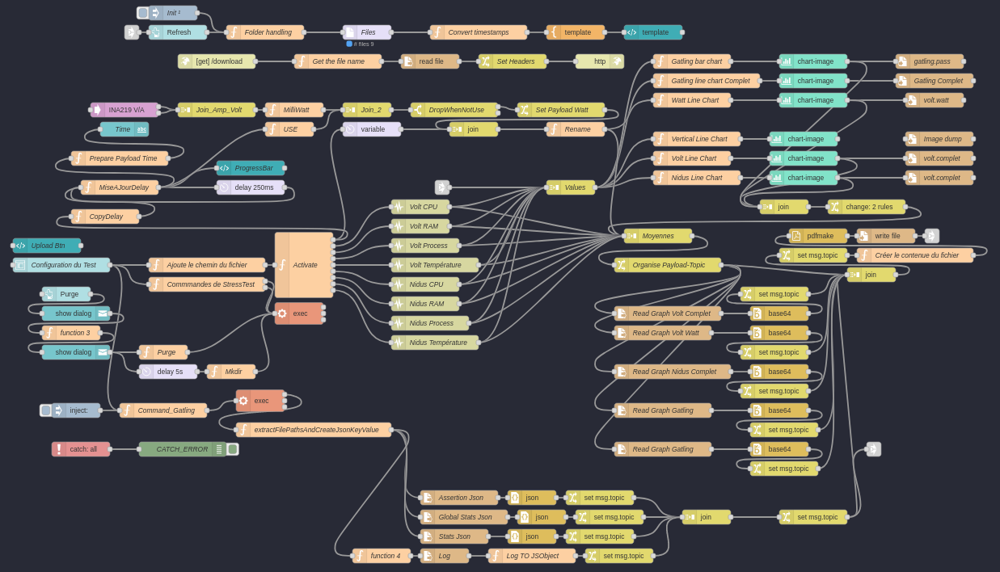
</div>

<div style="page-break-after: always;"></div>

## 21.3. Exécution d'un Test Préétabli sur Gatling depuis Node-Red
L'exécution d'un test préétabli sur Gatling depuis Node-Red revêt une importance cruciale pour la suite du projet. Cela permettra de lancer les scénarios de test sur l'application ou le système cible. Pour réaliser cette étape, nous allons utiliser le nœud **exec** de Node-Red, qui nous permet d'exécuter des commandes sur le système d'exploitation. Ce nœud sera utilisé pour lancer les commandes Gatling nécessaires afin de lancer les tests.

Je lui transmets la commande suivante en entrée :
```bash
tobby@Nidus:~ $ /home/tobby/.gatling/gatling-charts-highcharts-bundle-3.9.5/bin/gatling.sh -s CuriousTRex -bm --run-mode local -erjo " -Dusers=5 -Dramp=5"
```


<div style="page-break-after: always;"></div>

## 21.4. Envoi de Commande avec une Durée

L'une des premières étapes essentielles est de pouvoir définir une durée pour le test. Pour accomplir cette tâche, j'ai employé un nœud **function** qui permet de spécifier la durée du test en fonction de la valeur saisie par l'utilisateur. Cette valeur est ensuite transmise à un nœud **exec** qui se charge d'exécuter la commande Gatling nécessaire. Voici le code de la fonction :


```javascript
msg.original = msg.payload;
if (msg.topic !== "inject" && msg.payload.time_gatling !== undefined && msg.payload.user_gatling !== undefined) {
    // Crée la commande en utilisant les valeurs spécifiées
    msg.payload.time = msg.payload.time_gatling * 60;
    msg.payload = `/home/tobby/.gatling/gatling-charts-highcharts-bundle-3.9.5/bin/gatling.sh -s CuriousTRex -bm --run-mode local -erjo "-Dusers=${msg.payload.user_gatling} -Dramp=${msg.payload.time_gatling}"`;
} else {
    // Utilise la commande d'origine car il ne s'agit pas d'un noeud inject ou les valeurs ne sont pas fournies
    // Par défaut, utilisez la commande actuelle
    msg.payload = "/home/tobby/.gatling/gatling-charts-highcharts-bundle-3.9.5/bin/gatling.sh -s CuriousTRex -bm --run-mode local -erjo \" -Dusers=5 -Dramp=5\"";
}

// Renvoie le message modifié
return msg;
```


<div style="page-break-after: always;"></div>

## 21.5. Récupération des Informations

Pour obtenir les informations d'un rapport Gatling, j'ai dû entreprendre une rétro-ingénierie significative. En effet, Gatling ne propose pas de mécanisme direct pour extraire des informations depuis la ligne de commande. Il est nécessaire de collecter les données directement à partir des fichiers générés par Gatling. Voici un exemple de fichier généré par Gatling :

```log
RUN	CuriousTRex_Bash	Curioustrex-bash	1693898386165	 	3.9.5
USER	CuriousTRex	START	1693898386953
REQUEST		request_0	1693898386949	1693898386985	OK	 
REQUEST		request_1	1693898387009	1693898387014	OK	 
USER	CuriousTRex	START	1693898387108
REQUEST		request_0	1693898387107	1693898387128	OK	 
REQUEST		request_1	1693898387132	1693898387136	OK	 
REQUEST		styles.css	1693898387162	1693898387167	OK	 
REQUEST		styles.css	1693898387162	1693898387167	OK	 
REQUEST		request_2	1693898387184	1693898387189	OK	 
REQUEST		request_2	1693898387184	1693898387189	OK	 
REQUEST		styles.css	1693898387211	1693898387222	OK	 
REQUEST		Home.jpg	1693898387212	1693898387228	OK	 
REQUEST		styles.css	1693898387223	1693898387233	OK	 
REQUEST		Données.jpg	1693898387213	1693898387234	OK	 
REQUEST		Home.jpg	1693898387224	1693898387239	OK	 
REQUEST		Test_Complet.jpg	1693898387215	1693898387241	OK	
```
On peut donc voir qu'il y a **beaucoup d'information à traiter dans ce cas particulier**, le test dure 30 secondes avec 5 utilisateurs, et le fichier `simulation.log` fait **3'114 lignes**.

Étant donné que les informations sont sauvegardées à chaque fois dans un fichier différent, j'ai mis en place une fonction dans un nœud qui me permet de récupérer le nom du dossier dans lequel le rapport et les logs sont sauvegardés.


<div style="page-break-after: always;"></div>

Ensuite, j'en fais un tableau de chemins de fichiers :


```javascript
// Fonction pour extraire le chemin après "file://"
var inputPayload = msg.payload;

// Recherche de l'index de "file://"
var fileIndex = inputPayload.indexOf("file://");

// Si "file://" est trouvé, extrayez le chemin après
if (fileIndex !== -1) {
    // Extraire le chemin après "file://"
    var filePath = inputPayload.substring(fileIndex + 7); // +7 pour sauter "file://"

    // Supprimer le fichier index.html du chemin, s'il est présent
        filePath = filePath.substring(0, filePath.length - 12); // -11 pour enlever "/index.html"

    // Mettre le chemin extrait dans le message de sortie
    msg.payload = filePath;

    // Tableau de noms de fichiers .json
    var jsonFilesList = [
        "assertions.json",
        "global_stats.json",
        "stats.json"
    ];

    // Créer un tableau de clé-valeurs pour les fichiers .json
    var jsonFilesKeyValue = {};

    // Parcourir la liste des noms de fichiers et construire les chemins complets
    for (var i = 0; i < jsonFilesList.length; i++) {
        var jsonFileName = jsonFilesList[i];
        var jsonFilePath = filePath + '/js/' + jsonFileName;
        jsonFilesKeyValue[jsonFileName] = jsonFilePath;
    }

    // Ajouter le tableau de clé-valeurs au message
    msg.jsonFiles = jsonFilesKeyValue;

    // Renvoyer le message modifié
    return msg;
} else {
    // Aucun "file://" trouvé, renvoyer le message d'origine
    return msg;
}
```

<div style="page-break-after: always;"></div>


Tout cela se fait à la sortie du nœud exec, lequel renvoie les informations suivantes :
```bash
[...]
================================================================================
2023-09-05 11:05:03                                          29s elapsed
---- Requests ------------------------------------------------------------------
[...]

---- CuriousTRex ----------------------------------------------------------------
[##########################################################################]100%
          waiting: 0      / active: 0      / done: 150   
================================================================================

Simulation CuriousTRex_Bash completed in 29 seconds
Parsing log file(s)...
Parsing log file(s) done
Generating reports...

================================================================================
---- Global Information --------------------------------------------------------
[...]
---- Response Time Distribution ------------------------------------------------
> t < 800 ms                                          2816 (100%)
> 800 ms <= t < 1200 ms                                  0 (  0%)
> t >= 1200 ms                                           0 (  0%)
> failed                                                 0 (  0%)
================================================================================

Reports generated in 0s.
Please open the following file: file:///home/toblerc/T%C3%A9l%C3%A9chargements/gatling-charts-highcharts-bundle-3.9.5/results/Curioustrex-bash-20230905090433239/index.html
```

<div style="page-break-after: always;"></div>

## 21.6. Traitement des données

Une fois les chemins des fichiers définis, je lis les fichiers JSON et les transmets à un nœud **JSON** chargé de les traiter et de les renvoyer dans un format exploitable par Node-Red.

En sortie, j'assemble les quatre fichiers en un seul message que j'envoie ensuite aux fonctions de création de graphiques.

### 21.6.1. Création des graphiques

Je crée deux graphiques, l'un utilisant le pourcentage de réussite et d'échec pour générer un bar chart :

```javascript
// Données reçues du flux précédent
var rawData = msg.payload.gatling.Global;  // Utilisez les données de msg.payload.gatling.Global
msg.topic = "VoltBarChart"; // Définir le sujet du message

// Extraction des données nécessaires
var groupData = [
    rawData.group1,
    rawData.group2,
    rawData.group3,
    rawData.group4
];

var labels = [];
var percentages = [];

// Parcourir les données des groupes et extraire les informations
for (var i = 1; i <= groupData.length; i++) {
    var groupName = "group" + i;
    labels.push(rawData[groupName].htmlName);
    percentages.push(rawData[groupName].percentage);
}

// Création du graphique
var chartData = {
    type: 'bar',  // Utiliser un graphique de type "bar"
    options: {
        title: {
            display: true,
            text: 'Répartition des performances par groupe' // Titre du graphique
        },
        chartArea: {
            backgroundColor: '#d3d7dd' // Couleur de fond du graphique
        },
        scales: {
            x: {
                beginAtZero: true,
                title: {
                    display: true,
                    text: 'Groupes' // Titre de l'axe des X
                }
            },
            y: {
                beginAtZero: true,
                title: {
                    display: true,
                    text: 'Pourcentage' // Titre de l'axe des Y
                }
            }
        },
        plugins: {
            datalabels: {
                anchor: 'end',
                align: 'top',
                formatter: function (value) {
                    return value + '%';  // Ajouter le symbole de pourcentage à l'étiquette
                }
            }
        }
    },
    data: {
        labels: labels,
        datasets: [
            {
                label: "Pourcentage", // Légende de l'ensemble de données
                backgroundColor: 'rgba(0, 128, 255, 0.7)',  // Couleur du remplissage des barres
                data: percentages
            }
        ]
    }
};

msg.payload = chartData; // Attribuer les données du graphique au message

return msg; // Renvoyer le message
```
Le deuxième calcule le temps de réponse de chaque requête afin de créer un graphique linéaire :
```javascript
// Assurez-vous que msg.payload.gatling.Log est un tableau
var logEntries = Array.isArray(msg.payload.gatling.Log) ? msg.payload.gatling.Log : [];

// Création du graphique
var chartData = {
    type: 'line', // Utilisez un graphique de type "line"
    options: {
        title: {
            display: true,
            text: 'Comparaison des performances' // Titre du graphique
        },
        legend: {
            display: true // Affichez la légende du graphique
        },
        chartArea: {
            backgroundColor: '#d3d7dd' // Couleur de fond du graphique
        },
        plugins: {
            datalabels: {
                display: false // Désactivez l'affichage des étiquettes de données
            }
        }
    },
    data: {
        labels: logEntries.map(function (entry) {
            if (entry.type === 'RUN') {
                return 'Début de la Simulation'; // Label pour les opérations de type "RUN"
            } else if (entry.type === 'REQUEST') {
                // Calcul de la différence en millisecondes entre le début de la simulation et le début de la requête
                var simulationStart = logEntries.find(function (item) {
                    return item.type === 'RUN';
                });
                if (simulationStart) {
                    var startTime = simulationStart.start;
                    var requestTime = entry.start;
                    var timeDiff = requestTime - startTime;
                    return (timeDiff / 1000).toFixed(0) + ' s'; // Temps en secondes
                } else {
                    return 'N/A'; // Si aucune opération de type "RUN" n'est trouvée
                }
            } else {
                return ''; // Autres types d'opérations (USER, etc.) sans label
            }
        }),
        datasets: [
            {
                label: "Temps de Réponse", // Légende de l'ensemble de données
                borderColor: 'rgba(0, 128, 255, 1)', // Couleur de la ligne du graphique
                fill: false, // Désactivez le remplissage sous la ligne
                data: logEntries.map(function (entry) {
                    if (entry.type === 'REQUEST') {
                        // Calcul de la différence en millisecondes entre le début et la fin de la requête
                        var requestStart = entry.start;
                        var requestEnd = entry.end;
                        var requestTime = requestEnd - requestStart;
                        return requestTime;
                    } else {
                        return 0; // Valeurs pour les opérations de type "RUN" ou autres
                    }
                }),
                pointRadius: 0, // Diamètre des points sur le graphique
            }
        ]
    }
};

msg.payload = chartData; // Attribuez les données du graphique au message
return msg; // Renvoyez le message
```

<div style="page-break-after: always;"></div>

### 21.6.2. PDF
Une fois les chart créer,  je les réutilise dans le noeud de création de PDF pour les ajouter au rapport :
```javascript
/**
 * 
 * Vu precedemment
 * 
 */
{
            text: "Gatling", // Section Gatling
            style: "header2"
        },
        {
            text: "Nom de la simulation :                 " + msg.payload.gatling.Assertion.simulation // Nom de la simulation Gatling
        },
        {
            text: "Commencée :                 " + msg.payload.gatling.Assertion.start // Date de début de la simulation Gatling (à formater)
        },
        {
            image: 'gatlingImage', // Image Gatling
            width: 500,
        },
        {
            image: 'gatlingGraphComplete', // Image graphique complet Gatling
            width: 500,
        },
    ],
    images: {
        voltImage: 'data:image/png;base64,' + msg.payload.voltGraph.toString('base64'), // Utilisation du buffer pour l'image Volt
        wattImage: 'data:image/png;base64,' + msg.payload.wattGraph.toString('base64'),  // Utilisation du buffer pour l'image Watt de Volt
        nidusImage: 'data:image/png;base64,' + msg.payload.nidusGraph.toString('base64'),  // Utilisation du buffer pour l'image Nidus
        gatlingImage: 'data:image/png;base64,' + msg.payload.gatlingGraph.toString('base64'),  // Utilisation du buffer pour l'image Gatling
        gatlingGraphComplete: 'data:image/png;base64,' + msg.payload.gatlingGraphComplete.toString('base64'),  // Utilisation du buffer pour l'image Gatling
    },
/**
 * 
 * Vu precedemment
 * 
 */
```

<div style="page-break-after: always;"></div>


## 21.7. Refactoring
Pour finir, j'ai créer des subflow pour le noeud MQTT afin de simplifier la visualisation et le management des données :
<div style="text-align:center;">

</div>
<br>


<div style="page-break-after: always;"></div>


## 21.8. Résultat
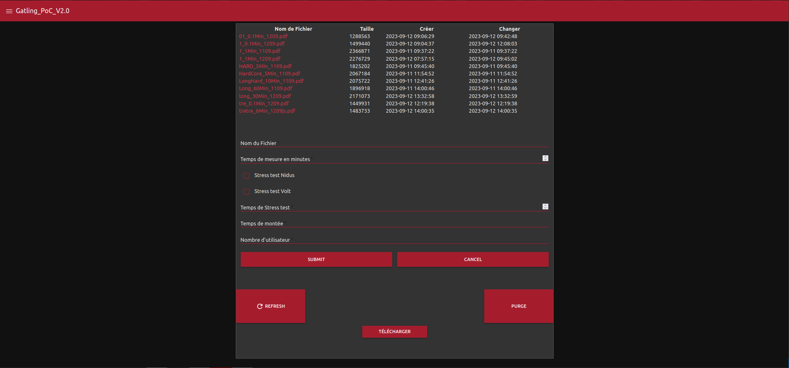

Après la conclusion des tests, les graphiques sont générés et intégrés au rapport PDF :

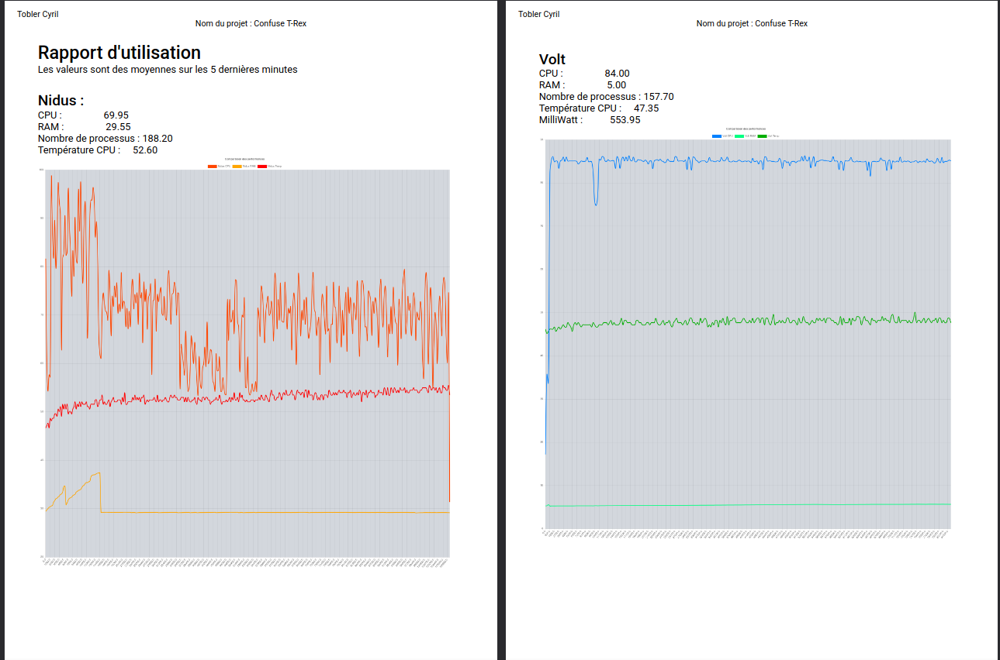
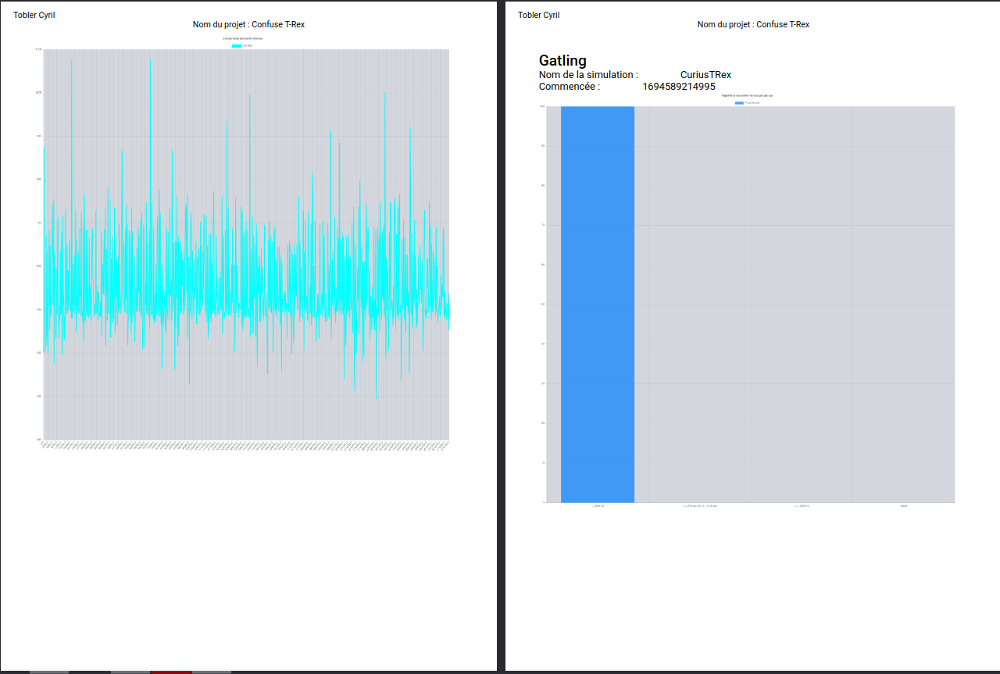
<div align="center">
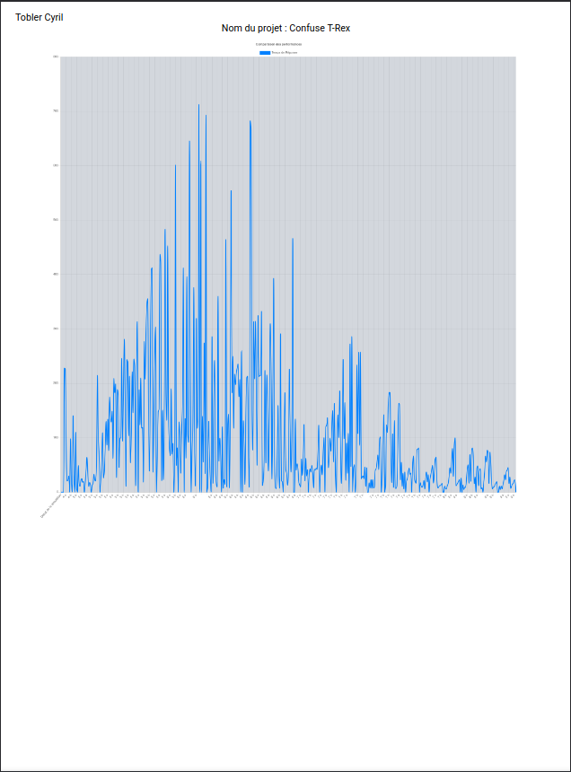
</div>
Dans ce PDF, vous pouvez constater que toutes les données souhaitées sont présentes. Cependant, des problèmes de mise en page sont apparents. En effet, les étiquettes des graphiques sont trop petites et mal formatées.

De plus, il est difficile de suivre l'état des RPI pendant le test Gatling. Par conséquent, il est impératif de trouver une solution pour améliorer l'interface utilisateur.

Dans la version 3, je vais donc m'efforcer de résoudre ces problèmes.

<div style="page-break-after: always;"></div>


# 22. Curious T-Rex V3.0

Après avoir atteint l'étape de la "PoC" (Preuve de Concept), il est temps de passer à la version opérationnelle du projet. À partir de Node-Red, vous avez désormais la capacité d'effectuer les actions suivantes :

- Lancer des StressTests.
- Lancer des tests Gatling.
- Collecter des données de monitoring (CPU, RAM, Température, etc.).
- Collecter des données de Gatling (Temps de réponse, pourcentage de réussite, etc.).
- Fusionner ces données pour créer des graphiques.
- Compiler l'ensemble pour générer un rapport PDF.

Les objectifs à atteindre pour cette version sont les suivants :
- Transmettre des paramètres de test à Gatling depuis Node-Red.
- Améliorer l'interface utilisateur de Node-Red.
- Intégrer les valeurs requises dans le rapport PDF.
- Adapter les graphiques pour une meilleure lisibilité.
- Ajouter la fonctionnalité d'exportation des données au format JSON.
- Intégrer la possibilité d'importer les données au format JSON et de générer un PDF.
- Optimiser le code.
- Introduire une page d'accueil.
- Offrir la possibilité de lancer soit uniquement un StressTest, soit un StressTest avec Gatling.


## 22.1. UI

Pour l'interface utilisateur (UI), j'ai pris la décision de limiter la durée du test de Gatling à la durée du test. Cette décision est basée sur le principe selon lequel la durée des mesures devrait généralement correspondre à la durée de Gatling. Cependant, je laisse toujours la possibilité de définir la durée du StressTest de manière indépendante.

J'ai également ajouté une option pour spécifier si le ventilateur est activé. Actuellement, étant donné les températures élevées d'environ 30 degrés à l'extérieur, il est nécessaire d'utiliser un ventilateur pour éviter la surchauffe du Raspberry Pi. Je tenais donc à avoir la possibilité de le signaler dans le rapport.

Actuellement, le ventilateur utilisé est un modèle de bureau issu de ma propre réserve, et il est activé manuellement à l'aide d'un interrupteur. Il n'est donc pas contrôlable depuis Node-Red. Toutefois, il est envisageable qu'à l'avenir, nous utilisions un ventilateur contrôlable, auquel cas il serait possible de l'activer ou de le désactiver depuis Node-Red.

Pour maintenir un certain niveau de contrôle, j'ai intégré les informations de monitoring directement à côté du formulaire de lancement du test. Ainsi, il est possible de visualiser en temps réel les valeurs de monitoring et de suivre le déroulement du test.


<div style="text-align:right;">

</div>

<div style="page-break-after: always;"></div>

### 22.1.1. Ventilateur 
<div style="text-align:center;">

</div>

### 22.1.2. UI
<div style="text-align:center;">
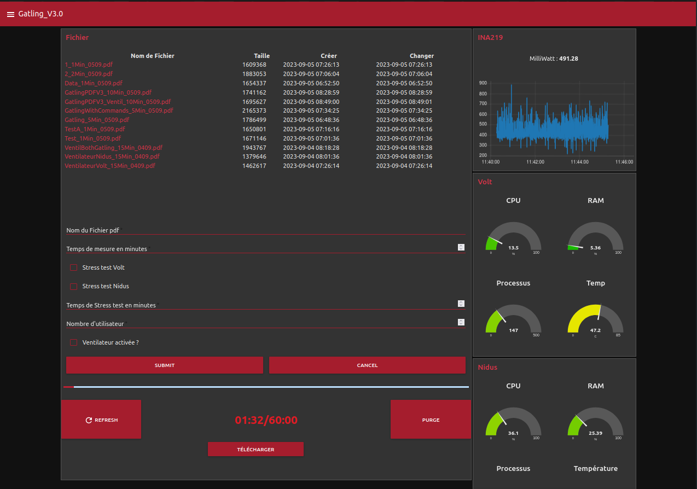
</div>

<div style="page-break-after: always;"></div>

## 22.2. Paramètres de Test
### 22.2.1. Node-Red
Pour passer des paramètres de test à Gatling depuis Node-Red, j'ai ajouté un nœud **function** qui permet de créer la commande Gatling en fonction des paramètres saisis par l'utilisateur. Voici le code de la fonction :

```javascript
msg.original = msg.payload;
if (msg.topic !== "inject" && msg.payload.time !== undefined && msg.payload.user_gatling !== undefined && msg.payload.user_gatling > 0) {
        // Crée la commande en utilisant les valeurs spécifiées
    msg.payload.time = msg.payload.time * 60;
    msg.payload = `/home/tobby/.gatling/gatling-charts-highcharts-bundle-3.9.5/bin/gatling.sh -s CuriousTRex -bm --run-mode local -erjo "-Dusers=${msg.payload.user_gatling} -Dramp=${msg.payload.time} -Xms2G -Xmx4G" | tail -1`;
    } else {
        return null;
    }
```

### 22.2.2. Gatling
Une fois que la commande est envoyée, il est nécessaire de l'interpréter du côté du script Gatling. À cette fin, j'ai ajouté les lignes suivantes au script de Gatling :
```scala
val nbUsers = java.lang.Long.getLong("users", 1).toDouble
val myRamp = java.lang.Long.getLong("ramp", 1)
println(s"Nombre d'utilisateurs : $nbUsers")
println(s"Temps de montée : $myRamp")

  setUp(scn.inject(constantUsersPerSec(nbUsers).during(myRamp seconds))).protocols(httpProtocol)
```
Cela permet de récupérer les valeurs passées en paramètres et de les utiliser pour le test. Toutefois, si aucune valeur n'est passée ou si elle ne correspond pas au format attendu, le script utilisera les valeurs par défaut.


<div style="page-break-after: always;"></div>

## 22.3. Optimisation

Pour améliorer les performances du système, j'ai pris deux approches principales.

### 22.3.1. Séparation des Flux de Données

Au départ, j'avais regroupé toutes les données dans un même flux. Cependant, cela a entraîné un inconvénient majeur : à chaque étape de traitement, chaque fonction ou jointure sollicitait l'ensemble du flux. Cela signifiait que d'énormes quantités de données étaient traitées inutilement, ce qui était tout sauf optimal.

Pour remédier à cela, j'ai choisi de segmenter les flux de données et de les traiter indépendamment les uns des autres. Cette approche permet d'éviter le traitement de données superflues, améliorant ainsi considérablement les performances globales du système.

### 22.3.2. Prétraitement des Données en Amont

Ensuite, j'ai décidé de déplacer le traitement des données plus en amont de leur flux respectif. Cela signifie que les données sont traitées et simplifiées plus tôt dans leur parcours. En conséquence, des données déjà traitées et donc moins volumineuses transitent à travers les étapes suivantes.

Cette stratégie réduit la charge de traitement à chaque étape ultérieure, ce qui se traduit par une nette amélioration des performances globales du système.
<br><br><br><br><br><br><br><br><br><br><br><br>
<div style="text-align:left;">

</div>


<div style="page-break-after: always;"></div>

## 22.4. JSON
Dans la version 3.0, je n'ai pas inclus la possibilité de générer un rapport à partir d'un test réalisé sans Gatling. Cette décision découle du fait que la génération de rapports avec ou sans Gatling est l'une des dernières fonctionnalités que je souhaitais ajouter à la V3.0. Cette transformation sera intégrée dans la V4.0 du projet.
### 22.4.1. Création du Fichier JSON

Au début de ce processus, j'ai centralisé toutes les données nécessaires à la création de graphiques en un point unique. À cet endroit, je les ai transformées en format JSON et les ai enregistrées dans un fichier.

<div align="center">
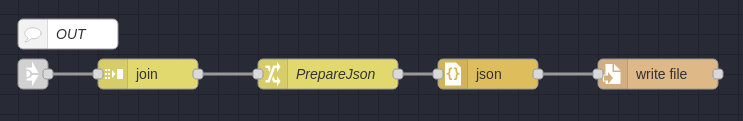
</div>

### 22.4.2. Lecture du Fichier JSON

Ensuite, j'ai mis en place une fonctionnalité permettant à l'utilisateur de télécharger les différents fichiers JSON générés. Cela offre une vue d'ensemble des données sous une forme exploitable.

<div align="center">
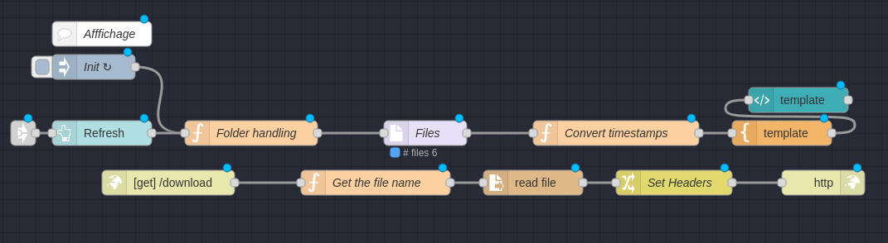
</div>
<br><br><br><br><br><br>
<div style="text-align:right;">

</div>
<div style="page-break-after: always;"></div>

### 22.4.3. Importation du Fichier JSON

L'importation du fichier JSON s'effectue sur la page de Gatling, où l'utilisateur peut également télécharger les rapports de performance. Cette intégration logique permet à l'utilisateur de charger son fichier en utilisant un bouton dédié.

Après l'importation, les données sont traitées de la même manière que lors de la création du rapport PDF, aboutissant ainsi au même résultat.

<div align="center">
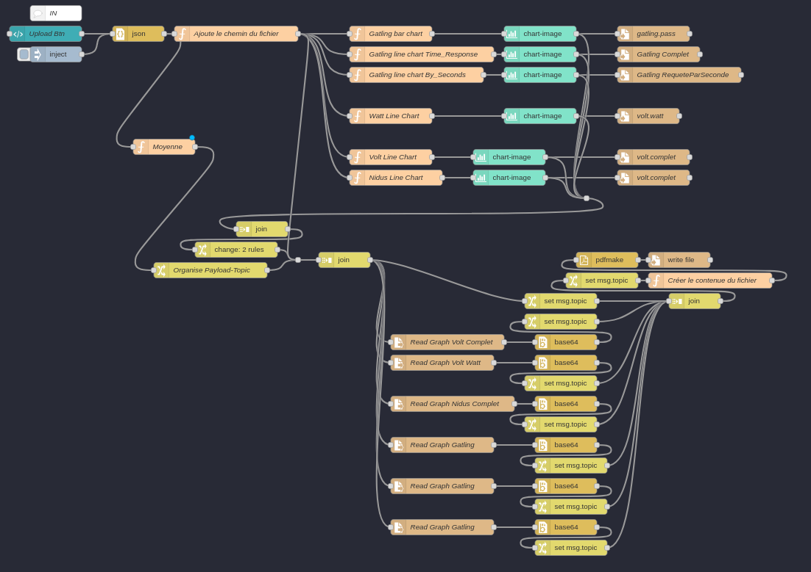
</div>

<div style="page-break-after: always;"></div>

## 22.5. Rapport PDF selon Gatling

Dans la dernière fonctionnalité que j'ai mise en place au sein de la version 3.0, j'ai introduit la possibilité de créer un rapport PDF différent en fonction des circonstances. J'ai pris en considération le fait que l'utilisateur ne souhaite peut-être pas toujours effectuer un stress test ou une simulation Gatling. Par exemple, il pourrait vouloir évaluer le comportement de son système d'exploitation à vide pour des fins de comparaison. Dans cette optique, j'avais déjà donné à l'utilisateur la possibilité de choisir s'il devait ou non effectuer un stress test sur l'un ou l'autre des Raspberry Pi. J'ai ensuite ajouté une option pour l'exécution de Gatling. Si l'utilisateur choisit de ne pas utiliser Gatling, le rapport PDF sera généré sans les graphiques de Gatling.

### 22.5.1. Mise en place de la fonction

```javascript
msg.original = msg.payload;
if (msg.topic !== "inject" && msg.payload.time !== undefined && msg.payload.user_gatling !== undefined && msg.payload.user_gatling > 0) {
        // Crée la commande en utilisant les valeurs spécifiées
    msg.payload.time = msg.payload.time * 60;
    msg.payload = `/home/tobby/.gatling/gatling-charts-highcharts-bundle-3.9.5/bin/gatling.sh -s CuriousTRex -bm --run-mode local -erjo "-Dusers=${msg.payload.user_gatling} -Dramp=${msg.payload.time} -Xms2G -Xmx4G" | tail -1`;
    } else {
        return null;
    }
```
J'ai ajouté une condition dans la fonction qui crée la commande Gatling à envoyer en SSH. Cette condition permet de déterminer si l'utilisateur a choisi d'effectuer un test Gatling ou non. Le formulaire de l'utilisateur est utilisé pour cela. Lors de l'envoi des valeurs du formulaire, je stocke ces valeurs dans une variable globale accessible par tous les nœuds et persistante. Cette approche me permet de traiter les données de Gatling ou de les ignorer lors de la génération du rapport ultérieurement. Ainsi, je peux générer un rapport avec ou sans les données de Gatling en fonction de la décision de l'utilisateur, que ce soit pour effectuer un test Gatling ou simplement un StressTest.

Grâce à l'optimisation que j'ai réalisée plus tôt, une situation innatendu en à découlé qui s'est posrtée complètement à mon avantage en effet en séparant les flux il m'as été beaucoup plus simple de mettre des `switch`, en effet choisir de continuer ou non flux par flux est beaucoup plus simple si je n'avais pas réaliser cette optimisation plus tôt j'aurais du créer un flux complet diférent qui aurait commencé par un switch.

<div style="page-break-after: always;"></div>

## 22.6. Résultat
Au terme de cette version 3.0, j'ai atteint tous les objectifs que je m'étais fixés. Le système est désormais capable de générer un rapport PDF à partir de données de monitoring et de Gatling. Il est également possible d'exporter les données au format JSON et de les réimporter pour générer un rapport PDF.
Qui plus est, les performances du système ont été améliorées grâce à l'optimisation du code et à la séparation des flux de données.
Les graphique sont plus lisibles et les données sont mieux organisées dans le rapport PDF.

### 22.6.1. UI
<div align="center">
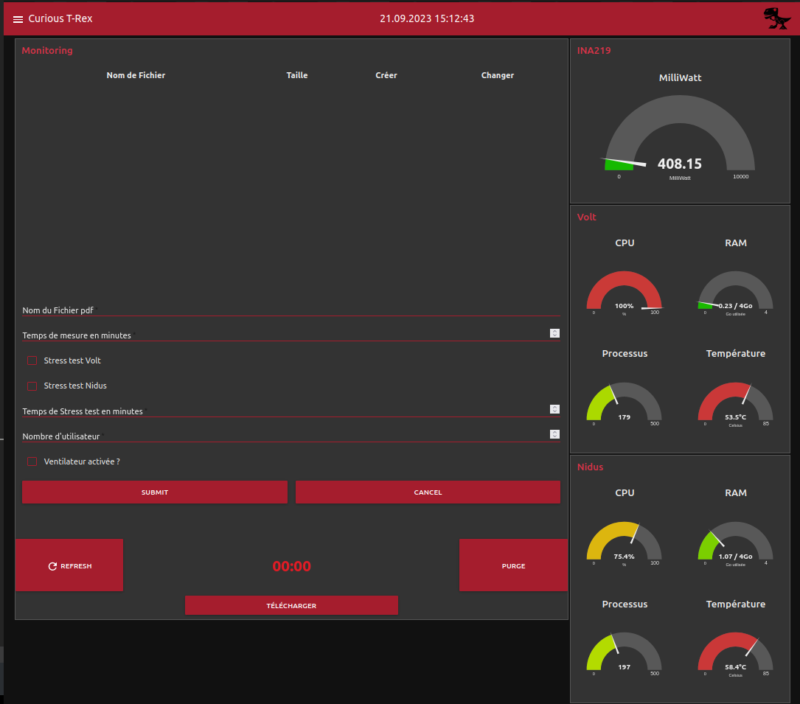
</div>

<div style="page-break-after: always;"></div>

### 22.6.2. Rapport PDF
Malgré que toutes les donnée étais présente dans le rapport PDF, après l'entretient du suivi de projet, il a été soulevé certains points qui posait problèmeme, en effet donnée n'étais pas très bien allignée et laissée sans explication, j'ai donc décidé de revoir la mise en page du rapport PDF. J'ai également rajoutée la consommation moyenne d'une requête Gatling, ce calcul à été réalisée en faisant un très long test sans aucune charge de travail et en déduisant la consommation moyenne d'une requête Gatling.
<div align="center">
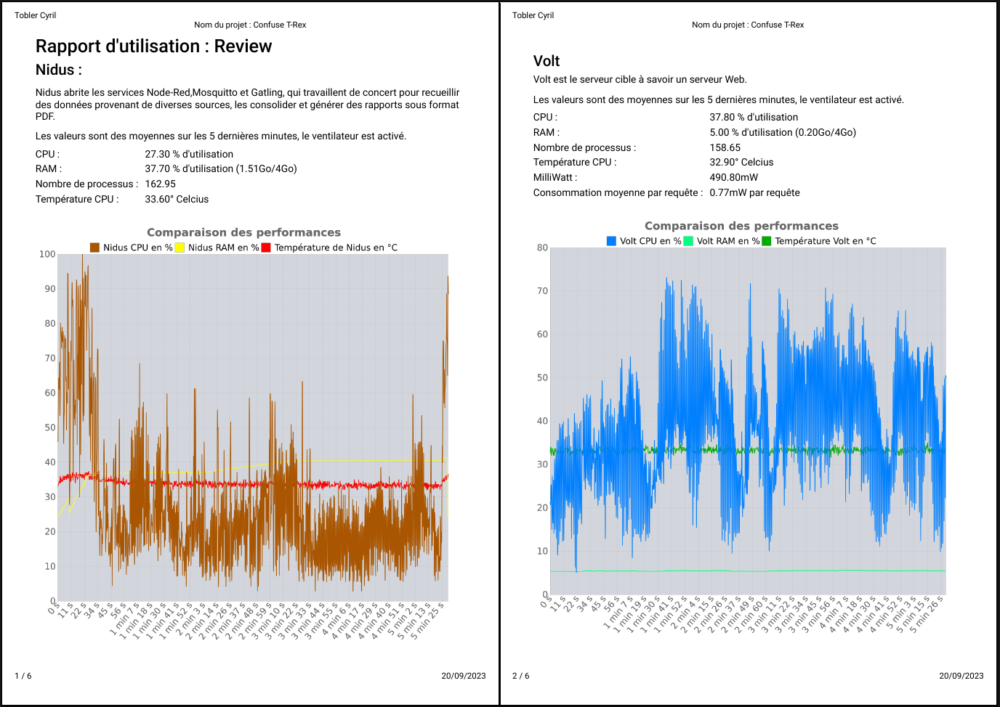
</div>
<div align="center">
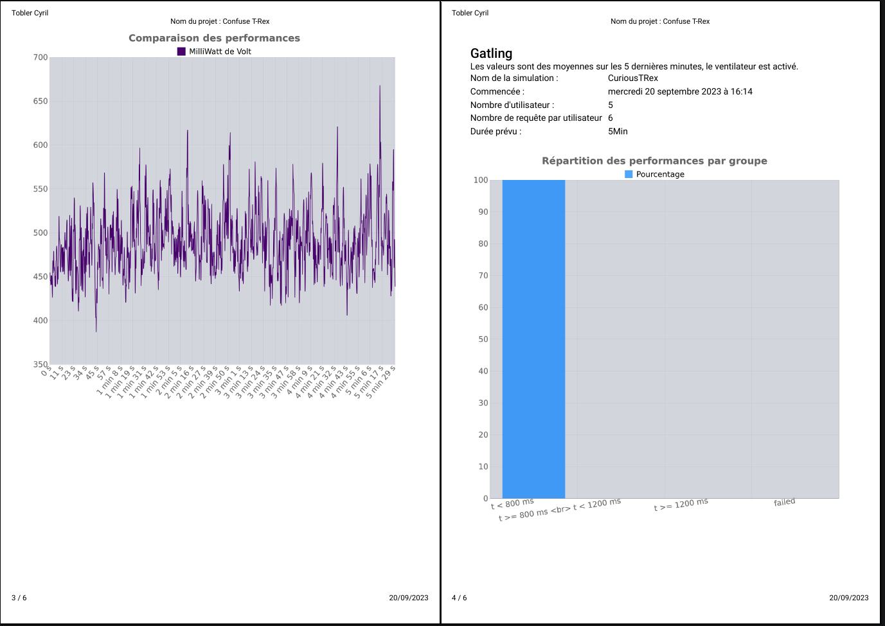
</div>
<div align="center">
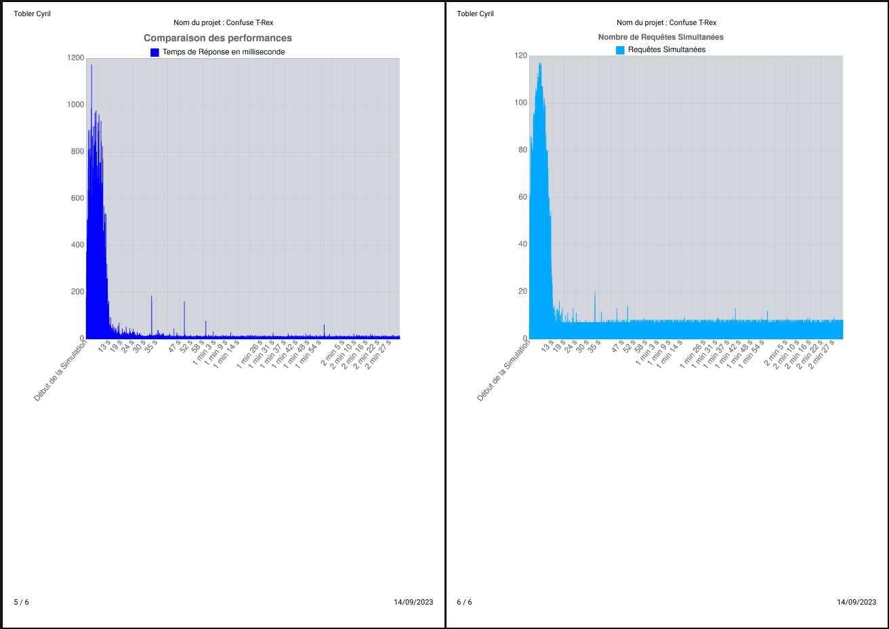
</div>


<div style="page-break-after: always;"></div>

# 23. Curious T-Rex
Pour pouvoir faciliter la prise en main du projet, il fallais une méthode rapide pour installer Nidus, donc j'ai réalisé un script d'installation qui permet d'installer Nidus en une seule commande.

## 23.1. Installation
Voici le script d'installation, il est volontairement plus court que celui présent sur [git](https://mylos.cifom.ch/gitlab/ToblerC/banc-de-mesures-de-la-consommation-electrique/-/blob/main/scripts/install.sh), pour des raisons de lisibilité :

```bash
#!/bin/bash

# Nom d'utilisateur et répertoire d'utilisation
user="tobby"
user_home="/home/$user"

# Fonction pour exécuter une commande en silence (redirection de la sortie)
run_command_silently() {
    "$@" > /dev/null 2>&1
    return $?
}
# Changement du nom d'hôte en Nidus
hostnamectl set-hostname Nidus

# Mise à jour de Node.js et installation de Node-Red
bash <(curl -sL https://raw.githubusercontent.com/node-red/linux-installers/master/deb/update-nodejs-and-nodered) --confirm-install --confirm-root --confirm-pi --no-init
if [ $? -eq 0 ]; then
   echo "Node.js et Node-Red installés avec succès."
else
   echo "Erreur lors de l'installation de Node.js et Node-Red."
   exit 1
fi

# Instalation de Git
run_command_silently sudo apt install git -y
if [ $? -eq 0 ]; then
    echo "Git installé avec succès."
else
    echo "Erreur lors de l'installation de Git."
fi

# Activation des services du Raspberry Pi OS nécessaires pour le projet
sudo systemctl enable ssh
if [ $? -eq 0 ]; then
    echo "Service SSH activé avec succès."
else
    echo "Erreur lors de l'activation du service SSH."
fi
sudo raspi-config nonint do_i2c 0

# Création des clés SSH si elles n'existent pas déjà
if [ ! -f $user_home/.ssh/id_rsa ]; then
    sudo -u $user ssh-keygen -t rsa -b 2048 -f $user_home/.ssh/id_rsa -N ""
    if [ $? -eq 0 ]; then
        echo "Clés SSH créées avec succès."
    else
        echo "Erreur lors de la création des clés SSH."
    fi
else
    echo "Les clés SSH existent déjà, aucune action requise."
fi

# Installation de Java JDK
run_command_silently sudo apt install default-jdk -y
if [ $? -eq 0 ]; then
    echo "Java JDK installé avec succès."
else
    echo "Erreur lors de l'installation de Java JDK."
fi

# Création du répertoire .gatling
sudo mkdir $user_home/.gatling
if [ $? -eq 0 ]; then
    echo "Répertoire .gatling créé avec succès."
else
    echo "Erreur lors de la création du répertoire .gatling."
fi

# Téléchargement de Gatling
run_command_silently sudo wget -O $user_home/.gatling/gatling-charts-highcharts-bundle-3.9.5-bundle.zip https://repo1.maven.org/maven2/io/gatling/highcharts/gatling-charts-highcharts-bundle/3.9.5/gatling-charts-highcharts-bundle-3.9.5-bundle.zip
if [ $? -eq 0 ]; then
    echo "Gatling téléchargé avec succès."
else
    echo "Erreur lors du téléchargement de Gatling."
fi

# Extraction de Gatling
run_command_silently sudo unzip $user_home/.gatling/gatling-charts-highcharts-bundle-3.9.5-bundle.zip -d $user_home/.gatling/
if [ $? -eq 0 ]; then
    echo "Gatling extrait avec succès."
else
    echo "Erreur lors de l'extraction de Gatling."
fi

# Installation de Mosquitto
run_command_silently sudo apt install mosquitto -y
if [ $? -eq 0 ]; then
    echo "Mosquitto installé avec succès."
else
    echo "Erreur lors de l'installation de Mosquitto."
fi

# Configuration de Mosquitto
sudo tee /etc/mosquitto/mosquitto.conf > /dev/null <<EOL
listener 1883
allow_anonymous true
EOL

# Redémarrage de Mosquitto pour appliquer la configuration
sudo service mosquitto restart
if [ $? -eq 0 ]; then
    echo "Mosquitto redémarré avec succès."
else
    echo "Erreur lors du redémarrage de Mosquitto."
fi

# Activation du service Mosquitto
systemctl enable mosquitto
if [ $? -eq 0 ]; then
    echo "Service Mosquitto activé avec succès."
else
    echo "Erreur lors de l'activation du service Mosquitto."
fi

# Acfivation du service Node-Red
sudo systemctl enable nodered.service
if [ $? -eq 0 ]; then
    echo "Service Node-Red activé avec succès."
else
    echo "Erreur lors de l'activation du service Node-Red."
fi

# Installation des dépendances de Node-Red
sudo npm install -g --unsafe-perm node-red --no-audit --no-update-notifier --no-fund --save --save-prefix=~ --omit=dev --engine-strict @node-red-contrib-themes/theme-collection

sudo npm install -g --unsafe-perm node-red --no-audit --no-update-notifier --no-fund --save --save-prefix=~ --omit=dev --engine-strict node-red-dashboard@3.6.0

sudo npm install -g --unsafe-perm node-red --no-audit --no-update-notifier --no-fund --save --save-prefix=~ --omit=dev --engine-strict node-red-contrib-pdfmake2@2.0.0

sudo npm install -g --unsafe-perm node-red --no-audit --no-update-notifier --no-fund --save --save-prefix=~ --omit=dev --engine-strict node-red-contrib-mqtt-plus@0.0.7

sudo npm install -g --unsafe-perm node-red --no-audit --no-update-notifier --no-fund --save --save-prefix=~ --omit=dev --engine-strict node-red-contrib-fs@1.4.1

sudo npm install -g --unsafe-perm node-red --no-audit --no-update-notifier --no-fund --save --save-prefix=~ --omit=dev --engine-strict node-red-contrib-easybotics-ina219-sensor@0.7.6

run_command_silently sudo apt-get install libcairo2-dev libjpeg-dev libgif-dev build-essential g++ -y

run_command_silently sudo apt-get install build-essential libcairo2-dev libpango1.0-dev libjpeg-dev libgif-dev librsvg2-dev -y

run_command_silently sudo apt-get install libpixman-1-dev libxcb-composite0-dev -y

sudo npm install -g --unsafe-perm node-red --no-audit --no-update-notifier --no-fund --save --save-prefix=~ --omit=dev --engine-strict node-red-contrib-chart-image

sudo npm install -g --unsafe-perm node-red --no-audit --no-update-notifier --no-fund --save --save-prefix=~ --omit=dev --engine-strict node-red-node-base64

# Écho pour indiquer la fin du script
echo "Installation de Gatling, Mosquitto, Node-Red et ses dépendances terminée."
echo "Initialisation de Node-Red..."
node-red admin init
echo "Redémarrage de Node-Red..."
sudo systemctl restart nodered.service
echo "Installation terminée."
echo "Vous pouvez maintenant vous connecter à Node-Red à l'adresse suivante : http://localhost:1880"

```

<div style="page-break-after: always;"></div>

Ce script automatisé a pour objectif de simplifier l'installation de Gatling, Mosquitto, Node-Red et leurs dépendances dans le contexte du projet. Voici les principales étapes :

1. **Changement du nom d'hôte :** Le script modifie le nom d'hôte du système en "Nidus".

2. **Mise à jour de Node.js et installation de Node-Red :** Node.js est mis à jour, et Node-Red est installé via un script externe.

3. **Installation de Git :** Git est installé pour la gestion du code source.

4. **Activation des services nécessaires :** Les services SSH et Mosquitto sont activés pour la communication.

5. **Création des clés SSH :** Des clés SSH sont générées si elles n'existent pas déjà.

6. **Installation de Java JDK :** Java JDK est installé pour les besoins du projet.

7. **Création du répertoire .gatling :** Un répertoire .gatling est créé pour Gatling.

8. **Téléchargement de Gatling :** Gatling est téléchargé depuis un dépôt Maven.

9. **Extraction de Gatling :** Le fichier Gatling est extrait dans le répertoire .gatling.

10. **Installation de Mosquitto :** Mosquitto, un serveur MQTT, est installé.

11. **Configuration de Mosquitto :** La configuration de Mosquitto est adaptée pour permettre une communication anonyme.

12. **Redémarrage de Mosquitto :** Mosquitto est redémarré pour appliquer la nouvelle configuration.

13. **Activation du service Mosquitto :** Le service Mosquitto est activé pour un démarrage automatique.

14. **Activation du service Node-Red :** Le service Node-Red est activé pour un démarrage automatique.

15. **Installation des dépendances de Node-Red :** Plusieurs dépendances essentielles pour Node-Red sont installées, y compris les thèmes, le dashboard, pdfmake2, mqtt-plus, fs, INA219 sensor, chart image et base64.

16. **Finalisation de l'installation :** Le script termine en initialisant Node-Red et en redémarrant le service pour que les modifications prennent effet.

Ces étapes permettent de préparer l'environnement nécessaire à notre projet, en installant les outils et services requis. Une fois le script exécuté avec succès, vous pourrez accéder à Node-Red via l'adresse [http://localhost:1880](http://localhost:1880).

### 23.1.1. Utilisation
Afin de tester le script dans des conditions proches de sa finalité, j'ai opté pour une approche pratique. Au lieu de créer une seconde carte SD, réaliser des captures d'écran et effectuer des manipulations séparées, j'ai pris la décision de flasher en direct la carte SD de Nidus, la machine sur laquelle je développe le projet. Cette approche comportait un certain risque, car en cas d'échec, cela aurait pu entraîner une perte de temps considérable. Cependant, j'ai décidé de relever ce défi pour tester le script en conditions réelles et apporter des modifications en temps réel si nécessaire.

Cela a conduit à la rédaction du chapitre détaillant la deuxième installation de Nidus, qui sert également de guide d'utilisation pour le script d'installation : [11.5. Deuxième installation Raspbian](#115-deuxième-installation-raspbian)


<div style="page-break-after: always;"></div>

## 23.2. Mise à jour du JSON

La mise à jour du JSON a nécessité un travail de fond conséquent. J'ai dû repartir de zéro pour mettre en place un système de différenciation en fonction de l'utilisation de Gatling. Cela m'a amené à repenser entièrement la manière dont les données étaient enregistrées et lues. Par exemple, j'ai ajouté un champ spécifique pour indiquer si Gatling avait été utilisé.

Afin de tirer pleinement parti de cette refonte majeure, j'ai choisi de décomposer au maximum les flux de données. Cela signifie qu'il n'y a plus de liens rigides entre les différentes étapes de traitement. Cette flexibilité offre l'avantage de faciliter la séparation ultérieure des flux en plusieurs parcours distincts si cela s'avère nécessaire.

Cette révision en profondeur du JSON était essentielle pour garantir la robustesse et la modularité du système. Elle permet également d'anticiper d'éventuels besoins d'adaptation future en fonction des évolutions du projet.

Cependant, cette approche a également ses inconvénients. En effet, il faut être beaucoup plus rigoureux lors de la mise en place des fluc car il est plus complexe de faire des modifications en cours de route. De plus, il faut être très attentif à la manière dont les données sont traitées, car il est facile de se perdre dans les différents flux.

### 23.2.1. Affichage

Au niveau de l'affichage des fichier JSON, je n'ai rien changé, en effet l'affichage des fichier JSON est déjà très bien réalisé et ne nécessite pas de modification.

<div align="center">
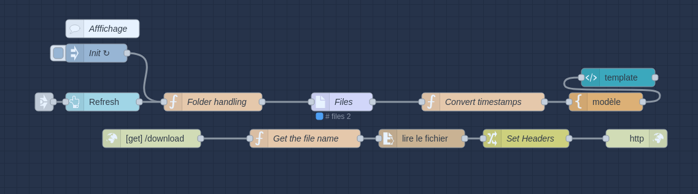
</div>

<div style="page-break-after: always;"></div>

### 23.2.2. Enregistrement des données

Pour l'enregistrement des données, j'ai décidé de simplement ajouter un donnée pour indiquer si Gatling a été utilisé ou non. Cette approche permet de conserver la structure existante et de ne pas avoir à modifier les données existantes.

<div align="center">
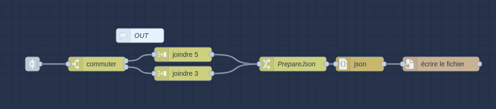
</div>

### 23.2.3. IN

Pour la lecture des donnée, j'ai pu garder une ghrande partie de ce qui avais été mis en place car avec mon aproche à base de switch, il m'as été très simple de rajouter un switch pour différencier les données de Gatling et les données de monitoring.

<div align="center">
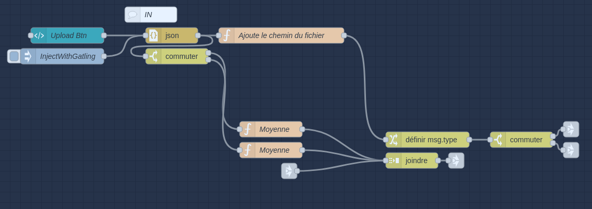
</div>

### 23.2.4. Création des graphiques

Pour la création des graphiques, je me suis inspirée de ce que j'avais déjà réalisé, j'ai donc gardé la même structure mais j'ai du rajouter un switch pour différencier les données de Gatling et les données de monitoring.

<div align="center">
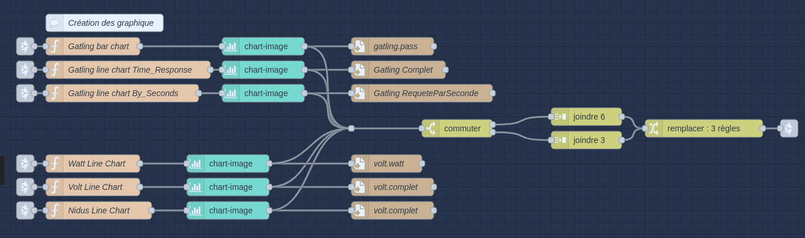
</div>

### 23.2.5. Récupération des images

Pour la récupération des images, il à fallu faire du ménage car les entrée et les sortie étais chaotique, j'ai donc du revoir la structure de la récupération des images, j'ai donc décidé d'épurer au maximum les flux pour ne garder que l'essentiel.

<div align="center">
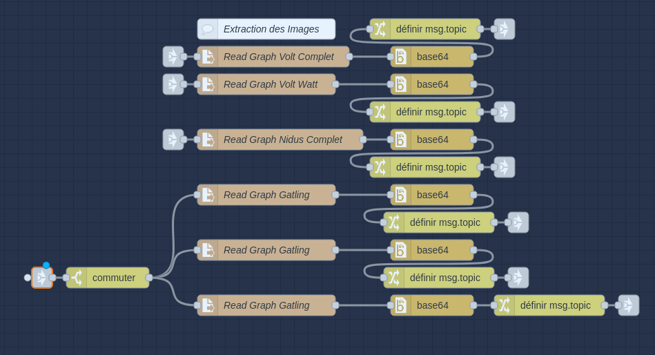
</div>

### 23.2.6. Création du PDF
La création du PDF est la partie la plus modifié car j'ai du séparer mon flux selon l'utilisation de Gatling, en effet si Gatling n'est pas utilisé, il n'y a pas de graphique de Gatling à afficher, j'ai donc du créer un flux pour Gatling et un flux pour le monitoring.

<div align="center">
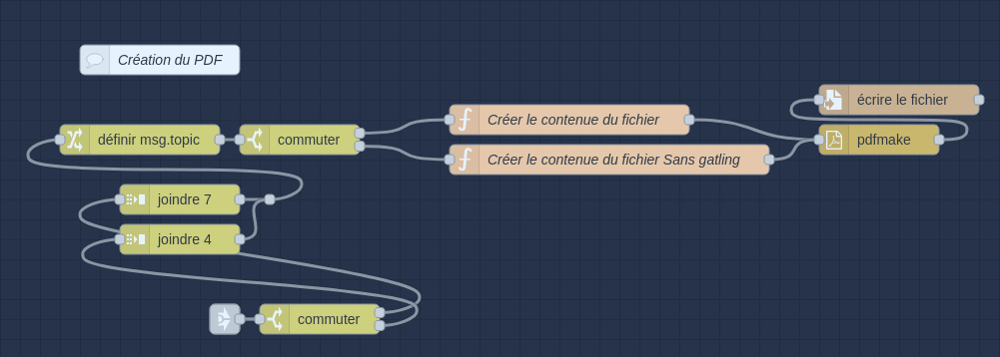
</div>

<div style="page-break-after: always;"></div>

# 24. Problèmes
Comme dans tout projet, j'ai rencontré des problèmes lors de la réalisation de ce projet. Certains ont été résolus, d'autres non. Dans cette section, je vais décrire les problèmes rencontrés et les solutions que j'ai trouvées.

## 24.1. Problème de Détection I2C

Lors de l'installation de l'INA219, l'une des premières étapes consiste à vérifier si le Raspberry Pi détecte correctement le module. Pour ce faire, il faut utiliser la commande `sudo i2cdetect -y 1`, qui permet de répertorier les modules I2C connectés au Raspberry Pi. Cependant, lors de mes tests, j'ai rencontré des difficultés pour détecter l'INA219. J'ai donc entrepris une série de tests avec l'aide précieuse de M. Singelé afin de déterminer la cause du problème.

Voici les tests que j'ai effectués :

- Vérification des soudures (Vérifié avec M. Singelé)
- Vérification des connexions par câble (Vérifié avec M. Singelé)
- Vérification de la tension délivrée à la puce (3.3V)
- Activation de l'I2C sur le Raspberry Pi
- Vérification de la présence du Bus I2C (`ls /dev/i2c*`)
- Vérification des adresses de la puce (1 en 40 et 1 en 41)
- Essai avec une autre puce (soudée par M. Singelé)
- Essai avec un autre Raspberry Pi 4
- Essai avec un Raspberry Pi 3B
- Vérification des logs de l'I2C
- Contournement de la commande i2cdetect et essai direct d'un script Python capable de réaliser une requête toutes les 0.00057 secondes
- Essai sur un autre emplacement de la breadboard
- Vérification de la présence de modules noyau I2C (`lsmod | grep i2c`)
- Vérification avec un oscilloscope
- 
<div style="page-break-after: always;"></div>

Malheureusement, aucun de ces tests n'a abouti à une solution. J'ai donc pris la décision de repartir de zéro en effectuant une installation propre, sans Node-Red ni Gatling. À ce moment-là, j'ai enfin pu détecter mes puces avec succès.

```bash
tobby@Nidus:~ $ sudo i2cdetect -y 1
     0  1  2  3  4  5  6  7  8  9  a  b  c  d  e  f
00:                         -- -- -- -- -- -- -- -- 
10: -- -- -- -- -- -- -- -- -- -- -- -- -- -- -- -- 
20: -- -- -- -- -- -- -- -- -- -- -- -- -- -- -- -- 
30: -- -- -- -- -- -- -- -- -- -- -- -- -- -- -- -- 
40: 40 -- -- -- -- -- -- -- -- -- -- -- -- -- -- -- 
50: -- -- -- -- -- -- -- -- -- -- -- -- -- -- -- -- 
60: -- -- -- -- -- -- -- -- -- -- -- -- -- -- -- -- 
70: -- -- -- -- -- -- -- --         

tobby@Nidus:~ $ sudo i2cdetect -y 1
     0  1  2  3  4  5  6  7  8  9  a  b  c  d  e  f
00:                         -- -- -- -- -- -- -- -- 
10: -- -- -- -- -- -- -- -- -- -- -- -- -- -- -- -- 
20: -- -- -- -- -- -- -- -- -- -- -- -- -- -- -- -- 
30: -- -- -- -- -- -- -- -- -- -- -- -- -- -- -- -- 
40: -- 41 -- -- -- -- -- -- -- -- -- -- -- -- -- -- 
50: -- -- -- -- -- -- -- -- -- -- -- -- -- -- -- -- 
60: -- -- -- -- -- -- -- -- -- -- -- -- -- -- -- -- 
70: -- -- -- -- -- -- -- --    
```
Une fois que la puce a été détectée, j'ai entrepris une réinstallation minutieuse de Node-Red et Gatling, vérifiant étape par étape si la détection de la puce était toujours fonctionnelle. Finalement, j'en ai conclu que le problème résidait dans le chargement incorrect du module I2C lors de ma première installation.

<div style="page-break-after: always;"></div>

## 24.2. Problème de Performance

Lors de la troisième itération du projet, un problème significatif s'est manifesté. Jusqu'à présent, mes tests avec Gatling étaient relativement courts, d'une durée de moins de 20 minutes et avec un seul utilisateur. Cependant, lors de mon premier test avec 5 utilisateurs pendant 30 minutes, une erreur de mémoire insuffisante est survenue.

Pour récupérer les informations de Gatling, j'extrayais les données des fichiers journaux. Avec ces paramètres, le fichier journal devenait très rapidement volumineux. De plus, ma méthode de traitement des informations était gourmande en mémoire. J'ai donc dû revoir ma manière de traiter les données et de les stocker pour éviter ce genre de problème.

À l'origine, dans l'idée de généraliser mes fonctions, je visais à regrouper toutes les sources de données en un seul flux. Cependant, cela s'est avéré non optimal en termes de mémoire et de puissance de calcul. J'ai donc décidé de séparer les sources de données en plusieurs flux distincts et de les traiter individuellement. Cela a permis de réduire la charge de travail de Node-Red et, par conséquent, de réduire la consommation de mémoire.

Cependant, bien que cela permette de lancer des tests plus imposants, cela ne résout pas entièrement le problème de mémoire pour des tests de charges plus longs avec de nombreux utilisateurs. Il est important de noter que le Raspberry Pi 4 n'est pas un serveur capable de gérer des tests de charges massifs.


### 24.2.1. Solutions testées :
- Traitement des données séparément au lieu de les regrouper en un seul flux.
- Traitement précoce des données dans le flux pour éviter le stockage excessif de données.

### 24.2.2. Solutions possibles :
- Externalisation de Node-Red sur un serveur plus puissant pour améliorer les performances.

### 24.2.3. Solution choisie :
En traitant les informations plus tôt dans le flux et en évitant de joindre les flux inutilement, j'ai pu réduire la consommation de mémoire et ainsi éviter les problèmes de performances. Cependant, il est essentiel de noter que, malgré ces améliorations, je ne peux pas réaliser des tests de charge avec de nombreux utilisateurs sur de longues périodes.

J'ai réussi à réaliser des tests avec 10 utilisateurs effectuant 6 requêtes par seconde pendant 5 minutes, ou un test d'une heure avec un seul utilisateur.

Il est important de maintenir des attentes réalistes : le Raspberry Pi 4 n'est pas un serveur et ne peut pas gérer des tests de charge avec des milliers d'utilisateurs pendant des heures et traiter ensuite des millions de lignes de journaux.

En terme de chiffre, j'ai conclu que le Raspberry Pi 4 peut gérer un test avec 10 utilisateurs pendant 5 minutes, mais à ce points nous touchons les limites du Raspberry Pi 4.
Après de nombreaux test j'ai réàlisée que la limite actuelle est chiffrable, en effet il faut se fier à cette equation :

nbUsers * nbRequestsPerSecond * testDuration < 300 


<div style="page-break-after: always;"></div> 

## 24.3. Température
Les Raspberry Pi sont connus pour leur tendance à surchauffer. C'est pourquoi il est important de prendre des mesures pour éviter la surchauffe. 

Dans un premier temps la solution abordée dès le départ fut de greffer Nidus et Volt de radiateur afin de dissiper la chaleur. Cependant, cette solution n'était pas suffisante pour éviter la surchauffe. J'ai donc décidé d'ajouter un ventilateur de bureau pour aider à dissiper la chaleur.

Cependant, le ventilateur n'est pas contrôlable depuis Node-Red, ce qui signifie qu'il doit être activé manuellement.

Cela signifie également que le ventilateur doit être activé avant le début du test et désactivé après la fin du test. 

Cela peut être problématique car il dépend forcément d'une intervention humaine. Cependant, il est possible de le contrôler depuis Node-Red, mais cela nécessite l'utilisation d'un ventilateur contrôlable, c'est pour quoi j'ai décidé de rajouter un bouton pour mentionner si le ventilateur est utilisée ou non, afin de pouvoir le notifier dans le rapport et a terme si l'on ajoute un ventilateur contrôlable, de pouvoir l'activer ou le désactiver depuis Node-Red.

Et après plusieurs test j'ai pu comparer les résultats avec et sans ventilateur, pour garantir que les résultats du test ne sont pas faussés par l'environnement, j'ai décidé que avant les test je laisserais le ventilateur tourner pendant 5 minutes pour que la température soit stable pour le test avec ventilateur et pour l'autre je laisserais le ventilateur éteint pendant 5 minutes pour que la température soit stable pour le test sans ventilateur.

<div style="page-break-after: always;"></div> 

### 24.3.1. Sans ventilateur


<div style="page-break-after: always;"></div> 

### 24.3.2. Avec Ventilateur


<div style="page-break-after: always;"></div>

## 24.4. Analyse des Résultats des Tests de Performance

Dans un souci de fournir des résultats impartiaux, il est important de noter certaines observations lors des tests de performance avec et sans ventilateur. Ces observations visent à contextualiser les résultats et à en expliquer les variations.

Lors du test avec le ventilateur activé, une légère augmentation de la consommation de RAM a été observée par rapport au test sans ventilateur. Il est crucial de noter que cette différence est minime et peut être attribuée à des facteurs tels que l'ordre de réalisation des tests. En effet, le test avec le ventilateur a été effectué après le test sans ventilateur, et il est possible que la RAM n'ait pas été complètement libérée après le premier test, ce qui aurait pu influencer légèrement la consommation de RAM dans le second test.

Cependant, les variations les plus significatives ont été observées au niveau des températures. La température du processeur est restée constamment en dessous de 40 degrés Celsius lors du test avec le ventilateur en fonctionnement, tandis qu'elle a dépassé les 60 degrés Celsius lors du test sans ventilateur. Ces résultats démontrent clairement l'impact positif du ventilateur sur la température du processeur.

Il est important de noter que ces tests ont été réalisés pendant une période de canicule, ce qui signifie que la température ambiante était exceptionnellement élevée. Cela suggère que, dans des conditions ambiantes plus fraîches, la température du processeur aurait pu être encore plus basse. Cependant, il est peu probable que cela ait eu un impact significatif sur les différences observées, car la réduction de la température du processeur grâce au ventilateur était clairement substantielle et significative.
<br><br><br><br><br><br>


<div style="page-break-after: always;"></div>


# 25. Choix effectués
Dans cette section, je vais détailler les choix que j'ai effectués pour chaque composant et technologie utilisée dans le cadre de ce projet. Il est important de noter que les options que j'ai choisies correspondent à celles que j'ai spécifiées au début du projet, sauf mention contraire. Voici un aperçu de ces choix :

## 25.1. Node-Red

**Node-Red** a été sélectionné comme principal outil de développement pour plusieurs raisons. Tout d'abord, il offre une interface visuelle conviviale pour la création de flux de données et d'automatisations, ce qui le rend accessible même pour ceux qui n'ont pas de compétences avancées en programmation. De plus, Node-Red dispose d'une vaste bibliothèque de nœuds (nodes) préconçus, ce qui accélère considérablement le processus de développement. Enfin, il est compatible avec les protocoles MQTT et SSH, ce qui le rend idéal pour notre application.

## 25.2. MQTT pour les Relevés de Monitoring

Le **protocole MQTT** a été retenu pour la communication entre les dispositifs IoT et le serveur central pour les relevés de monitoring. Cela est dû à sa légèreté, à son efficacité dans la gestion de nombreuses connexions simultanées et à sa prise en charge par Node-Red. Il offre également une flexibilité pour la mise en œuvre de stratégies de publication/abonnement, ce qui est essentiel pour notre application de suivi de la consommation énergétique.

## 25.3. Rapport PDF

Le choix entre un **rapport PDF** et un **rapport HTML** c'est surtout fais pour la portabilité et la facilité de lecture. En effet, un rapport PDF est plus facile à lire et à partager qu'un rapport HTML. A terme, il est possible grâce à la flexibilité de Node-Red de générer un rapport HTML, mais pour l'instant, le rapport PDF est plus adapté à notre application.
## 25.4. INA219

L'instrumentation pour la mesure de la consommation électrique a été un choix crucial. J'ai opté pour l'utilisation de **l'INA219** en raison de sa précision dans la mesure des tensions et courants, ainsi que de sa compatibilité avec les Raspberry Pi. Cependant, la prise de décision a été facilitée par le fait que l'INA219 répondait parfaitement aux exigences de notre projet.

## 25.5. Gatling

Pour les tests de charge et de performance, **Gatling** a été choisi. Cet outil a été privilégié pour sa simplicité d'utilisation, sa capacité à générer des charges réalistes et sa compatibilité avec Node-Red pour l'automatisation des tests. Bien que **JMeter** soit un outil bien établi dans ce domaine, Gatling s'est révélé plus adapté à nos besoins spécifiques en termes de flexibilité et de génération de rapports.

Ces choix ont été soigneusement réfléchis et correspondent aux besoins et aux objectifs du projet. Ils ont été guidés par des considérations techniques, de facilité de mise en œuvre et de compatibilité avec les autres composants du système.

<div style="page-break-after: always;"></div>

# 26. Améliorations Futures

Dès les premiers prémices de ce projet, il a toujours été clair pour toutes les parties prenantes que l'objectif n'était pas de limiter ce produit à une utilisation personnelle. Au contraire, l'idéal serait de fournir un outil Open-Source que les développeurs pourraient utiliser, contribuer et améliorer. Dans cette section, je vais détailler les améliorations que je souhaite apporter à ce projet après la période de mon travail de diplôme.

Le travail de diplôme est limité à une durée fixe de 6 semaines, mais après cette période, je continuerai à travailler sur le projet et le publierai sur GitHub. Mon engagement est de poursuivre le développement autant que possible.

Personnellement, je crois qu'à notre époque, l'optimisation des ressources pour des raisons de performance est souvent mise en avant, mais l'optimisation de la consommation d'énergie est négligée. C'est pourquoi je pense que ce projet a un grand potentiel pour devenir un outil de référence pour les développeurs, en mettant l'accent sur l'efficacité énergétique.

## 26.1. Amélioration du calcul de la bar de chargement
Actuellement, la barre de chargement est calculé par rapport au temps défini par l'utilisateur lors de la création du test. Cependant, il serait plus intéressant de calculer la barre de chargement par rapport au temps de la simulation Gatling. Cela permettrait d'avoir une barre de chargement plus précise et plus réaliste.

## 26.2. Base de Données
L'ajout d'une base de données permettrait de stocker les données de monitoring et de Gatling. Cela aurait plusieurs avantages, notamment la conservation d'un historique des données pour des analyses futures. De plus, cela réduirait la charge de travail de Node-Red, car les données seraient stockées dans une base de données plutôt que dans des fichiers.

## 26.3. Utilisation de FlowFuse
L'adoption de FlowFuse offrirait une solution pour dépasser les limitations en termes de puissance de calcul et de mémoire du Raspberry Pi. Cela permettrait également de réduire la charge de travail, notamment lors de la création de rapports, en offrant des ressources supplémentaires pour traiter les données.

## 26.4. Analyse des Données
Faire appel à des experts en analyse de données et en création de rapports améliorerait la précision et la qualité des rapports générés. Cela rendrait également les rapports plus professionnels, ce qui serait essentiel pour des utilisations en entreprise.

<div style="page-break-after: always;"></div>

## 26.5. Tests de Cluster
À terme, il serait extrêmement intéressant de pouvoir tester un cluster de Raspberry Pi. Cela permettrait notamment de répartir la charge des serveurs, par exemple un pour le serveur web, un pour la base de données, un pour le proxy et un pour le load balancer. De telles expériences permettraient de tester la scalabilité de l'application et sa capacité à gérer des charges plus importantes.

De plus, avec la possibilité de tester un cluster de Raspberry Pi, il serait également envisageable de tester des clusters Kubernetes pour évaluer si l'application est capable de gérer un environnement de conteneurs orchestrateurs.

## 26.6. Intégration de Services Cloud
Permettre l'intégration avec des services cloud populaires tels que AWS, Azure ou Google Cloud pour le stockage des données et l'analyse avancée.

## 26.7. Sécurité Renforcée
Renforcer la sécurité de l'ensemble du système, en mettant en place des mécanismes de chiffrement des données, d'authentification forte et de protection contre les vulnérabilités.

## 26.8. Intégration de l'Apprentissage Automatique
Explorer l'intégration de l'apprentissage automatique pour l'analyse prédictive des données, ce qui pourrait permettre de détecter des tendances et des anomalies.

## 26.9. Support Multilingue
Ajouter la prise en charge de plusieurs langues pour rendre l'application accessible à un public international.

## 26.10. Optimisation d'une distribution Ubuntu
Fournir une distribution Ubuntu optimisée au maximum, n'ayant que le strict minimum en termes de service et de logiciel. Cela permettrait de réduire la consommation de ressources et de faciliter le développement. Cette optimisation permettrait notamment de réduire les biais de performance liés à l'OS et de pouvoir comparer les performances plus en détail.

<div style="page-break-after: always;"></div> 

# 27. Licences

Ce chapitre présente les licences associées à ce projet, y compris la licence principale du projet, la GPL V3.0, ainsi que les licences des dépendances utilisées.

## 27.1. Licence Principale du Projet

Le projet principal est sous licence **GNU General Public License Version 3.0 (GPL-3.0)**. Cette licence open source garantit les droits de l'utilisateur à exécuter, étudier, modifier et redistribuer le logiciel.

Pour plus de détails sur la licence **GPL V3.0**, voici [le texte complet de la licence](https://www.gnu.org/licenses/gpl-3.0.html).

## 27.2. Licences des Dépendances
Le projet utilise plusieurs dépendances, chacune étant soumise à une licence spécifique. Voici un aperçu des licences des dépendances, avec des informations sur chacune d'entre elles :

1. [**Licence MIT**](https://opensource.org/license/mit/)
   - **Chart.js, PDFMake2, PDF Make, pi-ina219**
   - La licence MIT autorise une utilisation, une modification et une redistribution libres du logiciel, à condition que les avis de droits d'auteur soient conservés.

2. [**Licence Apache 2.0**](https://opensource.org/license/apache-2-0/)
   - **Node-Red, Dashboard, MQTT+, File System Node-Red, Base64 Node-Red, Gatling, FlowFuse**
   - La licence Apache 2.0 permet une utilisation, une modification et une redistribution libres du logiciel, tout en incluant des dispositions spécifiques concernant les brevets et les contributions.

3. [**Licence ISC (Internet Systems Consortium)**](https://opensource.org/license/isc-license-txt/)
   - **INA219 Node-Red**
   - La licence ISC autorise une utilisation, une modification et une redistribution libres du logiciel, avec une responsabilité limitée.

4. [**Licence BSD-2-Clause**](https://opensource.org/license/bsd-2-clause/)
   - **Chart-Image Node-Red**
   - La licence BSD-2-Clause autorise une utilisation, une modification et une redistribution libres du logiciel, en exigeant que les avis de droits d'auteur soient conservés.

5. [**Licence EPL/EDL (Eclipse Public License / Eclipse Distribution License)**](https://opensource.org/license/epl-2-0/)
   - **Mosquitto**
   - La licence EPL/EDL est spécifique à la fondation Eclipse et permet une utilisation, une modification et une redistribution libres du logiciel, avec des exigences particulières pour les distributions.

6. [**GNU General Public License Version 3.0 (GPL-3.0)**](https://opensource.org/license/gpl-3.0/)
   - **Raspberry Pi OS, Ubuntu**
   - La licence GNU General Public License Version 3.0 garantit les droits de l'utilisateur à exécuter, étudier, modifier et redistribuer le logiciel conformément à ses termes et conditions.

<div style="page-break-after: always;"></div>


### 27.2.1. Brevets et Contributions spécifiques :

Cela signifie que la licence a des dispositions spécifiques concernant les brevets et les contributions. En général, cela indique que les personnes qui contribuent au projet en ajoutant du code ou d'autres ressources acceptent de céder les droits de leurs brevets associés à ce code au projet. Cela permet au projet d'utiliser ces brevets en toute légalité sans craindre de litiges futurs liés aux brevets. C'est une mesure de protection pour le projet open source et ses contributeurs.

Implication pour les développeurs : Si vous utilisez une bibliothèque ou un logiciel sous une licence avec cette clause, vous devez être conscient que toute contribution que vous apportez au projet peut entraîner la cession de vos droits de brevet associés à cette contribution. Cela signifie que vous ne pourrez pas utiliser ces brevets pour poursuivre le projet ou d'autres contributeurs en justice pour des violations de brevet. Cela encourage la collaboration et la protection du projet.

### 27.2.2. Responsabilité Limitée :

Cette clause signifie généralement que les auteurs du logiciel ne sont pas responsables des dommages ou des problèmes qui pourraient résulter de l'utilisation du logiciel. En d'autres termes, si le logiciel provoque un problème, une perte de données ou tout autre dommage, les auteurs ne sont pas légalement responsables.

Implication pour les développeurs : En utilisant un logiciel sous une licence avec cette clause, vous acceptez que les auteurs ne soient pas responsables des éventuels problèmes ou dommages causés par le logiciel. Vous devez utiliser le logiciel en connaissance de cause et prendre vos propres mesures pour minimiser les risques. Cela protège les auteurs du logiciel contre d'éventuelles poursuites en responsabilité.


| Licence                                                                                                                | Brevets et Contributions spécifiques | Responsabilité Limitée |
| ---------------------------------------------------------------------------------------------------------------------- | ------------------------------------ | ---------------------- |
| [**Licence MIT**](https://opensource.org/license/mit/)                                                                 | Non                                  | Non                    |
| [**Licence Apache 2.0**](https://opensource.org/license/apache-2-0/)                                                   | Oui                                  | Non                    |
| [**Licence ISC (Internet Systems Consortium)**](https://opensource.org/license/isc-license-txt/)                       | Non                                  | Oui                    |
| [**Licence BSD-2-Clause**](https://opensource.org/license/bsd-2-clause/)                                               | Non                                  | Non                    |
| [**Licence EPL/EDL (Eclipse Public License / Eclipse Distribution License)**](https://opensource.org/license/epl-2-0/) | Oui                                  | Non                    |
| [**GNU General Public License Version 3.0 (GPL-3.0)**](https://opensource.org/license/gpl-3-0/)                        | Non                                  | Non                    |

<div style="page-break-after: always;"></div>

# 28. Conclusion

Au cours de ce projet, j'ai eu l'opportunité de me confronter à une multitude de défis passionnants liés à l'optimisation des ressources et à la réduction de la consommation électrique. Ce projet, axé sur l'utilisation de Gatling, Node-Red, et Mosquitto sur le Raspberry Pi (Nidus) pour collecter, agréger et générer des rapports PDF de données, a été une véritable aventure d'apprentissage.

L'une des principales difficultés auxquelles j'ai été confronté était le besoin constant d'acquérir de nouvelles connaissances. J'ai souvent dû solliciter l'aide d'autres experts et plonger dans des documentations exhaustives. Par exemple, j'ai découvert que la température du CPU pouvait influencer la consommation électrique, ce qui a nécessité une analyse minutieuse de ces variables pour obtenir des résultats précis. Plus le projet avançait, plus je prenais conscience de l'ampleur de cette tâche colossale.

En ce qui concerne l'infrastructure, j'ai compris l'importance de proposer un produit ouvert et évolutif. Les besoins ont évolué au fil du temps, allant de la simple collecte de données à des demandes plus avancées, telles que la possibilité de tester des clusters de Raspberry Pi, de stocker les données en base de données, ou encore de mettre en place un système de notation et de comparaison. Chacune de ces possibilités représente un projet en soi.

Au niveau du projet en lui-même, j'en conclus que les points forts de ce projet sont que les développeurs peuvent à moindre coût s'offrir une solution de monitoring et de test de performance, et que le projet est facilement modifiable et personnalisable pour un utilisateur ayant des bases avec Gatling, Node-Red, ou du JavaScript.

En ce qui concerne ses points faibles, il est clair que l'infrastructure actuelle n'est pas adaptée pour des tests de charge massifs, et que le Raspberry Pi 4 n'est pas un serveur, mais un ordinateur de bureau. Par conséquent, il ne peut pas gérer des tests de charge avec des milliers d'utilisateurs pendant des heures et traiter ensuite des millions de lignes de journaux. Il faudra donc réfléchir à des solutions plus adaptées (FlowFuse, serveur plus performant, etc...). De plus, l'une des solutions qu'il faudra mettre en place est l'ajout d'un microcontrôleur entre le Raspberry Pi et l'INA219, car le Raspberry Pi ne peut pas gérer une horloge parfaitement fiable alors qu'en parallèle il effectue le traitement d'un grand nombre de données, ce qui peut fausser les résultats.

Mon espoir est que ce projet ne se limite pas à une simple preuve de concept, mais qu'il serve de base pour les futures promotions d'étudiants. J'aspire à ce que ces futurs étudiants puissent continuer à le faire évoluer, le perfectionner et lui apporter des améliorations continues. Parmi les pistes d'avenir pour ce projet, je pense notamment à :

- La création d'un système de notation et de comparaison des tests avec stockage en base de données.
- La conception d'un boîtier modulable avec une gestion optimisée du flux d'air pour les Raspberry Pi.
- L'exploration de l'analyse des données à l'aide d'outils d'intelligence artificielle pour des insights plus poussés.
- L'expérimentation avec la mise en place d'un système de cluster de Raspberry Pi pour des tests encore plus poussés.

Chacun de ces aspects pourrait devenir le point de départ du travail de diplôme d'un étudiant désireux de se plonger dans le domaine passionnant de l'optimisation des ressources et de la consommation électrique, et je serais fier de pouvoir avoir un rôle dans la suite de ce projet, que ce soit à mon compte ou en tant que conseil ou expert pour de futurs étudiants.


<div style="page-break-after: always;"></div>

# 29. Remerciement 
Je tiens à exprimer ma profonde gratitude envers les personnes qui ont joué des rôles essentiels dans la réalisation de ce projet. Avant tout, je souhaite exprimer ma sincère reconnaissance à M. Benoit Vianin, dont la proposition du projet, le matériel fourni et les conseils avisés ont été cruciaux pour sa mise en place. Sa précieuse assistance technique a été d'une grande importance.

Je tiens également à adresser mes remerciements à M. Fabien Maire, Directeur du service Informatique du SIS2 (Service Informatique du Secondaire 2), pour son accompagnement et ses conseils tout au long de ce travail. Sa vision éclairée et son expertise ont été des facteurs clés dans la réussite de ce projet.

Un remerciement spécial s'adresse à M. Christophe Singele, enseignant en microtechnique au CPNE-TI, pour son soutien inestimable dans la compréhension des schémas électriques et dans la résolution des problèmes de câblage et de connectique. Sa patience et ses connaissances ont été une source inestimable d'aide.

Je saisis également cette occasion pour exprimer ma gratitude envers l'équipe du SIS2 pour son accueil chaleureux dans leurs locaux et pour le soutien constant qu'ils m'ont apporté tout au long de ce travail. Leur environnement de travail a été propice à la réalisation de ce projet.

Je remercie sincèrement M. Patrice Lüthi, enseignant en informatique au CPNE-TI, pour sa contribution essentielle dans la mise en place de la communication entre l'INA219 et les Raspberry Pi. Son expertise technique a joué un rôle clé dans la résolution des défis techniques.

Je tiens aussi à remercier une personne qui se reconnaîtra, pour le fais que malgré le fait que je ne lui ai pas demandé de l'aide, il m'as donnée ma chance le jour où j'ai eu besoin de lui. Il m'as permis de me réaliser et de prouver que je suis capable de faire ce que je veux. Je lui en serais éternellement reconnaissant.

Enfin, Un remerciement tout particulier à ma mère et à ma copine pour leur soutien infaillible durant ma formation, qui m'a conduit à accomplir ce travail. Leur encouragement constant et leur confiance en moi ont été des sources d'inspiration essentielles.

Ces individus exceptionnels ont joué un rôle capital dans la réalisation de ce projet. Leur soutien, leur expertise et leur encouragement ont été essentiels, et je leur suis profondément reconnaissant.


<div style="page-break-after: always;"></div> 


# 30. Sources

## 30.1. Node-RED et Extensions

1. [**Guide d'Installation Node-Red, Version: 18.17.1, Licence: Apache-2.0**](https://nodered.org/docs/getting-started/raspberrypi)
   > Guide officiel pour installer Node-Red sur Raspberry Pi.

2. [**Guide de Sécurisation de Node-Red**](https://nodered.org/docs/user-guide/runtime/securing-node-red)
   > Guide officiel pour sécuriser votre installation Node-Red.

3. [**Dashboard Node-Red, Version: 3.6.0, Licence: Apache-2.0**](https://flows.nodered.org/node/node-red-dashboard)
   > Extension pour créer des tableaux de bord dans Node-Red.

4. [**MQTT +, Version: 0.0.7, Licence: Apache-2.0** ](https://flows.nodered.org/node/node-red-contrib-mqtt-plus)
   > Extension MQTT pour Node-Red.

5. [**File system Node-Red, Version: 1.4.1, Licence: Apache-2.0**](https://flows.nodered.org/node/node-red-contrib-fs)
   > Extension pour gérer les fichiers du serveur dans Node-Red.

6. [**INA219 Node-Red, Version: 0.7.6, Licence: ISC**](https://flows.nodered.org/node/node-red-contrib-easybotics-ina219-sensor)
   > Extension pour utiliser le capteur de courant INA219 dans Node-Red.

7. [**Base64, Version: 0.3.0, Licence: Apache-2.0**](https://flows.nodered.org/node/node-red-node-base64)
   > Extension pour le codage et le décodage Base64 dans Node-Red.

8. [**Chart Image Node-Red, Version: 1.2.0,Licence: BSD-2-Clause**](https://flows.nodered.org/node/node-red-contrib-chart-image)
   > Extension pour créer des graphiques dans Node-Red.

## 30.2. Bibliothèques et Outils Externes

9. [**Chart.js, Version: 4.4.0, Licence: MIT**](https://www.chartjs.org/)
   > Bibliothèque JavaScript pour créer des graphiques interactifs.

10. [**PDF Make2 Node-Red, Version: 2.0.0, Licence: MIT**](https://flows.nodered.org/node/node-red-contrib-pdfmake2)
    > Extension pour générer des fichiers PDF dans Node-Red.

11. [**PDF Make, Version  0.2.x, Licence: MIT**](https://github.com/bpampuch/pdfmake)
    > Bibliothèque JavaScript pour générer des fichiers PDF.

12. [**Mosquitto, Verion 2.0.17, Licence : EPL/EDL**](https://mosquitto.org/)
    > Serveur MQTT open source.
13. [**R. A. Light, "Mosquitto: server and client implementation of the MQTT protocol," The Journal of Open Source Software, vol. 2, no. 13, May 2017, DOI: 10.21105/joss.00260.**](https://joss.theoj.org/papers/10.21105/joss.00265)
    > Article du journal de l'open sources software sur Mosquitto.

<div style="page-break-after: always;"></div> 

## 30.3. Tutoriels et Documentation Technique

14. [**Tutoriel de Base Rototron**](https://www.rototron.info/raspberry-pi-ina219-tutorial/)
    > Tutoriel de base pour utiliser l'INA219 avec Raspberry Pi.

15. [**Documentation Technique de l'INA219**](https://www.ti.com/lit/ds/symlink/ina219.pdf)
    > Documentation technique officielle du capteur INA219 de Texas Instruments.

16. [**Bibliothèque Python pour l'INA219 pi-ina219, Verion 1.4.1, Licence : MIT**](https://pypi.org/project/pi-ina219/)
    > Bibliothèque Python pour utiliser l'INA219 avec Raspberry Pi.

17. [**Forum Problème de Détection I2C**  ](https://forums.raspberrypi.com/viewtopic.php?t=272351#p1652031)
    > Forum de la communauté Raspberry Pi pour résoudre les problèmes de détection I2C.

18. [**Tutoriel Mise en Place INA219** ](https://binaryfury.wann.net/2014/04/solarbatteryload-power-logging-with-raspberry-pi-and-ina219/)
    > Tutoriel sur la mise en place de l'INA219 pour la surveillance de l'énergie solaire.

19. [**Tutoriel Création d'un Enregistreur de Consommation**](https://www.hackster.io/Sparky/diy-power-logger-using-i2c-python-9a39e0)
    > Tutoriel pour créer un enregistreur de consommation d'énergie DIY.

20. [**Tutoriel Complet avec Arduino**](https://electropeak.com/learn/interfacing-ina219-current-sensor-module-with-arduino/)
    > Tutoriel complet sur l'utilisation de l'INA219 avec Arduino.

21. [**Documentation matérielle du Raspberry Pi 4**](https://www.raspberrypi.org/documentation/hardware/raspberrypi/README.md)
    > Documentation matérielle officielle du Raspberry Pi 4.
## 30.4. Gatling

22. [**Téléchargement Gatling, Verion 3.9.5, Licence : Apache-2.0**](https://repo1.maven.org/maven2/io/gatling/highcharts/gatling-charts-highcharts-bundle/3.9.5/gatling-charts-highcharts-bundle-3.9.5-bundle.zip)
    > Lien de téléchargement de l'outil Gatling pour la performance des applications.

23. [**Tutoriel Avancé Gatling**](https://gatling.io/docs/gatling/tutorials/advanced/)
    > Tutoriel avancé pour utiliser Gatling dans des scénarios plus complexes.

24. [**Tutoriel de Démarrage Rapide Gatling**](https://gatling.io/docs/gatling/tutorials/quickstart/)
    > Tutoriel rapide pour commencer à utiliser Gatling.

# 31. Autres Outils et Ressources

25. [**Tutoriel sur l'utilisation de S1seven**](https://www.s1seven.com/blog/use-s1sevens-certificate-tools-to-convert-a-json-certificate-to-a-pdf/)
    > Tutoriel pour utiliser les outils de conversion de certificat JSON en PDF (n'est pas utilisée).

26. [**FlowFuse, Version: 1.11.2, Licence : Apache-2.0**](https://www.flowfuse.io/)
    > Plateforme de DevOps pour le développement et la mise en place d'application avec Node-Red

<div style="page-break-after: always;"></div> 

## 31.1. Articles de Recherche

27. [**Yewan Wang, David Nörtershäuser, Stéphane Masson, Jean-Marc Menaud. Etude de l’influence de la température du processeur sur la consommation des serveurs. ComPAS 2018 - Conférence.d’informatique en Parallélisme, Architecture et Système, Jul 2018, Toulouse, France. pp.1-8.**](https://imt-atlantique.hal.science/hal-01807805/)
    > Article de recherche sur l'influence de la température du processeur sur la consommation des serveurs.

28. [**Profil de Consommation d'une carte de développement par M. Lamber**](https://www.researchgate.net/publication/350387196_Power_Consumption_Profiling_of_a_Lightweight_Development_Board_Sensing_with_the_INA219_and_Teensy_40_Microcontroller)
    > Recherche sur le profil de consommation avec INA219 et Teensy 4.0.

29. [**Profil de Consommation par M. Pol J. Planas Pulido**](https://upcommons.upc.edu/bitstream/handle/2117/180533/tfg-report-pol-planas.pdf?sequence=1&isAllowed=y)
    > Recherche sur le profil de consommation avec INA219.

## 31.2. Liens externes

30. [**MicroChip AVR**](https://www.microchip.com/en-us/development-tool/ac164160)
    > Puce de développement Microchip AVR.
31. [**GeeekPi Raspberry Pi Cluster**](https://www.amazon.fr/GeeekPi-Raspberry-Stackable-Ventilateur-4-Couches/dp/B083FP9JRY)
    > Cluster avec Ventilateur 120mm pour RPi 4B/3B+/3B/2B/B+ et Jetson Nano (4-Couches) 
32. [**Cluster "standart" Raspberry Pi**](https://www.elektor.fr/tower-case-for-raspberry-pi-server-cluster)
    > Cluster fais de plaque de pleixglass avec intercalaire
33. [**Index des Licences Utilisées**](https://opensource.org/licenses/alphabetical)
    > Index des licences open source.
34. [**ChatGPT**](https://chat.openai.com/)
    > Outil de chat avec une IA, utilisé pour corriger les fautes d'orthographe et la syntaxe.
## 31.3. OS
35. [**Raspberry Pi OS, Version 2023-05-03, Licence : GNU GPL**](https://www.raspberrypi.org/software/)
    > Système d'exploitation officiel du Raspberry Pi.
36. [**Ubuntu Server, Version 23.04, Licence : GNU GPL**](https://ubuntu.com/download/server)
    > Système d'exploitation Ubuntu Server.

<div style="page-break-after: always;"></div>

# 32. Annexes

Vous trouverez une collection de documents essentiels pour une compréhension complète du projet dans le dossier du rapport. Ces documents sont les suivants :

1. **Code Source de l'Application Node-Red :** Le code source complet de l'application Node-Red développée pour ce projet. Il inclut les configurations et les fonctionnalités mises en place.

2. **Scripts Utilisés :** Tous les scripts pertinents utilisés dans le cadre du projet, y compris ceux pour l'installation, la configuration et le lancement du système de mesure.

3. **Manuel d'Utilisation de l'Application :** Un guide détaillé expliquant comment utiliser l'application développée, y compris les étapes pour l'exécution des tests et la récupération des rapports au format PDF.

4. **Factsheet ESNE :** La factsheet ESNE présentant le contexte et les objectifs du projet.

5. **Rapport du HAL sur la Consommation du CPU :** Un rapport complet détaillant l'analyse de la consommation du CPU en fonction de la température. Ce rapport peut fournir des informations cruciales pour comprendre les facteurs d'influence sur la consommation électrique.

6. **Rapport de Développement d'un Datalogger avec l'INA219 et Python :** Un rapport exhaustif documentant le développement d'un datalogger utilisant le chip INA219 en conjonction avec le langage de programmation Python.

7. **Rapport de Recherche sur le Profil de Consommation avec l'INA219 et Teensy 4.0 :** Un rapport de recherche décrivant en détail l'exploration du profil de consommation électrique en utilisant le chip INA219 en combinaison avec le Teensy 4.0.

8. **Fiche Technique de l'INA219 :** Une fiche technique complète de l'INA219, fournissant des informations techniques approfondies sur ce composant essentiel au système de mesure.

Ces annexes sont mises à disposition pour approfondir la compréhension du projet, faciliter les futurs travaux de recherche et de développement, et permettre une utilisation efficace de l'application et de ses composants.


<br><br><br><br><br><br><br><br><br><br><br><br>
<div style="text-align:right;">

</div>