# 1. Rapport de projet : Banc de mesures de la consommation électrique pour application web


<br><br><br><br><br>


---

**Candidat:** Cyril Tobler  
**Proposé par:** SINABE Sarl  
**Personne de contact:** Benoit Vianin  
**Enseignant-e:** Fabien Maire  
**Lieu de travail:** Ecole CPNE-TI SIS2  
**Nombre de périodes:** 300  
**Durée du travail :**  *14.08.23 - 22.09.23*

---

<div style="page-break-after: always;"></div>


# 2. Sommaire
- [1. Rapport de projet : Banc de mesures de la consommation électrique pour application web](#1-rapport-de-projet--banc-de-mesures-de-la-consommation-électrique-pour-application-web)
- [2. Sommaire](#2-sommaire)
- [3. Introduction](#3-introduction)
- [4. Planification](#4-planification)
- [5. Instalation physique](#5-instalation-physique)
  - [5.1. Nidus](#51-nidus)
  - [5.2. Volt](#52-volt)
- [6. Shéma de principe](#6-shéma-de-principe)
- [7. Systèmes d'exploitation (OS)](#7-systèmes-dexploitation-os)
  - [7.1. Ubuntu](#71-ubuntu)
  - [7.2. Raspbian](#72-raspbian)
  - [7.3. Première installation](#73-première-installation)
  - [7.4. Seconde instalation Ubuntu Server](#74-seconde-instalation-ubuntu-server)
    - [7.4.1. Configuration post instalation](#741-configuration-post-instalation)
    - [7.4.2. Instalation Apache](#742-instalation-apache)
    - [7.4.3. Script MQTT](#743-script-mqtt)
- [8. Node-RED](#8-node-red)
  - [8.1. Instalation](#81-instalation)
  - [8.2. Configuration](#82-configuration)
    - [8.2.1. Installation des plugins](#821-installation-des-plugins)
    - [8.2.2. Sécurisation de Node-Red](#822-sécurisation-de-node-red)
    - [8.2.3. Suivi Git](#823-suivi-git)
- [9. Gatling](#9-gatling)
  - [9.1. Installation](#91-installation)
    - [9.1.1. Prerequis](#911-prerequis)
    - [9.1.2. Download](#912-download)
  - [9.2. Vérification de l'installation](#92-vérification-de-linstallation)
  - [9.3. Scripts](#93-scripts)
- [10. Apache et Site Web](#10-apache-et-site-web)
  - [10.1. Installation](#101-installation)
  - [10.2. Mise en place d'un site Web](#102-mise-en-place-dun-site-web)
- [11. MQTT](#11-mqtt)
  - [11.1. Installation de Mosquitto sur Nidus](#111-installation-de-mosquitto-sur-nidus)
  - [11.2. Ouverture des port sur Nidus](#112-ouverture-des-port-sur-nidus)
  - [11.3. Script MQTT](#113-script-mqtt)
    - [11.3.1. Script](#1131-script)
    - [11.3.2. Description détaillée du script](#1132-description-détaillée-du-script)
    - [11.3.3. Conclusion](#1133-conclusion)
  - [11.4. Installation](#114-installation)
  - [11.5. Utilisation du script](#115-utilisation-du-script)
    - [11.5.1. Vérification](#1151-vérification)
- [12. INA219](#12-ina219)
    - [12.0.1. Installation physique](#1201-installation-physique)
      - [12.0.1.1. Branchement SANS VOLT](#12011-branchement-sans-volt)
      - [12.0.1.2. Branchement AVEC VOLT](#12012-branchement-avec-volt)
    - [12.0.2. Vérification de la présence du INA219](#1202-vérification-de-la-présence-du-ina219)
  - [12.1. Obtention des données](#121-obtention-des-données)
    - [12.1.1. Test avec le script python A vide](#1211-test-avec-le-script-python-a-vide)
- [13. Noeud Node-Red](#13-noeud-node-red)
  - [13.1. INA219](#131-ina219)
  - [13.2. Monitoring](#132-monitoring)
  - [13.3. Dashboard](#133-dashboard)
  - [13.4. PDF](#134-pdf)
    - [13.4.1. Base](#1341-base)
  - [13.5. Images de graphiques et de tableaux](#135-images-de-graphiques-et-de-tableaux)
- [14. Stress Test V1.0](#14-stress-test-v10)
  - [14.1. Écran d'Accueil](#141-écran-daccueil)
  - [14.2. En Exécution](#142-en-exécution)
  - [14.3. Résultat](#143-résultat)
  - [14.4. Purge](#144-purge)
- [15. Gatling Test V2.0](#15-gatling-test-v20)
  - [15.1. But](#151-but)
  - [15.2. Étapes à Atteindre](#152-étapes-à-atteindre)
  - [15.3. Exécution d'un Test Préétabli sur Gatling depuis Node-Red](#153-exécution-dun-test-préétabli-sur-gatling-depuis-node-red)
  - [15.4. Envoi de Commande avec une Durée](#154-envoi-de-commande-avec-une-durée)
  - [15.5. Récupération des Informations](#155-récupération-des-informations)
  - [15.6. Traitement des données](#156-traitement-des-données)
    - [15.6.1. Création des graphiques](#1561-création-des-graphiques)
    - [15.6.2. PDF](#1562-pdf)
  - [15.7. Refactoring](#157-refactoring)
- [16. Remerciement](#16-remerciement)
- [17. Sources](#17-sources)

<div style="page-break-after: always;"></div>

# 3. Introduction
Le système sera conçu pour simuler des requêtes HTTP réalistes à l'aide de Gatling, mesurer la consommation électrique en utilisant l'INA219 connecté via le bus I2C, et collecter les mesures de performance à l'aide de Node-RED. Les rapports générés fourniront des informations détaillées sur les performances du système testé, y compris le temps de réponse, la consommation d'énergie par requête, l'utilisation du processeur, etc.
# 4. Planification
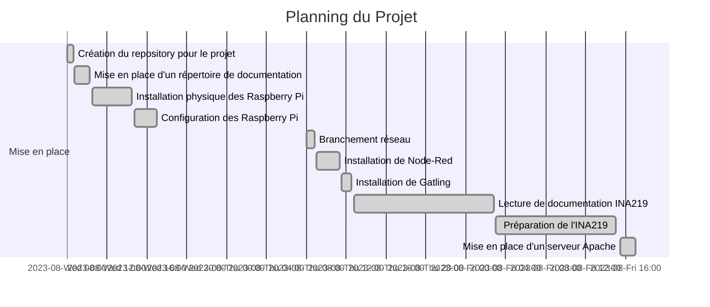
    
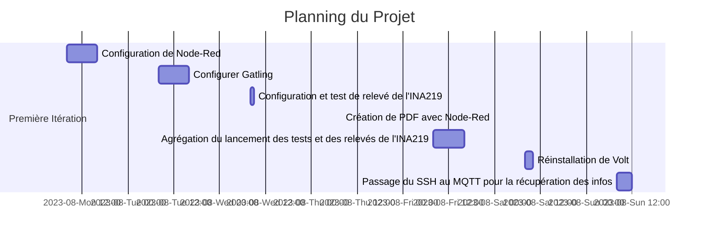
# 5. Instalation physique
## 5.1. Nidus


## 5.2. Volt


<div style="page-break-after: always;"></div>

# 6. Shéma de principe
```ascii
                    +---------+      +-------------+
                    |   Volt  |      |   Nidus     |
                    |_________|      |_____________|
                    |  RPI 4  |      |  RPI 4      |
                    |_________|      |_____________|
                    | Apache  |      | Node-RED    |
                    | No-Proc |      | Gatling     |
                    |         |      | INA219      |
                    |         |      | MQTT        |
                    +---------+      +-------------+
                        ^   |             ^   |
                        |   |             |   |
                        |   |             |   |
                        |   |             |   |
                        |   v             |   v
                    +-----------------------------+
                    |       Réseau local          |
                    +---+-------------------+-----+
                        | Dashboard Node-Red|
                        +-------------------+
                                    ^
                                    |
                                    |
                            +------------+
                            |Utilisateur |
                            +------------+

```
Explication : Actuellement le but est que Nidus offre tout les outil pour le monittoring incluant le MQTT, Node-Red, Gatling et l'INA219. Volt lui ne sert que de serveur web pour le site web. Le but est de pouvoir faire des test de charge sur le site web et de pouvoir mesurer la consommation électrique du serveur web.
De fais toute intéraction de l'utilisateur se fait avec Nidus.
Nidus envoie ses donnée de monittoring sur le serveur MQTT installé sur Nidus, et Node-Red installé sur Nidus récupère les données du serveur MQTT et les envoie dans des noeud fais pour le traiter et fournir ensuite les sortie appropié :
- Dashboard : Pour l'utilisateur
- PDF : Pour l'utilisateur
Nidus peut dans un second temps lancer des stresstest via Node-Red sur lui même et sur Volt. Il peut aussi lancer des stresstest sur Volt via Gatling.

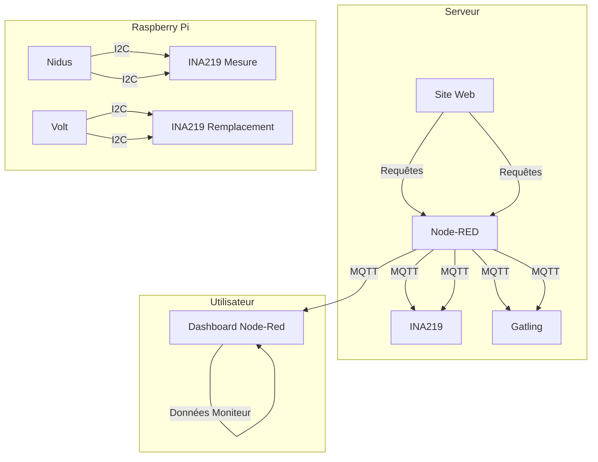

<div style="page-break-after: always;"></div>

# 7. Systèmes d'exploitation (OS)
Dans le cadre de ce projet, plusieurs systèmes d'exploitation seront utilisés. Pour commencer, nous utiliserons Ubuntu.
## 7.1. Ubuntu
Ubuntu est un système d'exploitation largement utilisé pour les serveurs et les ordinateurs de bureau. Il est livré avec un ensemble d'outils de développement et de productivité, notamment un navigateur Web, un éditeur de texte, des logiciels de programmation, des outils de calcul, des jeux et des logiciels de productivité. Ubuntu propose un environnement de bureau léger et réactif, conçu tant pour les ordinateurs de bureau que pour les serveurs.
## 7.2. Raspbian
Raspbian est un système d'exploitation libre basé sur Debian, spécialement optimisé pour le Raspberry Pi. Depuis 2015, Raspbian est livré avec un ensemble d'outils appelé Pixel. Pixel offre un environnement de bureau comprenant un navigateur Web, un éditeur de texte, des logiciels de programmation, des outils de calcul, des jeux et des logiciels de productivité. Pixel est un environnement de bureau léger et réactif, conçu spécifiquement pour les ordinateurs monocarte Raspberry Pi.
## 7.3. Première installation
Dans un premier temps, nous allons installer la version bureau d'Ubuntu sur Volt. Cette décision est motivée par le fait qu'il est plus simple de travailler dans un environnement de bureau pour tester rapidement tous les concepts du projet.

Sur Nidus, Raspbian en version bureau sera installé pour des raisons similaires à celles de Volt.

Un élément crucial à noter est que, étant donné que l'INA219 sera connecté à Nidus, il est plus pratique d'installer Raspbian sur Nidus afin d'avoir accès aux broches GPIO.

Dans un second temps, pour obtenir des mesures plus précises, nous installerons les versions « core » d'Ubuntu et de Raspbian.

Adresse IP de Volt : 157.26.228.77
Adresse IP de Nidus : 157.26.251.185


## 7.4. Seconde instalation Ubuntu Server


<div style="page-break-after: always;"></div>

### 7.4.1. Configuration post instalation
```bash
toblerc@LPT-UNIX-USB-CT:~$ ssh tobby@157.26.228.77
The authenticity of host '157.26.228.77 (157.26.228.77)' can't be established.
ED25519 key fingerprint is SHA256:/5raLlKqk0A4AnFWnLP9bagNS3zKE9rFPqn5vA5pc+M.
This key is not known by any other names
Are you sure you want to continue connecting (yes/no/[fingerprint])? yes
Warning: Permanently added '157.26.228.77' (ED25519) to the list of known hosts.
tobby@157.26.228.77's password: 
Welcome to Ubuntu 22.04.3 LTS (GNU/Linux 5.15.0-1034-raspi aarch64)

[...]

tobby@Volt:~$ ls -la
total 28> 2022 .bash_logout
-rw-r--r-- 1 tobby tobby 3771 Jan  6  2022 .bashrc
drwx------ 2 tobby tobby 4096 Aug 23 09:29 .cache
-rw-r--r-- 1 tobby tobby  807 Jan  6  2022 .profile
drwx------ 2 tobby tobby 4096 Aug 23 09:30 .ssh
tobby@Volt:~$ cd .ssh/
tobby@Volt:~/.ssh$ ls -la
total 8
drwx------ 2 tobby tobby 4096 Aug 23 09:30 .
drwxr-x--- 4 tobby tobby 4096 Aug 23 09:30 ..
-rw------- 1 tobby tobby    0 Aug 23 09:30 authorized_keys
tobby@Volt:~/.ssh$ sudo vi authorized_keys 
[sudo] password for tobby: 
tobby@Volt:~/.ssh$ exit
logout
Connection to 157.26.228.77 closed.
toblerc@LPT-UNIX-USB-CT:~$ ssh tobby@157.26.228.77
Welcome to Ubuntu 22.04.3 LTS (GNU/Linux 5.15.0-1034-raspi aarch64)

[...]

Last login: Wed Aug 23 09:30:02 2023 from 157.26.215.31
tobby@Volt:~$ sudo apt update && sudo apt upgrade -y && sudo apt dist-upgrade -y && sudo apt autzo-remove -y
[sudo] password for tobby: 
[...]
tobby@Volt:~$ sudo apt update && sudo apt upgrade -y && sudo apt dist-upgrade -y && sudo apt auto-remove -y

[...]


0 upgraded, 0 newly installed, 0 to remove and 0 not upgraded.

```
### 7.4.2. Instalation Apache
```bash
tobby@Volt:~$ sudo apt install apache2
Reading package lists... Done
Building dependency tree... Done
Reading state information... Done
The following additional packages will be installed:
  apache2-bin apache2-data apache2-utils bzip2 libapr1 li
[...]

```

```bash
toblerc@LPT-UNIX-USB-CT:~$ scp -r /home/toblerc/Documents/ES_2024/banc-de-mesures-de-la-consommation-electrique/siteWeb/www/html tobby@157.26.228.77://home/tobby
[...]   
toblerc@LPT-UNIX-USB-CT:~$ 
tobby@Volt:~$ sudo cp -r /home/tobby/html /var/www/
```
### 7.4.3. Script MQTT
```bash
toblerc@LPT-UNIX-USB-CT:~/Documents/ES_2024/banc-de-mesures-de-la-consommation-electrique$ scp ./mqtt.sh tobby@157.26.228.77:/home/tobby
mqtt.sh                                                                                                                                                                         100% 2522     1.7MB/s   00:00    
toblerc@LPT-UNIX-USB-CT:~/Documents/ES_2024/banc-de-mesures-de-la-consommation-electrique$ 
tobby@Volt:~$ sudo cp ./mqtt.sh /usr/local/bin/
tobby@Volt:~$ ls -la /usr/local/bin/
total 12
drwxr-xr-x  2 root root 4096 Aug 23 10:26 .
drwxr-xr-x 10 root root 4096 Aug  7 17:23 ..
-rw-r--r--  1 root root 2522 Aug 23 10:26 mqtt.sh
```
```bash
tobby@Volt:/usr/local/bin$ sudo ./mqtt.sh 
Installation de mosquitto-clients...
Hit:1 http://ports.ubuntu.com/ubuntu-ports jammy InRelease
Get:2 http://ports.ubuntu.com/ubuntu-ports jammy-updates InRelease [119 kB]
Hit:3 http://ports.ubuntu.com/ubuntu-ports jammy-backports InRelease
Get:4 http://ports.ubuntu.com/ubuntu-ports jammy-security InRelease [110 kB]
Fetched 229 kB in 2s (133 kB/s)    
Reading package lists... Done
Reading package lists... Done
Building dependency tree... Done
[...]

```

<div style="page-break-after: always;"></div>

# 8. Node-RED
**Node-RED** est un outil de programmation visuelle open source conçu pour faciliter la connexion de périphériques, d'API et de services en ligne. Il propose un éditeur de flux basé sur un navigateur, permettant ainsi de connecter des nœuds à l'aide de simples glisser-déposer. Ces nœuds peuvent être exécutés dans un environnement Node.js. Ils peuvent être des fonctions JavaScript ou des modules npm, tels que node-red-contrib-gpio, node-red-contrib-sqlite, node-red-contrib-modbustcp, etc. En plus des nœuds de base fournis, Node-RED offre plus de 2000 nœuds supplémentaires créés par la communauté et prêts à être utilisés.

## 8.1. Instalation
```bash
tobby@Nidus:~ $ bash <(curl -sL https://raw.githubusercontent.com/node-red/linux-installers/master/deb/update-nodejs-and-nodered)
Running Node-RED install for user tobby at /home/tobby on debian


This can take 20-30 minutes on the slower Pi versions - please wait.

  Stop Node-RED                       ✔
  Remove old version of Node-RED      ✔
  Remove old version of Node.js       ✔   
  Install Node.js 18 LTS              ✔   v18.17.1   Npm 9.6.7
  Clean npm cache                     ✔
  Install Node-RED core               ✔   3.0.2
  Move global nodes to local          -
  Npm rebuild existing nodes          ✔
  Install extra Pi nodes              ✔
  Add shortcut commands               ✔
  Update systemd script               ✔
                                      

Any errors will be logged to   /var/log/nodered-install.log
All done.
You can now start Node-RED with the command  node-red-start
  or using the icon under   Menu / Programming / Node-RED
Then point your browser to localhost:1880 or http://{your_pi_ip-address}:1880

Started :  mer 16 aoû 2023 14:12:19 CEST 
Finished:  mer 16 aoû 2023 14:16:01 CEST
 
**********************************************************************************
 ### WARNING ###
 DO NOT EXPOSE NODE-RED TO THE OPEN INTERNET WITHOUT SECURING IT FIRST
 
 Even if your Node-RED doesn't have anything valuable, (automated) attacks will
 happen and could provide a foothold in your local network
 
 Follow the guide at https://nodered.org/docs/user-guide/runtime/securing-node-red
 to setup security.
 
 ### ADDITIONAL RECOMMENDATIONS ###
  - Remove the /etc/sudoers.d/010_pi-nopasswd file to require entering your password
    when performing any sudo/root commands:
 
      sudo rm -f /etc/sudoers.d/010_pi-nopasswd
 
  - You can customise the initial settings by running:
 
      node-red admin init
 
  - After running Node-RED for the first time, change the ownership of the settings
    file to 'root' to prevent unauthorised changes:
 
      sudo chown root:root ~/.node-red/settings.js
 
**********************************************************************************
 
  Would you like to customise the settings now (y/N) ? y

Node-RED Settings File initialisation
=====================================
This tool will help you create a Node-RED settings file.

✔ Settings file · /home/tobby/.node-red/settings.js

User Security
=============
✔ Do you want to setup user security? · Yes
✔ Username · Tobby
✔ Password · ***********
✔ User permissions · full access
✔ Add another user? · Yes
✔ Username · FMA
✔ Password · ******** (Pa$$w.rd)
✔ User permissions · read-only access
✔ Add another user? · Yes
✔ Username · BVI
✔ Password · ******** (Pa$$w.rd)
✔ User permissions · read-only access
✔ Add another user? · No

Projects
========
The Projects feature allows you to version control your flow using a local git repository.

✔ Do you want to enable the Projects feature? · No

Flow File settings
==================
✔ Enter a name for your flows file · flows.json
✔ Provide a passphrase to encrypt your credentials file · 

Editor settings
===============
✔ Select a theme for the editor. To use any theme other than "default", you will need to install @node-red-contrib-themes/theme-collection in your Node-RED user directory. · dark
✔ Select the text editor component to use in the Node-RED Editor · monaco (default)

Node settings
=============
✔ Allow Function nodes to load external modules? (functionExternalModules) · Yes


Settings file written to /home/tobby/.node-red/settings.js
To use the 'dark' editor theme, remember to install @node-red-contrib-themes/theme-collection in your Node-RED user directory

tobby@Nidus:~ $ sudo systemctl enable nodered.service
Created symlink /etc/systemd/system/multi-user.target.wants/nodered.service → /lib/systemd/system/nodered.service.

```


## 8.2. Configuration
### 8.2.1. Installation des plugins


### 8.2.2. Sécurisation de Node-Red
Pour sécuriser Node-Red, il convient de modifier le fichier `settings.js`. Dans notre cas, nous utilisons la commande `node-red admin init`, ce qui permet, par exemple, de créer des paires utilisateur/mot de passe.

De plus, il est recommandé, si nécessaire, d'ajouter un login au *Dashboard*.

### 8.2.3. Suivi Git
Afin de suivre le projet sur Git, il est nécessaire de configurer un utilisateur, générer des clés SSH, puis effectuer un *clone* du projet.


Comme il s'agit d'un *clone*, il faudra ajouter les fichiers manquants et ajuster les droits d'accès.

```bash
tobby@Nidus:~/.node-red/projects/banc-de-mesures-de-la-consommation-electrique $ touch ~/.node-red/projects/banc-de-mesures-de-la-consommation-electrique/flows_cred.json
tobby@Nidus:~/.node-red/projects/banc-de-mesures-de-la-consommation-electrique $ chmod 600 ~/.node-red/projects/banc-de-mesures-de-la-consommation-electrique/flows_cred.json

```


<div style="page-break-after: always;"></div>

# 9. Gatling
**Gatling** est un outil de test de charge open source basé sur Scala, conçu pour évaluer les performances des applications et des sites Web. Gatling simule des utilisateurs virtuels qui envoient des requêtes HTTP vers le système cible. Il enregistre les temps de réponse des requêtes et les présente sous forme de graphiques. Gatling est doté d'un éditeur de scénarios basé sur navigateur, permettant aux utilisateurs de créer des scénarios de test de charge à l'aide d'un langage de domaine spécifique (DSL) appelé *Gatling DSL*. Ce langage, basé sur Scala, permet de définir des scénarios de test de charge à l'aide de mots-clés tels que `exec`, `pause`, `feed`, etc.

La version la plus récente de Gatling est la 3.9.5, compatible avec Java 8 et Java 11. Dans ce projet, nous opterons pour Java 11 pour exécuter Gatling.

## 9.1. Installation

### 9.1.1. Prerequis
```bash
tobby@Nidus:~ $ sudo apt install default-jdk
tobby@Nidus:~/.node-red $ java -version
openjdk version "11.0.18" 2023-01-17
OpenJDK Runtime Environment (build 11.0.18+10-post-Debian-1deb11u1)
OpenJDK 64-Bit Server VM (build 11.0.18+10-post-Debian-1deb11u1, mixed mode)
tobby@Nidus:~/.node-red $ 


```
### 9.1.2. Download

```bash
tobby@Nidus:~ $ mkdir .gatling
tobby@Nidus:~ $ ls -la
total 104
drwxr-xr-x 18 tobby tobby 4096 16 aoû 15:10 .
drwxr-xr-x  3 root  root  4096 16 aoû 13:58 ..

[...]

drwxr-xr-x  2 tobby tobby 4096 16 aoû 15:10 .gatling

[...]

tobby@Nidus:~ $ wget -O ~/.gatling/gatling-charts-highcharts-bundle-3.9.5-bundle.zip https://repo1.maven.org/maven2/io/gatling/highcharts/gatling-charts-highcharts-bundle/3.9.5/gatling-charts-highcharts-bundle-3.9.5-bundle.zip
--2023-08-16 15:12:41--  https://repo1.maven.org/maven2/io/gatling/highcharts/gatling-charts-highcharts-bundle/3.9.5/gatling-charts-highcharts-bundle-3.9.5-bundle.zip
Résolution de repo1.maven.org (repo1.maven.org)… 146.75.116.209, 2a04:4e42:8d::209
Connexion à repo1.maven.org (repo1.maven.org)|146.75.116.209|:443… connecté.
requête HTTP transmise, en attente de la réponse… 200 OK
Taille : 77080673 (74M) [application/zip]
Sauvegarde en : « /home/tobby/.gatling/gatling-charts-highcharts-bundle-3.9.5-bundle.zip »

/home/tobby/.gatling/gatling-charts-highcharts-bundl 100%[====================================================================================================================>]  73.51M  11.0MB/s    ds 5.8s    

2023-08-16 15:12:47 (12.8 MB/s) — « /home/tobby/.gatling/gatling-charts-highcharts-bundle-3.9.5-bundle.zip » sauvegardé [77080673/77080673]

tobby@Nidus:~ $ unzip ~/.gatling/gatling-charts-highcharts-bundle-3.9.5-bundle.zip -d ~/.gatling/
Archive:  /home/tobby/.gatling/gatling-charts-highcharts-bundle-3.9.5-bundle.zip

[...]

  inflating: /home/tobby/.gatling/gatling-charts-highcharts-bundle-3.9.5/LICENSE  
tobby@Nidus:~ $ cd .gatling/
tobby@Nidus:~/.gatling $ ls -la
total 75288
drwxr-xr-x  3 tobby tobby     4096 16 aoû 15:12 .
drwxr-xr-x 18 tobby tobby     4096 16 aoû 15:10 ..
drwxr-xr-x  7 tobby tobby     4096 10 mai 11:19 gatling-charts-highcharts-bundle-3.9.5
-rw-r--r--  1 tobby tobby 77080673 10 mai 11:19 gatling-charts-highcharts-bundle-3.9.5-bundle.zip
tobby@Nidus:~/.gatling $ cd gatling-charts-highcharts-bundle-3.9.5/
tobby@Nidus:~/.gatling/gatling-charts-highcharts-bundle-3.9.5 $ ls -la
total 48
drwxr-xr-x 7 tobby tobby  4096 10 mai 11:19 .
drwxr-xr-x 3 tobby tobby  4096 16 aoû 15:12 ..
drwxr-xr-x 2 tobby tobby  4096 10 mai 11:19 bin
drwxr-xr-x 2 tobby tobby  4096 10 mai 11:19 conf
drwxr-xr-x 2 tobby tobby 12288 10 mai 11:19 lib
-rw-r--r-- 1 tobby tobby 11367 10 mai 11:19 LICENSE
drwxr-xr-x 2 tobby tobby  4096 10 mai 11:19 results
drwxr-xr-x 5 tobby tobby  4096 10 mai 11:19 user-files
```
## 9.2. Vérification de l'installation
```bash
tobby@Nidus:~/.gatling/gatling-charts-highcharts-bundle-3.9.5/bin $ ./gatling.sh
GATLING_HOME is set to /home/tobby/.gatling/gatling-charts-highcharts-bundle-3.9.5
Do you want to run the simulation locally, on Gatling Enterprise, or just package it?
Type the number corresponding to your choice and press enter
[0] <Quit>
[1] Run the Simulation locally
[2] Package and upload the Simulation to Gatling Enterprise Cloud, and run it there
[3] Package the Simulation for Gatling Enterprise
[4] Show help and exit
1
août 16, 2023 4:28:28 PM java.util.prefs.FileSystemPreferences$1 run
INFO: Created user preferences directory.
computerdatabase.ComputerDatabaseSimulation is the only simulation, executing it.
Select run description (optional)
InstallVerif
Simulation computerdatabase.ComputerDatabaseSimulation started...

[...]

Simulation computerdatabase.ComputerDatabaseSimulation completed in 17 seconds
Parsing log file(s)...
Parsing log file(s) done
Generating reports...

================================================================================
---- Global Information --------------------------------------------------------
> request count                                        108 (OK=105    KO=3     )
> min response time                                    108 (OK=108    KO=111   )
> max response time                                   1563 (OK=1563   KO=114   )
> mean response time                                   162 (OK=163    KO=112   )
> std deviation                                        168 (OK=170    KO=1     )
> response time 50th percentile                        115 (OK=115    KO=112   )
> response time 75th percentile                        120 (OK=121    KO=113   )
> response time 95th percentile                        351 (OK=352    KO=114   )
> response time 99th percentile                        620 (OK=620    KO=114   )
> mean requests/sec                                  6.353 (OK=6.176  KO=0.176 )
---- Response Time Distribution ------------------------------------------------
> t < 800 ms                                           104 ( 96%)
> 800 ms <= t < 1200 ms                                  0 (  0%)
> t >= 1200 ms                                           1 (  1%)
> failed                                                 3 (  3%)
---- Errors --------------------------------------------------------------------
> status.find.is(201), but actually found 200                         3 (100,0%)
================================================================================

Reports generated in 0s.
Please open the following file: file:///home/tobby/.gatling/gatling-charts-highcharts-bundle-3.9.5/results/computerdatabasesimulation-20230816142907884/index.html
```
## 9.3. Scripts
Pour Gatling, j'ai d'abord choisi le Java comme language de programmation mais je me suis tournée ensuite vers le Scala car il est plus adapté à Gatling. J'ai donc créé un script Scala qui permet de faire un test de charge sur le site web. Ce script est très simple, il se contente de faire une requête GET sur la page d'accueil du site web. Il est possible de modifier le nombre d'utilisateur et le temps de test dans le script. J'ai aussi créé un script bash qui permet de lancer le script Scala. 

```scala
import io.gatling.core.Predef._
import io.gatling.http.Predef._
import scala.concurrent.duration._

class CuriusTRex_Bash extends Simulation {

  val httpProtocol = http
    .baseUrl("http://volt.s2.rpn.ch")
    .inferHtmlResources()
    .acceptHeader("image/avif,image/webp,*/*")
    .acceptEncodingHeader("gzip, deflate")
    .acceptLanguageHeader("fr,fr-FR;q=0.8,en-US;q=0.5,en;q=0.3")
    .userAgentHeader("Mozilla/5.0 (X11; Ubuntu; Linux x86_64; rv:109.0) Gecko/20100101 Firefox/114.0")

  val headers_0 = Map(
    "Accept" -> "text/css,*/*;q=0.1",
    "If-Modified-Since" -> "Thu, 17 Aug 2023 08:18:41 GMT",
    "If-None-Match" -> "\"dc3-6031a0f5b4a47-gzip\""
  )

  val headers_1 = Map(
    "Accept" -> "text/html,application/xhtml+xml,application/xml;q=0.9,image/avif,image/webp,*/*;q=0.8",
    "Upgrade-Insecure-Requests" -> "1"
  )

  val headers_4 = Map(
    "If-Modified-Since" -> "Thu, 17 Aug 2023 07:26:33 GMT",
    "If-None-Match" -> "\"164ac-6031954e8df3b\""
  )

  val headers_6 = Map(
    "If-Modified-Since" -> "Thu, 17 Aug 2023 07:26:33 GMT",
    "If-None-Match" -> "\"14c4c-6031954e8cf9b\""
  )

  val headers_7 = Map(
    "Accept" -> "text/html,application/xhtml+xml,application/xml;q=0.9,image/avif,image/webp,*/*;q=0.8",
    "If-Modified-Since" -> "Thu, 17 Aug 2023 08:08:51 GMT",
    "If-None-Match" -> "\"2129-60319ec28bede-gzip\"",
    "Upgrade-Insecure-Requests" -> "1"
  )

  val scn = scenario("CuriusTRex")
    .exec(
      http("request_0")
        .get("/styles.css")
        .headers(headers_0)
    )
    // Start
    .exec(
      http("request_1")
        .get("/contact.html")
        .headers(headers_1)
    )
    .exec(
      http("request_2")
        .get("/about.html")
        .headers(headers_1)
        .resources(
          http("request_3")
            .get("/capture/Home.jpg"),
          http("request_4")
            .get("/capture/Test_Complet.jpg")
            .headers(headers_4),
          http("request_5")
            .get("/capture/Donn%C3%A9es.jpg"),
          http("request_6")
            .get("/capture/Test.jpg")
            .headers(headers_6)
        )
    )
    .exec(
      http("request_7")
        .get("/about.html")
        .headers(headers_7)
    )
   .exec(flushHttpCache)
   .exec(flushSessionCookies)
   .exec(flushCookieJar)

val nbUsers = java.lang.Long.getLong("users", 1).toDouble
val myRamp = java.lang.Long.getLong("ramp", 0)
println(s"Nombre d'utilisateurs : $nbUsers")
println(s"Temps de montée : $myRamp")

  setUp(scn.inject(constantUsersPerSec(nbUsers).during(myRamp seconds))).protocols(httpProtocol)
}

```

<div style="page-break-after: always;"></div>

# 10. Apache et Site Web
## 10.1. Installation
```bash
sudo apt install apache2
sudo systemctl status apache2
sudo systemctl enable apache2
```
## 10.2. Mise en place d'un site Web
J'ai créee un site web très simple reprenant le readme du projet. Et il comporte trois pages ainsi que du CSS.
```bash
scp -r /home/toblerc/Documents/ES_2024/banc-de-mesures-de-la-consommation-electrique/siteWeb/www/html tobby@Volt:/var/www/html/
```

<div style="page-break-after: always;"></div>

# 11. MQTT
Dans notre cas, j'ai l'intention d'utiliser MQTT pour transmettre les données de consommation à Node-Red. En contournant le transfert de requêtes via SSH et l'utilisation de clés SSH, MQTT permet de gagner en performances et en sécurité. En termes de performances, MQTT est considérablement plus léger que SSH, environ dix fois plus léger.
## 11.1. Installation de Mosquitto sur Nidus
```bash
tobby@Nidus:~/.ssh $ sudo apt install mosquitto
Lecture des listes de paquets... Fait
[...]
tobby@Nidus:~/.ssh $ sudo systemctl status mosquitto
● mosquitto.service - Mosquitto MQTT Broker
     Loaded: loaded (/lib/systemd/system/mosquitto.service; enabled; vendor preset: enabled)
     Active: active (running) since Tue 2023-08-22 16:01:58 CEST; 7s ago
       Docs: man:mosquitto.conf(5)
             man:mosquitto(8)
    Process: 22571 ExecStartPre=/bin/mkdir -m 740 -p /var/log/mosquitto (code=exited, status=0/SUCCESS)
    Process: 22572 ExecStartPre=/bin/chown mosquitto /var/log/mosquitto (code=exited, status=0/SUCCESS)
    Process: 22573 ExecStartPre=/bin/mkdir -m 740 -p /run/mosquitto (code=exited, status=0/SUCCESS)
    Process: 22574 ExecStartPre=/bin/chown mosquitto /run/mosquitto (code=exited, status=0/SUCCESS)
   Main PID: 22575 (mosquitto)
      Tasks: 1 (limit: 3933)
        CPU: 42ms
     CGroup: /system.slice/mosquitto.service
             └─22575 /usr/sbin/mosquitto -c /etc/mosquitto/mosquitto.conf

aoû 22 16:01:58 Nidus systemd[1]: Starting Mosquitto MQTT Broker...
aoû 22 16:01:58 Nidus systemd[1]: Started Mosquitto MQTT Broker.
```
## 11.2. Ouverture des port sur Nidus
Modifier le fichier de conf comme suit :
```bash
tobby@Nidus:~ $ sudo vim /etc/mosquitto/mosquitto.conf
tobby@Nidus:~ $ sudo cat /etc/mosquitto/mosquitto.conf 
# Place your local configuration in /etc/mosquitto/conf.d/
#
# A full description of the configuration file is at
# /usr/share/doc/mosquitto/examples/mosquitto.conf.example

pid_file /run/mosquitto/mosquitto.pid

persistence true
persistence_location /var/lib/mosquitto/

log_dest file /var/log/mosquitto/mosquitto.log

include_dir /etc/mosquitto/conf.d

listener 1883
allow_anonymous true
```

<div style="page-break-after: always;"></div>

## 11.3. Script MQTT
J'ai élaboré un script MQTT sophistiqué, conçu pour publier efficacement les données de consommation sur le broker MQTT. Ce script, au démarrage de la machine, entreprend un fonctionnement en boucle continue, garantissant la collecte et la publication régulières de ces données. L'objectif est d'optimiser les performances tout en garantissant la fiabilité du processus.
### 11.3.1. Script
```sh
#!/bin/bash
### BEGIN INIT INFO
# Provides:          mqtt
# Required-Start:    $remote_fs $syslog
# Required-Stop:     $remote_fs $syslog
# Default-Start:     2 3 4 5
# Default-Stop:      0 1 6
# Short-Description: Script MQTT de collecte de données
# Description:       Ce script collecte la charge CPU, la charge RAM
#                    et le nombre de processus, puis publie ces données
#                    sur un broker MQTT.
### END INIT INFO

# Pour ajouter les droits d'exécution : 
# chmod +x mqtt.sh
# Pour le copier depuis Nidus vers Volt :
# scp ./mqtt.sh tobby@volt:/usr/local/bin/mqtt.sh
# Emplacement du script (doit être dans /usr/local/bin)
INSTALL_DIR="/usr/local/bin"
# Nom du script
SCRIPT_NAME="mqtt.sh"
# Adresse du broker MQTT
MQTT_BROKER="nidus"
# Sujets MQTT pour les différentes données
MQTT_TOPIC_CPU="benchmark/cpu"
MQTT_TOPIC_RAM="benchmark/ram"
MQTT_TOPIC_PROCESSES="benchmark/processes"

# Vérification si le script est dans le bon dossier d'installation
if [ "$(dirname "$(readlink -f "$0")")" != "$INSTALL_DIR" ]; then
    echo "Erreur : Le script doit être installé dans $INSTALL_DIR"
    exit 1
fi

# Vérification et installation des dépendances (mosquitto-clients)
if ! command -v mosquitto_pub &> /dev/null; then
    echo "Installation de mosquitto-clients..."
    sudo apt-get update
    sudo apt-get install mosquitto-clients
    echo "Installation terminée."
fi

# Vérification si le lien symbolique vers init.d existe
if [ ! -e "/etc/init.d/$SCRIPT_NAME" ]; then
    echo "Création du lien symbolique dans /etc/init.d..."
    sudo ln -s "$INSTALL_DIR/$SCRIPT_NAME" "/etc/init.d/$SCRIPT_NAME"
    echo "Lien symbolique créé."
fi

# Vérification et activation du service init.d
if ! sudo service "$SCRIPT_NAME" status &> /dev/null; then
    echo "Activation du service..."
    sudo update-rc.d "$SCRIPT_NAME" defaults
    echo "Service activé."
fi

# Boucle principale pour la collecte et la publication des données
while true; do
    # Collecte des données
    CPU_LOAD=$(top -bn1 | grep "Cpu(s)" | awk '{print $2 + $4}')
    RAM_LOAD=$(free | awk '/Mem/{printf("%.2f\n", $3/$2*100)}')
    PROCESS_COUNT=$(ps aux | wc -l)

    # Publication des données sur MQTT
    mosquitto_pub -h $MQTT_BROKER -t $MQTT_TOPIC_CPU -m "$CPU_LOAD"
    mosquitto_pub -h $MQTT_BROKER -t $MQTT_TOPIC_RAM -m "$RAM_LOAD"
    mosquitto_pub -h $MQTT_BROKER -t $MQTT_TOPIC_PROCESSES -m "$PROCESS_COUNT"

    echo "Données publiées sur MQTT"

    sleep 1  # Attente d'une seconde
done
```
### 11.3.2. Description détaillée du script
Le script commence par vérifier si l'emplacement d'installation est correct, s'assurant qu'il est placé dans le répertoire défini par **INSTALL_DIR**. Ensuite, il vérifie la présence et l'installation des dépendances requises, notamment **mosquitto-clients**, en l'installant si nécessaire.

Une autre vérification importante concerne l'existence d'un lien symbolique vers **/etc/init.d**, qui est nécessaire pour exécuter le script au démarrage de la machine. Si le lien symbolique n'existe pas, le script le crée.

Ensuite, le script s'assure que le service init.d correspondant est activé. Si ce n'est pas le cas, il active le service en utilisant la commande **update-rc.d**.

La section la plus importante du script est la boucle principale, où les données de consommation sont collectées et publiées en continu sur le broker MQTT. Pour chaque itération de la boucle, les taux de charge CPU, de charge RAM et le nombre de processus en cours sont mesurés et enregistrés.

Ces données sont ensuite publiées sur le broker MQTT à l'aide de la commande **mosquitto_pub**. Chaque type de données est publié sur un sujet MQTT spécifique (**$MQTT_TOPIC_CPU**, **$MQTT_TOPIC_RAM**, **$MQTT_TOPIC_PROCESSES**), ce qui permet de les organiser de manière claire.

Le script affiche également un message indiquant que les données ont été publiées sur MQTT, et ensuite attend une seconde avant de reprendre une nouvelle itération de la boucle.

### 11.3.3. Conclusion
Ce script MQTT élaboré et bien structuré offre un moyen efficace de collecter et de publier les données de consommation sur le broker **MQTT**. Son fonctionnement en boucle continue, combiné à des vérifications et des actions préliminaires, garantit une gestion fiable et optimisée des données, contribuant ainsi à la réussite globale du projet.

## 11.4. Installation
```bash
toblerc@LPT-UNIX-USB-CT:~/Documents/ES_2024/banc-de-mesures-de-la-consommation-electrique$ scp ./mqtt.sh tobby@volt:/usr/local/bin/mqtt.sh
mqtt.sh                                                                                                                                                                         100% 2526     2.1MB/s   00:00 
```
## 11.5. Utilisation du script
```bash
tobby@Volt:/usr/local/bin$ sudo ./mqtt.sh
Installation de mosquitto-clients...
[...]
Il est nécessaire de prendre 136 ko dans les archives.
Après cette opération, 568 ko d'espace disque supplémentaires seront utilisés.
Souhaitez-vous continuer ? [O/n] O
[...]
Installation terminée.
Création du lien symbolique dans /etc/init.d...
Lien symbolique créé.
Activation du service...
Service activé.
```

### 11.5.1. Vérification


<div style="page-break-after: always;"></div>

# 12. INA219

Dans ce chapitre, nous explorerons la puce **INA219**, qui joue un rôle essentiel dans la mesure de la consommation. Il est important de noter que nous utilisons deux puces INA219 dans ce projet : l'une pour la mesure proprement dite et l'autre en tant que pièce de rechange en cas de problème. Pour les différencier, nous avons effectué des soudures pour attribuer des adresses I2C spécifiques à chaque puce. L'adresse de la puce de mesure est réglée sur *0x40*, tandis que l'adresse de la puce de remplacement est réglée sur *0x41*.

### 12.0.1. Installation physique

L'installation physique du **INA219** implique des branchements spécifiques en fonction des scénarios : avec ou sans le dispositif Volt. Voici les détails de chaque configuration :

#### 12.0.1.1. Branchement SANS VOLT


#### 12.0.1.2. Branchement AVEC VOLT

Le branchement avec le dispositif Volt ajoute une complexité supplémentaire. Voici un aperçu détaillé de ce branchement :


### 12.0.2. Vérification de la présence du INA219

Avant de pouvoir commencer à utiliser le **INA219** pour mesurer la consommation, il est crucial de vérifier la présence de la puce et de s'assurer qu'elle est correctement détectée par le système. Cette étape est essentielle pour garantir des mesures précises et fiables tout au long du projet.

```bash
tobby@Nidus:~ $ sudo i2cdetect -y 1
     0  1  2  3  4  5  6  7  8  9  a  b  c  d  e  f
00:                         -- -- -- -- -- -- -- -- 
10: -- -- -- -- -- -- -- -- -- -- -- -- -- -- -- -- 
20: -- -- -- -- -- -- -- -- -- -- -- -- -- -- -- -- 
30: -- -- -- -- -- -- -- -- -- -- -- -- -- -- -- -- 
40: 40 -- -- -- -- -- -- -- -- -- -- -- -- -- -- -- 
50: -- -- -- -- -- -- -- -- -- -- -- -- -- -- -- -- 
60: -- -- -- -- -- -- -- -- -- -- -- -- -- -- -- -- 
70: -- -- -- -- -- -- -- --         

tobby@Nidus:~ $ sudo i2cdetect -y 1
     0  1  2  3  4  5  6  7  8  9  a  b  c  d  e  f
00:                         -- -- -- -- -- -- -- -- 
10: -- -- -- -- -- -- -- -- -- -- -- -- -- -- -- -- 
20: -- -- -- -- -- -- -- -- -- -- -- -- -- -- -- -- 
30: -- -- -- -- -- -- -- -- -- -- -- -- -- -- -- -- 
40: -- 41 -- -- -- -- -- -- -- -- -- -- -- -- -- -- 
50: -- -- -- -- -- -- -- -- -- -- -- -- -- -- -- -- 
60: -- -- -- -- -- -- -- -- -- -- -- -- -- -- -- -- 
70: -- -- -- -- -- -- -- --    
```
## 12.1. Obtention des données
### 12.1.1. Test avec le script python A vide 
Instalation de la bibliothèque python
```bash
tobby@Nidus:~ $ sudo pip3 install pi-ina219
Looking in indexes: https://pypi.org/simple, https://www.piwheels.org/simple
Collecting pi-ina219
  Downloading pi_ina219-1.4.1-py2.py3-none-any.whl (10 kB)
Collecting Adafruit-GPIO
  Downloading https://www.piwheels.org/simple/adafruit-gpio/Adafruit_GPIO-1.0.3-py3-none-any.whl (38 kB)
Collecting mock
  Downloading https://www.piwheels.org/simple/mock/mock-5.1.0-py3-none-any.whl (30 kB)
Collecting adafruit-pureio
  Downloading https://www.piwheels.org/simple/adafruit-pureio/Adafruit_PureIO-1.1.11-py3-none-any.whl (10 kB)
Requirement already satisfied: spidev in /usr/lib/python3/dist-packages (from Adafruit-GPIO->pi-ina219) (3.5)
Installing collected packages: adafruit-pureio, mock, Adafruit-GPIO, pi-ina219
Successfully installed Adafruit-GPIO-1.0.3 adafruit-pureio-1.1.11 mock-5.1.0 pi-ina219-1.4.1
```
Vérification de la présence de l'INA219
```
tobby@Nidus:~ $ i2cdetect -y 1
     0  1  2  3  4  5  6  7  8  9  a  b  c  d  e  f
00:                         -- -- -- -- -- -- -- -- 
10: -- -- -- -- -- -- -- -- -- -- -- -- -- -- -- -- 
20: -- -- -- -- -- -- -- -- -- -- -- -- -- -- -- -- 
30: -- -- -- -- -- -- -- -- -- -- -- -- -- -- -- -- 
40: 40 -- -- -- -- -- -- -- -- -- -- -- -- -- -- -- 
50: -- -- -- -- -- -- -- -- -- -- -- -- -- -- -- -- 
60: -- -- -- -- -- -- -- -- -- -- -- -- -- -- -- -- 
70: -- -- -- -- -- -- -- --      
``` 
Création du script python
```bash
tobby@Nidus:~/Documents $ mkdir py
tobby@Nidus:~/Documents $ cd py
tobby@Nidus:~/Documents/py $ touch my_ina219.py
tobby@Nidus:~/Documents/py $ ls -la
total 8
drwxr-xr-x 2 tobby tobby 4096 22 aoû 10:19 .
drwxr-xr-x 3 tobby tobby 4096 22 aoû 10:18 ..
-rw-r--r-- 1 tobby tobby    0 22 aoû 10:19 my_ina219.py
tobby@Nidus:~/Documents/py $ sudo vi ./my_ina219.py
``` 
```python
#!/usr/bin/env python
from ina219 import INA219
from ina219 import DeviceRangeError

SHUNT_OHMS = 0.1


def read():
    ina = INA219(SHUNT_OHMS)
    ina.configure()

    print("Bus Voltage: %.3f V" % ina.voltage())
    try:
        print("Bus Current: %.3f mA" % ina.current())
        print("Power: %.3f mW" % ina.power())
        print("Shunt voltage: %.3f mV" % ina.shunt_voltage())
    except DeviceRangeError as e:
        # Current out of device range with specified shunt resistor
        print(e)


if __name__ == "__main__":
    read()
```
Execution du script
```bash
tobby@Nidus:~/Documents/py $ python ./my_ina219.py 
Bus Voltage: 0.888 V
Bus Current: -0.195 mA
Power: 0.000 mW
Shunt voltage: -0.010 mV
```

<div style="page-break-after: always;"></div>

# 13. Noeud Node-Red

## 13.1. INA219

Dans cette section, nous explorons le composant **INA219**, un élément clé de notre projet. L'**INA219** est équipé de deux sorties qui fournissent des valeurs en milliampères et en volts, offrant ainsi des informations cruciales sur la consommation.

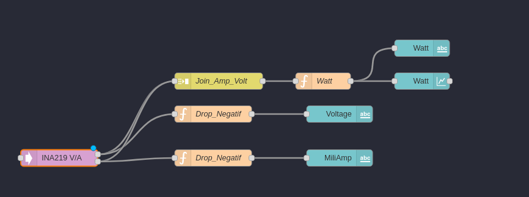


Pour tirer le meilleur parti de l'INA219, j'ai mis en place une configuration sophistiquée. J'ai configuré des nœuds de fonctions spécifiques pour exclure les valeurs négatives. Ces valeurs négatives sont généralement des erreurs de lecture et doivent être traitées correctement pour garantir des données précises. Ensuite, j'ai élaboré une séquence de traitement pour afficher ces valeurs de manière compréhensible dans un libellé.

En plus de cela, j'ai mis en place un nœud "join" qui joue un rôle crucial. Ce nœud fusionne les deux valeurs obtenues à partir des sorties de l'INA219 en un seul message cohérent. Ce message est ensuite acheminé vers un autre nœud de fonction spécialisé. Ce nœud effectue des calculs complexes pour obtenir les données de consommation en watts. Ces données sont ensuite affichées à la fois dans un libellé, offrant une visualisation claire des résultats, et dans un graphique, permettant une compréhension visuelle de l'évolution de la consommation.


```javascript
// Récupérer les valeurs de courant (mA) et de tension (V) depuis les propriétés msg.payload
var current_mA = msg.payload.miliamps;
var voltage_V = msg.payload.voltage;

// Calculer la puissance en watts (W)
var power_W = (current_mA / 1000) * voltage_V;  // Convertir le courant en ampères

// Vérifier si la tension est négative
if (voltage_V < 0.5) {
    // Si la tension est négative, ne rien faire et retourner le message inchangé
    return null;
}

// Créer un nouvel objet msg avec la puissance en watts comme payload
msg.payload = power_W;
msg.topic = "Watt";
// Renvoyer le message modifié
return msg;
```
## 13.2. Monitoring

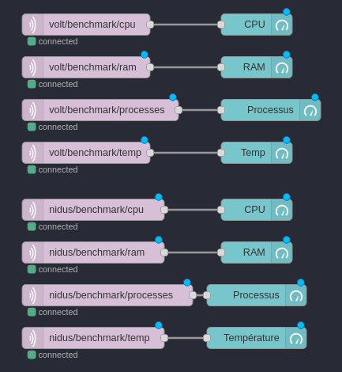


Dans cette section, nous abordons le **Monitoring**, une étape cruciale de notre projet. Pour cette tâche, j'ai choisi d'utiliser le protocole **MQTT**, qui présente des avantages significatifs en termes de rapidité et de légèreté par rapport au **SSH**.

En commençant par la réception des données via le nœud MQTT, celles-ci sont dirigées vers un nœud de type "gauge" (_jauge_) qui affiche la valeur en temps réel. Cette représentation visuelle offre une vue instantanée de la consommation, permettant une surveillance efficace.

<div style="page-break-after: always;"></div>

## 13.3. Dashboard

Le **Dashboard**, en tant que centre de contrôle essentiel, rassemble tous les éléments nécessaires pour une visualisation optimale des données générées.

Il met à disposition un ensemble complet de nœuds spécifiques, créant une interface utilisateur intuitive et interactive. Ces nœuds proposent une gamme variée de fonctionnalités pour présenter, ajuster et transmettre les données. Voici quelques exemples des nœuds qui contribuent à cette expérience :

- **Bouton (_Button_) :** Permet aux utilisateurs d'interagir et de déclencher des actions de manière directe.

- **Liste déroulante (_Dropdown_) :** Offre un moyen de sélectionner parmi plusieurs options, permettant un contrôle structuré des paramètres ou des valeurs.

- **Interrupteur (_Switch_) :** Fournit une transition immédiate entre deux états, souvent utilisé pour activer ou désactiver des fonctionnalités.

- **Curseur (_Slider_) :** Permet un réglage précis d'une valeur numérique en glissant un curseur. Utile pour ajuster des paramètres continus.

- **Champ numérique (_Numeric_) :** Fournit une interface pour entrer des valeurs numériques avec précision.

- **Champ de texte (_Text input_) :** Permet aux utilisateurs d'entrer du texte, généralement pour des commentaires, des descriptions ou des valeurs personnalisées.

- **Sélecteur de date (_Date picker_) :** Facilite la sélection de dates et d'heures, souvent utilisé pour des enregistrements horodatés.

- **Sélecteur de couleur (_Colour picker_) :** Permet de choisir précisément une couleur pour des éléments visuels ou des codes couleur.

- **Formulaire (_Form_) :** Regroupe plusieurs champs de saisie et de contrôle en une entité logique, simplifiant ainsi la collecte de données.

- **Texte (_Text_) :** Affiche du texte ou des instructions pour guider l'utilisateur dans l'interprétation des données ou l'utilisation de l'interface.

- **Jauge (_Gauge_) :** Présente graphiquement une valeur numérique, offrant une visualisation rapide d'un état ou d'une mesure.

- **Graphique (_Chart_) :** Permet la création de divers types de graphiques pour illustrer visuellement les tendances et les relations entre les données.

- **Sortie audio (_Audio out_) :** Peut être utilisée pour fournir des commentaires auditifs ou des alertes sonores.

- **Notification (_Notification_) :** Affiche des messages d'information ou d'alerte à l'utilisateur pour des événements spécifiques.

- **Contrôle d'interface utilisateur (_UI control_) :** Offre des éléments interactifs personnalisables pour répondre aux besoins spécifiques de l'application.

- **Modèle (_Template_) :** Permet d'intégrer du contenu HTML personnalisé, offrant une flexibilité avancée pour inclure graphiques, widgets et plus encore.

Ces nœuds apportent un ensemble puissant d'outils pour la création d'interfaces visuelles riches, éliminant la nécessité d'une programmation manuelle pour chaque élément. Cela encourage la collaboration efficace entre les développeurs et les utilisateurs non techniques dans la conception d'interfaces utilisateur conviviales et informatives.

## 13.4. PDF
### 13.4.1. Base
Pour generer un PDF, il faut passer un Json dans le payload du message :
```json
  {
  "_msgid":"b63574aa110e9d9b"
  ,"payload":
      {
      "content":
        [
        "First paragraph",
        "Another paragraph, this time a little bit longer to make sure, this line will be divided into at least two lines"
        ]
      },
      "topic":""
  }
```
Qui est reçu dans le noeud pdfmake qui le passe en Base64 qui est ensuite reçu dans le noeud write file qui l'écrit dans un fichier PDF.

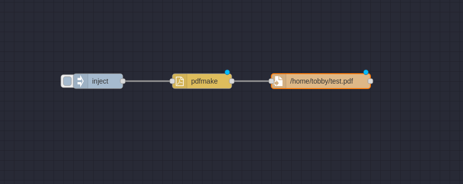

## 13.5. Images de graphiques et de tableaux
Une fois que la génération de PDF est maîtrisée, il est temps de valoriser davantage les informations en y ajoutant des images.

En effet, bien que disposer des valeurs à un instant donné soit utile, pouvoir visualiser ces valeurs sous forme de graphique est encore plus puissant. Pour réaliser cela, nous utiliserons le nœud **node-red-contrib-chart-image**, qui nous permettra de générer des graphiques. Ce nœud repose sur le module **Chart.js**, qui permet de créer des graphiques en utilisant du code JavaScript.

En plus du nœud de graphique, nous aurons besoin du nœud **node-red-node-base64**, qui facilitera la conversion d'images en base64 et vice versa. Cette conversion est essentielle pour intégrer les images dans le document PDF.

Cette combinaison de nœuds nous permettra de créer des représentations visuelles attrayantes et informatives des données, offrant ainsi une compréhension plus approfondie et une présentation visuellement engageante.

<div style="page-break-after: always;"></div>

# 14. Stress Test V1.0

J'ai créé une page qui permet de générer un rapport en fonction de la durée et de l'exécution d'un stress test sur Nidus et/ou sur Volt. Voici le flux complet pour la génération du rapport:

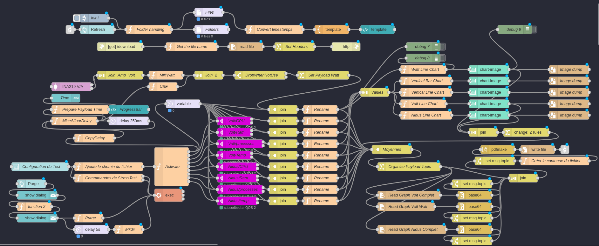


Pour être honnête, il faut admettre que la lisibilité initiale n'est pas optimale. Par conséquent, j'ai décidé de décomposer le processus en plusieurs étapes afin d'obtenir une meilleure compréhension globale.

## 14.1. Écran d'Accueil

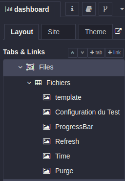

Au premier abord, vous serez accueilli par un navigateur de fichiers et un formulaire. Ce formulaire vous permet de spécifier la durée du test et de décider si vous souhaitez exécuter un test de stress sur Nidus et/ou sur Volt. Voici le contenu de la page "file" qui contient le formulaire:

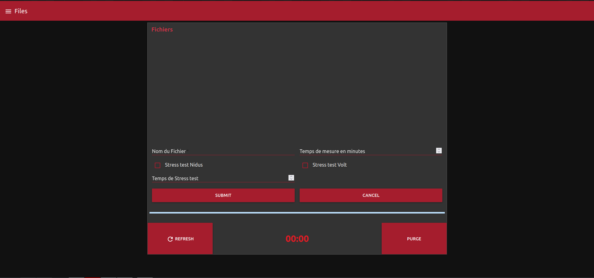

Après avoir rempli le formulaire:

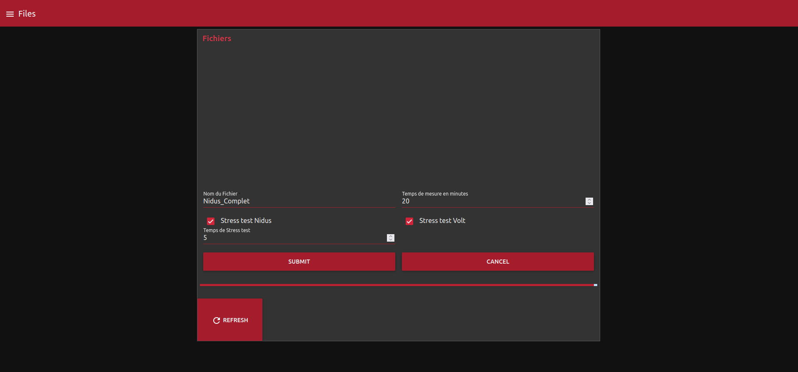

Les nœuds responsables de cette section sont les suivants:

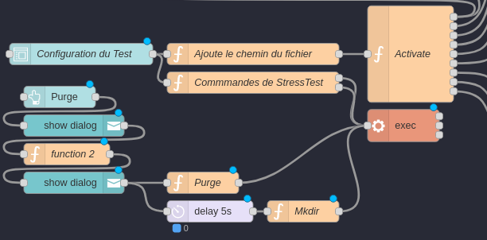


Deux éléments se distinguent ici:
- Un formulaire de "Configuration du Test"
- Un bouton "Purge" dont nous discuterons ultérieurement

Le formulaire recueille les données saisies par l'utilisateur. Ensuite, il transmet ces données en sortie. Deux fonctions sont connectées à cette sortie. La première fonction ajoute les chemins des fichiers, tels que "chart.png" et "report.pdf", à un tableau. La seconde fonction gère l'exécution des tests de stress en fonction des entrées de l'utilisateur, et les envoie ensuite à un nœud "exec" qui exécute les commandes sur Nidus et/ou Volt.

La première fonction transmet ensuite les données à une fonction à sorties multiples, ce qui permet d'envoyer différents messages distincts.

## 14.2. En Exécution

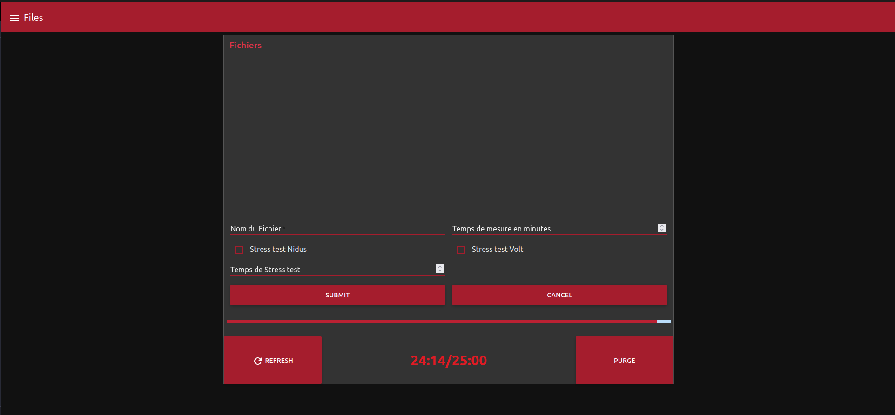

Pendant l'exécution, une **barre de progression** est affichée pour montrer l'avancement du test, accompagnée d'une **étiquette** en dessous pour indiquer le pourcentage d'avancement. Cela permet d'obtenir une meilleure visualisation de l'état d'avancement.

En arrière-plan, un certain nombre de tâches se déroulent :

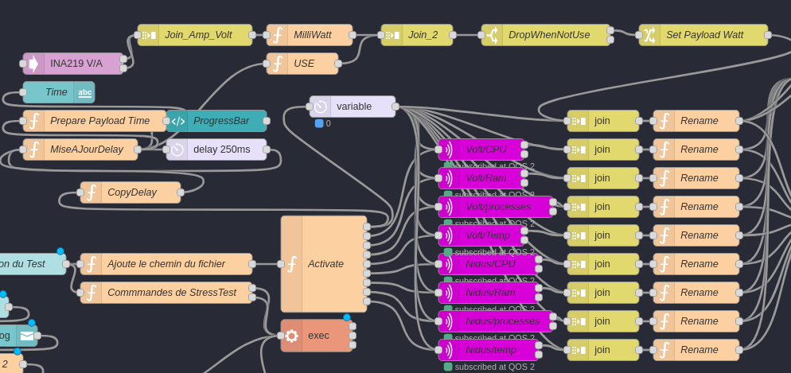


Pour en donner plus de détails :
- La première sortie du nœud **Activate** est connectée à un nœud **delay** qui ajuste la durée du test, ainsi qu'à une série d'autres nœuds qui gèrent la barre de progression.
- La deuxième sortie du nœud **Activate** est reliée à un nœud MQTT amélioré. Celui-ci permet de souscrire aux **topics** appropriés. Au début du test, il souscrit au topic `#/benchmark/#`, puis à la fin du test, il reçoit le topic `/` pour se désinscrire. Cela permet de filtrer uniquement les informations nécessaires et d'éviter d'être submergé par les messages superflus envoyés sur le broker MQTT.
- Les six autres sorties du nœud **Activate** ont la même fonction. Elles envoient toutes des messages pour modifier le topic MQTT.

Ensuite, ces messages sont acheminés vers un nœud **join**, qui les combine en un tableau de messages. Ce tableau est ensuite transmis à un nœud **function** chargé de traiter les données. Parmi les tâches effectuées par ce nœud figurent la personnalisation des **topics** pour chaque ensemble de données et le calcul de la moyenne des valeurs reçues :
```javascript
// Définir le sujet du message
msg.topic = "volt/benchmark/cpu";

// Vérifier si le tableau payload existe et n'est pas vide
if (msg.payload && Array.isArray(msg.payload) && msg.payload.length > 0) {
    // Convertir les valeurs en chaînes de caractères en nombres entiers
    var numericValues = msg.payload.map(function (value) {
        return parseInt(value, 10); // 10 indique la base décimale
    }).filter(function (value) {
        return !isNaN(value); // Filtrer les valeurs non numériques
    });

    // Vérifier si des valeurs numériques ont été trouvées
    if (numericValues.length > 0) {
        // Calculer la somme des valeurs numériques dans le tableau
        var sum = numericValues.reduce(function (acc, value) {
            return acc + value;
        }, 0);

        // Calculer la moyenne en divisant la somme par le nombre d'éléments
        var moyenne = sum / numericValues.length;

        // Arrondir la moyenne à deux chiffres après la virgule et au multiple de 0.05 le plus proche
        moyenne = Math.round(moyenne * 20) / 20;

        // Ajouter la moyenne au message
        msg.moyenne = moyenne.toFixed(2);
    } else {
        // Si aucune valeur numérique n'a été trouvée, définir la moyenne à 0
        msg.moyenne = "0.00";
    }
} else {
    // Si le tableau est vide ou n'existe pas, définir la moyenne à 0
    msg.moyenne.volt.benchmark.cpu = "0.00";
}

// Renvoyer le message modifié
return msg;
```
La partie supérieure permet d'atteindre le même résultat à l'aide de l'INA219. Cependant, puisque je ne peux pas choisir le moment où je veux récupérer les valeurs et qu'elles sont envoyées de manière continue, j'ai utilisé une astuce consistant à détourner les messages de mise à jour de la **barre de progression**. Je les ai synchronisés avec les messages de l'INA219, puis les ai dirigés vers un nœud **join** qui les regroupe. Ensuite, ces messages sont envoyés dans un nœud **switch** qui rejette les messages ne provenant pas de la barre de progression. Cela a pour effet de ne conserver que les messages de l'INA219 pendant le test.

Une fois les ensembles de données collectés, il est temps de les utiliser :

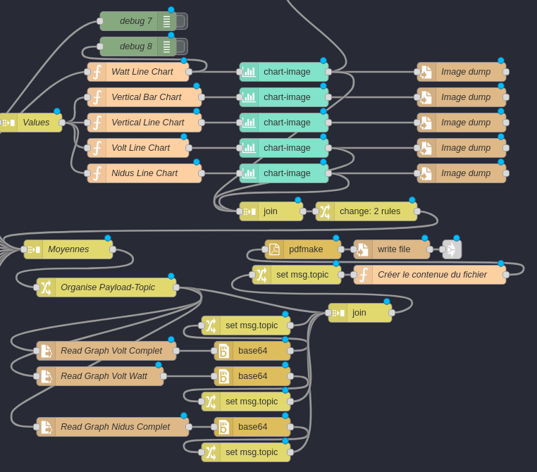


Après l'application des fonctions **rename**, deux nœuds **join** sont utilisés pour regrouper les données. L'un regroupe les tableaux de données, tandis que l'autre regroupe les moyennes calculées.

Intéressons-nous d'abord au nœud **Values**, car c'est le premier à être utilisé. Il permet de créer un tableau de données qui est ensuite transmis à une série de nœuds de fonctions. Ces nœuds de fonctions traitent les données et les formatent pour créer des **graphiques linéaires** sous forme d'images PNG :

```javascript
// Données reçues du flux précédent
var rawData = msg.payload;
var delayInSeconds = msg.delay / 1000; // Conversion en secondes

// Extraction des données nécessaires
var voltWatt = rawData;
// Création du graphique
var chartData = {
    type: 'line',  // Changement du type de graphique en "line"
    options: {
        title: {
            display: true,
            text: 'Comparaison des performances'
        },
        legend: {
            display: true
        },
        chartArea: {
            backgroundColor: '#d3d7dd'
        },
        plugins: {
            datalabels: {
                display: false  // Désactiver l'affichage des étiquettes de données
            }
        }
    },
    data: {
        labels: Array.from({ length: voltWatt.length }, (_, i) => (i * delayInSeconds).toFixed(1)),  // Temps en secondes
        datasets: [
            
            {
                label: "Volt Watt",
                borderColor: 'rgba(0, 255, 255, 1)',
                fill: false,
                data: voltWatt,
                pointRadius: 0,
            },
        ]
    }
};

msg.payload = chartData;

return msg;
```
L'exemple ci-dessus est volontairement plus simple, car il ne contient qu'un seul ensemble de données, à savoir les watts de Volt.
À la sortie de cette fonction, un nœud utilise ce qui a été créé pour générer un **tampon PNG**. Ce tampon est ensuite transmis à un nœud **write file** qui écrit le fichier dans le dossier spécifié par le nœud **Ajoute le nom du fichier**, situé après le formulaire. Simultanément, le nœud envoie également le tampon à un nœud **join** qui attend que tous les graphiques soient créés pour qu'ils puissent être réutilisés.

Une fois que le signal indiquant que les fichiers ont été créés est reçu, le nœud **join** appelé **Moyenne** peut transmettre ses données. Ces données sont réorganisées par un nœud **change**, puis envoyées à plusieurs autres nœuds pour récupérer les images en base64 des graphiques. Ces images sont envoyées en même temps que les moyennes à la fonction **Créer le contenu du fichier** :

```javascript
// Cette section crée un objet payload qui sera utilisé pour générer un rapport PDF.

msg.payload = {
    // Header du rapport PDF
    header: function (currentPage, pageCount, pageSize) {
        return [
            {
                text: "Tobler Cyril", // Nom de l'auteur du rapport
                alignment: "left", // Alignement du texte à gauche
                fontSize: 10, // Taille de la police 10
                margin: [15, 10, 0, 0] // Marge (haut, droite, bas, gauche)
            },
            {
                text: "Nom du projet : Confuse T-Rex", // Nom du projet
                alignment: "center", // Alignement du texte au centre
                fontSize: 10, // Taille de la police 10
                margin: [0, 0, 0, 0] // Pas de marge
            }
        ];
    },
    // Footer du rapport PDF
    footer: function (currentPage, pageCount) {
        return {
            columns: [
                {
                    text: currentPage.toString() + " / " + pageCount, // Numéro de page actuel / Nombre total de pages
                    alignment: "left",
                    fontSize: 10,
                    margin: [15, 0, 0, 10]
                },
                {
                    text: new Date().toLocaleDateString("fr-FR"), // Date actuelle au format français
                    alignment: "right",
                    fontSize: 10,
                    margin: [0, 0, 15, 10]
                }
            ],
            margin: [0, 0, 0, 10] // Marge du footer
        };
    },
    // Contenu du rapport PDF
    content: [
        {
            text: "Rapport d'utilisation", // Titre du rapport
            style: "header", // Style de texte "header" défini ci-dessous
            margin: [0, 10, 0, 0] // Marge du titre
        },
        {
            text: "Les valeurs sont des moyennes sur les " + Math.floor(msg.delay / (1000 * 60)) + " dernières minutes" // Informations sur les valeurs
        },
        {
            text: "Nidus :",
            style: "header2"
        },
        {
            text: "CPU :                 " + msg.payload.moyenne["nidus/benchmark/cpu"]
        },
        {
            text: "RAM :                 " + msg.payload.moyenne["nidus/benchmark/ram"]
        },
        {
            text: "Nombre de processus : " + msg.payload.moyenne["nidus/benchmark/processes"]
        },
        {
            text: "Température CPU :     " + msg.payload.moyenne["nidus/benchmark/temp"]
        },
        {
            image: 'nidusImage',
            width: 500,
            pageBreak: 'after',
        },
        {
            text: "Volt",
            style: "header2"
        },
        {
            text: "CPU :                 " + msg.payload.moyenne["volt/benchmark/cpu"]
        },
        {
            text: "RAM :                 " + msg.payload.moyenne["volt/benchmark/ram"]
        },
        {
            text: "Nombre de processus : " + msg.payload.moyenne["volt/benchmark/processes"]
        },
        {
            text: "Température CPU :     " + msg.payload.moyenne["volt/benchmark/temp"]
        }, 
        {
            text: "MilliWatt :           " + msg.payload.moyenne["volt/benchmark/watt"]
        },
        {
            image: 'voltImage',
            width: 500
        }, 
        {
            image: 'wattImage',
            width: 500
        },
    ],
     // Images à inclure dans le rapport
    images: {
        voltImage: 'data:image/png;base64,' + msg.payload.voltGraph.toString('base64'), // Image Volt au format base64
        wattImage: 'data:image/png;base64,' + msg.payload.wattGraph.toString('base64'),  // Image Watt de Volt au format base64
        nidusImage: 'data:image/png;base64,' + msg.payload.nidusGraph.toString('base64'),  // Image Nidus au format base64
    },
    // Styles de texte personnalisés
    styles: {
        header: {
            fontSize: 22, // Taille de la police 22
            bold: true, // Texte en gras
            margin: [0, 30, 0, 0] // Marge du titre
        },
        header2: {
            fontSize: 18, // Taille de la police 18
            bold: true, // Texte en gras
            margin: [0, 20, 0, 0] // Marge des sous-titres
        }
    }
};

// Renvoie le message avec le payload généré
return msg;
```

Cette fonction va créer, de manière similaire aux graphiques, une structure utilisée par PDFMake pour générer un fichier PDF. Cette structure est ensuite transmise à un nœud **pdfmake**, qui la convertit en base64 et l'envoie à un nœud **write file**. Ce dernier écrit le fichier PDF dans le dossier spécifié par le nœud **Ajoute le nom du fichier**, situé après le formulaire.

Le nœud final permet de mettre à jour le modèle HTML qui répertorie les fichiers PDF et PNG dans le dossier défini par le nœud **Ajoute le nom du fichier**. Ce modèle HTML permet de les télécharger en un seul clic.

## 14.3. Résultat
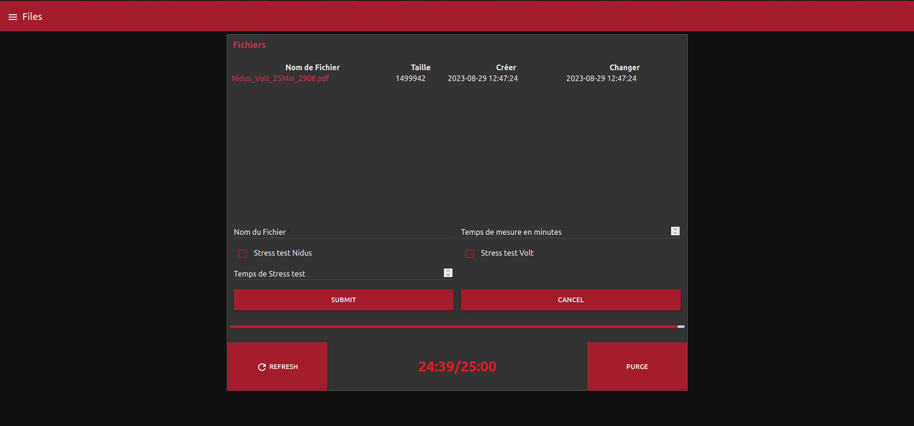

Pour obtenir les résultats, il suffit de cliquer sur le nom du fichier, qui sera automatiquement téléchargé. Ce processus est géré par ces nœuds :

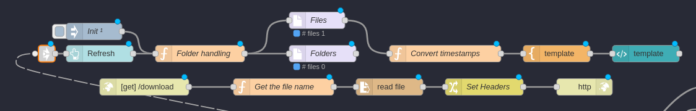

La partie supérieure gère l'affichage des fichiers dans un modèle et ajoute aux noms de fichier des requêtes GET qui permettent de télécharger les fichiers en un seul clic. La partie inférieure gère la réception des requêtes GET et envoie le fichier demandé à un nœud **read file**, qui le lit et l'envoie ensuite à un nœud **http response**. Ce dernier envoie le fichier au client ayant effectué la requête.

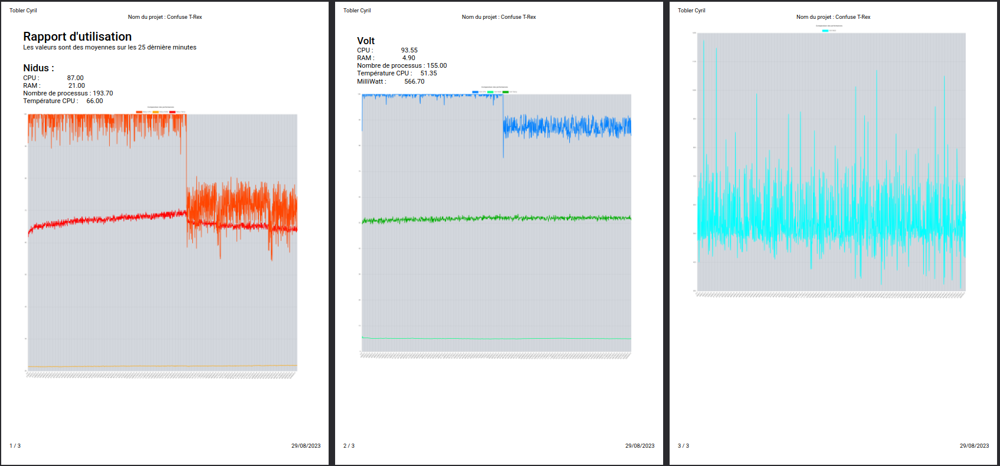

## 14.4. Purge
Au cours de mes tests, j'ai réalisé qu'un problème survient lorsque l'on génère un certain nombre de rapports, le dossier devient rapidement surchargé. Par conséquent, j'ai décidé de mettre en place un bouton permettant de purger le dossier de tous les fichiers .pdf et .png qui s'y trouvent. Cependant, pour éviter toute suppression accidentelle de fichiers importants, j'ai mis en place un système de confirmation demandant à l'utilisateur s'il est sûr de vouloir supprimer les fichiers.

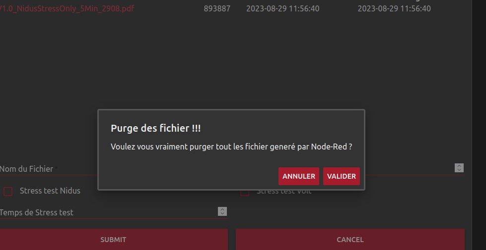
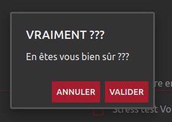

Voici les nœuds qui gèrent cette partie :

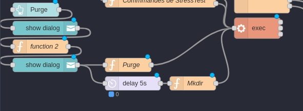


Ce que l'on peut observer, c'est qu'après avoir appuyé sur le bouton de purge, un message est envoyé dans un nœud `show dialog` qui affiche une fenêtre de confirmation. Si l'utilisateur appuie sur le bouton "Oui", un message est transmis à un nœud de fonction qui vérifie le contenu du message et redemande une confirmation s'il est à nouveau validé. À ce stade, deux flux sont créés :
- Le premier effectue la purge totale de tous les fichiers dans `/home/NodeRed/`.
- Le second commence par un délai de quelques secondes avant de recréer les dossiers de structuration.

<div style="page-break-after: always;"></div>

# 15. Gatling Test V2.0
## 15.1. But
L'objectif de cette étape est d'intégrer Gatling aux tests de Node-Red, offrant ainsi la possibilité de réaliser à la fois des tests de charge et des tests de stress sur la même infrastructure.

## 15.2. Étapes à Atteindre
1. **Exécution d'un Test Préétabli sur Gatling depuis Node-Red** : La première étape consiste à configurer et à exécuter un test préétabli à l'aide de Gatling directement depuis l'environnement Node-Red. Cela permettra de lancer les scénarios de test sur l'application ou le système cible.

2. **Récupération des Résultats de Gatling et Création de Graphiques pour l'Incorporation au PDF** : Une fois le test Gatling terminé, nous devrons récupérer les résultats générés par Gatling. Ces résultats seront ensuite transformés en graphiques informatifs pour être intégrés dans le rapport PDF. Cette étape vise à rendre les données de performance facilement compréhensibles.

3. **Définition de la Durée du Test Gatling depuis Node-Red** : Pour chaque test Gatling, il sera nécessaire de définir la durée de l'exécution du test directement depuis Node-Red. Cela permettra de personnaliser la durée des tests en fonction des exigences du projet.

Cette intégration de Gatling aux tests Node-Red offre un moyen puissant d'évaluer les performances de l'infrastructure tout en maintenant un contrôle complet sur les scénarios de test et les paramètres de durée.
## 15.3. Exécution d'un Test Préétabli sur Gatling depuis Node-Red
L'exécution d'un test préétabli sur Gatling depuis Node-Red revêt une importance cruciale pour la suite du projet. Cela permettra de lancer les scénarios de test sur l'application ou le système cible. Pour réaliser cette étape, nous allons utiliser le nœud **exec** de Node-Red, qui nous permet d'exécuter des commandes sur le système d'exploitation. Ce nœud sera utilisé pour lancer les commandes Gatling nécessaires afin de lancer les tests.

Je lui transmets la commande suivante en entrée :
```bash
tobby@Nidus:~ $ /home/tobby/.gatling/gatling-charts-highcharts-bundle-3.9.5/bin/gatling.sh -s CuriusTRex -bm --run-mode local -erjo " -Dusers=5 -Dramp=5"
```
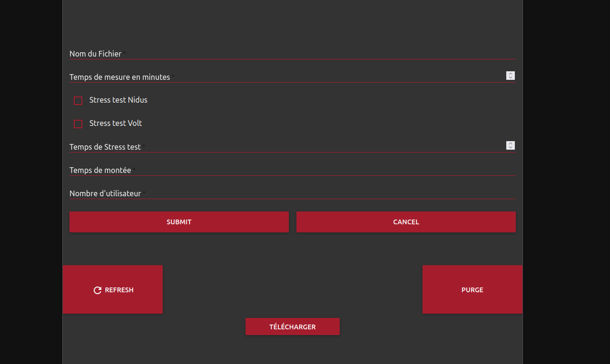
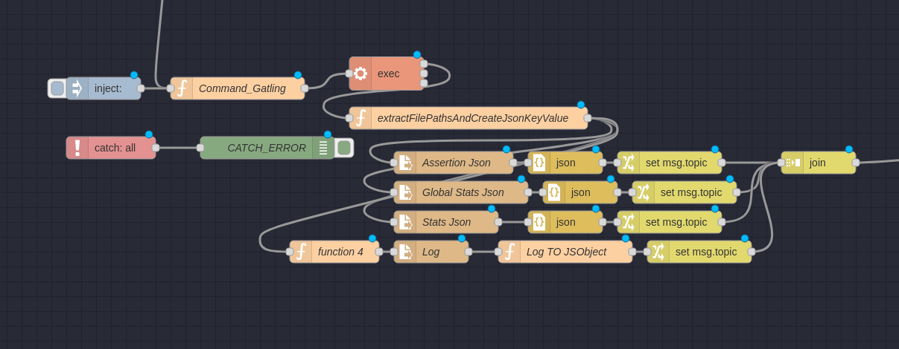

## 15.4. Envoi de Commande avec une Durée

L'une des premières étapes essentielles est de pouvoir définir une durée pour le test. Pour accomplir cette tâche, j'ai employé un nœud **function** qui permet de spécifier la durée du test en fonction de la valeur saisie par l'utilisateur. Cette valeur est ensuite transmise à un nœud **exec** qui se charge d'exécuter la commande Gatling nécessaire. Voici le code de la fonction :


```javascript
msg.original = msg.payload;
if (msg.topic !== "inject" && msg.payload.time_gatling !== undefined && msg.payload.user_gatling !== undefined) {
    // Crée la commande en utilisant les valeurs spécifiées
    msg.payload.time = msg.payload.time_gatling * 60;
    msg.payload = `/home/tobby/.gatling/gatling-charts-highcharts-bundle-3.9.5/bin/gatling.sh -s CuriusTRex -bm --run-mode local -erjo "-Dusers=${msg.payload.user_gatling} -Dramp=${msg.payload.time_gatling}"`;
} else {
    // Utilise la commande d'origine car il ne s'agit pas d'un noeud inject ou les valeurs ne sont pas fournies
    // Par défaut, utilisez la commande actuelle
    msg.payload = "/home/tobby/.gatling/gatling-charts-highcharts-bundle-3.9.5/bin/gatling.sh -s CuriusTRex -bm --run-mode local -erjo \" -Dusers=5 -Dramp=5\"";
}

// Renvoie le message modifié
return msg;
```

## 15.5. Récupération des Informations

Pour obtenir les informations d'un rapport Gatling, j'ai dû entreprendre une rétro-ingénierie significative. En effet, Gatling ne propose pas de mécanisme direct pour extraire des informations depuis la ligne de commande. Il est nécessaire de collecter les données directement à partir des fichiers générés par Gatling. Voici un exemple de fichier généré par Gatling :

```log
RUN	CuriusTRex_Bash	curiustrex-bash	1693898386165	 	3.9.5
USER	CuriusTRex	START	1693898386953
REQUEST		request_0	1693898386949	1693898386985	OK	 
REQUEST		request_1	1693898387009	1693898387014	OK	 
USER	CuriusTRex	START	1693898387108
REQUEST		request_0	1693898387107	1693898387128	OK	 
REQUEST		request_1	1693898387132	1693898387136	OK	 
REQUEST		styles.css	1693898387162	1693898387167	OK	 
REQUEST		styles.css	1693898387162	1693898387167	OK	 
REQUEST		request_2	1693898387184	1693898387189	OK	 
REQUEST		request_2	1693898387184	1693898387189	OK	 
REQUEST		styles.css	1693898387211	1693898387222	OK	 
REQUEST		Home.jpg	1693898387212	1693898387228	OK	 
REQUEST		styles.css	1693898387223	1693898387233	OK	 
REQUEST		Données.jpg	1693898387213	1693898387234	OK	 
REQUEST		Home.jpg	1693898387224	1693898387239	OK	 
REQUEST		Test_Complet.jpg	1693898387215	1693898387241	OK	
```
On peut donc voir qu'il y a **beaucoup d'information à traiter dans ce cas particulier**, le test dure 30 secondes avec 5 utilisateurs, et le fichier `simulation.log` fait **3114 lignes**.

Étant donné que les informations sont sauvegardées à chaque fois dans un fichier différent, j'ai mis en place une fonction dans un nœud qui me permet de récupérer le nom du dossier dans lequel le rapport et les logs sont sauvegardés.

Ensuite, j'en fais un tableau de chemins de fichiers :


```javascript
// Fonction pour extraire le chemin après "file://"
var inputPayload = msg.payload;

// Recherche de l'index de "file://"
var fileIndex = inputPayload.indexOf("file://");

// Si "file://" est trouvé, extrayez le chemin après
if (fileIndex !== -1) {
    // Extraire le chemin après "file://"
    var filePath = inputPayload.substring(fileIndex + 7); // +7 pour sauter "file://"

    // Supprimer le fichier index.html du chemin, s'il est présent
        filePath = filePath.substring(0, filePath.length - 12); // -11 pour enlever "/index.html"

    // Mettre le chemin extrait dans le message de sortie
    msg.payload = filePath;

    // Tableau de noms de fichiers .json
    var jsonFilesList = [
        "assertions.json",
        "global_stats.json",
        "stats.json"
    ];

    // Créer un tableau de clé-valeurs pour les fichiers .json
    var jsonFilesKeyValue = {};

    // Parcourir la liste des noms de fichiers et construire les chemins complets
    for (var i = 0; i < jsonFilesList.length; i++) {
        var jsonFileName = jsonFilesList[i];
        var jsonFilePath = filePath + '/js/' + jsonFileName;
        jsonFilesKeyValue[jsonFileName] = jsonFilePath;
    }

    // Ajouter le tableau de clé-valeurs au message
    msg.jsonFiles = jsonFilesKeyValue;

    // Renvoyer le message modifié
    return msg;
} else {
    // Aucun "file://" trouvé, renvoyer le message d'origine
    return msg;
}
```
Tout cela se fait à la sortie du nœud exec, lequel renvoie les informations suivantes :
```bash
[...]
================================================================================
2023-09-05 11:05:03                                          29s elapsed
---- Requests ------------------------------------------------------------------
> Global                                                   (OK=2816   KO=0     )
> request_0                                                (OK=150    KO=0     )
> request_1                                                (OK=150    KO=0     )
> styles.css                                               (OK=450    KO=0     )
> request_2                                                (OK=150    KO=0     )
> Home.jpg                                                 (OK=300    KO=0     )
> Données.jpg                                              (OK=300    KO=0     )
> Test.jpg                                                 (OK=300    KO=0     )
> Test_Complet.jpg                                         (OK=300    KO=0     )
> request_3                                                (OK=150    KO=0     )
> request_5                                                (OK=150    KO=0     )
> request_4                                                (OK=150    KO=0     )
> request_6                                                (OK=116    KO=0     )
> request_7                                                (OK=150    KO=0     )

---- CuriusTRex ----------------------------------------------------------------
[##########################################################################]100%
          waiting: 0      / active: 0      / done: 150   
================================================================================

Simulation CuriusTRex_Bash completed in 29 seconds
Parsing log file(s)...
Parsing log file(s) done
Generating reports...

================================================================================
---- Global Information --------------------------------------------------------
> request count                                       2816 (OK=2816   KO=0     )
[...]
---- Response Time Distribution ------------------------------------------------
> t < 800 ms                                          2816 (100%)
> 800 ms <= t < 1200 ms                                  0 (  0%)
> t >= 1200 ms                                           0 (  0%)
> failed                                                 0 (  0%)
================================================================================

Reports generated in 0s.
Please open the following file: file:///home/toblerc/T%C3%A9l%C3%A9chargements/gatling-charts-highcharts-bundle-3.9.5/results/curiustrex-bash-20230905090433239/index.html
```
## 15.6. Traitement des données

Une fois les chemins des fichiers définis, je lis les fichiers JSON et les transmets à un nœud **JSON** chargé de les traiter et de les renvoyer dans un format exploitable par Node-Red.

En sortie, j'assemble les quatre fichiers en un seul message que j'envoie ensuite aux fonctions de création de graphiques.

### 15.6.1. Création des graphiques

Je crée deux graphiques, l'un utilisant le pourcentage de réussite et d'échec pour générer un bar chart :

```javascript
// Données reçues du flux précédent
var rawData = msg.payload.gatling.Global;  // Utilisez les données de msg.payload.gatling.Global
msg.topic = "VoltBarChart"; // Définir le sujet du message

// Extraction des données nécessaires
var groupData = [
    rawData.group1,
    rawData.group2,
    rawData.group3,
    rawData.group4
];

var labels = [];
var percentages = [];

// Parcourir les données des groupes et extraire les informations
for (var i = 1; i <= groupData.length; i++) {
    var groupName = "group" + i;
    labels.push(rawData[groupName].htmlName);
    percentages.push(rawData[groupName].percentage);
}

// Création du graphique
var chartData = {
    type: 'bar',  // Utiliser un graphique de type "bar"
    options: {
        title: {
            display: true,
            text: 'Répartition des performances par groupe' // Titre du graphique
        },
        chartArea: {
            backgroundColor: '#d3d7dd' // Couleur de fond du graphique
        },
        scales: {
            x: {
                beginAtZero: true,
                title: {
                    display: true,
                    text: 'Groupes' // Titre de l'axe des X
                }
            },
            y: {
                beginAtZero: true,
                title: {
                    display: true,
                    text: 'Pourcentage' // Titre de l'axe des Y
                }
            }
        },
        plugins: {
            datalabels: {
                anchor: 'end',
                align: 'top',
                formatter: function (value) {
                    return value + '%';  // Ajouter le symbole de pourcentage à l'étiquette
                }
            }
        }
    },
    data: {
        labels: labels,
        datasets: [
            {
                label: "Pourcentage", // Légende de l'ensemble de données
                backgroundColor: 'rgba(0, 128, 255, 0.7)',  // Couleur du remplissage des barres
                data: percentages
            }
        ]
    }
};

msg.payload = chartData; // Attribuer les données du graphique au message

return msg; // Renvoyer le message
```
Le deuxième calcule le temps de réponse de chaque requête afin de créer un graphique linéaire :
```javascript
// Assurez-vous que msg.payload.gatling.Log est un tableau
var logEntries = Array.isArray(msg.payload.gatling.Log) ? msg.payload.gatling.Log : [];

// Création du graphique
var chartData = {
    type: 'line', // Utilisez un graphique de type "line"
    options: {
        title: {
            display: true,
            text: 'Comparaison des performances' // Titre du graphique
        },
        legend: {
            display: true // Affichez la légende du graphique
        },
        chartArea: {
            backgroundColor: '#d3d7dd' // Couleur de fond du graphique
        },
        plugins: {
            datalabels: {
                display: false // Désactivez l'affichage des étiquettes de données
            }
        }
    },
    data: {
        labels: logEntries.map(function (entry) {
            if (entry.type === 'RUN') {
                return 'Début de la Simulation'; // Label pour les opérations de type "RUN"
            } else if (entry.type === 'REQUEST') {
                // Calcul de la différence en millisecondes entre le début de la simulation et le début de la requête
                var simulationStart = logEntries.find(function (item) {
                    return item.type === 'RUN';
                });
                if (simulationStart) {
                    var startTime = simulationStart.start;
                    var requestTime = entry.start;
                    var timeDiff = requestTime - startTime;
                    return (timeDiff / 1000).toFixed(0) + ' s'; // Temps en secondes
                } else {
                    return 'N/A'; // Si aucune opération de type "RUN" n'est trouvée
                }
            } else {
                return ''; // Autres types d'opérations (USER, etc.) sans label
            }
        }),
        datasets: [
            {
                label: "Temps de Réponse", // Légende de l'ensemble de données
                borderColor: 'rgba(0, 128, 255, 1)', // Couleur de la ligne du graphique
                fill: false, // Désactivez le remplissage sous la ligne
                data: logEntries.map(function (entry) {
                    if (entry.type === 'REQUEST') {
                        // Calcul de la différence en millisecondes entre le début et la fin de la requête
                        var requestStart = entry.start;
                        var requestEnd = entry.end;
                        var requestTime = requestEnd - requestStart;
                        return requestTime;
                    } else {
                        return 0; // Valeurs pour les opérations de type "RUN" ou autres
                    }
                }),
                pointRadius: 0, // Diamètre des points sur le graphique
            }
        ]
    }
};

msg.payload = chartData; // Attribuez les données du graphique au message
return msg; // Renvoyez le message
```
### 15.6.2. PDF
Une fois les chart créer,  je les réutilise dans le noeud de création de PDF pour les ajouter au rapport :
```javascript
/**
 * 
 * Vu precedemment
 * 
 */
{
            text: "Gatling", // Section Gatling
            style: "header2"
        },
        {
            text: "Nom de la simulation :                 " + msg.payload.gatling.Assertion.simulation // Nom de la simulation Gatling
        },
        {
            text: "Commencée :                 " + msg.payload.gatling.Assertion.start // Date de début de la simulation Gatling (à formater)
        },
        {
            image: 'gatlingImage', // Image Gatling
            width: 500,
        },
        {
            image: 'gatlingGraphComplete', // Image graphique complet Gatling
            width: 500,
        },
    ],
    images: {
        voltImage: 'data:image/png;base64,' + msg.payload.voltGraph.toString('base64'), // Utilisation du buffer pour l'image Volt
        wattImage: 'data:image/png;base64,' + msg.payload.wattGraph.toString('base64'),  // Utilisation du buffer pour l'image Watt de Volt
        nidusImage: 'data:image/png;base64,' + msg.payload.nidusGraph.toString('base64'),  // Utilisation du buffer pour l'image Nidus
        gatlingImage: 'data:image/png;base64,' + msg.payload.gatlingGraph.toString('base64'),  // Utilisation du buffer pour l'image Gatling
        gatlingGraphComplete: 'data:image/png;base64,' + msg.payload.gatlingGraphComplete.toString('base64'),  // Utilisation du buffer pour l'image Gatling
    },
/**
 * 
 * Vu precedemment
 * 
 */
```
## 15.7. Refactoring
Pour finir, j'ai créer des subflow pour le noeud MQTT afin de simplifier la visualisation et le management des données :
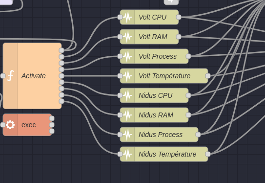
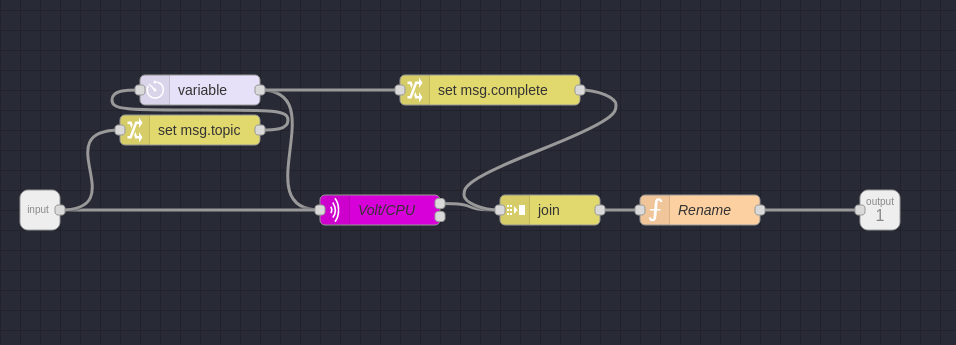

# 16. Remerciement 
Je tiens à exprimer ma profonde gratitude envers les personnes qui ont joué des rôles essentiels dans la réalisation de ce projet. Avant tout, je souhaite exprimer ma sincère reconnaissance à M. Benoit Vianin, dont la proposition du projet, le matériel fourni et les conseils avisés ont été cruciaux pour sa mise en place. Sa précieuse assistance technique a été d'une grande importance.

Je tiens également à adresser mes remerciements à M. Fabien Maire, Directeur du service Informatique du SIS2 (Service Informatique du Secondaire 2), pour son accompagnement et ses conseils tout au long de ce travail. Sa vision éclairée et son expertise ont été des facteurs clés dans la réussite de ce projet.

Un remerciement spécial s'adresse à M. Christophe Singele, enseignant en microtechnique au CPNE-TI, pour son soutien inestimable dans la compréhension des schémas électriques et dans la résolution des problèmes de câblage et de connectique. Sa patience et ses connaissances ont été une source inestimable d'aide.

Je saisis également cette occasion pour exprimer ma gratitude envers l'équipe du SIS2 pour son accueil chaleureux dans leurs locaux et pour le soutien constant qu'ils m'ont apporté tout au long de ce travail. Leur environnement de travail a été propice à la réalisation de ce projet.

Je remercie sincèrement M. Patrice Lüthi, enseignant en informatique au CPNE-TI, pour sa contribution essentielle dans la mise en place de la communication entre l'INA219 et les Raspberry Pi. Son expertise technique a joué un rôle clé dans la résolution des défis techniques.

Enfin, Un remerciement tout particulier à ma mère et à ma copine pour leur soutien infaillible durant ma formation, qui m'a conduit à accomplir ce travail. Leur encouragement constant et leur confiance en moi ont été des sources d'inspiration essentielles.

Ces individus exceptionnels ont joué un rôle capital dans la réalisation de ce projet. Leur soutien, leur expertise et leur encouragement ont été essentiels, et je leur suis profondément reconnaissant.


<div style="page-break-after: always;"></div>

# 17. Sources

1. **Guide d'Installation Node-Red**  
   [Installer Node-Red](https://nodered.org/docs/getting-started/raspberrypi)

2. **Guide de Sécurisation de Node-Red**  
   [Sécurisation de Node-Red](https://nodered.org/docs/user-guide/runtime/securing-node-red)

3. **Tutoriel de Base Rototron**  
   [Tutoriel Rototron](https://www.rototron.info/raspberry-pi-ina219-tutorial/)

4. **Documentation Technique de l'INA219**  
   [Documentation INA219](https://www.ti.com/lit/ds/symlink/ina219.pdf)

5. **Recherche de M. Lamber**  
   [Profil de Consommation par M. Lamber](https://www.researchgate.net/publication/350387196_Power_Consumption_Profiling_of_a_Lightweight_Development_Board_Sensing_with_the_INA219_and_Teensy_40_Microcontroller)

6. **Recherche de M. Pol J. Planas Pulido**  
   [Profil de Consommation par M. Pol J. Planas Pulido](https://upcommons.upc.edu/bitstream/handle/2117/180533/tfg-report-pol-planas.pdf?sequence=1&isAllowed=y)

7. **Bibliothèque Python pour l'INA219**  
   [Bibliothèque pi-ina219](https://pypi.org/project/pi-ina219/)

8. **Forum Problème de Détection I2C**  
   [Forum Raspberry Pi](https://forums.raspberrypi.com/viewtopic.php?t=272351#p1652031)

9. **Tutoriel Mise en Place INA219**  
   [Tutoriel INA219](https://binaryfury.wann.net/2014/04/solarbatteryload-power-logging-with-raspberry-pi-and-ina219/)

10. **Tutoriel Création d'un Enregistreur de Consommation**  
    [Tutoriel Enregistreur de Consommation](https://www.hackster.io/Sparky/diy-power-logger-using-i2c-python-9a39e0)

11. **Tutoriel Complet avec Arduino**  
    [Tutoriel Complet avec Arduino](https://electropeak.com/learn/interfacing-ina219-current-sensor-module-with-arduino/)

12. **Téléchargement Gatling**  
    [Téléchargement Gatling](https://repo1.maven.org/maven2/io/gatling/highcharts/gatling-charts-highcharts-bundle/3.9.5/gatling-charts-highcharts-bundle-3.9.5-bundle.zip)

13. **Tutoriel Avancé Gatling**  
    [Tutoriel Avancé Gatling](https://gatling.io/docs/gatling/tutorials/advanced/)

14. **Tutoriel de Démarrage Rapide Gatling**  
    [Tutoriel de Démarrage Rapide Gatling](https://gatling.io/docs/gatling/tutorials/quickstart/)

15. **Tutoriel sur l'utilisation de S1seven**  
    [Tutoriel S1seven](https://www.s1seven.com/blog/use-s1sevens-certificate-tools-to-convert-a-json-certificate-to-a-pdf/)