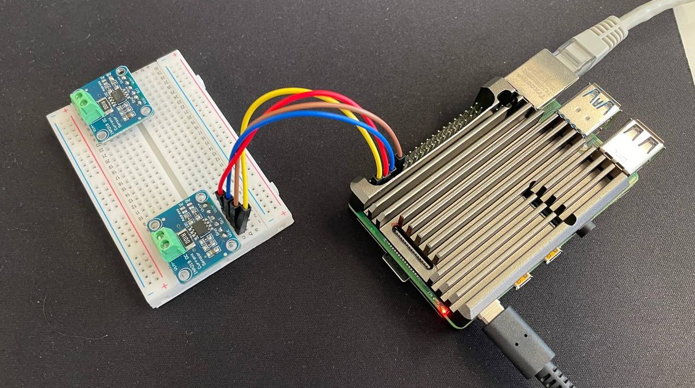
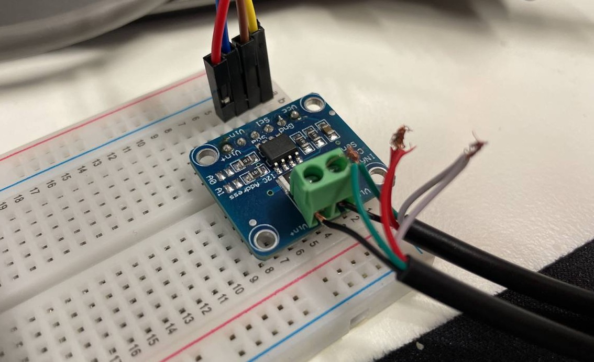

# 1. Rapport de projet
# 2. Sommaire
- [1. Rapport de projet](#1-rapport-de-projet)
- [2. Sommaire](#2-sommaire)
- [3. Introduction](#3-introduction)
- [4. Instalation physique](#4-instalation-physique)
  - [4.1. Nidus](#41-nidus)
  - [4.2. Volt](#42-volt)
- [5. Shéma de principe](#5-shéma-de-principe)
- [6. OS](#6-os)
  - [6.1. Ubuntu](#61-ubuntu)
  - [6.2. Raspbian](#62-raspbian)
  - [6.3. Première instalation](#63-première-instalation)
  - [Seconde instalation Ubuntu Server](#seconde-instalation-ubuntu-server)
  - [6.4. Configuration](#64-configuration)
- [7. Node-RED](#7-node-red)
  - [7.1. Instalation](#71-instalation)
  - [7.2. Configuration](#72-configuration)
    - [7.2.1. Instalation des plugins](#721-instalation-des-plugins)
    - [7.2.2. Sécurisation de Node-Red](#722-sécurisation-de-node-red)
    - [7.2.3. Suivi Git](#723-suivi-git)
- [8. Gatling](#8-gatling)
  - [8.1. Instalation](#81-instalation)
    - [8.1.1. Prerequis](#811-prerequis)
    - [8.1.2. Download](#812-download)
  - [8.2. Vérification de l'installation](#82-vérification-de-linstallation)
  - [8.3. Configuration](#83-configuration)
- [9. Apache et Site Web](#9-apache-et-site-web)
  - [9.1. Installation](#91-installation)
  - [9.2. Mise en place d'un site Web](#92-mise-en-place-dun-site-web)
- [10. MQTT](#10-mqtt)
  - [10.1. Instalaion de Mosquitto sur Nidus](#101-instalaion-de-mosquitto-sur-nidus)
  - [10.2. Ouverture des port sur Nidus](#102-ouverture-des-port-sur-nidus)
  - [10.3. Script MQTT](#103-script-mqtt)
  - [10.4. Installation](#104-installation)
  - [10.5. Utilisation du script](#105-utilisation-du-script)
    - [10.5.1. Vérification](#1051-vérification)
- [11. INA219](#11-ina219)
  - [11.1. Instalation physique](#111-instalation-physique)
    - [11.1.1. Branchement SANS VOLT](#1111-branchement-sans-volt)
    - [11.1.2. Branchement AVEC VOLT](#1112-branchement-avec-volt)
  - [11.2. Vérification de la présence du INA219](#112-vérification-de-la-présence-du-ina219)
  - [11.3. Obtention des données](#113-obtention-des-données)
    - [11.3.1. Test avec le script python A vide](#1131-test-avec-le-script-python-a-vide)
- [12. Noeud Node-Red](#12-noeud-node-red)
  - [12.1. Dashboard](#121-dashboard)
  - [12.2. Fonctions](#122-fonctions)
  - [12.3. INA219](#123-ina219)
  - [12.4. Monitoring](#124-monitoring)
- [13. Sources](#13-sources)

# 3. Introduction
Le système sera conçu pour simuler des requêtes HTTP réalistes à l'aide de Gatling, mesurer la consommation électrique en utilisant l'INA219 connecté via le bus I2C, et collecter les mesures de performance à l'aide de Node-RED. Les rapports générés fourniront des informations détaillées sur les performances du système testé, y compris le temps de réponse, la consommation d'énergie par requête, l'utilisation du processeur, etc.
# 4. Instalation physique
## 4.1. Nidus
{width=100%}
## 4.2. Volt
{width=100%}

# 5. Shéma de principe
```ascii
           +---------+      +-------------+
           |   Volt  |      |   Nidus     |
           |_________|      |_____________|
           |  RPI 4  |      |  RPI 4      |
           |_________|      |_____________|
           | Apache  |      | Node-RED    |
           | No-Proc |      | Gatling     |
           |         |      | INA219      |
           +---------+      +-------------+
              ^   |             ^   |
              |   |             |   |
              |   |             |   |
              |   |             |   |
              |   v             |   v
         +-----------------------------+
         |       Réseau local          |
         +---+-------------------+-----+
             | Dashboard Node-Red|
             +-------------------+
                        ^
                        |
                        |
                  +------------+
                  |Utilisateur |
                  +------------+

```
# 6. OS
Dans le cadre de ce projet il y auras plusieurs OS utilisée mais pour débuter nous allons utiliser Ubuntu.
## 6.1. Ubuntu
Ubuntu est un OS largement utilisé pour les serveurs et les ordinateurs de bureau. Ubuntu est livré avec un ensemble d'outils de développement et de productivité, y compris un navigateur Web, un éditeur de texte, des logiciels de programmation, des outils de calcul, des jeux et des logiciels de productivité. Ubuntu est un environnement de bureau léger et réactif conçu pour les ordinateurs de bureau et les serveurs.
## 6.2. Raspbian
Raspbian est un système d'exploitation libre basé sur Debian optimisé pour le Raspberry Pi. Depuis 2015, Raspbian est fourni avec un ensemble d'outils appelé Pixel. Pixel est un environnement de bureau qui comprend un navigateur Web, un éditeur de texte, des logiciels de programmation, des outils de calcul, des jeux et des logiciels de productivité. Pixel est un environnement de bureau léger et réactif conçu pour les ordinateurs monocarte Raspberry Pi.
## 6.3. Première instalation
Dans un premier temps nous allons installer Ubuntu en version desktop sur Volt. La raison dèrière ce choix est que pour tester au plus vite tous les concepts du projet il est plus simple de travailler sur un environnement de bureau.

Sur Nidus c'est Raspbian enversion desktop qui sera installé pour les mêmes raisons que pour Volt.

La raison dèrière ce choix est que Ubuntu core est plus léger que raspbian et plus utilisée pour les serveur web et que Raspbian est plus performant sur les Raspberry pi que Ubuntu core
Dernier point important, étant donnée que l'INA219 sera branché à Nidus, il est plus simple de mettre raspbian sur Nidus pour avoir accès au GPIO.

Dans un second temps pour avoir des mesures plus précise nous allons installer des versions core de Ubuntu et de raspbian.

Adresse IP de Volt : 157.26.228.130
Adresse IP de Nidus : 157.26.251.158

## Seconde instalation Ubuntu Server
{width=100%}
## 6.4. Configuration


# 7. Node-RED
Node-RED est un outil de programmation visuelle open source conçu pour connecter des périphériques, des API et des services en ligne. Il fournit un éditeur de flux basé sur un navigateur qui facilite la connexion de nœuds en utilisant des liens glisser-déposer qui peuvent être exécutés dans un environnement Node.js. Les nœuds peuvent être des fonctions JavaScript ou des modules npm, tels que node-red-contrib-gpio, node-red-contrib-sqlite, node-red-contrib-modbustcp, etc. Node-RED est livré avec un ensemble de nœuds de base prêts à l'emploi, mais il existe maintenant plus de 2000 nœuds de la communauté qui sont disponibles pour une utilisation.
## 7.1. Instalation
```bash
tobby@Nidus:~ $ bash <(curl -sL https://raw.githubusercontent.com/node-red/linux-installers/master/deb/update-nodejs-and-nodered)
Running Node-RED install for user tobby at /home/tobby on debian


This can take 20-30 minutes on the slower Pi versions - please wait.

  Stop Node-RED                       ✔
  Remove old version of Node-RED      ✔
  Remove old version of Node.js       ✔   
  Install Node.js 18 LTS              ✔   v18.17.1   Npm 9.6.7
  Clean npm cache                     ✔
  Install Node-RED core               ✔   3.0.2
  Move global nodes to local          -
  Npm rebuild existing nodes          ✔
  Install extra Pi nodes              ✔
  Add shortcut commands               ✔
  Update systemd script               ✔
                                      

Any errors will be logged to   /var/log/nodered-install.log
All done.
You can now start Node-RED with the command  node-red-start
  or using the icon under   Menu / Programming / Node-RED
Then point your browser to localhost:1880 or http://{your_pi_ip-address}:1880

Started :  mer 16 aoû 2023 14:12:19 CEST 
Finished:  mer 16 aoû 2023 14:16:01 CEST
 
**********************************************************************************
 ### WARNING ###
 DO NOT EXPOSE NODE-RED TO THE OPEN INTERNET WITHOUT SECURING IT FIRST
 
 Even if your Node-RED doesn't have anything valuable, (automated) attacks will
 happen and could provide a foothold in your local network
 
 Follow the guide at https://nodered.org/docs/user-guide/runtime/securing-node-red
 to setup security.
 
 ### ADDITIONAL RECOMMENDATIONS ###
  - Remove the /etc/sudoers.d/010_pi-nopasswd file to require entering your password
    when performing any sudo/root commands:
 
      sudo rm -f /etc/sudoers.d/010_pi-nopasswd
 
  - You can customise the initial settings by running:
 
      node-red admin init
 
  - After running Node-RED for the first time, change the ownership of the settings
    file to 'root' to prevent unauthorised changes:
 
      sudo chown root:root ~/.node-red/settings.js
 
**********************************************************************************
 
  Would you like to customise the settings now (y/N) ? y

Node-RED Settings File initialisation
=====================================
This tool will help you create a Node-RED settings file.

✔ Settings file · /home/tobby/.node-red/settings.js

User Security
=============
✔ Do you want to setup user security? · Yes
✔ Username · Tobby
✔ Password · ***********
✔ User permissions · full access
✔ Add another user? · Yes
✔ Username · FMA
✔ Password · ******** (Pa$$w.rd)
✔ User permissions · read-only access
✔ Add another user? · Yes
✔ Username · BVI
✔ Password · ******** (Pa$$w.rd)
✔ User permissions · read-only access
✔ Add another user? · No

Projects
========
The Projects feature allows you to version control your flow using a local git repository.

✔ Do you want to enable the Projects feature? · No

Flow File settings
==================
✔ Enter a name for your flows file · flows.json
✔ Provide a passphrase to encrypt your credentials file · 

Editor settings
===============
✔ Select a theme for the editor. To use any theme other than "default", you will need to install @node-red-contrib-themes/theme-collection in your Node-RED user directory. · dark
✔ Select the text editor component to use in the Node-RED Editor · monaco (default)

Node settings
=============
✔ Allow Function nodes to load external modules? (functionExternalModules) · Yes


Settings file written to /home/tobby/.node-red/settings.js
To use the 'dark' editor theme, remember to install @node-red-contrib-themes/theme-collection in your Node-RED user directory

tobby@Nidus:~ $ sudo systemctl enable nodered.service
Created symlink /etc/systemd/system/multi-user.target.wants/nodered.service → /lib/systemd/system/nodered.service.

```
{width=100%}
## 7.2. Configuration
### 7.2.1. Instalation des plugins
{width=33%}
{width=33%}
{width=33%}
{width=100%}
{width=100%}
### 7.2.2. Sécurisation de Node-Red
La sécurisation de Node-Red se fait en modifiant le fichier settings.js, ou dans note cas en utilisant la commande `node-red admin init`qui permet par exemple de créer les couple Utilisateur mot de passe.

Suite à celà il faudra également si celà s'avère utile ajouter un login au Dashboard.
### 7.2.3. Suivi Git
Pour suivre le projet sur git, il faut configurer un utiiisateur les clé SSH puis faire un clone du projet.
{width=30%}
{width=30%}
{width=30%}

Comme c'est un clone il faut ajouter un fichier qui manque et modifier les droits d'accès.
```bash
tobby@Nidus:~/.node-red/projects/banc-de-mesures-de-la-consommation-electrique $ touch ~/.node-red/projects/banc-de-mesures-de-la-consommation-electrique/flows_cred.json
tobby@Nidus:~/.node-red/projects/banc-de-mesures-de-la-consommation-electrique $ chmod 600 ~/.node-red/projects/banc-de-mesures-de-la-consommation-electrique/flows_cred.json

```
# 8. Gatling
Gatling est un outil de test de charge open source basé sur Scala, conçu pour tester les performances des applications et des sites Web. Gatling simule des utilisateurs virtuels qui envoient des requêtes HTTP vers le système cible. Il enregistre les temps de réponse des requêtes et les présente sous forme de graphiques. Gatling est livré avec un éditeur de scénario basé sur un navigateur qui permet aux utilisateurs de créer des scénarios de test de charge en utilisant un langage de domaine spécifique (DSL) appelé Gatling DSL. Gatling DSL est un langage de programmation basé sur Scala qui permet aux utilisateurs de définir des scénarios de test de charge en utilisant des mots-clés tels que exec, pause, feed, etc.

La dernière version de Gatling est la version 3.9.5 qui est compatible avec Java 8 et Java 11. Dans ce projet, nous utiliserons Java 11 pour exécuter Gatling.

## 8.1. Instalation
### 8.1.1. Prerequis
```bash
tobby@Nidus:~ $ sudo apt install default-jdk
tobby@Nidus:~/.node-red $ java -version
openjdk version "11.0.18" 2023-01-17
OpenJDK Runtime Environment (build 11.0.18+10-post-Debian-1deb11u1)
OpenJDK 64-Bit Server VM (build 11.0.18+10-post-Debian-1deb11u1, mixed mode)
tobby@Nidus:~/.node-red $ 


```
### 8.1.2. Download

```bash
tobby@Nidus:~ $ mkdir .gatling
tobby@Nidus:~ $ ls -la
total 104
drwxr-xr-x 18 tobby tobby 4096 16 aoû 15:10 .
drwxr-xr-x  3 root  root  4096 16 aoû 13:58 ..
-rw-------  1 tobby tobby  453 16 aoû 14:26 .bash_history
-rw-r--r--  1 tobby tobby  220  3 mai 04:53 .bash_logout
-rw-r--r--  1 tobby tobby 3523  3 mai 04:53 .bashrc
drwxr-xr-x  2 tobby tobby 4096  3 mai 05:02 Bookshelf
drwxr-xr-x  4 tobby tobby 4096 16 aoû 13:58 .cache
drwx------  5 tobby tobby 4096 16 aoû 13:58 .config
drwxr-xr-x  2 tobby tobby 4096 16 aoû 13:58 Desktop
drwxr-xr-x  2 tobby tobby 4096 16 aoû 13:58 Documents
drwxr-xr-x  2 tobby tobby 4096 16 aoû 15:10 .gatling
drwxr-xr-x  2 tobby tobby 4096 16 aoû 13:58 Images
drwxr-xr-x  3 tobby tobby 4096  3 mai 05:02 .local
drwxr-xr-x  2 tobby tobby 4096 16 aoû 13:58 Modèles
drwxr-xr-x  2 tobby tobby 4096 16 aoû 13:58 Musique
drwxr-xr-x  4 tobby tobby 4096 16 aoû 15:05 .node-red
drwxr-xr-x  4 tobby tobby 4096 16 aoû 14:15 .npm
-rw-------  1 tobby tobby   22 16 aoû 14:15 .npmrc
-rw-r--r--  1 tobby tobby  807  3 mai 04:53 .profile
drwxr-xr-x  2 tobby tobby 4096 16 aoû 13:58 Public
drwxr-xr-x  2 tobby tobby 4096 16 aoû 14:06 .ssh
drwxr-xr-x  2 tobby tobby 4096 16 aoû 13:58 Téléchargements
drwxr-xr-x  2 tobby tobby 4096 16 aoû 13:58 Vidéos
-rw-------  1 tobby tobby  106 16 aoû 14:27 .Xauthority
-rw-------  1 tobby tobby 2521 16 aoû 14:27 .xsession-errors
-rw-------  1 tobby tobby 2521 16 aoû 14:02 .xsession-errors.old
tobby@Nidus:~ $ wget -O ~/.gatling/gatling-charts-highcharts-bundle-3.9.5-bundle.zip https://repo1.maven.org/maven2/io/gatling/highcharts/gatling-charts-highcharts-bundle/3.9.5/gatling-charts-highcharts-bundle-3.9.5-bundle.zip
--2023-08-16 15:12:41--  https://repo1.maven.org/maven2/io/gatling/highcharts/gatling-charts-highcharts-bundle/3.9.5/gatling-charts-highcharts-bundle-3.9.5-bundle.zip
Résolution de repo1.maven.org (repo1.maven.org)… 146.75.116.209, 2a04:4e42:8d::209
Connexion à repo1.maven.org (repo1.maven.org)|146.75.116.209|:443… connecté.
requête HTTP transmise, en attente de la réponse… 200 OK
Taille : 77080673 (74M) [application/zip]
Sauvegarde en : « /home/tobby/.gatling/gatling-charts-highcharts-bundle-3.9.5-bundle.zip »

/home/tobby/.gatling/gatling-charts-highcharts-bundl 100%[====================================================================================================================>]  73.51M  11.0MB/s    ds 5.8s    

2023-08-16 15:12:47 (12.8 MB/s) — « /home/tobby/.gatling/gatling-charts-highcharts-bundle-3.9.5-bundle.zip » sauvegardé [77080673/77080673]

tobby@Nidus:~ $ unzip ~/.gatling/gatling-charts-highcharts-bundle-3.9.5-bundle.zip -d ~/.gatling/
Archive:  /home/tobby/.gatling/gatling-charts-highcharts-bundle-3.9.5-bundle.zip

[...]

  inflating: /home/tobby/.gatling/gatling-charts-highcharts-bundle-3.9.5/LICENSE  
tobby@Nidus:~ $ cd .gatling/
tobby@Nidus:~/.gatling $ ls -la
total 75288
drwxr-xr-x  3 tobby tobby     4096 16 aoû 15:12 .
drwxr-xr-x 18 tobby tobby     4096 16 aoû 15:10 ..
drwxr-xr-x  7 tobby tobby     4096 10 mai 11:19 gatling-charts-highcharts-bundle-3.9.5
-rw-r--r--  1 tobby tobby 77080673 10 mai 11:19 gatling-charts-highcharts-bundle-3.9.5-bundle.zip
tobby@Nidus:~/.gatling $ cd gatling-charts-highcharts-bundle-3.9.5/
tobby@Nidus:~/.gatling/gatling-charts-highcharts-bundle-3.9.5 $ ls -la
total 48
drwxr-xr-x 7 tobby tobby  4096 10 mai 11:19 .
drwxr-xr-x 3 tobby tobby  4096 16 aoû 15:12 ..
drwxr-xr-x 2 tobby tobby  4096 10 mai 11:19 bin
drwxr-xr-x 2 tobby tobby  4096 10 mai 11:19 conf
drwxr-xr-x 2 tobby tobby 12288 10 mai 11:19 lib
-rw-r--r-- 1 tobby tobby 11367 10 mai 11:19 LICENSE
drwxr-xr-x 2 tobby tobby  4096 10 mai 11:19 results
drwxr-xr-x 5 tobby tobby  4096 10 mai 11:19 user-files
```
## 8.2. Vérification de l'installation
```bash
tobby@Nidus:~/.gatling/gatling-charts-highcharts-bundle-3.9.5/bin $ ./gatling.sh
GATLING_HOME is set to /home/tobby/.gatling/gatling-charts-highcharts-bundle-3.9.5
Do you want to run the simulation locally, on Gatling Enterprise, or just package it?
Type the number corresponding to your choice and press enter
[0] <Quit>
[1] Run the Simulation locally
[2] Package and upload the Simulation to Gatling Enterprise Cloud, and run it there
[3] Package the Simulation for Gatling Enterprise
[4] Show help and exit
1
août 16, 2023 4:28:28 PM java.util.prefs.FileSystemPreferences$1 run
INFO: Created user preferences directory.
computerdatabase.ComputerDatabaseSimulation is the only simulation, executing it.
Select run description (optional)
InstallVerif
Simulation computerdatabase.ComputerDatabaseSimulation started...

================================================================================
2023-08-16 16:29:14                                           5s elapsed
---- Requests ------------------------------------------------------------------
> Global                                                   (OK=23     KO=0     )
> Home                                                     (OK=6      KO=0     )
> Home Redirect 1                                          (OK=6      KO=0     )
> Search                                                   (OK=5      KO=0     )
> Select                                                   (OK=3      KO=0     )
> Page 0                                                   (OK=3      KO=0     )

---- Users ---------------------------------------------------------------------
[-------------------------------------                                     ]  0%
          waiting: 5      / active: 5      / done: 0     
---- Admins --------------------------------------------------------------------
[-------------------------------------                                     ]  0%
          waiting: 1      / active: 1      / done: 0     
================================================================================


================================================================================
2023-08-16 16:29:19                                          10s elapsed
---- Requests ------------------------------------------------------------------
> Global                                                   (OK=71     KO=0     )
> Home                                                     (OK=12     KO=0     )
> Home Redirect 1                                          (OK=12     KO=0     )
> Search                                                   (OK=11     KO=0     )
> Select                                                   (OK=10     KO=0     )
> Page 0                                                   (OK=9      KO=0     )
> Page 1                                                   (OK=8      KO=0     )
> Page 2                                                   (OK=5      KO=0     )
> Page 3                                                   (OK=3      KO=0     )
> Form                                                     (OK=1      KO=0     )

---- Users ---------------------------------------------------------------------
[##############------------------------------------------------------------] 20%
          waiting: 0      / active: 8      / done: 2     
---- Admins --------------------------------------------------------------------
[--------------------------------------------------------------------------]  0%
          waiting: 0      / active: 2      / done: 0     
================================================================================


================================================================================
2023-08-16 16:29:24                                          15s elapsed
---- Requests ------------------------------------------------------------------
> Global                                                   (OK=101    KO=2     )
> Home                                                     (OK=12     KO=0     )
> Home Redirect 1                                          (OK=12     KO=0     )
> Search                                                   (OK=12     KO=0     )
> Select                                                   (OK=12     KO=0     )
> Page 0                                                   (OK=12     KO=0     )
> Page 1                                                   (OK=12     KO=0     )
> Page 2                                                   (OK=11     KO=0     )
> Page 3                                                   (OK=10     KO=0     )
> Form                                                     (OK=4      KO=0     )
> Post                                                     (OK=3      KO=0     )
> Post Redirect 1                                          (OK=1      KO=2     )
---- Errors --------------------------------------------------------------------
> status.find.is(201), but actually found 200                         2 (100,0%)

---- Users ---------------------------------------------------------------------
[###################################################-----------------------] 70%
          waiting: 0      / active: 3      / done: 7     
---- Admins --------------------------------------------------------------------
[#####################################-------------------------------------] 50%
          waiting: 0      / active: 1      / done: 1     
================================================================================


================================================================================
2023-08-16 16:29:26                                          17s elapsed
---- Requests ------------------------------------------------------------------
> Global                                                   (OK=105    KO=3     )
> Home                                                     (OK=12     KO=0     )
> Home Redirect 1                                          (OK=12     KO=0     )
> Search                                                   (OK=12     KO=0     )
> Select                                                   (OK=12     KO=0     )
> Page 0                                                   (OK=12     KO=0     )
> Page 1                                                   (OK=12     KO=0     )
> Page 2                                                   (OK=12     KO=0     )
> Page 3                                                   (OK=12     KO=0     )
> Form                                                     (OK=4      KO=0     )
> Post                                                     (OK=4      KO=0     )
> Post Redirect 1                                          (OK=1      KO=3     )
---- Errors --------------------------------------------------------------------
> status.find.is(201), but actually found 200                         3 (100,0%)

---- Users ---------------------------------------------------------------------
[##########################################################################]100%
          waiting: 0      / active: 0      / done: 10    
---- Admins --------------------------------------------------------------------
[##########################################################################]100%
          waiting: 0      / active: 0      / done: 2     
================================================================================

Simulation computerdatabase.ComputerDatabaseSimulation completed in 17 seconds
Parsing log file(s)...
Parsing log file(s) done
Generating reports...

================================================================================
---- Global Information --------------------------------------------------------
> request count                                        108 (OK=105    KO=3     )
> min response time                                    108 (OK=108    KO=111   )
> max response time                                   1563 (OK=1563   KO=114   )
> mean response time                                   162 (OK=163    KO=112   )
> std deviation                                        168 (OK=170    KO=1     )
> response time 50th percentile                        115 (OK=115    KO=112   )
> response time 75th percentile                        120 (OK=121    KO=113   )
> response time 95th percentile                        351 (OK=352    KO=114   )
> response time 99th percentile                        620 (OK=620    KO=114   )
> mean requests/sec                                  6.353 (OK=6.176  KO=0.176 )
---- Response Time Distribution ------------------------------------------------
> t < 800 ms                                           104 ( 96%)
> 800 ms <= t < 1200 ms                                  0 (  0%)
> t >= 1200 ms                                           1 (  1%)
> failed                                                 3 (  3%)
---- Errors --------------------------------------------------------------------
> status.find.is(201), but actually found 200                         3 (100,0%)
================================================================================

Reports generated in 0s.
Please open the following file: file:///home/tobby/.gatling/gatling-charts-highcharts-bundle-3.9.5/results/computerdatabasesimulation-20230816142907884/index.html
```
## 8.3. Configuration
# 9. Apache et Site Web
## 9.1. Installation
```bash
sudo apt install apache2
sudo systemctl status apache2
sudo systemctl enable apache2
```
## 9.2. Mise en place d'un site Web
J'ai créee un site web très simple reprenant le readme du projet. Et il comporte trois pages ainsi que du CSS.
```bash
scp -r /home/toblerc/Documents/ES_2024/banc-de-mesures-de-la-consommation-electrique/siteWeb/www/html tobby@Volt:/var/www/html/
```
# 10. MQTT
Dans notre cas ,je souhaite utiliser le MQTT pour envoyer les données de consommation à Node-Red.
En passant outre le tranfert de requette via le SSH et l'utilisation de clé SSH, le MQTT permet de gagner en performance et en sécurité.
Niveau performance, le MQTT est plus léger que le SSH de l'ordre de 10 fois plus léger.
## 10.1. Instalaion de Mosquitto sur Nidus
```bash
tobby@Nidus:~/.ssh $ sudo apt install mosquitto
Lecture des listes de paquets... Fait
[...]
tobby@Nidus:~/.ssh $ sudo systemctl status mosquitto
● mosquitto.service - Mosquitto MQTT Broker
     Loaded: loaded (/lib/systemd/system/mosquitto.service; enabled; vendor preset: enabled)
     Active: active (running) since Tue 2023-08-22 16:01:58 CEST; 7s ago
       Docs: man:mosquitto.conf(5)
             man:mosquitto(8)
    Process: 22571 ExecStartPre=/bin/mkdir -m 740 -p /var/log/mosquitto (code=exited, status=0/SUCCESS)
    Process: 22572 ExecStartPre=/bin/chown mosquitto /var/log/mosquitto (code=exited, status=0/SUCCESS)
    Process: 22573 ExecStartPre=/bin/mkdir -m 740 -p /run/mosquitto (code=exited, status=0/SUCCESS)
    Process: 22574 ExecStartPre=/bin/chown mosquitto /run/mosquitto (code=exited, status=0/SUCCESS)
   Main PID: 22575 (mosquitto)
      Tasks: 1 (limit: 3933)
        CPU: 42ms
     CGroup: /system.slice/mosquitto.service
             └─22575 /usr/sbin/mosquitto -c /etc/mosquitto/mosquitto.conf

aoû 22 16:01:58 Nidus systemd[1]: Starting Mosquitto MQTT Broker...
aoû 22 16:01:58 Nidus systemd[1]: Started Mosquitto MQTT Broker.
```
## 10.2. Ouverture des port sur Nidus
Modifier le fichier de conf comme suit :
```bash
tobby@Nidus:~ $ sudo vim /etc/mosquitto/mosquitto.conf
tobby@Nidus:~ $ sudo cat /etc/mosquitto/mosquitto.conf 
# Place your local configuration in /etc/mosquitto/conf.d/
#
# A full description of the configuration file is at
# /usr/share/doc/mosquitto/examples/mosquitto.conf.example

pid_file /run/mosquitto/mosquitto.pid

persistence true
persistence_location /var/lib/mosquitto/

log_dest file /var/log/mosquitto/mosquitto.log

include_dir /etc/mosquitto/conf.d

listener 1883
allow_anonymous true
```
## 10.3. Script MQTT
J'ai créé un script MQTT qui permet de publier les données de consommation sur le broker MQTT.
Le script est lancé au démarrage de la machine et tourne en boucle.
Et verifie si les dépendances sont installées, si ce n'est pas le cas il les installe.
Et finalement il vérifie si le lien symbolique vers init.d existe, si ce n'est pas le cas il le crée.

```sh
#!/bin/bash
### BEGIN INIT INFO
# Provides:          mqtt
# Required-Start:    $remote_fs $syslog
# Required-Stop:     $remote_fs $syslog
# Default-Start:     2 3 4 5
# Default-Stop:      0 1 6
# Short-Description: Script MQTT de collecte de données
# Description:       Ce script collecte la charge CPU, la charge RAM
#                    et le nombre de processus, puis publie ces données
#                    sur un broker MQTT.
### END INIT INFO

# Pour ajouter les droits d'exécution : 
# chmod +x mqtt.sh
# Pour le copier depuis Nidus vers Volt :
# scp ./mqtt.sh tobby@volt:/usr/local/bin/mqtt.sh
# Emplacement du script (doit être dans /usr/local/bin)
INSTALL_DIR="/usr/local/bin"
# Nom du script
SCRIPT_NAME="mqtt.sh"
# Adresse du broker MQTT
MQTT_BROKER="nidus"
# Sujets MQTT pour les différentes données
MQTT_TOPIC_CPU="benchmark/cpu"
MQTT_TOPIC_RAM="benchmark/ram"
MQTT_TOPIC_PROCESSES="benchmark/processes"

# Vérification si le script est dans le bon dossier d'installation
if [ "$(dirname "$(readlink -f "$0")")" != "$INSTALL_DIR" ]; then
    echo "Erreur : Le script doit être installé dans $INSTALL_DIR"
    exit 1
fi

# Vérification et installation des dépendances (mosquitto-clients)
if ! command -v mosquitto_pub &> /dev/null; then
    echo "Installation de mosquitto-clients..."
    sudo apt-get update
    sudo apt-get install mosquitto-clients
    echo "Installation terminée."
fi

# Vérification si le lien symbolique vers init.d existe
if [ ! -e "/etc/init.d/$SCRIPT_NAME" ]; then
    echo "Création du lien symbolique dans /etc/init.d..."
    sudo ln -s "$INSTALL_DIR/$SCRIPT_NAME" "/etc/init.d/$SCRIPT_NAME"
    echo "Lien symbolique créé."
fi

# Vérification et activation du service init.d
if ! sudo service "$SCRIPT_NAME" status &> /dev/null; then
    echo "Activation du service..."
    sudo update-rc.d "$SCRIPT_NAME" defaults
    echo "Service activé."
fi

# Boucle principale pour la collecte et la publication des données
while true; do
    # Collecte des données
    CPU_LOAD=$(top -bn1 | grep "Cpu(s)" | awk '{print $2 + $4}')
    RAM_LOAD=$(free | awk '/Mem/{printf("%.2f\n", $3/$2*100)}')
    PROCESS_COUNT=$(ps aux | wc -l)

    # Publication des données sur MQTT
    mosquitto_pub -h $MQTT_BROKER -t $MQTT_TOPIC_CPU -m "$CPU_LOAD"
    mosquitto_pub -h $MQTT_BROKER -t $MQTT_TOPIC_RAM -m "$RAM_LOAD"
    mosquitto_pub -h $MQTT_BROKER -t $MQTT_TOPIC_PROCESSES -m "$PROCESS_COUNT"

    echo "Données publiées sur MQTT"

    sleep 1  # Attente d'une seconde
done

```
## 10.4. Installation
```bash
toblerc@LPT-UNIX-USB-CT:~/Documents/ES_2024/banc-de-mesures-de-la-consommation-electrique$ scp ./mqtt.sh tobby@volt:/usr/local/bin/mqtt.sh
mqtt.sh                                                                                                                                                                         100% 2526     2.1MB/s   00:00 
```
## 10.5. Utilisation du script
```bash
tobby@Volt:/usr/local/bin$ sudo ./mqtt.sh
Installation de mosquitto-clients...
[...]
Il est nécessaire de prendre 136 ko dans les archives.
Après cette opération, 568 ko d'espace disque supplémentaires seront utilisés.
Souhaitez-vous continuer ? [O/n] O
[...]
Installation terminée.
Création du lien symbolique dans /etc/init.d...
Lien symbolique créé.
Activation du service...
Service activé.
```

### 10.5.1. Vérification
{width=100%}
# 11. INA219
Dans notre cas, il y a deux puce INA219, une en remplacement en cas de problème et l'autre pour la mesure de la consommation.
Pour les diférencier, j'ai souder l'adresse I2C de la puce de mesure sur 0x40 et celle de la puce de rwemplacement sur 0x41.
Sur le photos, la puce branchée en E1 à E6 est celle de mesure et celle branchée en E25 à E30 est celle de remplacement.
## 11.1. Instalation physique
### 11.1.1. Branchement SANS VOLT

{width=100%}

### 11.1.2. Branchement AVEC VOLT
{width=50%}


{width=50%}
## 11.2. Vérification de la présence du INA219
```bash
tobby@Nidus:~ $ sudo i2cdetect -y 1
     0  1  2  3  4  5  6  7  8  9  a  b  c  d  e  f
00:                         -- -- -- -- -- -- -- -- 
10: -- -- -- -- -- -- -- -- -- -- -- -- -- -- -- -- 
20: -- -- -- -- -- -- -- -- -- -- -- -- -- -- -- -- 
30: -- -- -- -- -- -- -- -- -- -- -- -- -- -- -- -- 
40: 40 -- -- -- -- -- -- -- -- -- -- -- -- -- -- -- 
50: -- -- -- -- -- -- -- -- -- -- -- -- -- -- -- -- 
60: -- -- -- -- -- -- -- -- -- -- -- -- -- -- -- -- 
70: -- -- -- -- -- -- -- --         

tobby@Nidus:~ $ sudo i2cdetect -y 1
     0  1  2  3  4  5  6  7  8  9  a  b  c  d  e  f
00:                         -- -- -- -- -- -- -- -- 
10: -- -- -- -- -- -- -- -- -- -- -- -- -- -- -- -- 
20: -- -- -- -- -- -- -- -- -- -- -- -- -- -- -- -- 
30: -- -- -- -- -- -- -- -- -- -- -- -- -- -- -- -- 
40: -- 41 -- -- -- -- -- -- -- -- -- -- -- -- -- -- 
50: -- -- -- -- -- -- -- -- -- -- -- -- -- -- -- -- 
60: -- -- -- -- -- -- -- -- -- -- -- -- -- -- -- -- 
70: -- -- -- -- -- -- -- --    
```
## 11.3. Obtention des données
### 11.3.1. Test avec le script python A vide 
Instalation de la bibliothèque python
```bash
tobby@Nidus:~ $ sudo pip3 install pi-ina219
Looking in indexes: https://pypi.org/simple, https://www.piwheels.org/simple
Collecting pi-ina219
  Downloading pi_ina219-1.4.1-py2.py3-none-any.whl (10 kB)
Collecting Adafruit-GPIO
  Downloading https://www.piwheels.org/simple/adafruit-gpio/Adafruit_GPIO-1.0.3-py3-none-any.whl (38 kB)
Collecting mock
  Downloading https://www.piwheels.org/simple/mock/mock-5.1.0-py3-none-any.whl (30 kB)
Collecting adafruit-pureio
  Downloading https://www.piwheels.org/simple/adafruit-pureio/Adafruit_PureIO-1.1.11-py3-none-any.whl (10 kB)
Requirement already satisfied: spidev in /usr/lib/python3/dist-packages (from Adafruit-GPIO->pi-ina219) (3.5)
Installing collected packages: adafruit-pureio, mock, Adafruit-GPIO, pi-ina219
Successfully installed Adafruit-GPIO-1.0.3 adafruit-pureio-1.1.11 mock-5.1.0 pi-ina219-1.4.1
```
Vérification de la présence de l'INA219
```
tobby@Nidus:~ $ i2cdetect -y 1
     0  1  2  3  4  5  6  7  8  9  a  b  c  d  e  f
00:                         -- -- -- -- -- -- -- -- 
10: -- -- -- -- -- -- -- -- -- -- -- -- -- -- -- -- 
20: -- -- -- -- -- -- -- -- -- -- -- -- -- -- -- -- 
30: -- -- -- -- -- -- -- -- -- -- -- -- -- -- -- -- 
40: 40 -- -- -- -- -- -- -- -- -- -- -- -- -- -- -- 
50: -- -- -- -- -- -- -- -- -- -- -- -- -- -- -- -- 
60: -- -- -- -- -- -- -- -- -- -- -- -- -- -- -- -- 
70: -- -- -- -- -- -- -- --      
``` 
Création du script python
```bash
tobby@Nidus:~/Documents $ mkdir py
tobby@Nidus:~/Documents $ cd py
tobby@Nidus:~/Documents/py $ touch my_ina219.py
tobby@Nidus:~/Documents/py $ ls -la
total 8
drwxr-xr-x 2 tobby tobby 4096 22 aoû 10:19 .
drwxr-xr-x 3 tobby tobby 4096 22 aoû 10:18 ..
-rw-r--r-- 1 tobby tobby    0 22 aoû 10:19 my_ina219.py
tobby@Nidus:~/Documents/py $ sudo vi ./my_ina219.py
``` 
```python
#!/usr/bin/env python
from ina219 import INA219
from ina219 import DeviceRangeError

SHUNT_OHMS = 0.1


def read():
    ina = INA219(SHUNT_OHMS)
    ina.configure()

    print("Bus Voltage: %.3f V" % ina.voltage())
    try:
        print("Bus Current: %.3f mA" % ina.current())
        print("Power: %.3f mW" % ina.power())
        print("Shunt voltage: %.3f mV" % ina.shunt_voltage())
    except DeviceRangeError as e:
        # Current out of device range with specified shunt resistor
        print(e)


if __name__ == "__main__":
    read()
```
Execution du script
```bash
tobby@Nidus:~/Documents/py $ python ./my_ina219.py 
Bus Voltage: 0.888 V
Bus Current: -0.195 mA
Power: 0.000 mW
Shunt voltage: -0.010 mV
```
# 12. Noeud Node-Red
## 12.1. Dashboard

## 12.2. Fonctions

## 12.3. INA219

## 12.4. Monitoring
    

# 13. Sources
- Node-Red [Install](https://nodered.org/docs/getting-started/raspberrypi)
- Sécurisation de [Node-Red](https://nodered.org/docs/user-guide/runtime/securing-node-red)
- [Rototron Tutoriel suivi de base](https://www.rototron.info/raspberry-pi-ina219-tutorial/)
- [Documentation technique de l'INA219](https://www.ti.com/lit/ds/symlink/ina219.pdf)
- [Travail de M. Lamber](https://www.researchgate.net/publication/350387196_Power_Consumption_Profiling_of_a_Lightweight_Development_Board_Sensing_with_the_INA219_and_Teensy_40_Microcontroller)
- [Travail de M. Pol J. Planas Pulido](https://upcommons.upc.edu/bitstream/handle/2117/180533/tfg-report-pol-planas.pdf?sequence=1&isAllowed=y)
- [Librairie python utilisée pour les tests](https://pypi.org/project/pi-ina219/)
- [Forum problème de detection I2C](https://forums.raspberrypi.com/viewtopic.php?t=272351#p1652031)
- [Tutoriel sur la mise en place des INA219](https://binaryfury.wann.net/2014/04/solarbatteryload-power-logging-with-raspberry-pi-and-ina219/) 
- [Tutoriel sur la mise en place d'un logger de consomation](https://www.hackster.io/Sparky/diy-power-logger-using-i2c-python-9a39e0)
- [Tutoriel complet avec un arduino utilisée](https://electropeak.com/learn/interfacing-ina219-current-sensor-module-with-arduino/)
- Télèchargement [Gatling](https://repo1.maven.org/maven2/io/gatling/highcharts/gatling-charts-highcharts-bundle/3.9.5/gatling-charts-highcharts-bundle-3.9.5-bundle.zip)
- Tuto Avancé [Gatling](https://gatling.io/docs/gatling/tutorials/advanced/)
- Tuto [Gatling](https://gatling.io/docs/gatling/tutorials/quickstart/)
